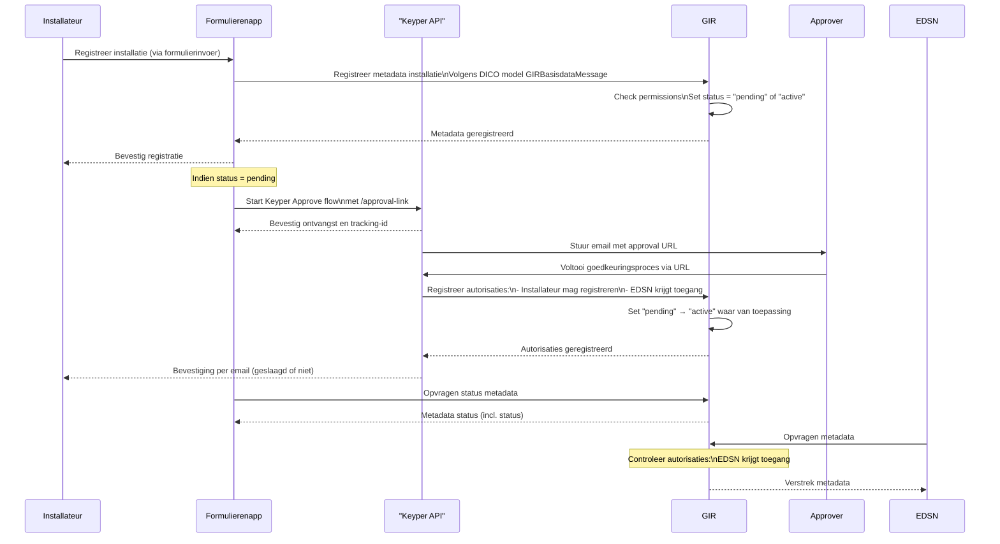

# GIR Implementation in NoodleBar

This section documents the specific implementation of the *Gebouwinstallatieregistratie* (GIR) use case within the NoodleBar ecosystem. GIR leverages modular NoodleBar components (Organization Register, Authorization Register, Keyper Approve) to enable secure, auditable registration and sharing of building installation metadata between installers, approvers, and EDSN.

## 🧩 Components Involved

- **GIR** (based on NoodleBar modules): Manages metadata registration and authorization
- **Formulierenapp**: Frontend for installers to submit installations
- **Keyper API**: Initiates and manages approval workflows
- **EDSN**: Data consumer (authorized third party)
- **Approver**: Entity responsible for validating and approving data sharing
- **Installateur**: Entity registering the building installation

---

## 🔁 Process Overview

### 1. Metadata Registration

- The **Installateur** submits installation data through the **Formulierenapp**.
- The Formulierenapp sends this data to the **GIR module** using the standardized `GIRBasisdataMessage` format (based on the DICO model).
- GIR sets the status of the installation to `pending` or `active` depending on pre-existing authorizations.
- A confirmation is returned to the Formulierenapp and shown to the installateur.

### 2. Conditional Approval Flow

- If the status is `pending`, the Formulierenapp triggers the **Keyper Approve** process via the `/approval-link` endpoint.
- The **Keyper API** issues a tracking ID and sends an approval URL to the **Approver**.
- Once the **Approver** completes the approval, the Keyper API registers policies to grant:
  - That the installateur is authorized to register installations.
  - That **EDSN** has access to this specific installation data.
- GIR then updates the status from `pending` to `active` where applicable.

### 3. Data Access

- The Formulierenapp can query the metadata status at any time.
- **EDSN** periodically retrieves metadata from GIR.
- GIR enforces access controls using NoodleBar’s Authorization Register, ensuring only authorized access for EDSN.

---

## 📌 Key Features in GIR Flow

| Feature | Description |
|--------|-------------|
| **DICO-based metadata** | Registration conforms to `GIRBasisdataMessage`, ensuring standardized metadata exchange. |
| **Dynamic Authorization** | GIR defers final activation of metadata until authorization is confirmed via Keyper. |
| **Keyper Integration** | Secure, traceable authorization approval via the Keyper Approve flow. |
| **EDSN Access** | Controlled access by EDSN only after explicit approval and registration. |

---

## 🔐 Authorization Logic in GIR

- GIR treats all incoming registrations as *pending* unless prior authorization exists.
- The Keyper Approve flow is used to dynamically **grant roles** (e.g., installateur as data provider, EDSN as consumer).
- The Authorization Register is updated programmatically via Keyper, based on approval outcome.

---

## 📈 Sequence Diagram

