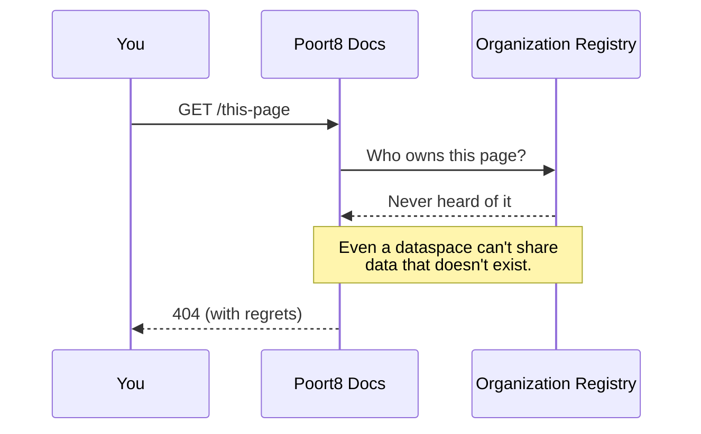

# 404: Page not found

You asked the dataspace for a page that doesn't exist. Here's what happened:

```mermaid
sequenceDiagram
    participant You
    participant Docs as Poort8 Docs
    participant OR as Organization Registry
    You->>Docs: GET /this-page
    Docs->>OR: Who owns this page?
    OR-->>Docs: Never heard of it
    Note over Docs,OR: Even a dataspace can't share<br/>data that doesn't exist.
    Docs-->>You: 404 (with regrets)
```

Check the address, try the search, or go back to the [overview](/).
