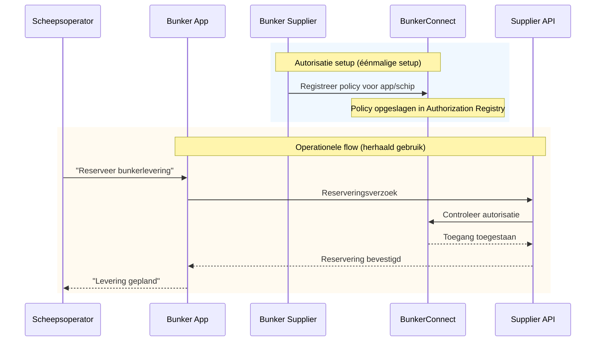

# BunkerConnect

BunkerConnect is een federatieve dataspace voor het coördineren van bunkerdiensten in de maritieme sector. Deze dataspace maakt geörchesteerde samenwerking mogelijk tussen schepen, bunker suppliers, havenbedrijven en andere betrokken partijen bij brandstoflevering op zee.

## Hoe werkt het?

BunkerConnect faciliteert de coördinatie van bunkerdiensten via een federatief model waarin alle partijen hun eigen data beheren en toegang verlenen volgens overeengekomen autorisaties. Het systeem ondersteunt het hele proces van reservering tot levering, met real-time verificatie van toegangsrechten en volledige audit trails.

### Stappen

1. **Autorisatie instellen** — De bunker supplier registreert eenmalig autorisaties in BunkerConnect voor apps/schepen die toegang krijgen tot hun diensten.
2. **Diensten afnemen** — De scheepsoperator kan via de app herhaaldelijk bunkerlevering reserveren; elke aanvraag wordt gecontroleerd tegen de geregistreerde autorisaties.
3. **Real-time verificatie** — Bij elke reservering controleert de supplier API via BunkerConnect of de toegang toegestaan is.

## Toegang en omgeving

BunkerConnect is bereikbaar via:
- **Preview:** https://bunkerconnect-preview.poort8.nl/
- **Productie:** https://bunkerconnect.poort8.nl/ [TBD — beschikbaar na productie-deployment]

## Aan de slag

| Wat je nodig hebt | Waar je het vindt |
|--------------------|-------------------|
| **Proces begrijpen** | [Lees hierboven](#hoe-werkt-het) |
| **Implementatie details** | [Bunker Diensten Toegang](bunker-diensten.md) |
| **API referentie** | [BunkerConnect API docs ➚](https://bunkerconnect-preview.poort8.nl/scalar/v1) |
| **NoodleBar concepten** | [NoodleBar documentatie](../noodlebar/) |

> **Optionele extensie:** BunkerConnect kan worden uitgebreid met Keyper voor geautomatiseerde goedkeuringsflows via e-mail. In de huidige implementatie registreren data-eigenaren autorisaties rechtstreeks in het Authorization Registry.

## Meer informatie

BunkerConnect is ontwikkeld in samenwerking met het Havenbedrijf Rotterdam en CGI voor digitalisering van maritieme bunkerdiensten. Voor technische details over het Organization Registry, Authorization Registry en federatief datadelen, zie de [NoodleBar documentatie](../noodlebar/).

Vragen? Neem contact op met Poort8 via **hello@poort8.nl**.
