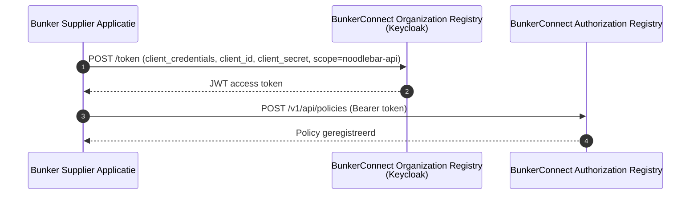
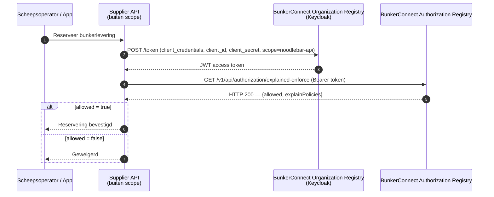

# Architectuur

Deze pagina legt uit hoe de BunkerConnect-componenten samenwerken om gecontroleerd datadelen tussen bunker suppliers en hun apps mogelijk te maken.

## Componenten

BunkerConnect bestaat uit twee kerncomponenten.

### BunkerConnect Organization Registry (OR)

Het **Organization Registry (OR)** is de bron van waarheid voor deelnemers:

- **Organisatie-identiteiten** — registratie, verificatie en goedkeuring
- **Gebruikersaccounts** — credentials, e-mailverificatie en organisatie-lidmaatschap
- **Applicatie-registraties** — OAuth-clients waarmee een bunker supplier de Authorization Registry aanroept

Het OR fungeert als OAuth authorization server en geeft de JWT access tokens uit die aan de Authorization Registry worden gepresenteerd.

### BunkerConnect Authorization Registry (AR)

Het **Authorization Registry (AR)** bewaart en handhaaft policies op dataniveau: wie (welke app/schip) namens welk schip toegang heeft tot de bunkerdiensten van welke supplier.

Een bunker supplier is in dit model tegelijk **data-eigenaar** en **service provider**: dezelfde organisatie registreert de policy én levert de bunkerdienst waarop de policy van toepassing is. Er is geen aparte derde partij die namens de supplier toegang verleent.

> De bunker diensten API en supplier-infrastructuur zelf vallen buiten deze documentatie — zie de kanttekening in [Bunker Diensten Toegang](bunker-diensten.md).

## Authenticatie

Alle API-communicatie gebruikt OAuth met Keycloak als identityprovider.



**Token endpoint:**
```
https://auth.poort8.nl/realms/bunkerconnect-preview/protocol/openid-connect/token
```

**JWKS endpoint:**
```
https://auth.poort8.nl/realms/bunkerconnect-preview/protocol/openid-connect/certs
```

Tokens zijn kortlevend en bevatten een `organization`-claim met de geverifieerde organisatie-identiteit van de supplier (EUID).

## Autorisatiemodel

Authenticatie beantwoordt "wie ben je?" — autorisatie beantwoordt "wat mag je?".

BunkerConnect gebruikt een **policy-gebaseerd** model. De bunker supplier registreert zelf een policy die vastlegt welke app/schip toegang heeft tot welke bunkerdienst. Bij elke operationele aanvraag controleert de supplier (via zijn eigen, niet in deze documentatie beschreven API) of er nog een geldige policy is, door de Authorization Registry te bevragen.



## Twee lagen van toegangscontrole

BunkerConnect scheidt toegang tot de Authorization Registry zelf van autorisatie op dataniveau:

| Laag | Wat het regelt | Wie beslist | Wanneer |
|------|----------------|-------------|---------|
| **AR-toegang** | Mag de supplier-applicatie de BunkerConnect Authorization Registry (`noodlebar-api`) aanroepen? | Poort8 (dataspace-beheerder) | Bij het registreren van de supplier-applicatie |
| **Data-autorisatie** | Mag een specifieke app/schip een specifieke bunkerdienst afnemen? | De bunker supplier zelf, via een policy | Per policy, door de supplier zelf ingesteld |

Beide lagen moeten vervuld zijn voordat de supplier een policy kan registreren of handhaven:
1. AR-toegang (goedgekeurd voor de supplier-applicatie)
2. Een geldige, door de supplier zelf geregistreerde policy voor de specifieke app/schip

> ℹ️ Goedkeuring op dataniveau verloopt in de generieke dataspace via **Keyper Approval Links**; BunkerConnect gebruikt momenteel de **Keyper Manager** voor het beheren van eigen policies, de geautomatiseerde e-mail-goedkeuringsflows zijn nog niet aangesloten. Zie de [generieke Keyper-documentatie ➚](../keyper/).

## Beveiligingslagen

| Laag | Mechanisme | Doel |
|------|------------|------|
| Transport | HTTPS (TLS 1.2+) | Versleutelde communicatie |
| Authenticatie | OAuth + JWT | Geverifieerde deelnemer-identiteit |
| AR-toegang | Keycloak audience/scope (`noodlebar-api`) | Geautoriseerd om de Authorization Registry aan te roepen |
| Data-autorisatie | Policy-handhaving | Geautoriseerd voor specifieke app/schip-toegang |
| Audit | Gelogde autorisatiebeslissingen | Compliance en incident-respons |

## Technische standaarden

| Standaard | Gebruik in BunkerConnect |
|-----------|---------------------|
| OAuth (client credentials) | Machine-to-machine authenticatie |
| JWT (RS256) | Tokenformaat met organisatie-identiteit |
| JWKS | Distributie van publieke sleutels voor tokenvalidatie |
| REST / JSON | Alle API-communicatie |
| OpenAPI 3.x | API-specificatieformaat |

## Volgende stappen

- [Organisatie Registratie](onboarding.md) — deelnemer worden
- [AR-toegang aanvragen](api-toegang-aanvragen.md) — voor bunker suppliers
- [Tokens valideren](access-tokens-valideren.md) en [Autorisatie valideren](autorisatie.md) — voor je eigen supplier-API

Vragen? Neem contact op met Poort8 via **hello@poort8.nl**.
