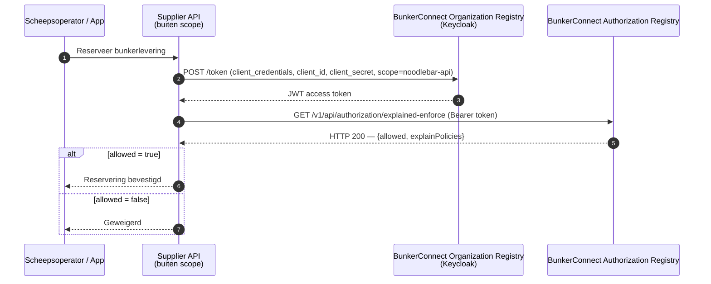

# Autorisatie valideren

Deze gids is voor **bunker suppliers** die willen verifiëren dat een operationele aanvraag (bijv. een reservering) geautoriseerd is voordat ze de bunkerdienst leveren. Hij beschrijft hoe je het BunkerConnect Authorization Registry (AR) bevraagt om te controleren of een geldige policy bestaat.

## Wanneer gebruik je dit?

Als je jouw eigen bunkerdiensten-API beveiligt met NoodleBar-tokens, bevestigt tokenvalidatie (zie [Tokens valideren](access-tokens-valideren.md)) de identiteit van de aanroeper. Autorisatie-validatie bevestigt dat er een policy is die deze aanvraag toestaat. Dit is de kernstap uit [Bunker Diensten Toegang](bunker-diensten.md): elke operationele aanvraag wordt gecontroleerd tegen de policy die je eerder hebt geregistreerd (zie [AR-toegang aanvragen](api-toegang-aanvragen.md)).

## Procesoverzicht



## Policy-model

Een policy in de AR legt vast welke app/schip toegang heeft tot welke bunkerdienst. De identifiers zijn EUID-waarden (`NLNHR.{kvkNummer}`).

| Veld | Beschrijving | Voorbeeld |
|------|--------------|-----------|
| `issuerId` | Bunker supplier die toegang verleende (data-eigenaar) | `NLNHR.87654321` |
| `subjectId` | Identifier van de app/het schip dat de bunkerdienst afneemt | (instance-specifiek, zie [Bunker Diensten Toegang](bunker-diensten.md)) |
| `serviceProvider` | Bunker supplier die de dienst levert — meestal gelijk aan `issuerId` | `NLNHR.87654321` |
| `type` | Resource-type | (instance-specifiek) |
| `resourceId` | Identifier van de bunkerdienst-resource | (instance-specifiek) |
| `attribute` | Data-attributen | `*` |
| `action` | Toegestane actie | bijv. `reserve` of `order` |

## Stap 1 — Haal een access token op

Authenticeer met de OAuth client credentials-grant, met de applicatie die toegang heeft tot de BunkerConnect Authorization Registry (zie [AR-toegang aanvragen](api-toegang-aanvragen.md)):

```bash
curl -X POST https://auth.poort8.nl/realms/bunkerconnect-preview/protocol/openid-connect/token \
  -H "Content-Type: application/x-www-form-urlencoded" \
  -d "grant_type=client_credentials" \
  -d "client_id=YOUR_APP_CLIENT_ID" \
  -d "client_secret=YOUR_APP_CLIENT_SECRET" \
  -d "scope=noodlebar-api"
```

> ℹ️ Dit token authenticeert jouw platform als *applicatie* tegenover de Authorization Registry. Het is geen identiteitstoken van de app/het schip — die identiteit geef je expliciet mee als `subject`-queryparameter.

## Stap 2 — Bevraag het explained-enforce endpoint

```bash
curl -G https://bunkerconnect-preview.poort8.nl/v1/api/authorization/explained-enforce \
  -H "Authorization: Bearer {token}" \
  --data-urlencode "issuer={JOUW_ORG}" \
  --data-urlencode "subject={IDENTIFIER_APP_OF_SCHIP}" \
  --data-urlencode "serviceProvider={JOUW_ORG}" \
  --data-urlencode "action={ACTION}" \
  --data-urlencode "resource={RESOURCE_ID}" \
  --data-urlencode "type={RESOURCE_TYPE}" \
  --data-urlencode "attribute=*" \
  --data-urlencode "useCase=default"
```

### Query parameters

| Parameter | Beschrijving | Voorbeeld |
|-----------|--------------|-----------|
| `issuer` | EUID van jouw organisatie (bunker supplier), als data-eigenaar die toegang verleende | `NLNHR.87654321` |
| `subject` | Identifier van de app/het schip dat de bunkerdienst afneemt | (instance-specifiek) |
| `serviceProvider` | EUID van jouw organisatie (bunker supplier), als degene die de dienst levert | `NLNHR.87654321` |
| `action` | Gevraagde actie | bijv. `reserve` of `order` |
| `resource` | Identifier van de bevraagde bunkerdienst-resource | (instance-specifiek) |
| `type` | Resource-type | (instance-specifiek) |
| `attribute` | Data-attributen | `*` |
| `useCase` | Use case-model | `default` |

## Stap 3 — Response

> ℹ️ **`explained-enforce` retourneert altijd HTTP 200**, ook wanneer autorisatie wordt geweigerd. Of het verzoek is toegestaan lees je af aan het `allowed`-veld, niet aan de HTTP-statuscode.

**Toegestaan:**

```json
{
  "allowed": true,
  "explainPolicies": [
    {
      "policyId": "a1b2c3d4-e5f6-7890-abcd-ef1234567890",
      "useCase": "default",
      "issuedAt": 1738368000,
      "notBefore": 1738368000,
      "expiration": 1769904000,
      "issuerId": "NLNHR.87654321",
      "subjectId": "...",
      "serviceProvider": "NLNHR.87654321",
      "action": "...",
      "resourceId": "...",
      "type": "...",
      "attribute": "*",
      "license": null,
      "rules": null,
      "properties": []
    }
  ]
}
```

**Geweigerd:**

```json
{
  "allowed": false,
  "explainPolicies": []
}
```

## Stap 4 — Valideer en reageer

### Aanbevolen statuscodes richting de app/het schip

| Code | Betekenis | Wanneer |
|------|-----------|---------|
| `200 OK` | Geautoriseerd | `allowed: true` — lever de bunkerdienst |
| `401 Unauthorized` | Ongeldig token | Alleen relevant als je zelf tokens van de app/het schip valideert — zie [Tokens valideren](access-tokens-valideren.md) |
| `403 Forbidden` | Niet geautoriseerd | `allowed: false` |
| `400 Bad Request` | Ongeldige invoer | Verzoek niet correct geformatteerd |
| `500 Internal Server Error` | Technische fout | Onverwachte fout — log en implementeer retry-logica |

## Implementatiepatroon

```
1. Ontvang de reserveringsaanvraag van de app/het schip
2. Bepaal de identifier van de aanvragende app/het schip
3. Haal een access token op voor de AR (client credentials, scope noodlebar-api)
4. Roep explained-enforce aan met issuer=jij, subject=app/schip, serviceProvider=jij
5. Enforce retourneert altijd HTTP 200 — check het `allowed`-veld
6. allowed=true → lever de bunkerdienst (200)
7. allowed=false → weiger (403)
```

## Gerelateerd

- [AR-toegang aanvragen](api-toegang-aanvragen.md) — hoe je de policy zelf registreert
- [Tokens valideren](access-tokens-valideren.md) — optionele tokenvalidatie voor je eigen API
- [BunkerConnect API docs ➚](https://bunkerconnect-preview.poort8.nl/scalar/v1)

Vragen? Neem contact op met Poort8 via **hello@poort8.nl**.
