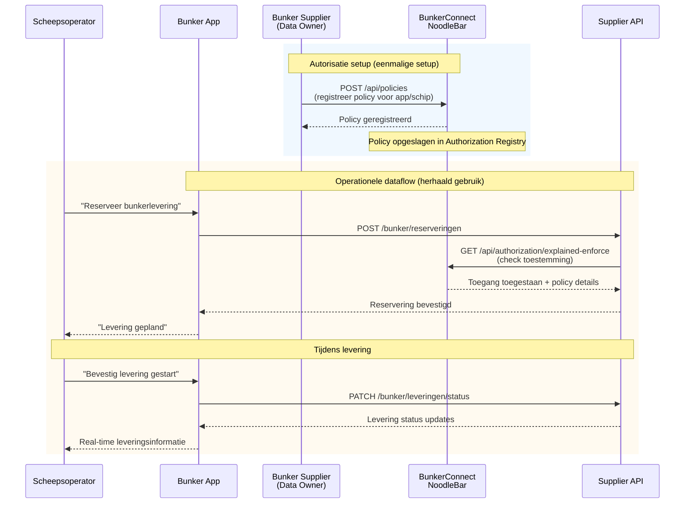

# Bunker Diensten Toegangsflow

Scheepsoperators kunnen bunkerdiensten (brandstoflevering) coördineren met bunker suppliers via hun gekozen app. Deze flow beschrijft hoe bunker suppliers autorisaties instellen en hoe apps vervolgens bunkerdiensten kunnen afnemen met real-time autorisatie verificatie.

🔗 **[API Docs ➚](https://bunkerconnect-preview.poort8.nl/scalar/v1)** — Interactieve endpoint testing

## Overzicht

De bunker diensten flow combineert **eenmalige autorisatie setup** door de data-eigenaar met **herhaald gebruik** via de supplier API. De bunker supplier registreert policies in BunkerConnect die bepalen welke apps namens welke schepen toegang hebben tot bunkerdiensten. Daarna kan de app zonder verdere tussenkomst diensten afnemen—de NoodleBar controleert bij elke aanvraag of de policy nog geldig is.

> **Belangrijk:** De bunker diensten API en supplier infrastructuur vallen buiten deze documentatie. Deze pagina beschrijft het autorisatie mechanisme dat door de supplier API wordt gebruikt en hoe policies worden beheerd.

> **Optionele extensie:** BunkerConnect kan worden uitgebreid met Keyper voor geautomatiseerde goedkeuringsflows via e-mail. Deze documentatie beschrijft de huidige implementatie waarin data-eigenaren autorisaties rechtstreeks registreren.

## Sequence Diagram



## Voorwaarden

| Wat je nodig hebt | Details |
|--------------------|---------|
| API toegang | [TBD — Auth0 client credentials, zie API docs ➚](https://bunkerconnect-preview.poort8.nl/scalar/v1) |
| Organisatie registratie | Je organisatie moet geregistreerd zijn in het Organization Registry |
| Supplier diensten infrastructuur | De bunker supplier moet diensten beschikbaar hebben en een API exposeren voor reserveringen |

## Stappen

### Stap 1: Bunker supplier registreert autorisatie _(Poort8)_

De bunker supplier registreert policies in BunkerConnect die bepalen welke apps namens welke schepen toegang hebben tot hun bunkerdiensten. Dit gebeurt via de BunkerConnect Authorization Registry API.

**NoodleBar policy registratie voorbeeld:**

```http
POST https://bunkerconnect-preview.poort8.nl/api/policies
Authorization: Bearer <ACCESS_TOKEN>
Content-Type: application/json
```
```json
{
  "subjectId": "12345678",
  "action": "[TBD - bijv. reserve of order]",
  "resourceId": "[TBD - bunker dienst resource ID]",
  "issuerId": "87654321",
  "useCase": "[TBD - instance specifiek]",
  "issuedAt": 1738368000,
  "notBefore": 1738368000,
  "expiration": 1769904000,
  "serviceProvider": "87654321",
  "type": "[TBD - instance specifiek]",
  "attribute": "*"
}
```

**Response:**

```json
{
  "policyId": "pol_abc123xyz",
  "issuerId": "87654321",
  "subjectId": "12345678",
  "resourceId": "[TBD - bunker dienst resource ID]",
  "action": "[TBD - bijv. reserve of order]",
  "useCase": "[TBD - instance specifiek]",
  "issuedAt": 1738368000,
  "notBefore": 1738368000,
  "expiration": 1769904000,
  "serviceProvider": "87654321",
  "type": "[TBD - instance specifiek]",
  "attribute": "*",
  "properties": []
}
```

> **Instance-specifiek:** De velden `resourceId`, `action`, `useCase` en `type` worden bepaald tijdens de technische configuratie van BunkerConnect. [TBD]

Deze policy geeft app/organisatie `12345678` toestemming om namens schepen bunkerdiensten te reserveren bij supplier `87654321`.

### Stap 2: Scheepsoperator wil bunkeren _(extern)_

De scheepsoperator gebruikt een app en zoekt naar beschikbare bunker suppliers in de haven. De app toont suppliers met hun diensten en tarieven. De scheepsoperator selecteert een supplier en wil een bunkerlevering plannen.

> ℹ️ Deze stap valt buiten de NoodleBar scope. De app wordt gebouwd door de platform provider of scheepsmanagement systeem leverancier.

### Stap 3: App reserveert bunkerdienst via supplier API _(extern)_

De scheepsoperator gebruikt de app om een bunkerlevering te reserveren. De app stuurt een reserveringsverzoek naar de bunker supplier API met details zoals gewenste leverdatum, hoeveelheid, en locatie.

> ℹ️ De bunker supplier API endpoints zijn instance-specifiek en vallen buiten de BunkerConnect NoodleBar scope. Zie de [BunkerConnect API docs ➚](https://bunkerconnect-preview.poort8.nl/scalar/v1) voor beschikbare endpoints.

### Stap 4: Supplier API controleert autorisatie via NoodleBar _(Poort8)_

Voordat de supplier API de reservering bevestigt, controleert deze of de app daadwerkelijk toestemming heeft om namens deze scheepsoperator bunkerdiensten te reserveren. De supplier API roept de BunkerConnect NoodleBar `explained-enforce` endpoint aan.

**Generic NoodleBar explained-enforce voorbeeld:**

```http
GET https://bunkerconnect-preview.poort8.nl/api/authorization/explained-enforce
  ?subject=12345678
  &resource=[TBD - bunker dienst resource ID]
  &action=[TBD - bijv. reserve of order]
  &useCase=[TBD - instance specifiek]
  &issuer=87654321
  &serviceProvider=87654321
  &type=[TBD - instance specifiek]
  &attribute=*
  &context={}
Authorization: Bearer <ACCESS_TOKEN>
```

De NoodleBar controleert of er een geldige policy bestaat die de `subject` (app/scheepsoperator organisatie) toegang geeft tot de `resource` (bunker dienst) voor de gevraagde `action`.

**Response (Permit):**

```json
{
  "allowed": true,
  "explainPolicies": [
    {
      "policyId": "pol_abc123xyz",
      "issuerId": "87654321",
      "subjectId": "12345678",
      "resourceId": "[TBD - bunker dienst resource ID]",
      "action": "[TBD - bijv. reserve of order]",
      "useCase": "[TBD - instance specifiek]",
      "issuedAt": 1738368000,
      "notBefore": 1738368000,
      "expiration": 1769904000,
      "serviceProvider": "87654321",
      "type": "[TBD - instance specifiek]",
      "attribute": "*",
      "properties": []
    }
  ]
}
```

**Response (Deny):**

```json
{
  "allowed": false,
  "explainPolicies": []
}
```

Als `allowed` = `true`, mag de supplier API de reservering bevestigen. Als `false`, weigert de API het verzoek.

Zie de [BunkerConnect API docs ➚](https://bunkerconnect-preview.poort8.nl/scalar/v1) voor de volledige endpoint referentie.

> **Instance-specifiek:** De waarden voor alle parameters worden bepaald tijdens de technische configuratie van BunkerConnect. [TBD]

## Foutafhandeling

[TBD — Wordt aangevuld zodra de API-specificatie beschikbaar is. Zie de [BunkerConnect API docs ➚](https://bunkerconnect-preview.poort8.nl/scalar/v1) voor actuele foutcodes.]

**Verwachte scenario's:**

- **Goedkeuring afgewezen**: Keyper stuurt webhook met `status: "rejected"`; app informeert scheepsoperator
- **Policy verlopen**: NoodleBar `explained-enforce` retourneert `Deny`; app moet nieuwe goedkeuring aanvragen
- **Supplier API onbereikbaar**: Standaard HTTP foutafhandeling (retry-mechanisme, timeout)
- **Onvoldoende capaciteit**: Supplier API business logic (niet BunkerConnect)

## Productie-omgeving

[TBD — Eventuele verschillen tussen preview en productie worden hier gedocumenteerd zodra de productie-omgeving beschikbaar is.]

**Verwacht:**

- Preview: `https://bunkerconnect-preview.poort8.nl` (huidige pilot fase)
- Productie: `https://bunkerconnect.poort8.nl` (na succesvolle pilot validatie)

## Volgende stappen

- Terug naar de [Introductie](README.md) voor een overzicht
- Bekijk de [BunkerConnect API docs ➚](https://bunkerconnect-preview.poort8.nl/scalar/v1) voor endpoint details
- Zie de [NoodleBar documentatie](../noodlebar/) voor achtergrond over OR, AR en federatief datadelen

## Context: Maritieme Digitalisering

BunkerConnect is ontwikkeld in samenwerking met het Havenbedrijf Rotterdam en CGI om maritieme bunkerdiensten te digitaliseren. Het federatieve model zorgt ervoor dat alle betrokken partijen (schepen, suppliers, havenbedrijven) hun eigen data behouden en toegang verlenen volgens overeengekomen autorisaties, met real-time verificatie en volledige audit trails.
