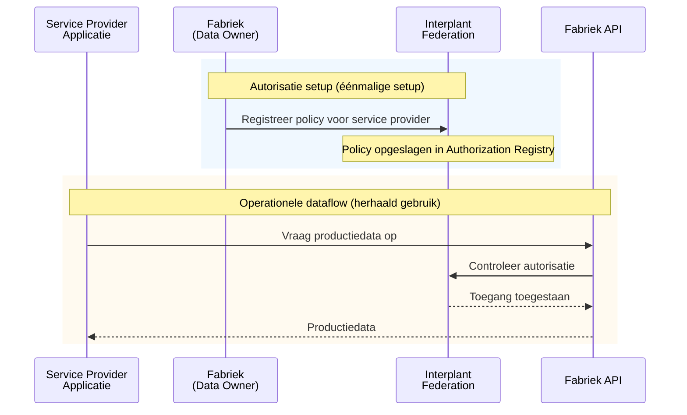

# Interplant Federation

De Interplant Federation is een federatieve dataspace voor het delen van productie- en installatie-gegevens tussen aangesloten fabrieken en bedrijven. Deze dataspace maakt gecontroleerde gegevensdeling mogelijk tussen productiefaciliteiten, service providers en data-eigenaren binnen een industrieel ecosysteem.

## Hoe werkt het?

De Interplant Federation faciliteert data-uitwisseling tussen fabrieken en hun partners via een federatief model. Elke organisatie behoudt volledige controle over de eigen data, terwijl geautoriseerde partners toegang krijgen tot specifieke gegevens volgens overeengekomen policies. Het systeem ondersteunt real-time autorisatie controles.

### Stappen

1. **Autorisatie instellen** — De fabriek registreert eenmalig policies in de Interplant Federation voor service providers die toegang krijgen tot hun productiedata.
2. **Data-uitwisseling** — De service provider kan herhaaldelijk data opvragen; elke aanvraag wordt gecontroleerd tegen de geregistreerde policies.
3. **Real-time verificatie** — Bij elke data-aanvraag controleert de fabriek API via de Interplant Federation of de toegang toegestaan is.

## Toegang en omgeving

De Interplant Federation is bereikbaar via:
- **Preview:** https://cgiipf-preview.poort8.nl/
- **Productie:** https://cgiipf.poort8.nl/ [TBD — beschikbaar na productie-deployment]

## Aan de slag

| Wat je nodig hebt | Waar je het vindt |
|--------------------|-------------------|
| **Proces begrijpen** | [Lees hierboven](#hoe-werkt-het) |
| **Implementatie details** | [Fabriek Data Toegang](fabriek-data-toegang.md) |
| **API referentie** | [Interplant Federation API docs ➚](https://cgiipf-preview.poort8.nl/scalar/v1) |
| **NoodleBar concepten** | [NoodleBar documentatie](../noodlebar/) |

## Meer informatie

Voor technische details over het Organization Registry, Authorization Registry en federatief datadelen, zie de [NoodleBar documentatie](../noodlebar/).

Vragen? Neem contact op met Poort8 via **hello@poort8.nl**.
