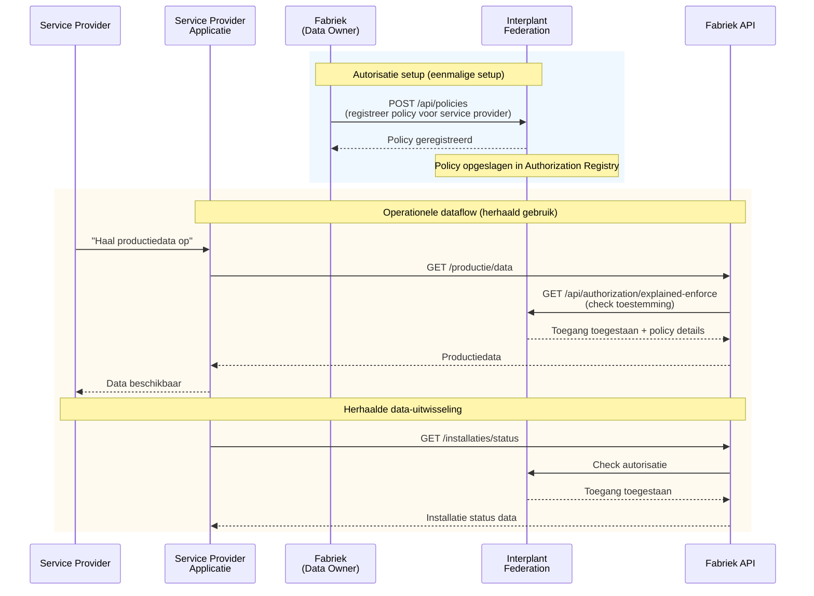

# Fabriek Data Toegangsflow

Service providers kunnen productie- en installatie-gegevens opvragen bij aangesloten fabrieken via hun applicatie. Deze flow beschrijft hoe fabrieken autorisaties instellen en hoe applicaties vervolgens data kunnen opvragen met real-time autorisatie verificatie.

🔗 **[API Docs ➚](https://cgiipf-preview.poort8.nl/scalar/v1)** — Interactieve endpoint testing

## Overzicht

De fabriek data toegangsflow combineert **eenmalige autorisatie setup** door de data-eigenaar met **herhaald gebruik** via de fabriek API. De fabriek registreert policies in de Interplant Federation die bepalen welke service providers toegang hebben tot productie- en installatiegegevens. Daarna kan de applicatie zonder verdere tussenkomst data opvragen—de NoodleBar controleert bij elke aanvraag of de policy nog geldig is.

> **Belangrijk:** De fabriek data API en productie infrastructuur vallen buiten deze documentatie. Deze pagina beschrijft het autorisatie mechanisme dat door de fabriek API wordt gebruikt en hoe policies worden beheerd.

## Sequence Diagram



## Voorwaarden

| Wat je nodig hebt | Details |
|--------------------|---------|
| API toegang | [TBD — Auth0 client credentials, zie API docs ➚](https://cgiipf-preview.poort8.nl/scalar/v1) |
| Organisatie registratie | Je organisatie moet geregistreerd zijn in het Organization Registry |
| Fabriek data API | De fabriek moet data beschikbaar stellen via een API voor service providers |

## Stappen

### Stap 1: Fabriek registreert autorisatie _(Poort8)_

De fabriek registreert policies in de Interplant Federation die bepalen welke service providers toegang hebben tot productie- en installatiegegevens. Dit gebeurt via de Interplant Federation Authorization Registry API.

**NoodleBar policy registratie voorbeeld:**

```http
POST https://cgiipf-preview.poort8.nl/api/policies
Authorization: Bearer <ACCESS_TOKEN>
Content-Type: application/json
```
```json
{
  "subjectId": "12345678",
  "action": "[TBD - bijv. read of query]",
  "resourceId": "[TBD - productie data resource ID]",
  "issuerId": "87654321",
  "useCase": "[TBD - instance specifiek]",
  "issuedAt": 1738368000,
  "notBefore": 1738368000,
  "expiration": 1769904000,
  "serviceProvider": "87654321",
  "type": "[TBD - instance specifiek]",
  "attribute": "*"
}
```

**Response:**

```json
{
  "policyId": "pol_xyz789abc",
  "issuerId": "87654321",
  "subjectId": "12345678",
  "resourceId": "[TBD - productie data resource ID]",
  "action": "[TBD - bijv. read of query]",
  "useCase": "[TBD - instance specifiek]",
  "issuedAt": 1738368000,
  "notBefore": 1738368000,
  "expiration": 1769904000,
  "serviceProvider": "87654321",
  "type": "[TBD - instance specifiek]",
  "attribute": "*",
  "properties": []
}
```

> **Instance-specifiek:** De velden `resourceId`, `action`, `useCase` en `type` worden bepaald tijdens de technische configuratie van de Interplant Federation. [TBD]

Deze policy geeft service provider organisatie `12345678` toestemming om productiedata op te vragen bij fabriek `87654321`.

### Stap 2: Service provider heeft data nodig _(extern)_

De service provider gebruikt een applicatie om productie- en installatiegegevens van fabrieken te analyseren. De applicatie toont beschikbare fabrieken en hun datasets. De service provider selecteert een fabriek en wil specifieke productiedata opvragen.

> ℹ️ Deze stap valt buiten de NoodleBar scope. De applicatie wordt gebouwd door de service provider of een aangesloten software leverancier.

### Stap 3: Applicatie vraagt data op via fabriek API _(extern)_

De service provider gebruikt de applicatie om productiedata of installatie status op te vragen. De applicatie stuurt een data-aanvraag naar de fabriek API met details zoals gewenste datasets, tijdsperiode, en data-granulariteit.

> ℹ️ De fabriek API endpoints zijn instance-specifiek en vallen buiten de Interplant Federation NoodleBar scope. Zie de [Interplant Federation API docs ➚](https://cgiipf-preview.poort8.nl/scalar/v1) voor beschikbare endpoints.

### Stap 4: Fabriek API controleert autorisatie via NoodleBar _(Poort8)_

Voordat de fabriek API de data retourneert, controleert deze of de applicatie daadwerkelijk toestemming heeft om namens deze service provider productiedata op te vragen. De fabriek API roept de Interplant Federation NoodleBar `explained-enforce` endpoint aan.

**Generic NoodleBar explained-enforce voorbeeld:**

```http
GET https://cgiipf-preview.poort8.nl/api/authorization/explained-enforce
  ?subject=12345678
  &resource=[TBD - productie data resource ID]
  &action=[TBD - bijv. read of query]
  &useCase=[TBD - instance specifiek]
  &issuer=87654321
  &serviceProvider=87654321
  &type=[TBD - instance specifiek]
  &attribute=*
  &context={}
Authorization: Bearer <ACCESS_TOKEN>
```

De NoodleBar controleert of er een geldige policy bestaat die de `subject` (applicatie/service provider organisatie) toegang geeft tot de `resource` (productie data) voor de gevraagde `action`.

**Response (Permit):**

```json
{
  "allowed": true,
  "explainPolicies": [
    {
      "policyId": "pol_xyz789abc",
      "issuerId": "87654321",
      "subjectId": "12345678",
      "resourceId": "[TBD - productie data resource ID]",
      "action": "[TBD - bijv. read of query]",
      "useCase": "[TBD - instance specifiek]",
      "issuedAt": 1738368000,
      "notBefore": 1738368000,
      "expiration": 1769904000,
      "serviceProvider": "87654321",
      "type": "[TBD - instance specifiek]",
      "attribute": "*",
      "properties": []
    }
  ]
}
```

**Response (Deny):**

```json
{
  "allowed": false,
  "explainPolicies": []
}
```

Als `allowed` = `true`, mag de fabriek API de data retourneren. Als `false`, weigert de API het verzoek.

Zie de [Interplant Federation API docs ➚](https://cgiipf-preview.poort8.nl/scalar/v1) voor de volledige endpoint referentie.

> **Instance-specifiek:** De waarden voor alle parameters worden bepaald tijdens de technische configuratie van de Interplant Federation. [TBD]

## Foutafhandeling

[TBD — Wordt aangevuld zodra de API-specificatie beschikbaar is. Zie de [Interplant Federation API docs ➚](https://cgiipf-preview.poort8.nl/scalar/v1) voor actuele foutcodes.]

**Verwachte scenario's:**

- **Policy verlopen**: NoodleBar `explained-enforce` retourneert `Deny`; fabriek moet policy verlengen
- **Geen policy**: NoodleBar `explained-enforce` retourneert `Deny`; fabriek moet eerst policy registreren
- **Fabriek API onbereikbaar**: Standaard HTTP foutafhandeling (retry-mechanisme, timeout)
- **Data niet beschikbaar**: Fabriek API business logic (niet Interplant Federation)

## Productie-omgeving

[TBD — Eventuele verschillen tussen preview en productie worden hier gedocumenteerd zodra de productie-omgeving beschikbaar is.]

**Verwacht:**

- Preview: `https://cgiipf-preview.poort8.nl` (huidige ontwikkelingsfase)
- Productie: `https://cgiipf.poort8.nl` (na succesvolle validatie)

## Volgende stappen

- Terug naar de [Introductie](README.md) voor een overzicht
- Bekijk de [Interplant Federation API docs ➚](https://cgiipf-preview.poort8.nl/scalar/v1) voor endpoint details
- Zie de [NoodleBar documentatie](../noodlebar/) voor achtergrond over OR, AR en federatief datadelen

## Context: Industriële Data-uitwisseling

De Interplant Federation is ontwikkeld in samenwerking met CGI om gecontroleerde data-uitwisseling mogelijk te maken tussen productiefaciliteiten binnen een industrieel ecosysteem. Het federatieve model zorgt ervoor dat fabrieken volledige controle behouden over hun productiedata, terwijl geautoriseerde service providers en partners toegang krijgen tot specifieke gegevens volgens overeengekomen policies.
