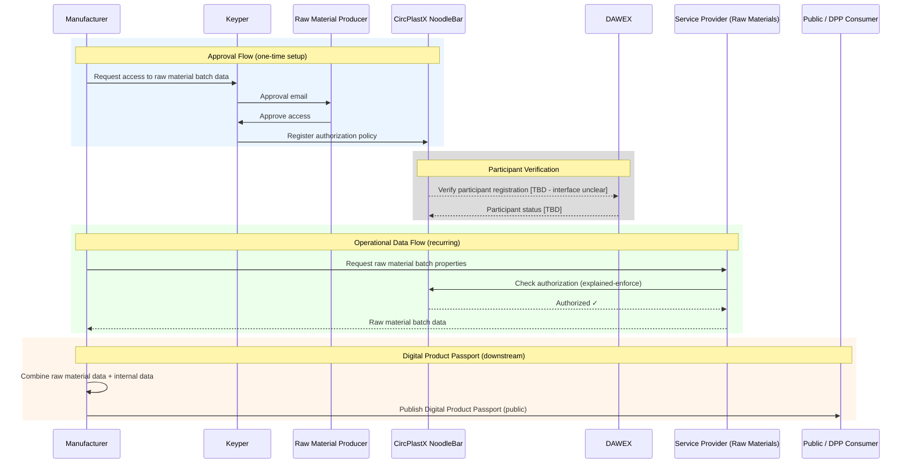

# CircPlastX

CircPlastX is a dataspace for controlled data exchange in the polymers, plastics, and recycling sector. It enables data services around raw material properties, recycling processes, and product lifecycle assessments (LCAs)—allowing manufacturers, raw material producers, and service providers to share data under explicit authorization.

## How it works?

CircPlastX connects participants in the plastics value chain. A manufacturer that needs raw material data for production or compliance purposes requests access through the dataspace. The raw material producer approves the request, and their service provider makes the data available via a data service. The manufacturer can then combine this data with internal information to produce Digital Product Passports (DPPs) that are publicly accessible.

Participant registration is managed by consortium partner **DAWEX**. All checks on participant identity and eligibility are performed through DAWEX.

> **⚠️ Note:** The technical interface between CircPlastX and DAWEX for participant verification is not yet defined. The diagrams below show DAWEX as an external component with a pending integration boundary.

### Steps

1. **Registration** — Participants register in the dataspace; eligibility is verified via DAWEX. `[TBD — DAWEX interface not yet defined]`
2. **Request access** — The manufacturer requests access to raw material batch data via Keyper.
3. **Approval** — The raw material producer receives an email, authenticates, and approves.
4. **Data retrieval** — The manufacturer retrieves raw material data from the service provider's data service, authorized by CircPlastX.
5. **DPP publication** — The manufacturer combines raw material data with internal data and publishes a Digital Product Passport.

## Example Data Services

CircPlastX supports multiple data services. Two initial examples:

| Service | Provider | Consumer | Description |
|---------|----------|----------|-------------|
| **Raw Material Batch Properties** | Raw material producer (via service provider) | Manufacturer | Properties and composition data of polymer/plastic batches |
| **Digital Product Passports (DPP)** | Manufacturer | Public / downstream parties | Lifecycle and composition data of consumer appliances, combining raw material data with manufacturing data |

### Raw Material Batch Properties

A raw material producer makes batch-level data available (e.g., polymer type, composition, recycled content percentage, mechanical properties). A service provider operates the technical data service. Manufacturers request access to specific batches or producers, and after approval, can retrieve this data for internal use.

### Digital Product Passports

Manufacturers combine raw material batch data with their own production data to create Digital Product Passports for consumer appliances. DPPs contain lifecycle and composition information and are intended to be publicly accessible (e.g., to support EU regulatory requirements around product sustainability).

> **Note:** The DPP service may follow a different authorization model since DPPs are publicly accessible. `[TBD — authorization model for public DPP access to be determined]`

## Participants and Roles

| Role | Description |
|------|-------------|
| **Raw Material Producer** | Produces polymers/plastics; owns raw material batch data; approves access requests |
| **Service Provider** | Operates the data service on behalf of the raw material producer |
| **Manufacturer** | Consumes raw material data; produces Digital Product Passports |
| **DAWEX** | Consortium partner; provides participant registration and verification `[TBD — interface pending]` |
| **Public / DPP Consumers** | Access publicly available Digital Product Passports |

## Access and Environment

CircPlastX will be available at:
- **Preview:** https://circplastx-preview.poort8.nl/ `[TBD — not yet deployed]`
- **Production:** https://circplastx.poort8.nl/ `[TBD — not yet deployed]`

## Getting Started

| What you need | Where to find it |
|---------------|------------------|
| **Understand the process** | [Read above](#how-it-works) |
| **Start implementing** | [Data Access Flow](data-access-flow.md) |
| **API reference** | [CircPlastX API docs ➚](https://circplastx-preview.poort8.nl/scalar/v1) `[TBD — not yet available]` |
| **Keyper (approval flow)** | [Keyper API docs ➚](https://keyper-preview.poort8.nl/scalar/?api=v1) |
| **NoodleBar concepts** | [NoodleBar documentation](../noodlebar/) |

## Further Reading

For technical details on NoodleBar concepts such as the Organization Registry, Authorization Registry, and iSHARE integration, see the [NoodleBar documentation](../noodlebar/).

Questions? Contact Poort8 at **hello@poort8.nl**.
