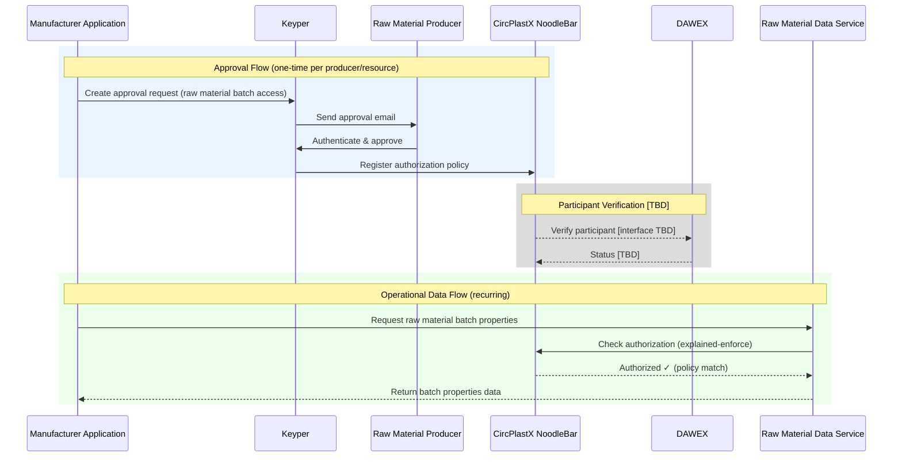

# Data Access Flow

This page describes the end-to-end flow for requesting and retrieving raw material batch data in CircPlastX. It covers both the one-time approval setup and the recurring data retrieval. Use this as an integration guide alongside the API documentation.

🔗 **[CircPlastX API Docs ➚](https://circplastx-preview.poort8.nl/scalar/v1)** — Interactive endpoint testing `[TBD — not yet available]`

## Overview

CircPlastX uses two Poort8-controlled touchpoints that all integrators interact with:

1. **Keyper** — For requesting and approving data access (one-time setup per resource)
2. **CircPlastX NoodleBar** — For authorization checks before data is returned (every request)

Everything else (the raw material data service, the manufacturer's application, DPP generation) is built externally by the participants or their service providers. This guide clearly marks which steps are external and which use Poort8 APIs.

> **⚠️ DAWEX Integration:** Participant registration and verification is handled by DAWEX. The technical interface between CircPlastX and DAWEX is not yet defined. Steps involving participant verification are shown but marked as pending.

## Sequence Diagram



## Prerequisites

| What you need | Details |
|---------------|---------|
| API access | `[TBD — Auth0 client credentials, see API docs ➚]` |
| Organization registration | Your organization must be registered and verified via DAWEX `[TBD — DAWEX verification process pending]` |
| Resource identifiers | `[TBD — how raw material batches and producers are identified in the system]` |

## Steps

### Step 1: Manufacturer needs raw material data _(external)_

The manufacturer's application needs raw material batch data (e.g., polymer composition, recycled content, mechanical properties) for production processes, quality assurance, or regulatory compliance such as Digital Product Passports.

> ℹ️ This step is outside CircPlastX scope. The manufacturer's application is built by the manufacturer or their IT partner.

### Step 2: Request access via Keyper _(Poort8)_

The manufacturer's application creates an approval request via the Keyper API, specifying which raw material producer's data it needs access to.

**Keyper API example:**

```http
POST https://keyper-preview.poort8.nl/v1/api/approval-links
Authorization: Bearer <ACCESS_TOKEN>
Content-Type: application/json
```
```json
{
  "requester": {
    "name": "<manufacturer contact name>",
    "email": "<manufacturer contact email>",
    "organization": "<manufacturer organization name>",
    "organizationId": "<manufacturer organization ID>"
  },
  "approver": {
    "name": "<raw material producer contact name>",
    "email": "<raw material producer contact email>",
    "organization": "<raw material producer organization name>",
    "organizationId": "<raw material producer organization ID>"
  },
  "dataspace": {
    "baseUrl": "https://circplastx-preview.poort8.nl"
  },
  "reference": "<unique reference>",
  "addPolicyTransactions": [
    {
      "type": "[TBD — instance specific]",
      "action": "[TBD — e.g. GET or read]",
      "license": "[TBD — instance specific]",
      "useCase": "[TBD — instance specific]",
      "issuedAt": "<UNIX_TIMESTAMP>",
      "issuerId": "<raw material producer organization ID>",
      "attribute": "*",
      "notBefore": "<UNIX_TIMESTAMP>",
      "subjectId": "<manufacturer organization ID>",
      "expiration": "<UNIX_TIMESTAMP>",
      "resourceId": "[TBD — e.g. batch ID or producer/material identifier]",
      "serviceProvider": "<service provider organization ID>"
    }
  ],
  "orchestration": {
    "flow": "[TBD — instance specific]"
  }
}
```

See the [Keyper API reference ➚](https://keyper-preview.poort8.nl/scalar/?api=v1#tag/approval-links/post/v1/api/approval-links) for full field documentation.

> **Instance-specific:** The fields `type`, `license`, `useCase`, `resourceId`, and `orchestration.flow` are determined during technical configuration. `[TBD]`

### Step 3: Raw material producer approves _(Poort8)_

The raw material producer receives an approval email from Keyper. They authenticate, review the request (who is asking for access to what data), and approve or reject. On approval, Keyper automatically registers an authorization policy in the CircPlastX NoodleBar Authorization Registry.

This step requires no integration work from the developer — it is handled entirely by Keyper.

### Step 4: Manufacturer retrieves raw material data _(external)_

After approval, the manufacturer's application requests raw material batch data from the service provider's data service. This is a direct API call to the service provider's system.

> ℹ️ The raw material data service endpoints are external and operated by the service provider on behalf of the raw material producer. `[TBD — service provider API details not yet defined]`

### Step 5: Service provider checks authorization _(Poort8)_

Before returning data, the service provider's data service validates the manufacturer's access rights by calling the CircPlastX NoodleBar explained-enforce endpoint.

**NoodleBar explained-enforce example:**

```http
GET https://circplastx-preview.poort8.nl/api/authorization/explained-enforce
  ?subject={manufacturerOrganizationId}
  &resource={resourceId}
  &action={action}
  &useCase={useCase}
Authorization: Bearer <ACCESS_TOKEN>
```

The explained-enforce endpoint returns whether the request is allowed and which policy matched. The service provider uses this result to decide whether to return the data.

See the [CircPlastX API docs ➚](https://circplastx-preview.poort8.nl/scalar/v1) for the full endpoint reference. `[TBD — not yet available]`

> **Instance-specific:** The values for `resource`, `action`, and `useCase` parameters depend on the instance configuration. `[TBD]`

### Step 6: Data returned to manufacturer _(external)_

If authorized, the service provider returns the raw material batch properties to the manufacturer's application. The manufacturer can then use this data for internal operations.

### Step 7: Manufacturer creates Digital Product Passport _(external)_

The manufacturer combines raw material data with internal production data to create a Digital Product Passport (DPP) for consumer appliances. The DPP is made publicly accessible.

> ℹ️ DPP creation and publication is outside CircPlastX scope. The authorization model for public DPP access (whether it goes through CircPlastX or is entirely public) is `[TBD]`.

## DAWEX Participant Verification

All participant registration and identity verification is handled by consortium partner DAWEX. Before an organization can participate in CircPlastX data exchanges, it must be registered and verified through DAWEX.

| Aspect | Status |
|--------|--------|
| Registration process | `[TBD — managed by DAWEX]` |
| Technical interface (API/protocol) | `[TBD — not yet defined]` |
| Verification triggers | `[TBD — at registration, at policy creation, or at enforcement time?]` |
| Sync mechanism | `[TBD — push/pull/webhook?]` |

## Error Handling

`[TBD — Will be documented once the API specification is available. See the CircPlastX API docs ➚ for current error codes when available.]`

## Production Notes

`[TBD — CircPlastX is not yet deployed. Differences between preview and production environments will be documented here.]`

## Next Steps

- Back to the [Introduction](README.md) for an overview
- See the [CircPlastX API docs ➚](https://circplastx-preview.poort8.nl/scalar/v1) for endpoint details `[TBD — not yet available]`
- See the [Keyper API docs ➚](https://keyper-preview.poort8.nl/scalar/?api=v1) for approval flow endpoints
- See the [NoodleBar documentation](../noodlebar/) for background on OR, AR, and Keyper
