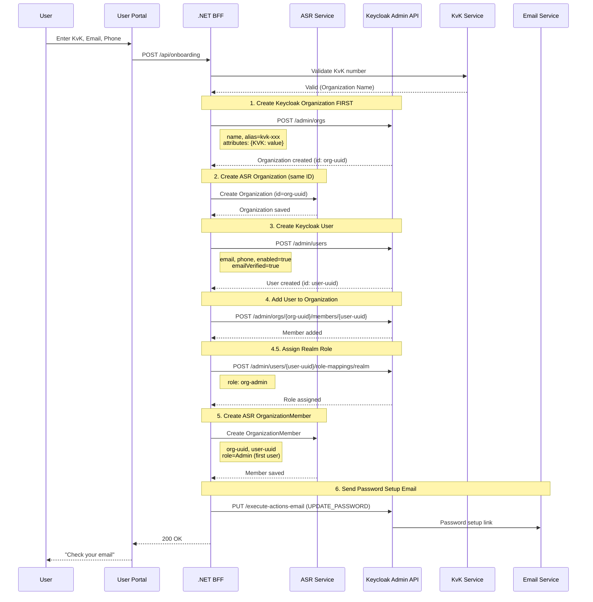
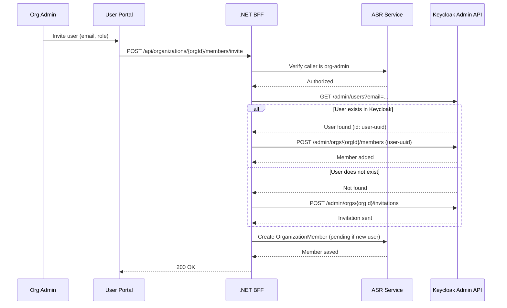
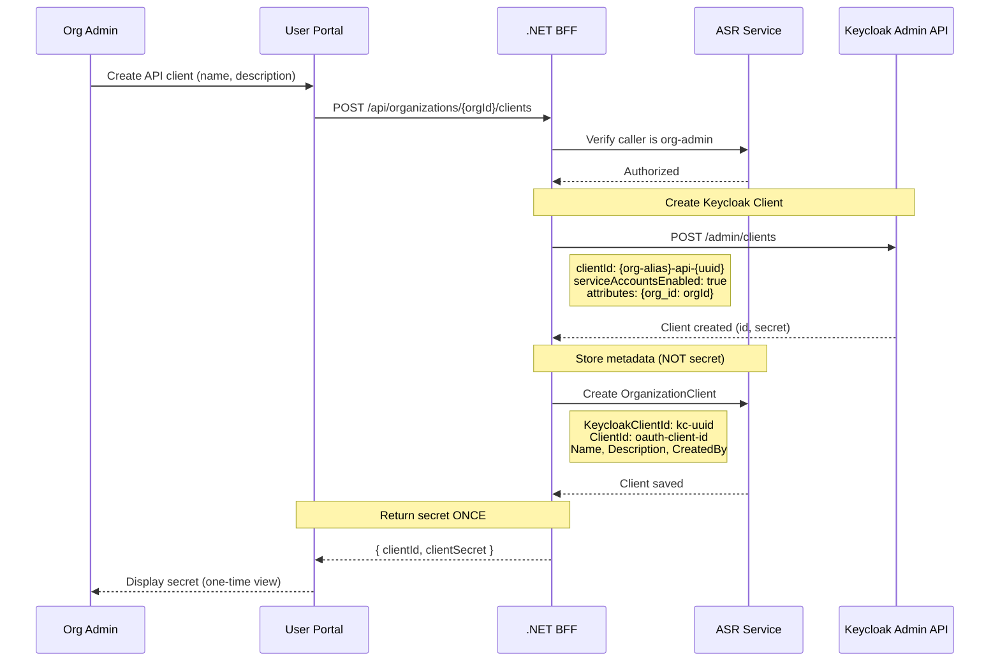

# ASR Data Model Design

## 1. Overview

### 1.1 Purpose

This document defines the data model architecture for the **Association Registry (ASR)**, a CTN application built on top of Keycloak v26. The ASR manages organizations, their members, and business relationships within the CTN dataspace. The ASR will support both self-service management of the organization, members, etc, as well as dataspace admins that can manage all organizations in the association registry.

### 1.2 Design Principles

1. **Hybrid Storage**: Identity data in Keycloak, business data in ASR database
2. **Keycloak as Identity Provider**: Leverage Keycloak v26 Organizations for identity-first login and member management
3. **ASR as Source of Truth for Business Data**: Agreements, certificates, services, and compliance data remain in ASR
4. **Push-on-Write Sync**: Changes in ASR trigger updates to Keycloak (not background sync)
5. **Soft Delete**: Entities are marked inactive, never hard-deleted (audit compliance)

### 1.3 Key Decisions Summary

| # | Decision |
|---|----------|
| 1 | Use Keycloak v26 Organizations |
| 1a | **Keycloak UUID as Organization.Identifier** - For Keycloak-enabled instances, `Organization.Identifier` contains the Keycloak Organization UUID. This avoids breaking changes (no property rename). Business identifiers (KvK, LEI, EUID) are stored in the `Identifiers` collection as metadata, not as primary keys. For non-Keycloak instances, `Identifier` can remain an arbitrary string. |
| 2 | Multiple users per organization |
| 3 | M2M clients: Keycloak stores credentials, ASR stores domain metadata |
| 4 | Organizations created via Keycloak Admin API |
| 5 | Simple org roles: `org-admin` vs `org-member` |
| 5a | **Phase 1: Realm roles** - Users have the same role across all organizations. **Phase 2: Organization member attributes** - Per-organization role stored in Keycloak org membership attributes, included in token via `Organization Membership` mapper. |
| 6 | Users can belong to multiple organizations |
| 7 | All business entities (Agreement, Certificate, etc.) remain in ASR |
| 8 | M2M authentication uses client secrets (not X.509 certificates) |
| 9 | First onboarding user becomes `org-admin` |
| 10 | Soft delete in both Keycloak and ASR |
| 11 | Dedicated `Identifier` entity replaces `Property.IsIdentifier` pattern |
| 12 | `Verification` entity tracks registration approval steps |
| 13 | Organization status computed from incomplete verifications (not stored) |
| 14 | `System` entity (renamed OrganizationClient) for M2M clients + OAS metadata |
| 15 | All entities implement `IAuditableEntity` for automatic timestamps |
| 16 | Optimistic concurrency via RowVersion/xmin depending on database provider |
| 17 | Global query filters for soft delete pattern |
| 18 | Data retention: 30-day recovery, 90-day anonymization, 7-year audit |
| 19 | **Store encrypted ID tokens as evidence** - For eHerkenning and Keycloak verifications, store the full encrypted ID token for non-repudiation. Store SHA-256 hash separately for integrity verification after token deletion. Evidence data encrypted with `IDataProtector`. Retention: 2 years for encrypted token, 7 years for hash. |
| 20 | **Attachments on Organization** - Documents (KvK uitreksel, certificates) stored in blob storage with metadata on Organization. Verification records the document hash at review time, not the document itself. |

---

## 2. Architecture Overview

```
┌─────────────────────────────────────────────────────────────────────────────┐
│                              CTN APPLICATION                                 │
│                                                                             │
│  ┌─────────────────────────────────────────────────────────────────────┐   │
│  │                         ASR (Business Domain)                        │   │
│  │                         PostgreSQL Database                          │   │
│  │                                                                      │   │
│  │   Organization ──┬── Identifier       (CoC, LEI, EUID)          NEW  │   │
│  │   - Identifier   ├── Verification     (approval steps)          NEW  │   │
│  │   - Adherence    ├── Agreement        (legal contracts)              │   │
│  │   - Details      │                                                    │   │
│  │     └─ Address   ├── Certificate      (iSHARE X.509)                 │   │
│  │                  ├── Certificate      (iSHARE X.509)                 │   │
│  │                  ├── Service          (business offerings)           │   │
│  │                  ├── OrganizationRole (dataspace roles)              │   │
│  │                  ├── Property         (business metadata)            │   │
│  │                  ├── AuthorizationRegistry (AR federation)           │   │
│  │                  ├── OrganizationMember    (user references)    NEW  │   │
│  │                  └── System           (M2M clients + OAS)       NEW  │   │
│  │                                                                      │   │
│  └─────────────────────────────────────────────────────────────────────┘   │
│                                    │                                        │
│                                    │ Sync (push-on-write)                   │
│                                    ▼                                        │
│  ┌─────────────────────────────────────────────────────────────────────┐   │
│  │                      KEYCLOAK v26 (Identity)                         │   │
│  │                                                                      │   │
│  │   Organization ──┬── Members (Users)                                 │   │
│  │   - id           │   - sub, email, credentials                       │   │
│  │   - name         │   - realm roles: org-admin, org-member            │   │
│  │   - alias        │                                                   │   │
│  │   - domains[]    ├── Clients (M2M)                                   │   │
│  │   - enabled      │   - clientId, secret                              │   │
│  │   - attributes   │   - attributes: org_id                            │   │
│  │                  │                                                   │   │
│  │                  └── Identity Providers (optional)                   │   │
│  │                                                                      │   │
│  └─────────────────────────────────────────────────────────────────────┘   │
│                                                                             │
└─────────────────────────────────────────────────────────────────────────────┘
```

---

## 3. Data Ownership Matrix

### 3.1 What Lives Where

| Data | Keycloak | ASR | Sync Direction | Rationale |
|------|:--------:|:---:|:--------------:|-----------|
| **Organization identity** | ✅ Primary | ✅ Reference | ASR → KC | KC handles org-based login |
| **Organization name** | ✅ | ✅ | ASR → KC | Display in tokens |
| **Organization enabled** | ✅ | ✅ (Adherence) | ASR → KC | Adherence status controls access |
| **Organization domains** | ✅ | ❌ | — | Explicitly configured by admins (not auto-extracted during onboarding) |
| **User credentials** | ✅ Primary | ❌ | — | KC owns authentication |
| **User email** | ✅ Primary | ❌ | — | KC owns identity |
| **User-Org membership** | ✅ | ✅ Reference | ASR → KC | Track in both for queries |
| **User org role (admin/member)** | ✅ Realm roles (Phase 1) / Org member attributes (Phase 2) | ✅ | ASR → KC | Authorization in tokens |
| **M2M Client credentials** | ✅ Primary | ❌ | — | Never store secrets in ASR |
| **M2M Client metadata** | ❌ | ✅ Primary | — | Purpose, created by, expiry |
| **Agreements** | ❌ | ✅ | — | Pure business data |
| **Certificates** | ❌ | ✅ | — | iSHARE compliance |
| **Services** | ❌ | ✅ | — | Business catalog |
| **OrganizationRole** | ❌ | ✅ | — | Dataspace classification |
| **Properties** | ❌ (except synced) | ✅ | Selective | Only token claims sync |
| **Adherence** | ❌ (only enabled) | ✅ | Status only | Validity is business logic |
| **Identifiers** | ❌ | ✅ | — | Business identifiers (CoC, LEI, EUID) |
| **Verifications** | ❌ | ✅ | — | Approval workflow status |
| **Address** | ❌ | ✅ | — | Organization address (owned by AdditionalDetails) |
| **Systems** | ✅ (client creds) | ✅ (metadata + OAS) | ASR → KC | M2M clients with API specs |

### 3.2 Keycloak Token Claims

The following claims will be available in JWT tokens via Keycloak protocol mappers:

#### Phase 1: Single Organization (Current Implementation)

> **MVP Limitation:** Users must belong to exactly one Keycloak Organization. If a token contains multiple organizations, the request is rejected with HTTP 403. See [ASR Minimal Architecture §5](./asr-minimal-architecture.md#5-tenant-context-service) for implementation details and future multi-org support.

```json
{
  "sub": "user-uuid",
  "email": "user@example.com",
  "preferred_username": "user@example.com",
  "organization": {
    "org-alias": {
      "id": "org-uuid",
      "name": "Organization Name"
    }
  },
  "realm_access": {
    "roles": ["org-admin"]
  }
}
```

**Phase 1 Notes:**
- Organization roles use Keycloak realm roles: `org-admin` or `org-member`
- Realm roles appear automatically in `realm_access.roles` claim (no custom protocol mapper needed)
- Standard .NET `[Authorize(Roles = "org-admin")]` attribute works out of the box
- **Limitation: Users have the same role across ALL organizations** (realm roles are global)
- For Phase 1, this is acceptable as most users will only belong to one organization
- The `organization` claim is populated by Keycloak v26 Organizations
- Identifiers use simple attribute keys: `KVK`, `LEI`, `EORI`
- These attributes are available in tokens via protocol mappers

#### Phase 2: Per-Organization Roles (Deferred)

When per-organization role differentiation is needed, we will migrate to Keycloak Organization member attributes:

**Token Structure:**
```json
{
  "organization": {
    "acme-corp": {
      "id": "42c3e46f-...",
      "role": ["admin"]       // ← Admin for ACME Corp
    },
    "widgets-inc": {
      "id": "7b91a2c3-...",
      "role": ["member"]      // ← Member for Widgets Inc
    }
  }
}
```

**Implementation:**
- Store role in organization member attributes when adding members via Keycloak Admin API
- Enable `Add organization attributes` in the `Organization Membership` protocol mapper
- Role appears per-organization in the `organization` claim
- Login flow: Keycloak prompts user to select organization (built-in org picker)
- Authorization service reads role from selected organization's attributes

**Migration Path:**
1. For each OrganizationMember, set member attribute `role` via Keycloak Admin API
2. Enable `Add organization attributes` in Organization Membership mapper
3. Update `IOrganizationAuthorizationService` to read role from organization claim
4. Remove realm role assignments (keep roles as fallback during transition)

---

## 4. Entity Definitions

### 4.1 Base Interfaces and Patterns

#### IAuditableEntity

All entities implement this interface for automatic timestamp management:

```csharp
public interface IAuditableEntity
{
    DateTimeOffset CreatedAt { get; set; }
    DateTimeOffset? UpdatedAt { get; set; }
    string? CreatedBy { get; set; }    // Keycloak user ID or "system"
    string? UpdatedBy { get; set; }    // Keycloak user ID or "system"
}
```

#### ISoftDeletable

Entities that support soft delete:

```csharp
public interface ISoftDeletable
{
    bool IsDeleted { get; set; }
    DateTimeOffset? DeletedAt { get; set; }
    string? DeletedBy { get; set; }    // Keycloak user ID
}
```

#### Concurrency Token

All entities include a concurrency token for optimistic locking:

```csharp
// SQL Server: [Timestamp] attribute on byte[]
public byte[] RowVersion { get; set; }

// PostgreSQL: Uses xmin system column (configured in DbContext)
// SQLite: Uses GUID-based version (manual update)
```

### 4.2 Organization (Modified)

```csharp
public class Organization : IAuditableEntity, ISoftDeletable
{
    // Primary key - Keycloak Organization UUID for Keycloak instances (immutable)
    // For non-Keycloak instances, can be any unique string
    // NOTE: Property remains "Identifier" to avoid breaking changes
    [Key]
    public required string Identifier { get; set; }
    
    // Basic info (synced to Keycloak)
    public required string Name { get; set; }
    public string? Alias { get; set; }  // URL-friendly slug, immutable after creation
    
    // Business data (ASR only)
    public required Adherence Adherence { get; set; }
    public AdditionalDetails AdditionalDetails { get; set; } = new();  // Contains Address as owned type
    
    // Audit (IAuditableEntity)
    public DateTimeOffset CreatedAt { get; set; }
    public DateTimeOffset? UpdatedAt { get; set; }
    public string? CreatedBy { get; set; }
    public string? UpdatedBy { get; set; }
    
    // Soft delete (ISoftDeletable)
    public bool IsDeleted { get; set; }
    public DateTimeOffset? DeletedAt { get; set; }
    public string? DeletedBy { get; set; }
    
    // Concurrency
    public byte[] RowVersion { get; set; } = [];  // SQL Server
    // PostgreSQL uses xmin shadow property
    
    // Navigation properties
    public ICollection<Identifier> Identifiers { get; set; } = [];          // NEW
    public ICollection<OrganizationVerification> Verifications { get; set; } = [];  // NEW - via junction table
    public ICollection<Attachment> Attachments { get; set; } = [];          // NEW - documents in blob storage
    public ICollection<Agreement> Agreements { get; set; } = [];
    public ICollection<Certificate> Certificates { get; set; } = [];
    public ICollection<OrganizationRole> Roles { get; set; } = [];
    public ICollection<Property> Properties { get; set; } = [];
    public ICollection<Service> Services { get; set; } = [];
    public ICollection<AuthorizationRegistry> AuthorizationRegistries { get; set; } = [];
    public ICollection<OrganizationMember> Members { get; set; } = [];      // NEW
    public ICollection<System> Systems { get; set; } = [];                  // NEW (renamed from OrganizationClient)
    
    // Computed property: Organization requires review if any verification is pending
    // Note: Requires loading via Include() or separate query through junction table
    public bool RequiresReview => Verifications.Any(ov => ov.Verification?.Status == VerificationStatus.Pending);
}
```

### 4.3 Identifier (New)

Dedicated entity for organization identifiers (replaces `Property.IsIdentifier` pattern):

```csharp
public class Identifier : IAuditableEntity
{
    public required string Id { get; set; }  // GUID
    
    // Foreign key (matches Organization.Identifier)
    public required string OrganizationIdentifier { get; set; }
    public Organization? Organization { get; set; }
    
    // Identifier data
    public required IdentifierType Type { get; set; }
    public required string Value { get; set; }
    
    // Verification status
    public bool IsVerified { get; set; }
    public DateTimeOffset? VerifiedAt { get; set; }
    public string? VerifiedBy { get; set; }  // "system" or admin user ID
    
    // Audit (IAuditableEntity)
    public DateTimeOffset CreatedAt { get; set; }
    public DateTimeOffset? UpdatedAt { get; set; }
    public string? CreatedBy { get; set; }
    public string? UpdatedBy { get; set; }
}

public enum IdentifierType
{
    CoC,    // Chamber of Commerce (KvK) number
    LEI,    // Legal Entity Identifier
    EUID    // European Unique Identifier
}
```

### 4.4 Verification (New)

Tracks registration approval steps. Organization status is computed from pending verifications.

> **Note:** Uses a junction table pattern (`OrganizationVerification`) instead of direct FK relationship for flexible linking/unlinking.

```csharp
public class Verification(VerificationType type)
{
    [Key]
    public string VerificationId { get; init; } = Guid.NewGuid().ToString();
    
    // Verification definition
    public VerificationType Type { get; init; } = type;
    public VerificationCategory Category { get; init; }  // Auto-derived from Type in constructor
    
    // Status
    public VerificationStatus Status { get; set; } = VerificationStatus.Pending;
    public string? Reason { get; set; }              // Rejection reason or notes
    public DateTimeOffset? HandledAt { get; set; }   // When status changed from Pending
    public string? HandledBy { get; set; }           // Email or "system"
    
    // Simplified evidence storage
    public string? Evidence { get; set; }            // Free-form evidence string
}
```

> **Deferred Features (see Section 10.3 for future design):**
> - Evidence storage (`EvidenceHash`, `EvidenceTokenEncrypted`, `EvidenceIssuer`, `EvidenceAssuranceLevel`, `EvidenceCollectedAt`)
> - Expiry tracking (`ExpiresAt`, `IsExpired`, `IsValid` computed properties)
> - Audit fields (`IAuditableEntity`: `CreatedAt`, `UpdatedAt`, `CreatedBy`, `UpdatedBy`)
> - Additional verification types: `LeiCheck`, `BusinessRegisterExtract`, `EHerkenning`, `ConditionsAccepted`
> - Additional statuses: `Expired`, `Skipped`

**Auto-derived Category:** The `Category` is computed from `Type` in the constructor:

```csharp
public Verification(VerificationType type)
{
    Type = type;
    Category = type switch
    {
        VerificationType.OnboardingApproval => VerificationCategory.Admin,
        VerificationType.DnsVerification => VerificationCategory.Automatic,
        VerificationType.KvkCheck => VerificationCategory.Automatic,
        VerificationType.EmailVerification => VerificationCategory.Organization,
        _ => VerificationCategory.Organization
    };
}
```

```csharp
public enum VerificationStatus
{
    Pending,      // Not yet handled
    Approved,     // Successfully verified
    Rejected      // Verification failed (see Reason)
    // Planned: Expired, Skipped
}

public enum VerificationType
{
    // ADMIN
    OnboardingApproval,       // Manual admin approval of registration
    
    // AUTOMATIC
    DnsVerification,          // DNS TXT record verification
    KvkCheck,                 // Chamber of Commerce API validation
    // Planned: LeiCheck
    
    // ORGANIZATION
    EmailVerification         // Email domain ownership (handled by Keycloak)
    // Planned: BusinessRegisterExtract, EHerkenning, ConditionsAccepted
}

public enum VerificationCategory
{
    Admin,           // Requires admin action
    Automatic,       // System performs automatically
    Organization     // Organization performs action
}
```

### 4.4a OrganizationVerification (New - Junction Table)

Join entity for many-to-many relationship between organizations and verifications. Uses junction table pattern for flexible linking/unlinking.

```csharp
public class OrganizationVerification(string organizationId, string verificationId)
{
    public string OrganizationId { get; init; } = organizationId;
    public string VerificationId { get; init; } = verificationId;
}
```

**EF Core Configuration:**
```csharp
modelBuilder.Entity<OrganizationVerification>()
    .ToTable("OrOrganizationVerification")
    .HasKey(ov => new { ov.OrganizationId, ov.VerificationId });
```

### 4.4b Attachment (New)

Documents uploaded by organizations, stored in blob storage. The `Verification` entity stores a hash of the document at review time, not the document itself.

```csharp
public class Attachment : IAuditableEntity, ISoftDeletable
{
    public required string Id { get; set; }  // GUID
    
    // Foreign key (matches Organization.Identifier)
    public required string OrganizationIdentifier { get; set; }
    public Organization? Organization { get; set; }
    
    // Document metadata
    public required AttachmentType Type { get; set; }
    public required string FileName { get; set; }
    public required string BlobUrl { get; set; }      // URL to blob storage
    public required string ContentHash { get; set; }  // SHA-256 for integrity
    public string? ContentType { get; set; }          // MIME type
    public long FileSizeBytes { get; set; }
    
    // Audit (IAuditableEntity)
    public DateTimeOffset CreatedAt { get; set; }
    public DateTimeOffset? UpdatedAt { get; set; }
    public string? CreatedBy { get; set; }
    public string? UpdatedBy { get; set; }
    
    // Soft delete (ISoftDeletable)
    public bool IsDeleted { get; set; }
    public DateTimeOffset? DeletedAt { get; set; }
    public string? DeletedBy { get; set; }
}

public enum AttachmentType
{
    KvkUitreksel,     // Chamber of Commerce extract
    Certificate,       // X.509 or other certificate
    Agreement,         // Signed agreement document
    Other              // Other supporting document
}
```

**Relationship to Verification:**

When an admin reviews a KvK uitreksel:
1. Document is uploaded → `Attachment` created with `ContentHash`
2. Admin reviews and approves → `Verification` updated:
   - `Status = Approved`
   - `Evidence = Attachment.ContentHash` (hash snapshot at review time)
   - `HandledAt`, `HandledBy` set

This design ensures:
- Document lifecycle is separate from verification lifecycle
- Hash at review time proves which version was approved
- Document can be updated/replaced without invalidating past verifications

### 4.5 Address (Owned Type inside AdditionalDetails)

Address is stored as an EF Core owned entity type inside `AdditionalDetails`. This design was chosen because:
- Address is always accessed together with Organization (no independent queries needed)
- Simpler schema - no separate table or foreign keys
- Matches the KvK API response structure for Dutch addresses

**Note:** Contact email and phone are stored directly in `AdditionalDetails.CompanyEmail` and `AdditionalDetails.CompanyPhone`, not in the Address entity.

```csharp
public class Address
{
    public string Street { get; set; }              // e.g., "Hoofdstraat"
    public int HouseNumber { get; set; }            // e.g., 123
    public string? HouseLetter { get; set; }        // e.g., "A" (optional)
    public string? HouseNumberAddition { get; set; }// e.g., "bis" (optional)
    public string? AddressAddition { get; set; }    // e.g., "3e etage" (optional)
    public string PostalCode { get; set; }          // e.g., "1234AB"
    public string City { get; set; }                // e.g., "Amsterdam"
    public string Country { get; set; }             // e.g., "Nederland"
    
    public Address(
        string street,
        int houseNumber,
        string postalCode,
        string city,
        string country,
        string? houseLetter = null,
        string? houseNumberAddition = null,
        string? addressAddition = null)
    {
        Street = street;
        HouseNumber = houseNumber;
        PostalCode = postalCode;
        City = city;
        Country = country;
        HouseLetter = houseLetter;
        HouseNumberAddition = houseNumberAddition;
        AddressAddition = addressAddition;
    }
}
```

**AdditionalDetails with Address:**
```csharp
public class AdditionalDetails
{
    public string? Description { get; set; }
    public string? WebsiteUrl { get; set; }
    public string? CapabilitiesUrl { get; set; }
    public string? LogoUrl { get; set; }
    public Address? Address { get; set; }           // Owned entity
    public string? CompanyEmail { get; set; }
    public string? CompanyPhone { get; set; }
    public string? Tags { get; set; }
    public bool? PubliclyPublishable { get; set; }
    public ICollection<string> CountriesOfOperation { get; set; } = [];
    public ICollection<string> Sectors { get; set; } = [];
}
```

**EF Core Configuration:**
```csharp
modelBuilder.Entity<Organization>()
    .ToTable("OrOrganization")
    .OwnsOne(o => o.AdditionalDetails, ad => ad.OwnsOne(a => a.Address));
```

**Address is populated from KvK API during onboarding:**
```csharp
var cocAddress = kvkProfile.Embedded?.Hoofdvestiging?.Adressen?.FirstOrDefault(a =>
    a.Straatnaam is not null &&
    a.Huisnummer is not null &&
    a.Postcode is not null &&
    a.Plaats is not null &&
    a.Land is not null);

if (cocAddress is not null)
{
    organization.AdditionalDetails.Address = new Address(
        cocAddress.Straatnaam!,
        cocAddress.Huisnummer!.Value,
        cocAddress.Postcode!,
        cocAddress.Plaats!,
        cocAddress.Land!,
        cocAddress.Huisletter,
        cocAddress.HuisnummerToevoeging,
        cocAddress.ToevoegingAdres
    );
}
```

### 4.6 OrganizationMember (New)

Tracks user membership with role. Does NOT store identity data.

```csharp
public class OrganizationMember : IAuditableEntity
{
    public required string Id { get; set; }  // GUID
    
    // Foreign keys (matches Organization.Identifier)
    public required string OrganizationIdentifier { get; set; }
    public Organization? Organization { get; set; }
    
    // Keycloak reference (not a foreign key - external system)
    public required string KeycloakUserId { get; set; }
    
    // Role within organization
    public required OrganizationMemberRole Role { get; set; }
    
    // Membership lifecycle
    public DateTimeOffset JoinedAt { get; set; }
    public string? InvitedByUserId { get; set; }  // Keycloak user ID who invited
    public DateTimeOffset? LeftAt { get; set; }   // Soft delete (left org)
    public bool IsActive { get; set; } = true;
    
    // Audit (IAuditableEntity)
    public DateTimeOffset CreatedAt { get; set; }
    public DateTimeOffset? UpdatedAt { get; set; }
    public string? CreatedBy { get; set; }
    public string? UpdatedBy { get; set; }
}

public enum OrganizationMemberRole
{
    Member,   // Read access to organization data
    Admin     // Can manage org, invite users, create M2M clients
}
```

> **Enum Alignment:** This enum maps to `OrganizationRole` in [ASR Minimal Architecture §2](./asr-minimal-architecture.md#2-domain-model) where `Member = 0` and `Admin = 1`. The naming difference is intentional: `OrganizationMemberRole` emphasizes the membership context, while `OrganizationRole` is used in authorization handlers.
```

### 4.7 System (New, renamed from OrganizationClient)

Tracks M2M clients with business metadata and OpenAPI specifications. Does NOT store credentials.

```csharp
public class System : IAuditableEntity, ISoftDeletable
{
    public required string Id { get; set; }  // GUID
    
    // Foreign keys (matches Organization.Identifier)
    public required string OrganizationIdentifier { get; set; }
    public Organization? Organization { get; set; }
    
    // Keycloak reference
    public required string KeycloakClientId { get; set; }  // Keycloak client UUID
    public required string ClientId { get; set; }          // OAuth2 client_id string
    
    // Business metadata (ASR only)
    public required string Name { get; set; }              // Human-friendly name
    public string? Description { get; set; }               // Purpose of this system
    public required SystemType Type { get; set; }          // NEW: API, Service, etc.
    
    // OpenAPI Specification (NEW)
    public string? OpenApiSpecUrl { get; set; }            // URL to OAS document
    public string? OpenApiSpecVersion { get; set; }        // e.g., "3.0.3"
    public DateTimeOffset? OpenApiSpecFetchedAt { get; set; }
    
    // Activity tracking
    public DateTimeOffset? LastActivityAt { get; set; }    // Last API call timestamp
    
    // Lifecycle
    public DateTimeOffset? ExpiresAt { get; set; }         // Optional expiry
    public DateTimeOffset? RevokedAt { get; set; }         // Soft revoke
    public string? RevokedByUserId { get; set; }
    public bool IsActive { get; set; } = true;
    
    // Audit (IAuditableEntity)
    public DateTimeOffset CreatedAt { get; set; }
    public DateTimeOffset? UpdatedAt { get; set; }
    public string? CreatedBy { get; set; }                 // Keycloak user ID
    public string? UpdatedBy { get; set; }
    
    // Soft delete (ISoftDeletable)
    public bool IsDeleted { get; set; }
    public DateTimeOffset? DeletedAt { get; set; }
    public string? DeletedBy { get; set; }
}

public enum SystemType
{
    ApiClient,       // Pure API consumer
    ServiceProvider, // Provides services to the dataspace
    Hybrid           // Both consumer and provider
}
```

#### Adherence (Modified)

Add enabled state for Keycloak sync.

```csharp
public class Adherence
{
    public required string Status { get; set; }       // Active, Pending, Suspended, Revoked
    public DateTimeOffset? StartDate { get; set; }
    public DateTimeOffset? EndDate { get; set; }
    
    // Computed property for Keycloak sync
    public bool IsEnabled => Status == "Active" 
        && (StartDate == null || StartDate <= DateTimeOffset.UtcNow)
        && (EndDate == null || EndDate > DateTimeOffset.UtcNow);
}
```

### 4.8 Keycloak Entities (Managed via Admin API)

#### Keycloak Organization

Created/updated via `IKeycloakAdminService`:

```json
{
  "id": "uuid (= ASR Organization.Identifier)",
  "name": "Organization Name",
  "alias": "kvk-12345678",
  "enabled": true,
  "domains": [],
  "attributes": {
    "KVK": ["12345678"],
    "asr_synced_at": ["2026-01-05T12:00:00Z"]
  }
}
```

#### Keycloak User

```json
{
  "id": "uuid",
  "username": "user@example.com",
  "email": "user@example.com",
  "emailVerified": true,
  "enabled": true,
  "attributes": {
    "phone_number": ["+31612345678"]
  },
  "realmRoles": ["org-admin"]
}
```

**Note:** Organization identifiers are stored as **Keycloak Organization attributes** using simple keys (e.g., `KVK`, `LEI`, `EORI`). This is intentional:
- Identifiers are organization-level data, not user-level
- Keys become token claims directly (e.g., `"KVK": "12345678"`)
- Simple and consistent across systems
- Extensible: add `LEI`, `EORI` without schema changes
- Avoids data duplication when multiple users belong to the same organization

User-Organization membership is managed via Keycloak's Organization Members API:
- `POST /admin/realms/{realm}/organizations/{orgId}/members` - Add member
- `DELETE /admin/realms/{realm}/organizations/{orgId}/members/{userId}` - Remove member

#### Keycloak Client (M2M)

```json
{
  "id": "uuid (= ASR OrganizationClient.KeycloakClientId)",
  "clientId": "org-alias-api-client-1",
  "name": "API Client for Service X",
  "enabled": true,
  "serviceAccountsEnabled": true,
  "clientAuthenticatorType": "client-secret",
  "attributes": {
    "org_id": ["org-uuid"],
    "asr_client_id": ["asr-uuid"]
  }
}
```

---

## 5. Synchronization Strategy

### 5.1 Push-on-Write Pattern

Changes in ASR trigger immediate updates to Keycloak via the **Keycloak.AuthServices.Sdk.Kiota** library.

**Keycloak Organizations Admin API Endpoints (v26+):**

| Operation | Endpoint |
|-----------|----------|
| Create Organization | `POST /admin/realms/{realm}/organizations` |
| Get Organization | `GET /admin/realms/{realm}/organizations/{id}` |
| Update Organization | `PUT /admin/realms/{realm}/organizations/{id}` |
| Delete Organization | `DELETE /admin/realms/{realm}/organizations/{id}` |
| List Members | `GET /admin/realms/{realm}/organizations/{id}/members` |
| Add Member | `POST /admin/realms/{realm}/organizations/{id}/members` |
| Remove Member | `DELETE /admin/realms/{realm}/organizations/{id}/members/{userId}` |
| Send Invitation | `POST /admin/realms/{realm}/organizations/{id}/invitations` |

The examples below use an `IKeycloakAdminService` abstraction that wraps the Kiota-generated client:

```csharp
public class OrganizationService : IOrganizationService
{
    private readonly IAsrRepository _asrRepository;
    private readonly IKeycloakAdminService _keycloakAdmin;  // Wraps KeycloakAdminApiClient from Kiota

    public async Task<Organization> CreateOrganization(Organization organization)
    {
        // 1. Create in Keycloak first (get UUID)
        var identifiers = GetIdentifiersForKeycloak(organization);
        identifiers["asr_synced_at"] = DateTimeOffset.UtcNow.ToString("O");
        
        var keycloakOrg = await _keycloakAdmin.CreateOrganization(new CreateOrgRequest
        {
            Name = organization.Name,
            Alias = organization.Alias,  // e.g., "kvk-12345678"
            Enabled = organization.Adherence.IsEnabled,
            // Domains intentionally left empty - configured by admins later, not auto-extracted
            Attributes = identifiers  // { "KVK": ["12345678"], "asr_synced_at": [...] }
        });
        
        // 2. Use Keycloak's UUID as ASR's Identifier (primary key)
        organization.Identifier = keycloakOrg.Id;
        
        // 3. Save in ASR database
        return await _asrRepository.CreateOrganization(organization);
    }
    
    /// <summary>
    /// Converts ASR Identifier entities to Keycloak attribute dictionary.
    /// Uses simple keys: KVK, LEI, EORI
    /// </summary>
    private Dictionary<string, string[]> GetIdentifiersForKeycloak(Organization organization)
    {
        return organization.Identifiers.ToDictionary(
            id => id.Type switch
            {
                IdentifierType.CoC => "KVK",
                IdentifierType.LEI => "LEI",
                IdentifierType.EUID => "EUID",
                _ => throw new ArgumentOutOfRangeException()
            },
            id => new[] { id.Value }
        );
    }

    public async Task<Organization> UpdateOrganization(Organization organization)
    {
        // 1. Update ASR database
        var updated = await _asrRepository.UpdateOrganization(organization);
        
        // 2. Sync to Keycloak (fire-and-forget or await based on criticality)
        var identifiers = GetIdentifiersForKeycloak(organization);
        identifiers["asr_synced_at"] = DateTimeOffset.UtcNow.ToString("O");
        
        await _keycloakAdmin.UpdateOrganization(organization.Identifier, new UpdateOrgRequest
        {
            Name = organization.Name,
            Enabled = organization.Adherence.IsEnabled,
            Attributes = identifiers  // { "KVK": ["12345678"], "LEI": [...], ... }
        });
        
        return updated;
    }
}
```

### 5.2 Sync Failure Handling

If Keycloak sync fails:

1. **Create operations**: Fail the entire operation (rollback)
2. **Update operations**: Log error, mark for retry, continue with ASR update
3. **Delete operations**: Soft delete in ASR, queue Keycloak disable

```csharp
public class SyncRetryRecord
{
    public string Id { get; set; }
    public string EntityType { get; set; }      // "Organization", "Member", "Client"
    public string EntityId { get; set; }
    public string Operation { get; set; }       // "Create", "Update", "Delete"
    public string? ErrorMessage { get; set; }
    public int RetryCount { get; set; }
    public DateTimeOffset NextRetryAt { get; set; }
    public DateTimeOffset CreatedAt { get; set; }
}
```

### 5.3 What Gets Synced

| ASR Change | Keycloak Update |
|------------|-----------------|
| Organization.Name | Organization.name |
| Organization.Adherence.Status → Inactive | Organization.enabled = false |
| Organization.Identifiers (CoC, LEI, EUID) | Organization.attributes.{KVK, LEI, EORI} |
| OrganizationMember added | Add user to KC Organization members |
| OrganizationMember.Role changed | Assign realm role `org-admin` or `org-member` (Phase 1) |
| OrganizationMember.IsActive = false | Remove from KC Organization members |
| OrganizationClient created | Create KC Client with service account |
| OrganizationClient.IsActive = false | Disable KC Client |

**Verification → Adherence Status Sync:**

When an `OnboardingApproval` verification status changes, the organization's `Adherence.Status` is automatically updated:

```csharp
// In UpdateVerification():
organization.Adherence.Status = verification.Status switch
{
    VerificationStatus.Approved => "Active",
    VerificationStatus.Rejected => "Rejected",
    _ => organization.Adherence.Status
};
```

**Phase 2 Change:** When per-organization roles are needed, `OrganizationMember.Role changed` will instead update the member's `role` attribute via `PUT /admin/realms/{realm}/orgs/{orgId}/members/{userId}` with the new role value in member attributes.

---

## 6. User Flows

### 6.1 Organization Onboarding



**Critical Implementation Notes:**
1. **Keycloak Organization created FIRST** - This provides the organization ID for all subsequent operations
2. **Identifiers as Organization attributes** - Stored using simple keys (`KVK`, `LEI`, `EORI`) as attribute keys
3. **Realm role on User** - First onboarding user gets `org-admin` realm role assigned
4. **Both systems updated** - Keycloak and ASR must both have the organization and member records

### 6.2 Invite User to Organization



### 6.3 Create M2M Client



---

## 7. API Design

### 7.1 New/Modified Endpoints

#### Organizations

| Method | Path | Description |
|--------|------|-------------|
| POST | `/api/organizations` | Create organization (onboarding) |
| GET | `/api/organizations` | List organizations (filtered by user access) |
| GET | `/api/organizations/{id}` | Get organization details |
| PUT | `/api/organizations/{id}` | Update organization |
| DELETE | `/api/organizations/{id}` | Soft delete organization |

#### Organization Members

| Method | Path | Description |
|--------|------|-------------|
| GET | `/api/organizations/{orgId}/members` | List members |
| POST | `/api/organizations/{orgId}/members/invite` | Invite user |
| PUT | `/api/organizations/{orgId}/members/{memberId}` | Update role |
| DELETE | `/api/organizations/{orgId}/members/{memberId}` | Remove member |

#### Organization Clients (M2M)

| Method | Path | Description |
|--------|------|-------------|
| GET | `/api/organizations/{orgId}/clients` | List M2M clients |
| POST | `/api/organizations/{orgId}/clients` | Create client (returns secret once) |
| GET | `/api/organizations/{orgId}/clients/{clientId}` | Get client metadata |
| PUT | `/api/organizations/{orgId}/clients/{clientId}` | Update metadata |
| DELETE | `/api/organizations/{orgId}/clients/{clientId}` | Revoke client |
| POST | `/api/organizations/{orgId}/clients/{clientId}/rotate-secret` | Rotate secret |

### 7.2 Authorization Rules

| Action | Required |
|--------|----------|
| View organization | User is member of org, OR has `read:or` scope |
| Update organization | User is `org-admin`, OR has `write:or` scope |
| Manage members | User is `org-admin` of that org |
| Create M2M client | User is `org-admin` of that org |
| Revoke M2M client | User is `org-admin` of that org |

---

## 8. Keycloak Admin Service Interface

### 8.1 Extended Interface

```csharp
public interface IKeycloakAdminService
{
    // === Users (existing) ===
    Task<Result<string>> CreateUser(string email, string phone, CancellationToken ct = default);
    Task<Result<bool>> UserExists(string email, CancellationToken ct = default);
    Task<Result<string>> GetUserIdByEmail(string email, CancellationToken ct = default);
    Task<Result> SendPasswordSetupEmail(string userId, string? redirectUri = null, CancellationToken ct = default);
    Task<Result> DisableUser(string userId, CancellationToken ct = default);

    // === Organizations (new) ===
    Task<Result<KeycloakOrganization>> CreateOrganization(CreateOrganizationRequest request, CancellationToken ct = default);
    Task<Result<KeycloakOrganization>> GetOrganization(string orgId, CancellationToken ct = default);
    Task<Result> UpdateOrganization(string orgId, UpdateOrganizationRequest request, CancellationToken ct = default);
    Task<Result> DisableOrganization(string orgId, CancellationToken ct = default);

    // === Organization Members (new) ===
    Task<Result> AddMemberToOrganization(string orgId, string userId, CancellationToken ct = default);
    Task<Result> RemoveMemberFromOrganization(string orgId, string userId, CancellationToken ct = default);
    Task<Result<IReadOnlyList<KeycloakUser>>> GetOrganizationMembers(string orgId, CancellationToken ct = default);

    // === Clients (new) ===
    Task<Result<KeycloakClientWithSecret>> CreateClient(CreateClientRequest request, CancellationToken ct = default);
    Task<Result<KeycloakClient>> GetClient(string clientId, CancellationToken ct = default);
    Task<Result> UpdateClient(string clientId, UpdateClientRequest request, CancellationToken ct = default);
    Task<Result> DisableClient(string clientId, CancellationToken ct = default);
    Task<Result<string>> RotateClientSecret(string clientId, CancellationToken ct = default);
}
```

### 8.2 Request/Response Models

```csharp
public record CreateOrganizationRequest
{
    public required string Name { get; init; }
    public required string Alias { get; init; }
    public bool Enabled { get; init; } = true;
    public IReadOnlyList<string> Domains { get; init; } = [];
    public Dictionary<string, string[]> Attributes { get; init; } = new();
}

public record KeycloakOrganization
{
    public required string Id { get; init; }
    public required string Name { get; init; }
    public required string Alias { get; init; }
    public bool Enabled { get; init; }
    public IReadOnlyList<string> Domains { get; init; } = [];
}

public record CreateClientRequest
{
    public required string ClientId { get; init; }  // OAuth2 client_id
    public required string Name { get; init; }
    public string? Description { get; init; }
    public required string OrganizationId { get; init; }
    public IReadOnlyList<string> Scopes { get; init; } = [];
}

public record KeycloakClientWithSecret
{
    public required string Id { get; init; }        // Keycloak UUID
    public required string ClientId { get; init; }  // OAuth2 client_id
    public required string Secret { get; init; }    // Only returned on create
}
```

### 8.3 Organization Authorization Service

Abstraction for checking org roles, enabling Phase 1 → Phase 2 migration without code changes:

> **Implementation Note:** This service works alongside the resource-based authorization handlers (`SameOrganizationHandler`, `OrganizationRoleHandler`) defined in [ASR Minimal Architecture §6](./asr-minimal-architecture.md#6-authorization-layer). Use `IOrganizationAuthorizationService` for role checks; use `IAuthorizationService.AuthorizeAsync()` for resource ownership checks.

```csharp
public interface IOrganizationAuthorizationService
{
    /// <summary>
    /// Check if the user is an admin of the specified organization.
    /// Phase 1: Checks org-admin realm role.
    /// Phase 2: Checks Keycloak group membership.
    /// </summary>
    Task<bool> IsOrgAdmin(ClaimsPrincipal user, string orgId);
    
    /// <summary>
    /// Check if the user is a member of the specified organization.
    /// </summary>
    Task<bool> IsOrgMember(ClaimsPrincipal user, string orgId);
    
    /// <summary>
    /// Get the user's role in the specified organization.
    /// </summary>
    Task<OrganizationMemberRole?> GetOrgRole(ClaimsPrincipal user, string orgId);
}
```

#### Phase 1 Implementation (Realm Roles)

```csharp
public class RealmRoleOrgAuthorizationService : IOrganizationAuthorizationService
{
    public Task<bool> IsOrgAdmin(ClaimsPrincipal user, string orgId)
    {
        // Phase 1: Single org, check realm_access.roles for org-admin
        return Task.FromResult(user.IsInRole("org-admin"));
    }
    
    public Task<bool> IsOrgMember(ClaimsPrincipal user, string orgId)
    {
        // Check if user's organization claim contains this org
        var orgClaim = user.FindFirst("organization");
        // Parse and check if orgId is present
        return Task.FromResult(orgClaim != null); // Simplified
    }
    
    public Task<OrganizationMemberRole?> GetOrgRole(ClaimsPrincipal user, string orgId)
    {
        if (user.IsInRole("org-admin"))
            return Task.FromResult<OrganizationMemberRole?>(OrganizationMemberRole.Admin);
        if (user.IsInRole("org-member"))
            return Task.FromResult<OrganizationMemberRole?>(OrganizationMemberRole.Member);
        return Task.FromResult<OrganizationMemberRole?>(null);
    }
}
```

#### Phase 2 Implementation (Organization Member Attributes)

```csharp
public class OrgMemberAttributeAuthorizationService : IOrganizationAuthorizationService
{
    public Task<bool> IsOrgAdmin(ClaimsPrincipal user, string orgId)
    {
        // Phase 2: Check role attribute in organization claim
        var orgClaim = user.FindFirst("organization")?.Value;
        if (string.IsNullOrEmpty(orgClaim)) return Task.FromResult(false);
        
        var organizations = JsonDocument.Parse(orgClaim);
        
        // Find org by ID (need to iterate as claim is keyed by alias)
        foreach (var org in organizations.RootElement.EnumerateObject())
        {
            if (org.Value.TryGetProperty("id", out var idProp) && 
                idProp.GetString() == orgId &&
                org.Value.TryGetProperty("role", out var roleProp))
            {
                return Task.FromResult(roleProp.EnumerateArray()
                    .Any(r => r.GetString() == "admin"));
            }
        }
        return Task.FromResult(false);
    }
    
    public Task<OrganizationMemberRole?> GetOrgRole(ClaimsPrincipal user, string orgId)
    {
        // Parse organization claim and extract role for specific org
        var orgClaim = user.FindFirst("organization")?.Value;
        if (string.IsNullOrEmpty(orgClaim)) return Task.FromResult<OrganizationMemberRole?>(null);
        
        var organizations = JsonDocument.Parse(orgClaim);
        foreach (var org in organizations.RootElement.EnumerateObject())
        {
            if (org.Value.TryGetProperty("id", out var idProp) && 
                idProp.GetString() == orgId &&
                org.Value.TryGetProperty("role", out var roleProp))
            {
                var role = roleProp.EnumerateArray().FirstOrDefault().GetString();
                return Task.FromResult<OrganizationMemberRole?>(role switch
                {
                    "admin" => OrganizationMemberRole.Admin,
                    "member" => OrganizationMemberRole.Member,
                    _ => null
                });
            }
        }
        return Task.FromResult<OrganizationMemberRole?>(null);
    }
}
```

**Registration:**
```csharp
// Phase 1: Realm roles (same role across all orgs)
services.AddScoped<IOrganizationAuthorizationService, RealmRoleOrgAuthorizationService>();

// Phase 2: Organization member attributes (per-org roles, swap implementation)
services.AddScoped<IOrganizationAuthorizationService, OrgMemberAttributeAuthorizationService>();
```

---

## 9. Data Integrity Patterns

This section documents EF Core patterns for data integrity, validated against Microsoft documentation.

### 9.1 Automatic Timestamps

Use `ChangeTracker.StateChanged` event to automatically set timestamps on all entities implementing `IAuditableEntity`:

```csharp
public class OrganizationContext : DbContext
{
    private readonly IHttpContextAccessor _httpContextAccessor;
    
    public OrganizationContext(DbContextOptions<OrganizationContext> options, 
                                IHttpContextAccessor httpContextAccessor)
        : base(options)
    {
        _httpContextAccessor = httpContextAccessor;
        ChangeTracker.StateChanged += UpdateTimestamps;
        ChangeTracker.Tracked += UpdateTimestamps;
    }
    
    private void UpdateTimestamps(object? sender, EntityEntryEventArgs e)
    {
        if (e.Entry.Entity is not IAuditableEntity entity)
            return;
            
        var userId = _httpContextAccessor.HttpContext?.User?.FindFirst(ClaimTypes.NameIdentifier)?.Value 
                     ?? "system";
        var now = DateTimeOffset.UtcNow;
        
        switch (e.Entry.State)
        {
            case EntityState.Added:
                entity.CreatedAt = now;
                entity.CreatedBy = userId;
                break;
            case EntityState.Modified:
                entity.UpdatedAt = now;
                entity.UpdatedBy = userId;
                break;
        }
    }
}
```

### 9.2 Soft Delete with Global Query Filters

Use EF Core global query filters to automatically exclude soft-deleted entities:

```csharp
protected override void OnModelCreating(ModelBuilder modelBuilder)
{
    // Apply global query filter to all soft-deletable entities
    modelBuilder.Entity<Organization>().HasQueryFilter(o => !o.IsDeleted);
    modelBuilder.Entity<System>().HasQueryFilter(s => !s.IsDeleted);
    
    // ... other entities
}

public override async Task<int> SaveChangesAsync(CancellationToken cancellationToken = default)
{
    // Convert Delete operations to soft delete
    foreach (var entry in ChangeTracker.Entries<ISoftDeletable>())
    {
        if (entry.State == EntityState.Deleted)
        {
            entry.State = EntityState.Modified;
            entry.Entity.IsDeleted = true;
            entry.Entity.DeletedAt = DateTimeOffset.UtcNow;
            entry.Entity.DeletedBy = GetCurrentUserId();
        }
    }
    
    return await base.SaveChangesAsync(cancellationToken);
}
```

#### Cascade Delete Behavior

When an Organization is soft-deleted, related entities (Agreements, Certificates, Services, etc.) are **preserved**, not cascade-deleted:

| Layer | Behavior |
|-------|----------|
| **Database schema** | `OnDelete(DeleteBehavior.Cascade)` is configured |
| **Application layer** | `SaveChangesAsync` sets dependent entity states to `Unchanged` |

**Why this works:**
- All delete operations go through EF Core's `SaveChangesAsync()`
- The soft delete logic intercepts `EntityState.Deleted` and converts it to a `Modified` state
- Related entities in `References` and `Collections` are set to `Unchanged` to prevent cascade updates/deletes
- The database cascade behavior never triggers because no actual DELETE is executed

**Design rationale:**
- Related entities remain accessible for audit and recovery purposes
- Child data (Agreements, Certificates, etc.) is preserved even after the parent Organization is soft-deleted
- The 30-day recovery window (see Section 10.1) allows restoring the organization with all its relationships intact

**Important:** Direct SQL DELETE statements bypass this protection. All operations should go through the application layer.

To query soft-deleted entities (e.g., for admin recovery):

```csharp
// EF Core 8+
var allOrganizations = await context.Organizations
    .IgnoreQueryFilters()
    .ToListAsync();
    
// EF Core 10+ (named query filters)
// .IgnoreQueryFilters(["SoftDeleteFilter"])
```

### 9.3 Optimistic Concurrency

Prevent lost updates with database-specific concurrency tokens:

```csharp
// SQL Server - uses rowversion
[Timestamp]
public byte[] RowVersion { get; set; }

// PostgreSQL - uses xmin system column (configured in OnModelCreating)
modelBuilder.Entity<Organization>()
    .Property<uint>("xmin")
    .HasColumnType("xid")
    .ValueGeneratedOnAddOrUpdate()
    .IsConcurrencyToken();

// SQLite - application-managed GUID version
public Guid Version { get; set; } = Guid.NewGuid();
// Updated manually before save
```

Handle concurrency conflicts:

```csharp
try
{
    await context.SaveChangesAsync();
}
catch (DbUpdateConcurrencyException ex)
{
    // Reload entity and retry, or return 409 Conflict
    throw new ConcurrencyConflictException(
        "The entity was modified by another user. Please refresh and try again.");
}
```

### 9.4 Idempotency Keys (Onboarding)

Prevent duplicate onboarding submissions:

```csharp
public class OnboardingRequest
{
    public required string IdempotencyKey { get; set; }  // Client-generated GUID
    public required string KvkNumber { get; set; }
    public required string Email { get; set; }
    // ...
}

// Check before processing
var existing = await context.OnboardingRequests
    .FirstOrDefaultAsync(r => r.IdempotencyKey == request.IdempotencyKey);
    
if (existing != null)
{
    // Return existing result (idempotent)
    return existing.OrganizationIdentifier;
}
```

---

## 10. Data Retention Policy

Data retention periods for different entity types, aligned with GDPR and audit requirements:

| Data Category | Retention Period | Action After Expiry |
|---------------|------------------|---------------------|
| Soft-deleted entities | 30 days | Eligible for permanent deletion |
| PII in audit logs | 90 days | Anonymize (replace with hashes) |
| Business audit records | 7 years | Archive to cold storage |
| Active entity data | Indefinite | N/A |
| Sync retry queue | 30 days | Hard delete completed records |
| Session/token data | Per token expiry | Hard delete |

### 10.1 Soft Delete Recovery Window

Organizations and related entities remain recoverable for 30 days:

```csharp
public async Task<Organization?> RecoverOrganization(string id)
{
    var org = await context.Organizations
        .IgnoreQueryFilters()
        .FirstOrDefaultAsync(o => o.Id == id && o.IsDeleted);
        
    if (org == null) return null;
    
    if (org.DeletedAt < DateTimeOffset.UtcNow.AddDays(-30))
        throw new RecoveryWindowExpiredException("Recovery window has expired.");
    
    org.IsDeleted = false;
    org.DeletedAt = null;
    org.DeletedBy = null;
    
    await context.SaveChangesAsync();
    return org;
}
```

### 10.2 Audit Record Anonymization

After 90 days, anonymize PII in audit records while preserving audit trail:

```csharp
public class AuditAnonymizationJob
{
    public async Task AnonymizeOldRecords()
    {
        var cutoff = DateTimeOffset.UtcNow.AddDays(-90);
        
        var records = await context.AuditRecords
            .Where(r => r.CreatedAt < cutoff && !r.IsAnonymized)
            .ToListAsync();
            
        foreach (var record in records)
        {
            // Hash any PII fields in the JSON
            record.EntityJson = AnonymizeJson(record.EntityJson);
            record.IsAnonymized = true;
        }
        
        await context.SaveChangesAsync();
    }
}
```

### 10.3 Verification Evidence Retention

> **⚠️ Not yet implemented.** Current implementation uses a simplified `Evidence` string field. This section documents the future design for structured evidence storage with non-repudiation support.

Evidence stored on `Verification` entities (e.g., eHerkenning ID tokens) follows a specific retention policy to balance non-repudiation requirements with GDPR data minimization:

| Evidence Data | Retention | Rationale |
|---------------|-----------|-----------|
| `EvidenceTokenEncrypted` | 2 years | Non-repudiation window for disputes |
| `EvidenceHash` (SHA-256) | 7 years | Proves evidence existed (no PII) |
| `EvidenceIssuer`, `EvidenceAssuranceLevel` | 7 years | Audit metadata (no PII) |

**Evidence Type is Implicit:**

| If these fields are set... | Evidence type is... |
|----------------------------|---------------------|
| `EvidenceTokenEncrypted` + `EvidenceHash` | ID token (eHerkenning, Keycloak) |
| Only `EvidenceHash` | Document hash (uitreksel stored in Attachments) |
| Nothing | No evidence needed (manual, email via Keycloak) |

**Why store the full token?**

Storing only the hash would prove *that* a verification occurred, but not *what* was verified. The full encrypted token enables:

1. **Non-repudiation** - User cannot deny they authenticated; you can re-validate the cryptographic signature against the IdP's public keys
2. **Dispute resolution** - If challenged, decrypt and present the original signed token as evidence
3. **Re-verification** - Validate token claims if business rules are questioned

**eHerkenning-specific considerations:**

For B2B verifications, eHerkenning returns mostly pseudonymized or public data:
- `sub` - Pseudonymized identifier (safe)
- `chamber_of_commerce` (KvK) - Public registry data (safe)
- LoA claims - Not PII (safe)

⚠️ **Exception: Eenmanszaak** - For sole proprietorships, `LegalSubjectID` may contain a BSN. Apply encryption consistently regardless.

**Implementation:**

```csharp
public class VerificationEvidenceCleanupJob
{
    public async Task CleanupExpiredEvidence()
    {
        var cutoff = DateTimeOffset.UtcNow.AddYears(-2);
        
        var verifications = await context.Verifications
            .Where(v => v.EvidenceTokenEncrypted != null && v.EvidenceCollectedAt < cutoff)
            .ToListAsync();
            
        foreach (var verification in verifications)
        {
            // Delete encrypted token, keep hash as proof
            verification.EvidenceTokenEncrypted = null;
            // EvidenceHash, EvidenceIssuer, EvidenceAssuranceLevel remain for 7 years
        }
        
        await context.SaveChangesAsync();
    }
}
```

---

## 11. Database Schema Changes

### 11.1 New Tables

```sql
-- Identifiers (NEW)
CREATE TABLE identifiers (
    id VARCHAR(36) PRIMARY KEY,
    organization_id VARCHAR(36) NOT NULL REFERENCES organizations(id),
    type VARCHAR(50) NOT NULL,          -- 'CoC', 'LEI', 'EUID'
    value VARCHAR(255) NOT NULL,
    is_verified BOOLEAN NOT NULL DEFAULT FALSE,
    verified_at TIMESTAMPTZ,
    verified_by VARCHAR(36),
    created_at TIMESTAMPTZ NOT NULL DEFAULT NOW(),
    updated_at TIMESTAMPTZ,
    created_by VARCHAR(36),
    updated_by VARCHAR(36),
    
    UNIQUE(organization_id, type)       -- One identifier per type per org
);

CREATE INDEX idx_identifiers_org ON identifiers(organization_id);
CREATE INDEX idx_identifiers_type_value ON identifiers(type, value);

-- Verifications (NEW)
CREATE TABLE "OrVerification" (
    "VerificationId" VARCHAR(36) PRIMARY KEY,
    "Type" VARCHAR(50) NOT NULL,          -- VerificationType enum (stored as string)
    "Category" VARCHAR(50) NOT NULL,      -- 'Admin', 'Automatic', 'Organization'
    "Status" VARCHAR(50) NOT NULL DEFAULT 'Pending',  -- VerificationStatus enum
    "Reason" TEXT,                         -- Rejection reason or notes
    "HandledAt" TIMESTAMPTZ,
    "HandledBy" VARCHAR(255),              -- Email or 'system'
    "Evidence" TEXT                        -- Simplified evidence storage
    -- Deferred: expires_at, evidence_hash, evidence_token_encrypted, etc.
    -- Deferred: audit fields (created_at, updated_at, created_by, updated_by)
);

CREATE INDEX idx_verifications_pending ON "OrVerification"("Status") 
    WHERE "Status" = 'Pending';

-- Organization-Verification Junction Table (NEW)
CREATE TABLE "OrOrganizationVerification" (
    "OrganizationId" VARCHAR(36) NOT NULL REFERENCES "OrOrganization"("Identifier"),
    "VerificationId" VARCHAR(36) NOT NULL REFERENCES "OrVerification"("VerificationId"),
    PRIMARY KEY ("OrganizationId", "VerificationId")
);

CREATE INDEX idx_org_verification_org ON "OrOrganizationVerification"("OrganizationId");
CREATE INDEX idx_org_verification_ver ON "OrOrganizationVerification"("VerificationId");

-- Attachments (NEW)
CREATE TABLE "OrAttachment" (
    "Id" VARCHAR(36) PRIMARY KEY,
    "OrganizationIdentifier" VARCHAR(36) NOT NULL REFERENCES "OrOrganization"("Identifier"),
    "Type" VARCHAR(50) NOT NULL,          -- AttachmentType enum
    "FileName" VARCHAR(255) NOT NULL,
    "BlobUrl" VARCHAR(2048) NOT NULL,
    "ContentHash" VARCHAR(64) NOT NULL,   -- SHA-256 for integrity
    "ContentType" VARCHAR(100),           -- MIME type
    "FileSizeBytes" BIGINT,
    "CreatedAt" TIMESTAMPTZ NOT NULL DEFAULT NOW(),
    "UpdatedAt" TIMESTAMPTZ,
    "CreatedBy" VARCHAR(36),
    "UpdatedBy" VARCHAR(36),
    "IsDeleted" BOOLEAN NOT NULL DEFAULT FALSE,
    "DeletedAt" TIMESTAMPTZ,
    "DeletedBy" VARCHAR(36)
);

CREATE INDEX idx_attachments_org ON "OrAttachment"("OrganizationIdentifier") WHERE "IsDeleted" = FALSE;
CREATE INDEX idx_attachments_type ON "OrAttachment"("OrganizationIdentifier", "Type") WHERE "IsDeleted" = FALSE;

-- Organization Members
CREATE TABLE organization_members (
    id VARCHAR(36) PRIMARY KEY,
    organization_id VARCHAR(36) NOT NULL REFERENCES organizations(id),
    keycloak_user_id VARCHAR(36) NOT NULL,
    role VARCHAR(50) NOT NULL,          -- 'Admin' or 'Member'
    joined_at TIMESTAMPTZ NOT NULL DEFAULT NOW(),
    invited_by_user_id VARCHAR(36),
    left_at TIMESTAMPTZ,
    is_active BOOLEAN NOT NULL DEFAULT TRUE,
    created_at TIMESTAMPTZ NOT NULL DEFAULT NOW(),
    updated_at TIMESTAMPTZ,
    created_by VARCHAR(36),
    updated_by VARCHAR(36),
    
    UNIQUE(organization_id, keycloak_user_id)
);

CREATE INDEX idx_org_members_org ON organization_members(organization_id) WHERE is_active = TRUE;
CREATE INDEX idx_org_members_user ON organization_members(keycloak_user_id) WHERE is_active = TRUE;

-- Systems (renamed from organization_clients)
CREATE TABLE systems (
    id VARCHAR(36) PRIMARY KEY,
    organization_id VARCHAR(36) NOT NULL REFERENCES organizations(id),
    keycloak_client_id VARCHAR(36) NOT NULL,
    client_id VARCHAR(255) NOT NULL,          -- OAuth2 client_id string
    name VARCHAR(255) NOT NULL,
    description TEXT,
    type VARCHAR(50) NOT NULL,                -- 'ApiClient', 'ServiceProvider', 'Hybrid'
    open_api_spec_url VARCHAR(2048),
    open_api_spec_version VARCHAR(20),
    open_api_spec_fetched_at TIMESTAMPTZ,
    last_activity_at TIMESTAMPTZ,
    expires_at TIMESTAMPTZ,
    revoked_at TIMESTAMPTZ,
    revoked_by_user_id VARCHAR(36),
    is_active BOOLEAN NOT NULL DEFAULT TRUE,
    created_at TIMESTAMPTZ NOT NULL DEFAULT NOW(),
    updated_at TIMESTAMPTZ,
    created_by VARCHAR(36),
    updated_by VARCHAR(36),
    is_deleted BOOLEAN NOT NULL DEFAULT FALSE,
    deleted_at TIMESTAMPTZ,
    deleted_by VARCHAR(36),
    row_version BYTEA,                        -- PostgreSQL: use xmin instead
    
    UNIQUE(keycloak_client_id)
);

CREATE INDEX idx_systems_org ON systems(organization_id) WHERE is_active = TRUE AND is_deleted = FALSE;

-- Sync Retry Queue
CREATE TABLE sync_retry_queue (
    id VARCHAR(36) PRIMARY KEY,
    entity_type VARCHAR(50) NOT NULL,
    entity_id VARCHAR(255) NOT NULL,
    operation VARCHAR(50) NOT NULL,
    error_message TEXT,
    retry_count INT NOT NULL DEFAULT 0,
    next_retry_at TIMESTAMPTZ NOT NULL,
    created_at TIMESTAMPTZ NOT NULL DEFAULT NOW(),
    completed_at TIMESTAMPTZ
);

CREATE INDEX idx_sync_retry_pending ON sync_retry_queue(next_retry_at) 
    WHERE completed_at IS NULL;

-- Idempotency Keys (for onboarding)
CREATE TABLE idempotency_keys (
    key VARCHAR(36) PRIMARY KEY,
    endpoint VARCHAR(255) NOT NULL,
    organization_id VARCHAR(255),
    response_json TEXT,
    created_at TIMESTAMPTZ NOT NULL DEFAULT NOW(),
    expires_at TIMESTAMPTZ NOT NULL
);

CREATE INDEX idx_idempotency_expires ON idempotency_keys(expires_at);
```

### 11.2 Organization Table Changes

```sql
-- Primary key is now Keycloak UUID (id), replacing the old identifier column
-- Migration: ALTER TABLE organizations RENAME COLUMN identifier TO legacy_identifier;
-- Migration: ALTER TABLE organizations ADD COLUMN id VARCHAR(36) PRIMARY KEY;

-- Add new columns to organizations
ALTER TABLE organizations ADD COLUMN alias VARCHAR(255);
ALTER TABLE organizations ADD COLUMN created_at TIMESTAMPTZ DEFAULT NOW();
ALTER TABLE organizations ADD COLUMN updated_at TIMESTAMPTZ;
ALTER TABLE organizations ADD COLUMN created_by VARCHAR(36);
ALTER TABLE organizations ADD COLUMN updated_by VARCHAR(36);
ALTER TABLE organizations ADD COLUMN is_deleted BOOLEAN NOT NULL DEFAULT FALSE;
ALTER TABLE organizations ADD COLUMN deleted_at TIMESTAMPTZ;
ALTER TABLE organizations ADD COLUMN deleted_by VARCHAR(36);
ALTER TABLE organizations ADD COLUMN row_version BYTEA;  -- For SQL Server: use [Timestamp]

-- Address columns (owned entity inside AdditionalDetails, stored in OrOrganization table)
-- See Section 4.5 for rationale on owned entity design
-- These columns are added to the OrOrganization table:
--   AdditionalDetails_Address_Street
--   AdditionalDetails_Address_HouseNumber
--   AdditionalDetails_Address_HouseLetter
--   AdditionalDetails_Address_HouseNumberAddition
--   AdditionalDetails_Address_AddressAddition
--   AdditionalDetails_Address_PostalCode
--   AdditionalDetails_Address_City
--   AdditionalDetails_Address_Country

CREATE UNIQUE INDEX idx_org_alias ON organizations(alias) WHERE alias IS NOT NULL;
CREATE INDEX idx_org_not_deleted ON organizations(id) WHERE is_deleted = FALSE;
```

---

## 12. Migration Path

### 12.1 From Current OR to ASR

1. **Schema migration**: Add new tables and columns
2. **Data migration**: 
   - Extract `keycloakUserId` from Properties → OrganizationMember
   - Migrate `Property.IsIdentifier` records to `Identifier` entity
   - Set role = Admin for existing users (they were the first/only user)
   - Create default `Verification` records for existing organizations
3. **Keycloak migration**:
   - Create Keycloak Organizations for each ASR Organization
   - Link existing users as members
4. **Property cleanup**: Remove migrated properties after verification

### 12.2 Backward Compatibility

During migration:
- Keep existing `IOrganizationRegistry` interface working
- Add new `IAsrOrganizationService` for new flows
- Deprecate old interface after migration complete

---

## 13. Security Considerations

### 13.1 Data Classification

| Data | Classification | Storage |
|------|----------------|---------|
| User credentials | Secret | Keycloak only |
| M2M client secrets | Secret | Keycloak only |
| User email/phone | PII | Keycloak only |
| KvK number | Business identifier | Both (synced) |
| Organization name | Public | Both (synced) |
| Agreements/contracts | Confidential | ASR only |
| X.509 certificates | Confidential | ASR only |

### 13.2 Access Control

- All ASR API endpoints require authentication
- Organization data scoped by membership
- M2M clients can only access their organization's data
- Dataspace admins (`write:or` scope) can access all organizations

### 13.3 Audit Trail

- All entity changes logged to `AuditRecord` table
- Keycloak events logged separately (auth events)
- Soft delete preserves history
- Audit records anonymized after 90 days (PII removed)

---

## 14. Open Questions

1. ~~**Domain extraction**~~: **RESOLVED** - Organization domains are NOT auto-extracted from user emails during onboarding. Domains are left empty and can be explicitly configured by admins later via Keycloak Admin Console or API. This avoids complexity with public email domain filtering and gives admins explicit control.

2. ~~**Multi-org user token**~~: **RESOLVED** - Keycloak v26 built-in organization picker prompts user to select during login. Deferred to Phase 2.

3. **Client scopes**: What OAuth2 scopes should M2M clients receive by default? Should this be configurable per organization?

4. **Rate limiting**: Should M2M client creation be rate-limited per organization?

5. **M2M org scope validation**: When M2M clients call ASR APIs, how do we validate they're only accessing their organization's data?
   - **Proposed solution**: Check `org_id` attribute on Keycloak Client, compare with requested resource's organization
   - Implementation: Add middleware or policy that extracts `org_id` from client token and validates ownership

---

## 15. Implementation Phases

### Phase 1: Foundation & Data Integrity
- [ ] Add base interfaces (`IAuditableEntity`, `ISoftDeletable`)
- [ ] Implement automatic timestamps via `ChangeTracker.StateChanged`
- [ ] Implement soft delete with global query filters
- [ ] Add optimistic concurrency tokens (per database provider)
- [ ] Add new entity classes (`Identifier`, `Verification`, `OrganizationMember`, `System`)
- [ ] Add `ContactDetails` owned entity to Organization
- [ ] Database migrations for all new tables
- [ ] Extend `IKeycloakAdminService` with Organization APIs
- [ ] Implement `IOrganizationAuthorizationService` (user attribute approach)
- [ ] Store identifiers as Keycloak Organization attributes using simple keys (`KVK`, `LEI`, `EORI`)

### Phase 2: Organization Management
- [ ] Create/update organization with Keycloak sync
- [ ] Onboarding flow with idempotency keys
- [ ] Create `Verification` records during onboarding
- [ ] Soft delete with Keycloak disable
- [ ] Adherence status → Keycloak enabled sync

### Phase 3: Identifiers & Verification Workflow
- [ ] Implement `Identifier` entity CRUD
- [ ] Implement `Verification` entity and workflow
- [ ] Automatic verifications (DNS, CoC API, LEI check)
- [ ] Admin approval flow for `RegistrationApproval`
- [ ] Organization status computed from incomplete verifications

### Phase 4: Member Management (Single Org)
- [ ] Invite user flow
- [ ] Role management (admin/member via user attribute)
- [ ] Remove member flow

### Phase 5: Systems (M2M Clients)
- [ ] Create system with secret (one-time display)
- [ ] Store `org_id` attribute on Keycloak Client
- [ ] OpenAPI specification URL and metadata
- [ ] Add M2M org scope validation middleware
- [ ] System activity tracking
- [ ] Secret rotation
- [ ] System revocation

### Phase 6: Data Retention & Compliance
- [ ] Implement 30-day soft delete recovery window
- [ ] Implement 90-day PII anonymization job
- [ ] Implement 7-year audit archive policy
- [ ] Add idempotency key cleanup job

### Phase 7: Migration
- [ ] Migrate existing data
- [ ] Migrate `Property.IsIdentifier` to `Identifier` entity
- [ ] Create Keycloak Organizations for existing orgs
- [ ] Link existing users as members
- [ ] Create default `Verification` records

### Phase 8: Multi-Organization Support (Deferred)
- [ ] Create Keycloak Groups per organization (`/organizations/{alias}/admins`, `/organizations/{alias}/members`)
- [ ] Migrate users from `org_role` attribute to groups
- [ ] Swap `IOrganizationAuthorizationService` implementation to `KeycloakGroupsOrgAuthorizationService`
- [ ] Enable Keycloak organization picker during login
- [ ] Remove `org_role` user attribute

---

## 16. References

### CTN Documentation
| Document | Purpose |
|----------|--------|
| [ASR Minimal Architecture](./asr-minimal-architecture.md) | Authorization layer, tenant context, route-based auth, security controls |
| [User Portal BFF Authentication](./user-portal-h2m-authentication.md) | BFF pattern, onboarding flow, CSRF protection |
| [Admin Portal OIDC Authentication](./admin-portal-h2m-authentication.md) | Blazor admin authentication |

### External References
- [Keycloak v26 Organizations Documentation](https://www.keycloak.org/docs/latest/server_admin/#managing-organizations)
- [Current Organization Registry Interface](../../Poort8.Dataspace.OrganizationRegistry/IOrganizationRegistry.cs)
- [EF Core Global Query Filters](https://learn.microsoft.com/en-us/ef/core/querying/filters)
- [EF Core Concurrency Tokens](https://learn.microsoft.com/en-us/ef/core/saving/concurrency)
- [EF Core Shadow Properties](https://learn.microsoft.com/en-us/ef/core/modeling/shadow-properties)
