# Federated OAuth/OIDC Architecture

An exploration of a federated authorization model where discovery and registration are centralized, but control remains decentralized.

## Purpose and Scope

**Problem**: The current practice where each app must build a direct relationship with each API leads to an unmanageable 'spaghetti' model. This increases development costs, slows innovation, and makes consistent management of security and consent virtually impossible.

**Goal**: Design a federated model where multiple API providers (Resource Servers) accept tokens from a single central Authorization Server, without requiring each app to integrate separately with each API.

**In scope**:

- Hub-and-spoke federation with central token issuance
- Consent layers (API→App and User→Data)
- Token validation by Resource Servers
- Scope governance

**Out of scope**:

- Distributed/mesh federations
- Fine-grained authorization within Resource Servers
- Delegation scenarios (see [Appendix A](#appendix-a-delegation-scenario))

## What This Is Not: Not a Platform

This model is explicitly **not a central platform** through which data flows. The architecture federates only trust — the actual data exchange remains a direct relationship between app and API.

| Aspect | Centrally Federated | Direct Between Parties |
|--------|---------------------|------------------------|
| Trust & identity | ✓ | |
| Token issuance | ✓ | |
| Scope governance | ✓ | |
| API registration | ✓ | |
| Data exchange | | ✓ |
| API calls | | ✓ |
| Contractual relationship app↔API | | ✓ |

The central AS never sees the actual data. This has important implications:

- **Privacy**: No central party that sees all data traffic
- **Performance**: No extra hop for data, only for tokens
- **Liability**: Data responsibility and end-control remains with the source (API provider)
- **Scalability**: Central AS doesn't need to scale with data volume

## A Familiar Pattern: "Sign in with Google"

To understand the architecture, we start with a recognizable example. When you choose "Register with Google" at Strava:

1. Strava sends you to Google
2. Google shows: "Strava is requesting access to your name and email address"
3. After approval, Google gives a token to Strava

Strava trusts Google as Identity Provider. This pattern is widespread and feels familiar to users. The question this document answers: **what if we extend this pattern to API access?**

## Definitions and Roles

| Term | Meaning | Example |
|------|---------|---------|
| **OpenID Provider (OP)** | Performs authentication, issues ID tokens | Keycloak, Google |
| **Authorization Server (AS)** | Issues access tokens for API access | Keycloak, Google |
| **Client** | Application requesting access on behalf of user/itself | Strava |
| **Resource Server (RS)** | API that delivers data, validates tokens | Fitbit API |
| **Resource Owner** | Owner of the data | The user |
| **Central Federation** | Combined OP+AS that issues tokens | In this document: "Google" as placeholder |

> **Note**: In this document we often use one component (e.g., Keycloak) as both OP and AS. Semantically these are different roles, but practically often the same server.

## Design Choices

This design makes five fundamental choices:

1. **Hub-and-spoke model** — One central AS, all RSs trust this issuer
2. **Two consent layers** — Both API→App and User→Data consent required
3. **Local JWT validation** — RSs validate tokens themselves, no introspection calls
4. **Short token lifetimes** — 5 minute access tokens as revocation mitigation
5. **Namespace-based scopes** — `{api}.{resource}.{action}` for governance

## From Identity to API Access

When you first choose "Register with Google" at Strava, the following happens:

1. Strava sends you to Google
2. Google shows a consent screen: "Strava is requesting access to your name and email address. Do you give permission?"
3. After approval, Google gives a token to Strava with that information

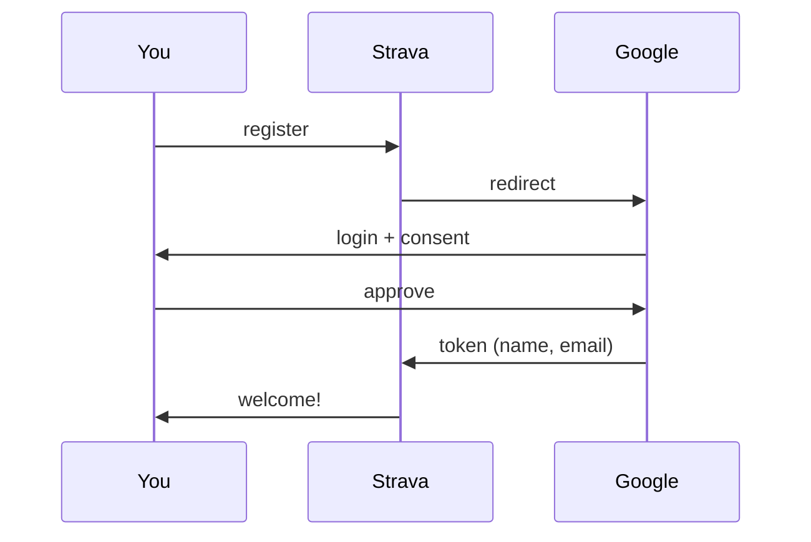

This is the familiar OAuth pattern for identity. Now one step further.

### The Thought Experiment

Imagine you want to import your heart rate data from Fitbit into Strava. In the current world, that works like this:

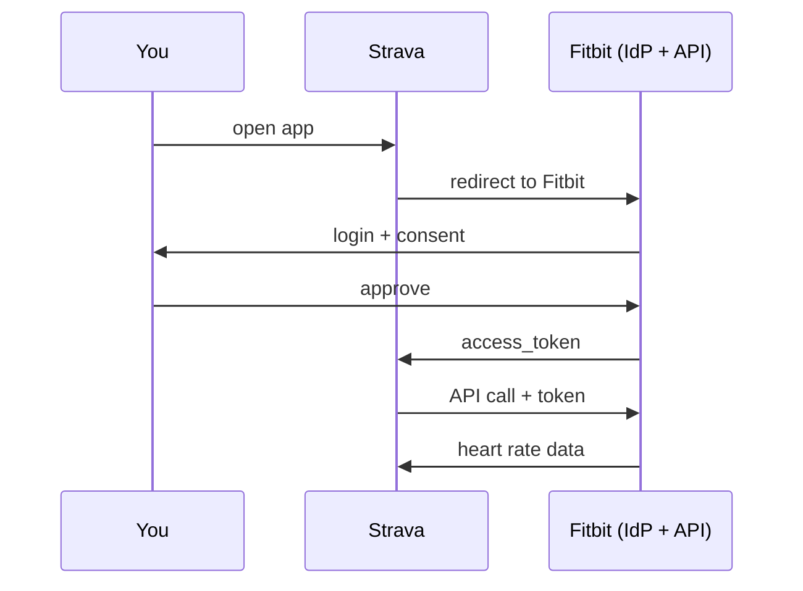

Fitbit here is both the Identity Provider (who are you?) and the Authorization Server (may Strava access your data?). This is the standard OAuth pattern.

But notice the difference from "Sign in with Google": with Google login, Strava trusts an external party (Google) for identity. With Fitbit data, Strava must have a direct relationship with Fitbit. Each new API provider means a new integration.

### The Twist: What If We Combine This?

What if we extend the Google pattern to API access? A central federation that manages not only identity, but also access to third-party APIs. Fitbit remains only a Resource Server (API), but no longer issues tokens.

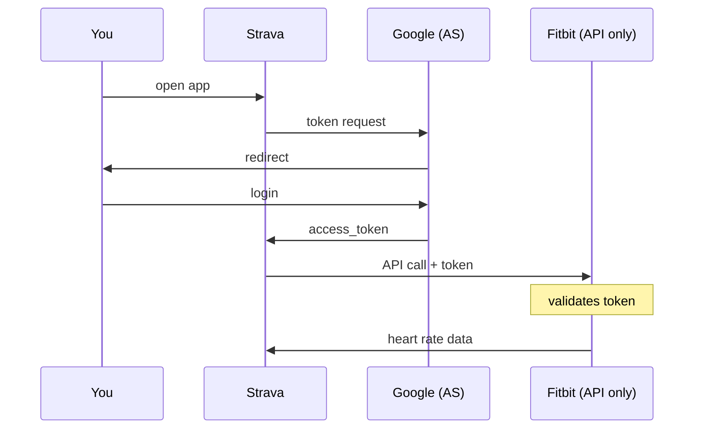

The crucial difference: Fitbit no longer issues tokens, but trusts tokens issued by Google.

## Assumptions

This model depends on several fundamental assumptions:

1. **Account linking exists** — The Resource Server can map a `sub` claim from the token to a local resource owner (see [Account binding](#account-binding))
2. **Tokens are audience-bound** — Each token is valid for exactly one Resource Server (`aud` claim)
3. **Namespace ownership is verified** — Only Fitbit can create `fitbit.*` scopes

## Who Gives Consent?

This model only works if the right consents are in place. There are two layers, each with its own owner.

### Layer 1: API Provider Grants App Access

Before any tokens can be issued, Fitbit must explicitly say: "Strava may use my API." Without this consent, the central Authorization Server refuses to issue a token — regardless of what the user wants.

| Who manages this? | Fitbit (API provider) |
|-------------------|------------------------|
| What is recorded? | "Strava may request scopes X, Y, Z for my API" |
| Where does this live? | Central registry |

This consent can be established in two ways:

**Push (app initiates):** Strava requests access from Fitbit via the central registry. Fitbit receives a notification and can approve or deny.

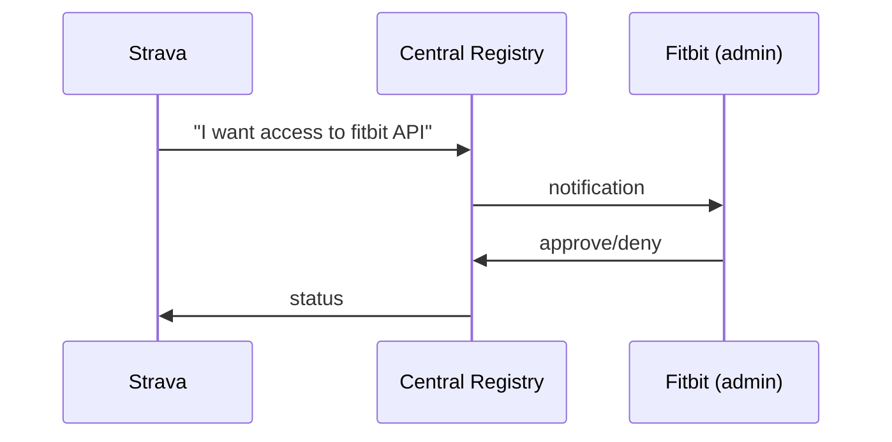

**Pull (API provider initiates):** Fitbit invites Strava. This is immediately active — the API provider has the authority.

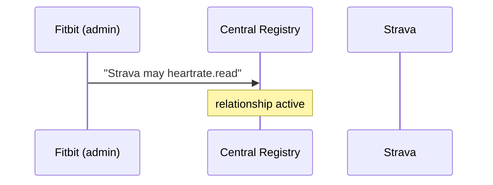

**Scalability of Layer 1**: A model that requires manual approval for every app scales poorly. Pragmatic alternatives:

| Approach | When to use |
|----------|-------------|
| **Dynamic Client Registration** | Automated: app registration at hub is propagated to RS |
| **Auto-approve mode** | For non-sensitive/public APIs, unless explicitly blocked |
| **Explicit allow** | Only for high-risk APIs with sensitive data |

### Layer 2: User Gives Consent

When the API → App relationship is in place, a user can give consent for their own data. This is the consent screen the user sees at the Authorization Server.

| Who manages this? | The user themselves |
|-------------------|---------------------|
| What is recorded? | "Strava may read my heart rate data" |
| Where does this live? | Central Authorization Server |

```
┌────────────────────────────────────────┐
│                                        │
│   Strava is requesting access to:      │
│                                        │
│   ☑ Your heart rate data (Fitbit)      │
│   ☐ Your sleep data (Fitbit)           │
│                                        │
│   [Allow]  [Deny]                      │
│                                        │
└────────────────────────────────────────┘
```

The user can only give consent for scopes that Fitbit has granted to Strava. If Strava requests `fitbit.sleep.read` but Fitbit hasn't approved that? Then that option doesn't even appear on the consent screen.

### The Interplay

On a token request, the Authorization Server validates both layers:

```
Token request: Strava wants fitbit.heartrate.read on behalf of user X

Step 1: Has Fitbit → Strava granted access for heartrate.read?
        → No: deny token
        → Yes: continue

Step 2: Has user X given consent for heartrate.read?
        → No: show consent screen
        → Yes: issue token
```

## Two Federation Models

There are fundamentally two ways to set up federation:

**Hub-and-spoke**: One central Authorization Server that issues all tokens. All Resource Servers trust this one issuer.

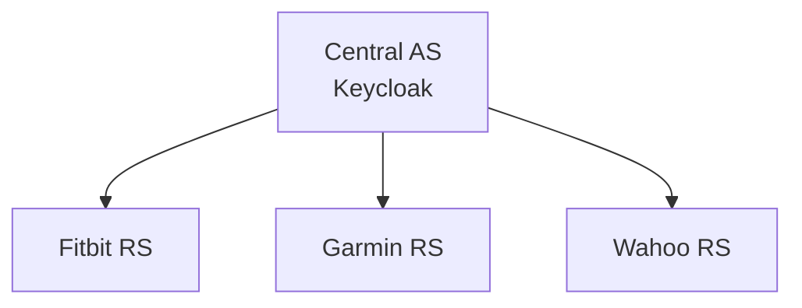

**Mesh/Bilateral**: Each party can be both AS and RS. Parties make mutual agreements about which issuers they trust.

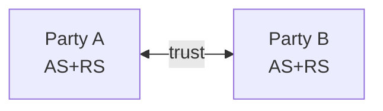

For this design we choose the hub-and-spoke model: simpler, less configuration per party, and one clear trust anchor.

## Authentication vs. Authorization

An important distinction that often remains implicit: the central federation does two things that we need to separate.

### Authentication: "Who Are You?"

The central IdP validates identity:

- Is this party who they claim to be?
- Is this party a member of the federation?
- For users: is this person authenticated?

This is comparable to "you have a Google account" — it says nothing about what you're allowed to do, only that you are who you claim to be.

### Authorization: Two Levels

Authorization happens in two places:

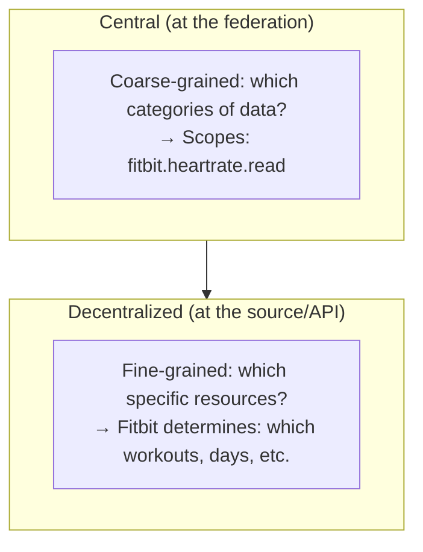

### Why This Distinction Matters

The source (Fitbit) can and may apply its own rules on top of what the central federation says. The token proves:

1. This party is authenticated (member of the federation)
2. This party has permission for scope X (coarse-grained)

What the source subsequently allows within that scope is up to the source itself. This gives the source autonomy without burdening the central federation with fine-grained access control.

## Token Flows

For this design we support two scenarios:

### Scenario 1: Machine-to-Machine (Client Credentials)

Strava wants to retrieve general API information from Fitbit, without user context. Think of: which device types are supported, API version, or available metrics.

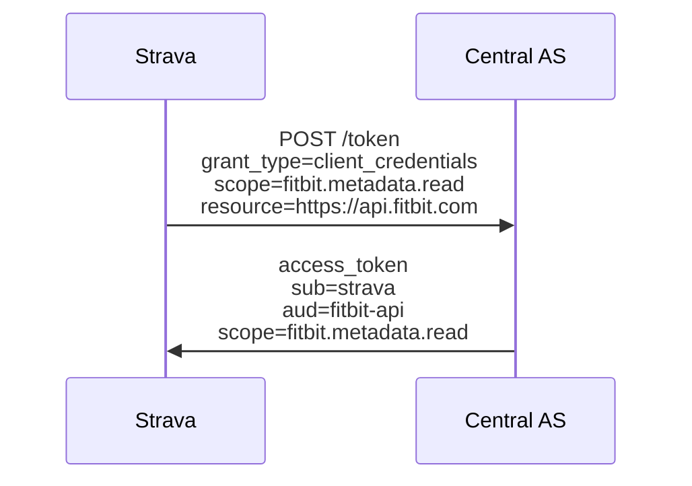

Here only layer 1 is relevant: Fitbit must have granted Strava access to `fitbit.metadata.read`. There is no user, so no consent needed.

> **Note**: The client must indicate at the token request which Resource Server the token is intended for (`resource` parameter or audience). The AS then mints a token with exactly that `aud` claim.

### Scenario 2: On Behalf of a User (Authorization Code + PKCE)

Strava wants your personal heart rate data from Fitbit.

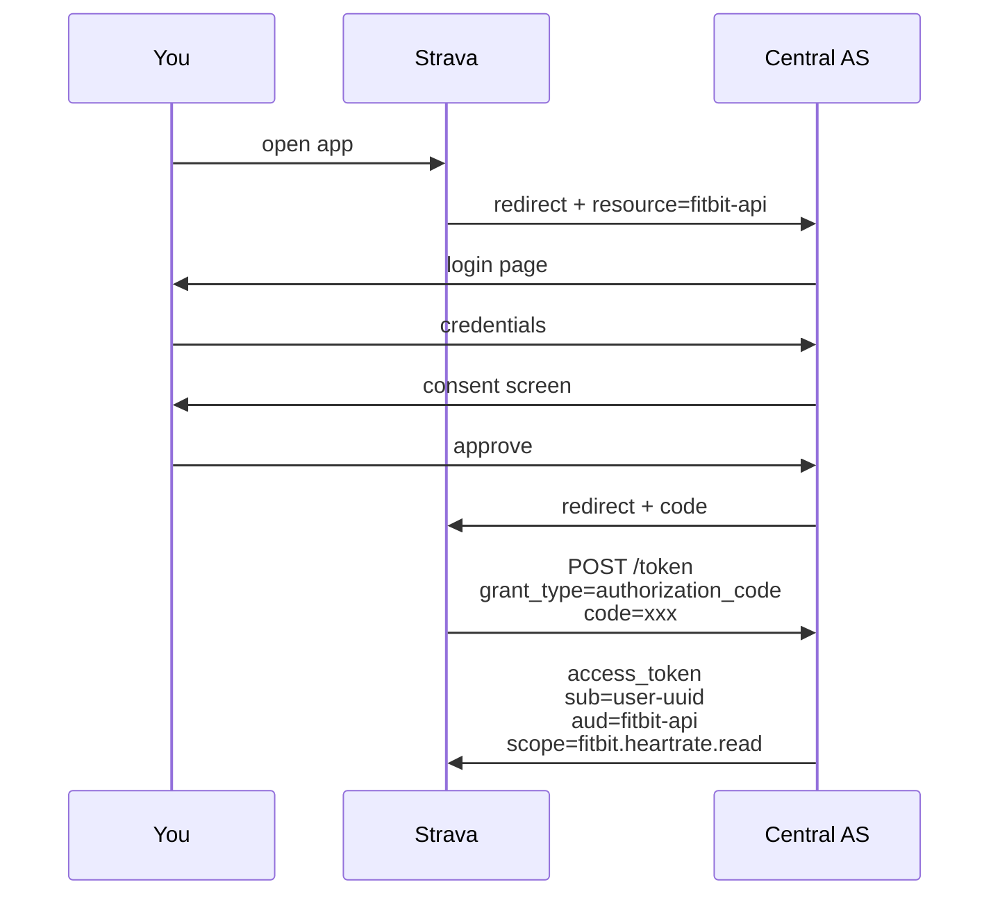

Here both layers are active: first it's checked whether Fitbit → Strava has granted the scope, then whether the user has given consent.

## Account Binding

A critical aspect often overlooked: how does Fitbit know which Fitbit account corresponds to the `sub` claim?

### The Problem

In the classic OAuth model, the user logs in at Fitbit, so Fitbit implicitly knows which Fitbit account is meant. In our federated model, the user logs in at the central AS. The token contains `sub=user-uuid` — a central identity that Fitbit doesn't know.

**Fitbit can do nothing with just `sub=user-uuid`, unless a mapping exists to the local Fitbit account.**

### Solution Approaches (B2C)

**Option 1: Account linking**

A one-time flow where the user links their Fitbit account to their federation identity:

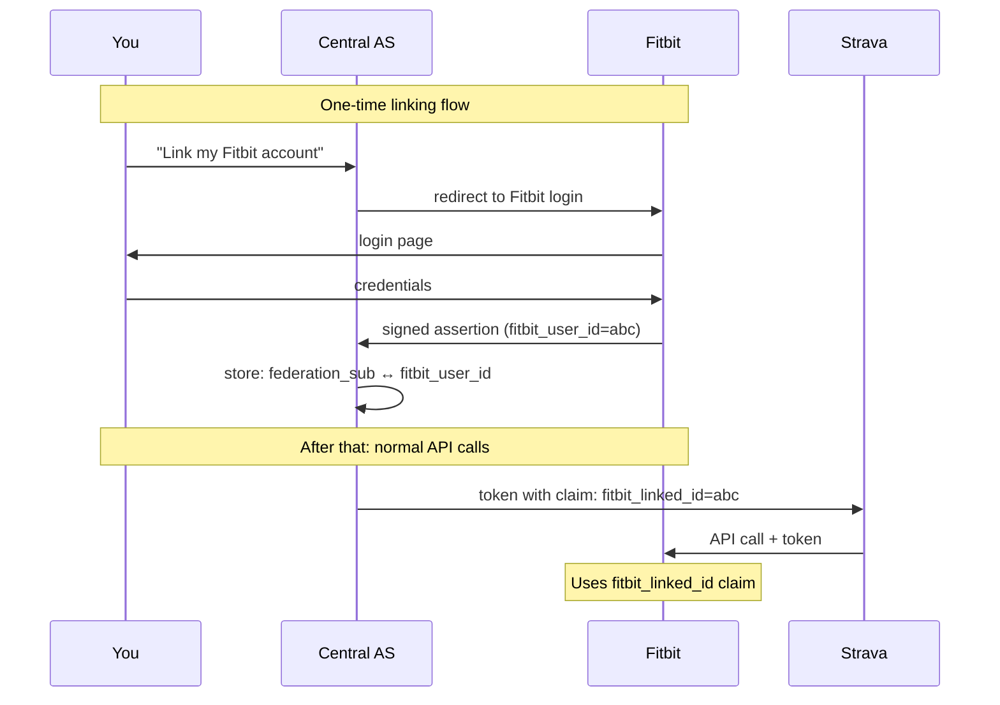

The central AS stores the mapping and adds an extra claim to tokens (`fitbit_linked_id`). Fitbit can use this claim to return the correct data.

**Option 2: Federation subject as primary key**

Fitbit bases its data model on the federation subject. New Fitbit accounts get the `federation_sub` as primary identifier.

- **Advantage**: No separate linking flow needed
- **Disadvantage**: Requires fundamental change in Fitbit's data model, doesn't work for existing accounts

**Option 3: Minimal Fitbit login for identity proof**

Fitbit remains IdP for user binding, but not for token issuance. On first use, the user does a Fitbit login to confirm the binding.

- **Advantage**: Fitbit retains control over identity
- **Disadvantage**: Two login flows for the user

### Recommendation (B2C)

For new ecosystems: **Option 1 (account linking)** with a clear UX. The linking happens once, after that the flow is transparent.

The central AS must:
- Support a linking flow per Resource Server
- Store the mappings securely
- Add a claim to tokens that the RS can use

### B2B: A Simpler Story

In B2B context — like dataspaces — the `sub` is usually an **organization**, not an individual user. Data is shared at organization level, not at person level.

This significantly simplifies account binding: organizations have stable, standardized identifiers that can serve as `sub`. No linking flow is needed — the identifier is directly usable.

### Organization Identifiers

| Identifier | Scope | Usage | Suitability |
|------------|-------|-------|-------------|
| **KvK number** | Netherlands | Trade Register | ✅ Widely accepted in NL, 8 digits, unique per legal entity |
| **EORI** | EU | Customs/trade | ✅ EU-wide, format: `NL` + KvK + `000` (e.g., `NL123456780000`) |
| **LEI** | Global | Financial sector | ✅ ISO 17442, 20 characters, annual renewal required |
| **VAT number** | EU | Tax authority | ⚠️ Changes on fiscal restructuring |
| **DUNS** | Global | D&B database | ⚠️ Commercially managed, not always available |

**Recommendation for Dutch context:**

- **Primary**: KvK number as `sub` — universally available, free to query, stable
- **Alternative**: EORI for cross-border scenarios (derived from KvK)
- **Optional**: LEI as additional claim for financial use cases

```json
{
  "sub": "12345678",
  "sub_type": "kvk",
  "org_name": "Fitbit Netherlands B.V.",
  "eori": "NL123456780000",
  "lei": "5493001KJTIIGC8Y1R12"
}
```

### Which Claims Does an RS Minimally Expect?

Besides the standard OAuth claims, a Resource Server often needs more context:

| Claim | Purpose | When needed |
|-------|---------|-------------|
| `sub` | Federation identity | Always |
| `{rs}_linked_id` | Local RS identity (after linking) | For user data |
| `org` | Organization context | B2B scenarios |
| `org_role` | Role within organization | Fine-grained B2B |
| `azp` | Which client makes the request | Audit, rate limiting |

## Scope Governance

Scopes are the key to this entire model. Without governance, chaos ensues: namespace conflicts, proliferation, and ambiguity about meaning.

### What Scopes Are and Are Not

A scope is a **category of access**, not access to a specific resource:

```
Scope = "read container data"           (category)
Not   = "read container ABC123"         (specific resource)

Scope = "read heart rate data"          (category)  
Not   = "heart rate from Monday Jan 15" (specific resource)
```

The scope determines the type of data an app may request. Which specific data the app receives within that category is determined by the source itself. This keeps the central system simple and gives the source autonomy.

### Namespace Convention

Each API provider gets their own namespace:

```
{api}.{resource}.{action}

Examples:
- fitbit.heartrate.read
- fitbit.heartrate.write
- fitbit.sleep.read
- garmin.heartrate.read
```

### Responsibilities

| Actor | Responsibility |
|-------|----------------|
| Federation administrator | Base scopes (openid, profile, email), namespace assignment |
| API provider | Manage own namespace (fitbit.* for Fitbit) |
| App | Request scopes, not create them |

### Registration Process

An API provider wanting to add a new scope:

1. Requests scope within own namespace
2. Federation administrator validates namespace ownership
3. Scope is created in central registry
4. Scope is available for apps to request

## Token Validation

When Strava makes an API call to Fitbit with a token, Fitbit must validate that token. There are two approaches for this.

### Local JWT Validation vs. Introspection

| Aspect | JWT local | Introspection endpoint |
|--------|-----------|------------------------|
| Latency | No extra call | Roundtrip per request |
| Availability | Works if AS is down | Dependent on AS |
| Revocation | Only after expiry | Immediate |
| Complexity | Standard libraries | Extra integration |

### Our Choice: Local Validation with Short Lifetimes

Immediate revocation is desirable, but the tradeoff is significant. With short token lifetimes, the risk is acceptable:

- Access token: 5 minutes lifetime
- Refresh token: tied to session policies (see [Keycloak configuration](#keycloak-configuration))
- Worst case on compromise: 5 minutes window

**OAuth 2.1 requirements for refresh tokens**: Refresh tokens must meet one of these requirements:

1. **One-time use (rotation)**: On each refresh, a new refresh token is issued, the old one becomes invalid
2. **Sender-constrained**: Token is cryptographically bound to the client (via mTLS or DPoP)

### Multi-Resource and Audience Binding

**Critical**: Tokens must be "narrow" per Resource Server. Otherwise risks arise:

- **Token replay**: A token for Fitbit is misused at Garmin
- **Audience confusion**: RS accepts token not intended for it
- **Scope spillover**: Scopes for RS-A work unintentionally at RS-B

The client must indicate the intended RS with each token request:

```
POST /token
  grant_type=authorization_code
  code=xxx
  resource=https://api.fitbit.com        ← intended RS
  scope=fitbit.heartrate.read
```

The AS mints a token with exactly that `aud`:

```json
{
  "aud": "https://api.fitbit.com",
  "azp": "strava",
  "scope": "fitbit.heartrate.read"
}
```

Fitbit **must** validate that `aud` matches its own identifier.

> **Confused Deputy prevention**: Correctly validating the `aud` claim is the primary defense against a 'Confused Deputy' attack, where a token intended for API-A is misused at API-B. This is not optional.

### What a Resource Server Validates

The token contains claims that Fitbit checks:

| Claim | Meaning | Check |
|-------|---------|-------|
| `iss` | Issuer - who issued this token? | Is this in my trust list? |
| `aud` | Audience - for whom is this token intended? | Is that me? |
| `exp` | Expiry - when does this token expire? | Is it still valid? |
| `scope` | Scopes - which permissions are granted? | Is this action allowed? |
| `sub` | Subject - on whose behalf is this token? | (informational) |
| `azp` | Authorized party - which client? | (informational) |

The validation steps:

```
GET /.well-known/jwks.json   →   Retrieve public keys (cache this)

Per request:
1. Signature check with public key
2. iss == expected issuer
3. aud == my identifier (CRITICAL)
4. exp > current time
5. scope contains required value
```

### JWKS Caching and Key Rotation

With local validation, the RS caches the public keys of the AS. This introduces a risk with key rotation:

1. AS rotates signing keys (new `kid`)
2. RS has old keys cached
3. Valid tokens fail until cache refreshes

**Mitigations**:

- Respect cache headers from JWKS endpoint
- On signature failure with unknown `kid`: reload JWKS once
- AS must continue publishing old keys temporarily (overlap period)
- Configure maximum cache time (e.g., 1 hour)

### When to Use Introspection Anyway?

In specific cases, introspection can be valuable:

- Security incident where immediate revocation is needed
- High-risk operations (financial transactions, data deletion)
- Audit trail requirements at token level

This can work as a hybrid model: local validation for the fast path, introspection for sensitive operations.

## Where Do Users Live?

So far we've assumed the simplest model: all users are in the central IdP (Google in our example). But this is not the only option. The choice of where users live has major impact on onboarding, privacy, and enterprise readiness.

### Option A: Central IdP (The Simple Model)

All users are in the central system. An organization (like GymChain) is an attribute of the user.

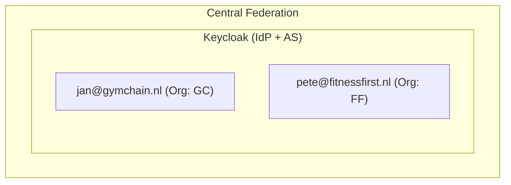

When Jan logs into Strava via Google, the token looks like this:

```json
{
  "sub": "user-123",
  "email": "jan@gymchain.nl",
  "org": "gymchain",
  "org_role": "trainer"
}
```

**Advantages:** Simplest model, one place for user management, consistent identity model.

**Disadvantages:** Organizations must "transfer" users to central system, no connection to existing identity systems, privacy-sensitive (central party sees all users).

### Option B: Federated IdPs

Each organization retains its own Identity Provider. The central Authorization Server does identity brokering — it delegates authentication to the organization.

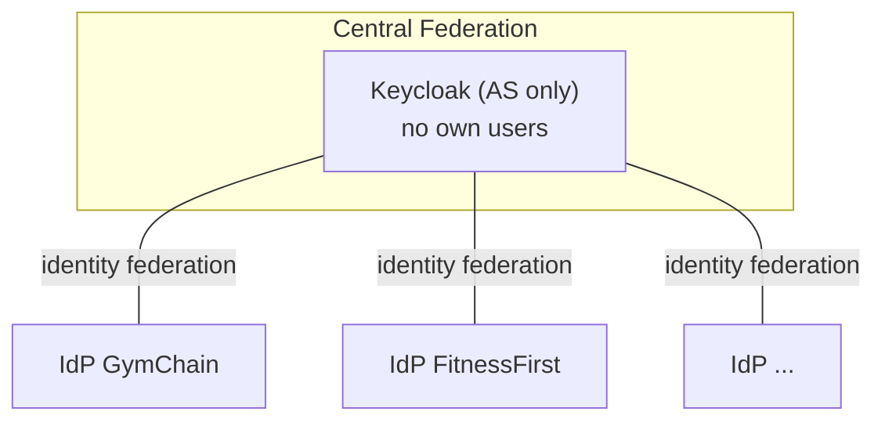

The flow becomes:

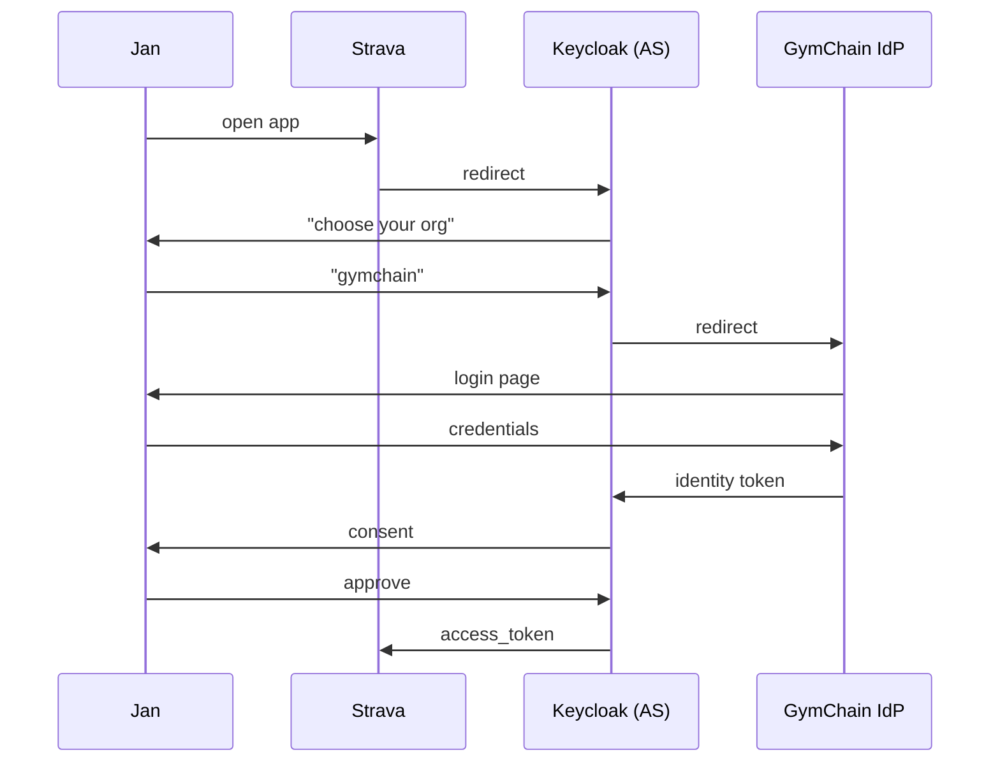

**Advantages:** Organizations retain own user management, fits enterprise reality (own Active Directory, Entra ID, Okta), more privacy-friendly.

**Disadvantages:** Each organization must be IdP-capable, more configuration per organization, mapping of claims between systems.

### Option C: App Does Authentication

The app (Strava) has its own users and does authentication itself. The central Authorization Server only does authorization and trusts the identity assertion from the app.

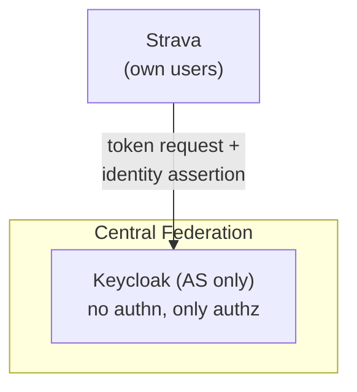

Strava requests a token via Token Exchange:

```
POST /token
  grant_type=urn:ietf:params:oauth:grant-type:token-exchange
  subject_token=<strava's own id_token for jan>
  subject_token_type=urn:ietf:params:oauth:token-type:id_token
  scope=fitbit.heartrate.read
```

**Advantages:** Apps retain own user relationship, no central user database needed, flexible.

**Disadvantages:** Central AS must trust each app as IdP, more complex trust model, organization context becomes difficult (how does the AS know which org a user belongs to?).

### Comparison

| Aspect | A: Central | B: Federated | C: App-based |
|--------|------------|--------------|--------------|
| Where do users live? | Central IdP | Per organization | Per app |
| Who does authentication? | Central IdP | Organization IdP | App |
| Organization onboarding | Create users | Connect IdP | N/A |
| User experience | One login | Login at own org | Login at app |
| Organization autonomy | Low | High | N/A |
| Enterprise-ready | Limited | Yes | Limited |
| Complexity | Low | Medium | High |

### Hybrid: The Best of Both Worlds

In practice, a hybrid model is often most realistic:

```
Small organizations  →  users in central IdP (option A)
Large enterprises    →  own IdP federated (option B)
```

This is how many SaaS platforms work: standard own login, but enterprise customers can connect their own SSO.

## OAuth 2.1 Conformity

OAuth 2.1 consolidates 'best current practices' and removes unsafe patterns from OAuth 2.0. Validation against this standard:

| OAuth 2.1 requirement | Status |
|-----------------------|--------|
| Authorization Code grant requires PKCE | ✅ Met — explicitly prescribed |
| Redirect URIs use exact string matching | ⚠️ Enforce in AS configuration |
| Implicit Grant is removed | ✅ Met — not used |
| Resource Owner Password Credentials Grant removed | ✅ Met — not used |
| Bearer tokens in query string forbidden | ⚠️ Tokens via Authorization header |
| Refresh tokens are one-time use or sender-constrained | ✅ Met — included as requirement |

## Critical Analysis

This model has inherent weak points that must be addressed during implementation.

### Trust and Security

**Single point of compromise**: If the central Authorization Server is compromised, all APIs are exposed. Mitigation: strict security on the AS, key rotation, monitoring.

**Token revocation gap**: With local JWT validation, it takes up to 5 minutes before a revoked token becomes invalid. Mitigation: short lifetimes, introspection for high-risk operations.

**Trust transitivity**: Fitbit must trust the central AS. In the current model, Fitbit only trusts itself. This requires a fundamental mindshift from API providers.

**Token theft mitigation**: In a federation with many parties, leak risk increases. Consider sender-constrained tokens:

- **DPoP** (Demonstrating Proof-of-Possession): Token is bound to a key pair of the client
- **mTLS**: Token is bound to the client certificate

This document assumes bearer tokens, but for high-security scenarios DPoP is recommended.

**Key management and blast radius**: One issuer means one keyset. On a compromise, all tokens are potentially invalid. Mitigations:

- Strict key rotation discipline
- Not-before policies for incident response ("invalidate all tokens issued before time T")
- Monitoring for abnormal token patterns
- Defined incident response plan

### Operational

**Single point of failure**: Google down means no new tokens. Existing tokens continue to work (local validation), but new sessions are not possible. Mitigation: high-availability setup, multi-region deployment.

**Scope namespace governance**: Who prevents someone from impersonating Fitbit and creating `fitbit.*` scopes? This requires a registration process with verification. Keycloak has no native protection for this — additional tooling is needed (see [Control plane](#control-plane-application)).

**Onboarding speed**: Adding new scopes requires action from the federation administrator. This can become a bottleneck. Mitigation: self-service with approval workflow.

**Layer 1 scalability**: If 1000 apps want access to Fitbit, Fitbit doesn't want to click "approve" 1000 times manually. Consider an "auto-approve" mode for non-sensitive data, with "explicit allow" only for sensitive scopes.

### Governance and Incentives

**Why would Fitbit participate?**: They lose control and direct relationship with developers. The value proposition must be clear: access to larger ecosystem, less operational burden, or other value.

**Who is "Google" here?**: The choice of operator of the central AS determines trust. Options: industry association, government, commercial party with governance agreements.

### Consent and Privacy

**Where does the user give consent?**: In the classic model, Fitbit shows the consent screen. Now the central AS does that. Does the user still understand it's about Fitbit data?

**Consent granularity**: Can the user say "Strava may have my heart rate, but not my sleep data"? The central AS must support this and present it clearly.

**Branding and attestation**: How does the user know that "Fitbit" in the consent screen is really Fitbit and not a lookalike? This touches on phishing and trust. The federation must verify Resource Servers and attest their branding.

**Privacy impact**: The central AS becomes a concentration point of consents and metadata about data access. This has GDPR implications (who is the controller?) and may require a DPIA.

> **Legal note**: This document presents an architectural vision, not a legal analysis of liability or data ownership. The concentration of consent data requires a separate governance and privacy analysis.

## Proof of Concept: Keycloak Implementation

A setup for implementation in Keycloak v26.

> **Note**: The standard Keycloak Admin Console is not sufficient for self-service by API providers. A custom management layer (Control Plane) is essential — see [Control plane application](#control-plane-application).

### Realm Structure

```
Realm: federation
├── Realm Settings
│   ├── Sessions
│   │   ├── SSO Session Idle: 30 min
│   │   ├── SSO Session Max: 10 hours
│   │   ├── Client Session Idle: 30 min     ← determines refresh token lifetime
│   │   └── Client Session Max: 10 hours    ← maximum refresh duration
│   ├── Tokens
│   │   ├── Access Token Lifespan: 5 min
│   │   └── Revoke Refresh Token: true      ← rotation on use
│   └── Keys
│       └── (automatic rotation)
```

> **Refresh token lifetime in Keycloak**: This is not a separate setting, but results from session policies. `Client Session Idle` and `Client Session Max` determine when a refresh token expires. With `Revoke Refresh Token` enabled, a new refresh token is issued on each use (rotation).

### Client Scopes

Define scopes per API provider:

```
Client Scopes
├── fitbit.heartrate.read
│   ├── Type: optional
│   └── Description: "Read heart rate data via Fitbit API"
├── fitbit.sleep.read
│   └── ...
├── garmin.heartrate.read
│   └── ...
```

### Clients

Apps and APIs as clients:

```
Clients
├── strava (app)
│   ├── Client Protocol: openid-connect
│   ├── Client authentication: On (confidential)
│   ├── Service Accounts Enabled: true
│   ├── Standard Flow Enabled: true
│   ├── Valid Redirect URIs: https://strava.com/callback
│   └── Client Scopes (optional): fitbit.heartrate.read, fitbit.sleep.read
│
├── fitbit-api (resource server)
│   ├── Client authentication: Off
│   ├── Standard Flow: Off
│   ├── Direct Access Grants: Off
│   ├── Service Accounts: Off
│   └── (all authentication flows off = resource server)
```

> **Bearer-only in Keycloak v26**: The old "Access Type: bearer-only" option has been removed in the new admin console. The modern approach is to disable all authentication flows for resource server clients.

### Grant Administration

The relationship "Strava may use fitbit.heartrate.read" is modeled by assigning the scope to the client:

```
Strava → Client Scopes → Assigned Optional → [fitbit.heartrate.read]
```

In native Keycloak this is an administrative action. For self-service by API providers, additional tooling is needed.

### Control Plane Application

The standard Keycloak Admin UI is insufficient for this model:

- Fitbit admins would need access to the general Keycloak Admin Console
- They would be able to see/edit clients of other parties
- Namespace validation (`fitbit.*`) is not enforced

**Solution**: A "Control Plane" application that sits in front of Keycloak:

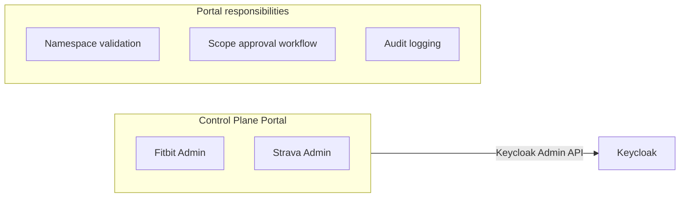

This portal:

1. Allows API providers (Fitbit) to log in and manage their own scopes
2. Validates that scopes fall within the assigned namespace
3. Shows "Apps requesting access" and allows approve/deny
4. Executes scope assignments via the Keycloak Admin API
5. Maintains audit trail of all changes

### Keycloak Organizations

Keycloak v26 introduces Organizations as a fully supported feature. This helps with:

- **Org context in tokens**: Claims like `org` and `org_role`
- **Member management**: Linking users to organizations
- **Onboarding flows**: Org-specific identity providers

What Organizations **does not** solve:

- The delegation chain (User → Org → App → API)
- Namespace governance for scopes
- Self-service for API providers

Organizations is a good foundation for B2B/multi-tenancy, but the Control Plane application remains needed for federation-specific management.

### Data Model

The consents are stored in two structures:

**API → App grants** (who may request which scopes):

```
api_app_grants
┌─────────────┬─────────────┬────────────────────────┬──────────┐
│ api         │ app         │ scopes                 │ status   │
├─────────────┼─────────────┼────────────────────────┼──────────┤
│ fitbit-api  │ strava      │ [heartrate.read,       │ approved │
│             │             │  sleep.read]           │          │
├─────────────┼─────────────┼────────────────────────┼──────────┤
│ fitbit-api  │ myfitnesspal│ [heartrate.read]       │ pending  │
└─────────────┴─────────────┴────────────────────────┴──────────┘
```

**User consents** (which user has given consent for what):

```
user_consents
┌─────────────┬─────────────┬────────────────────────┬─────────────┐
│ user        │ app         │ scopes                 │ granted_at  │
├─────────────┼─────────────┼────────────────────────┼─────────────┤
│ user-123    │ strava      │ [fitbit.heartrate.read]│ 2024-01-15  │
└─────────────┴─────────────┴────────────────────────┴─────────────┘
```

### Token Endpoints

```
Authorization:  /realms/federation/protocol/openid-connect/auth
Token:          /realms/federation/protocol/openid-connect/token
JWKS:           /realms/federation/protocol/openid-connect/certs
Introspection:  /realms/federation/protocol/openid-connect/token/introspect
```

---

## Appendix A: Delegation — Acting on Behalf of Another Party {#appendix-a-delegation-scenario}

> **Status**: Future scope. This scenario has been deliberately kept out of scope for the first version.

### The Problem

In the main document we describe scenarios where a party requests access to **their own data** or **data they have rights to**. But what if a party must act **on behalf of another party**?

**Concrete example:**

- **Shipper B.V.** has shipments at Customs
- **Forwarder** (with employee Jan) handles the logistics for Shipper
- Jan wants to retrieve shipment data from the **Customs API** via a TMS application

**The problem:**

- The data belongs to Shipper, not Forwarder
- Forwarder has no own "account" or data at Customs for these shipments
- The Customs API only knows Shipper as data owner
- Yet Jan (from Forwarder) must be able to access that data

**The delegation:**

Shipper says: "Forwarder may act on my behalf." The token must tell Customs: "This is Jan, from Forwarder, acting **on behalf of Shipper**."

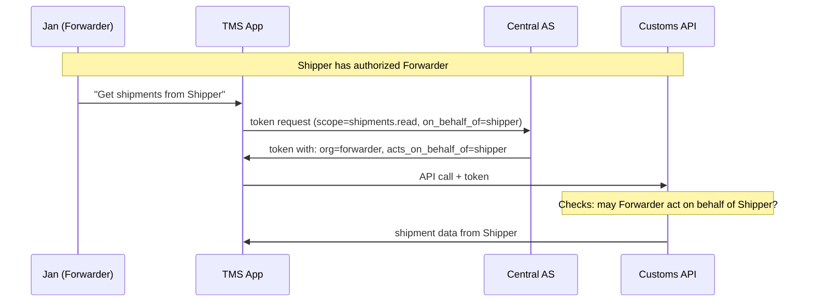

### Core Question

**Where and how is it recorded that Forwarder may act on behalf of Shipper?**

This is the central question this appendix explores. There are multiple options, each with their own trade-offs.

### Why Standard OAuth Is Insufficient

OAuth is designed for: "User grants App permission for Resource"

The model from the main document adds: "API provider grants App permission"

But neither covers: "Organization A may act on behalf of Organization B at an API"

This requires an additional layer in the consent model.

### The Consent Layers with Delegation

```
┌─────────────────────────────────────────────────────────────┐
│ Layer 1: API → App                                          │
│ "TMS may use the Customs API for shipments.read"            │
│ Managed by: Customs (API provider)                          │
├─────────────────────────────────────────────────────────────┤
│ Layer 2: Org → Org (DELEGATION)                             │
│ "Forwarder may act on behalf of Shipper"                    │
│ Managed by: Shipper (data owner)                            │
├─────────────────────────────────────────────────────────────┤
│ Layer 3: Org → User                                         │
│ "Jan may act on behalf of Forwarder with role 'planner'"    │
│ Managed by: Forwarder (employer)                            │
└─────────────────────────────────────────────────────────────┘
```

Layer 2 is new compared to the main document. The question is: where does this registration live?

### Option 1: Delegation at the Resource Server

Shipper registers the delegation directly at Customs:

```
Customs admin panel:
├── Shipper B.V.
│   └── Authorized parties: [Forwarder, Logistics Partner X]
```

The central AS knows nothing about this. The token contains only:

```json
{
  "sub": "jan-uuid",
  "org": "forwarder",
  "scope": "shipments.read"
}
```

The Customs API checks itself: "Is there a request from Forwarder for Shipper's data? Yes, that delegation is registered."

| Advantage | Disadvantage |
|-----------|--------------|
| Simple, fits existing patterns | Each RS must implement this themselves |
| RS retains full control | No central overview of delegations |
| No changes to central AS needed | App doesn't know in advance which delegations exist |

### Option 2: Delegation in the Central Registry

The central AS also manages org-to-org delegations:

```
delegations
┌─────────────┬─────────────────┬────────────────────────┐
│ principal   │ delegate        │ scopes                 │
├─────────────┼─────────────────┼────────────────────────┤
│ shipper-bv  │ forwarder       │ [shipments.read]       │
└─────────────┴─────────────────┴────────────────────────┘
```

The token now contains the delegation context:

```json
{
  "sub": "jan-uuid",
  "org": "forwarder",
  "acts_on_behalf_of": "shipper-bv",
  "scope": "shipments.read"
}
```

The RS only needs to trust the `acts_on_behalf_of` claim — the AS has already validated that the delegation is valid.

| Advantage | Disadvantage |
|-----------|--------------|
| Central overview of all delegations | Central AS becomes more complex |
| RS needs to implement less | Privacy-sensitive (who sees the delegations?) |
| App can query in advance which delegations exist | Shipper must register in central system |

### Option 3: Delegation via the App (Token Exchange)

The app first requests a token on behalf of Forwarder, then exchanges it for a token that also contains delegation context:

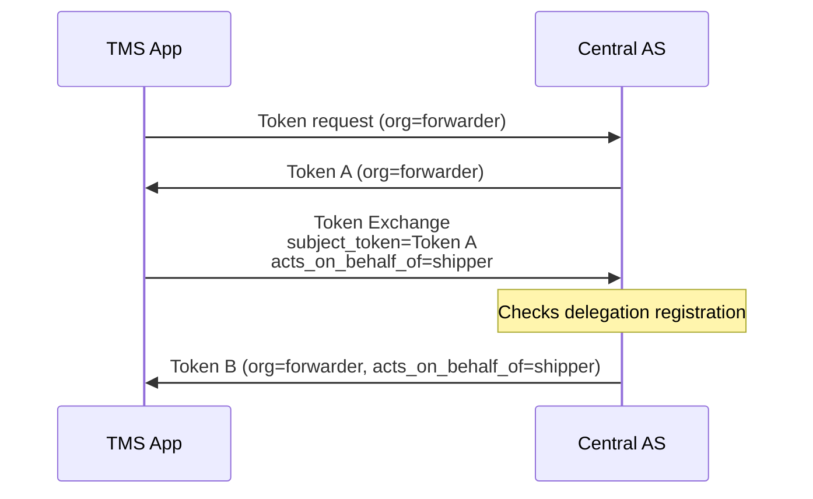

This uses RFC 8693 Token Exchange. The delegation registration can live at the AS or elsewhere.

| Advantage | Disadvantage |
|-----------|--------------|
| Standard OAuth extension | Extra roundtrip |
| Clear separation: first identity, then delegation | More complex for app developers |

### How Does the Delegation Come About?

Regardless of where the delegation lives, Shipper must explicitly say somewhere: "Forwarder may act on my behalf." This can happen via:

**Out-of-band (contract)**

Shipper and Forwarder have a commercial contract. An admin from Shipper registers the delegation manually in the system (RS or central registry).

**Self-service portal**

Shipper logs into a portal and adds Forwarder as an authorized party:

```
┌────────────────────────────────────────┐
│ Shipper B.V. - Authorized Parties      │
│                                        │
│ Current authorized parties:            │
│ ☑ Forwarder B.V. (shipments.read)      │
│ ☑ Logistics Partner X (shipments.read) │
│                                        │
│ [+ Add authorized party]               │
└────────────────────────────────────────┘
```

**Invitation flow**

Forwarder requests access, Shipper receives a notification and can approve:

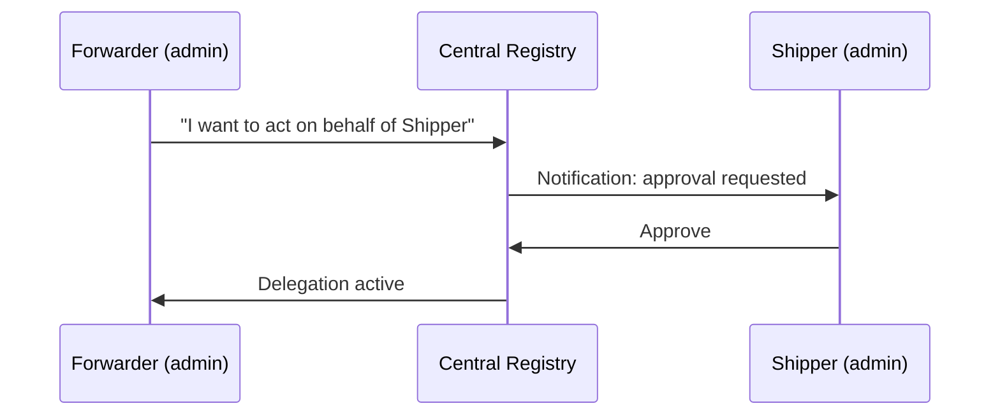

### Token Claims with Delegation

A token with delegation context could look like this:

```json
{
  "iss": "central-as",
  "sub": "jan-uuid",
  "aud": "customs-api",
  "scope": "shipments.read",
  
  "org": "12345678",
  "org_name": "Forwarder B.V.",
  
  "acts_on_behalf_of": "87654321",
  "acts_on_behalf_of_name": "Shipper B.V.",
  
  "delegation_scope": ["shipments.read"]
}
```

The RS now knows:
- **Who**: Jan
- **From which organization**: Forwarder
- **Acting on behalf of**: Shipper
- **With which permissions**: shipments.read

### Relevant Standards

| Standard | What it does | Application |
|----------|--------------|-------------|
| RFC 8693 Token Exchange | Exchange Token A for Token B with extra context | Adding delegation context to token |
| RFC 9396 RAR | Richer authorization requests | Specifying `acts_on_behalf_of` in request |
| GNAP | Newer authz standard, delegation-aware | Best fit, but still immature |

### Recommendation

**For the first version: delegation at the RS (Option 1)**

This fits the principle from the main document that fine-grained authorization remains at the source. The RS knows its own data model and can best manage delegations.

**Expand later to central registration (Option 2) when:**

- There is a need for central overview of delegations
- Multiple RSs need the same delegation information
- Apps want to know in advance which delegations are available

**Consider Token Exchange (Option 3) when:**

- A Token Exchange infrastructure already exists
- The delegation context must be dynamic (different per request)

### Not in Scope: Delegation of Personal Data

An even more complex scenario is when a **person** delegates access to an **organization** for their own data. For example: Jan (as a private individual) gives GymChain access to his Fitbit data.

This requires:
- Explicit user consent (Jan must give permission himself)
- Delegation registration (Jan → GymChain)  
- Revocation mechanism (Jan can revoke delegation)

This scenario is fundamentally different from B2B delegation (where organizations make mutual agreements) and falls outside the scope of this appendix.