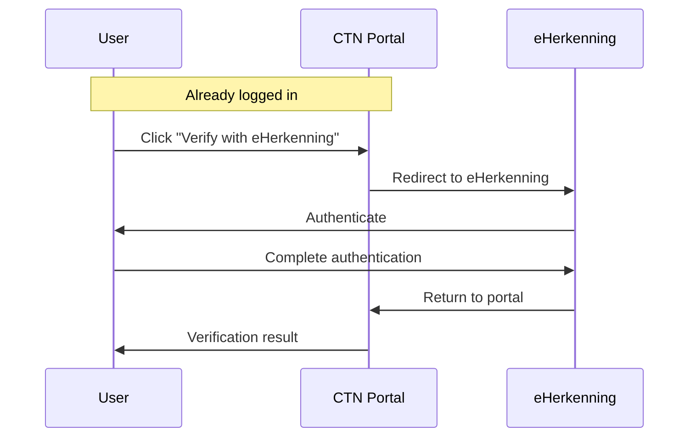

# eHerkenning Verification

## Overview

eHerkenning is a Dutch government authentication service for businesses. CTN uses it as a **verification step** during onboarding: after a user registers and logs in, they can authenticate via eHerkenning to prove they represent the organization they claim. The KVK number from the eHerkenning token is cross-checked against the stored KVK number to verify the organization's identity.

This is a **step-up verification**, not a login method. You must already be logged in to the CTN portal to initiate eHerkenning verification. The eHerkenning authentication does not change your session or login state.

> eHerkenning verification is only available for organizations registered in the Netherlands (KVK required).

---

## Flow

---

## How to Verify

1. Log in to the [CTN Self-Service Portal](https://ctn-preview.poort8.nl/portal).
2. Navigate to **Verifications** and click **Verify with eHerkenning**.
3. You are redirected to the eHerkenning authentication service.
4. Complete authentication via eHerkenning.
5. You are redirected back to the portal with the verification result.

If successful, the eHerkenning check is marked as **Approved** on your organization's verifications page.

---

## Error Outcomes

If verification cannot be completed, the portal shows an error message. The table below describes each possible outcome:

| Outcome | What it means |
|---|---|
| `success` | Your KVK number from eHerkenning matched your organization's registered KVK. Verification is complete. |
| `kvk_mismatch` | The KVK from your eHerkenning identity does not match the KVK registered for your organization. Check that your organization's KVK number is correct, or contact your dataspace administrator. |
| `not_authenticated` | Your portal session could not be verified. Log out and log in again, then retry. |
| `no_organization` | Your account is not associated with an organization. Contact your dataspace administrator. |
| `no_kvk_claim` | eHerkenning did not provide a KVK number. Ensure you are authenticating with a business-level eHerkenning account. |
| `org_not_found` | Your organization could not be found. Contact your dataspace administrator. |
| `no_verification` | The eHerkenning verification record is missing for your organization. Contact your dataspace administrator. |
| `unexpected` | An unexpected error occurred. Try again, or contact your dataspace administrator. |
