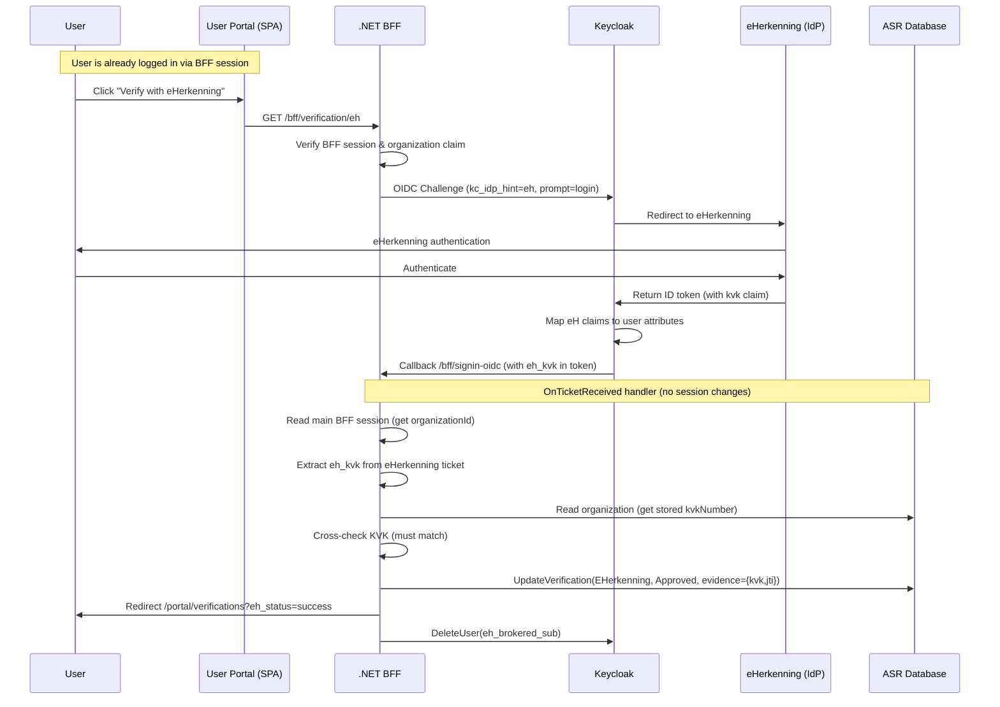

# eHerkenning Verification

## Overview

eHerkenning is a Dutch government authentication service for businesses. CTN uses it as a **verification step** during onboarding: after a user registers and logs in, they can authenticate via eHerkenning to prove they represent the organization they claim. The KVK number from the eHerkenning token is cross-checked against the stored KVK number to verify the organization's identity.

This is a **step-up verification**, not a login flow. The user must already be authenticated via the BFF session. The eHerkenning authentication does not create or modify the user's session.

### Design Guardrails

- EH verification is an assertion flow, not an account-linking/login flow.
- The callback never mutates the main BFF session (`HandleResponse()` short-circuits cookie/session changes).
- Verification approval is granted only after both checks pass: active membership and exact KVK match.
- Any Keycloak broker-created user is treated as temporary callback plumbing and is deleted after callback handling.

---

## Flow

---

## Keycloak Configuration

### Identity Provider: `eh`

eHerkenning is configured as an Identity Provider in the CTN Keycloak realm with alias `eh`.

### Identity Provider settings

| Setting | Value | Rationale |
|---|---|---|
| `Hide on login page` | **ON** | eHerkenning must not be available as normal CTN login; it is only used through explicit verification challenge (`kc_idp_hint=eh`). |
| `First login flow` | `eherkenning-verification-only` | Uses a dedicated broker flow for verification callbacks and controlled mismatch handling. |
| `Sync mode` | `FORCE` | Re-sync brokered eH attributes on each verification callback. |

### First Broker Login Flow: `eherkenning-verification-only`

Assigned to IdP `eh`.

| Step | Authenticator | Requirement |
|---|---|---|
| 1 | Detect Existing Broker User | `ALTERNATIVE` (or `DISABLED` in UI variants that only expose Enabled/Disabled) |
| 2 | Automatically Set Existing User | `ALTERNATIVE` |
| 3 | Create User If Unique | `ALTERNATIVE` |
| 4 | Review Profile | `DISABLED` |

`Confirm Link Existing Account` is intentionally absent. `Review Profile` is explicitly `DISABLED` to prevent Keycloak from showing "Update Account Information" when the brokered identity omits optional attributes (such as email).

> **Note on User Profile policy (2026-03-06):** `Review Profile = Disabled` in the flow is not sufficient on its own. In KC v26, User Profile policy enforcement is separate from the authentication flow: if any attribute is marked Required and the broker user is created without it, KC triggers `VERIFY_PROFILE` at account level regardless of flow settings. The fix is to set `firstName`, `lastName`, `email`, and `phoneNumber` to **Required = Never** in `Realm Settings → User Profile`. Scope-conditional Required (`Required when = Scopes are requested`) is insufficient because `ctn-bff` always requests `openid profile email phone offline_access organization`, satisfying all scope conditions. Setting Required = Never is safe because CTN does not use KC's self-registration form — all users are pre-created via the Admin API with email already set.

### Chosen Resolution for `VERIFY_PROFILE`

- **Primary blocker fix for CTN-208:** set `firstName`, `lastName`, `email`, and `phoneNumber` to **Required = Never** in the CTN realm User Profile.
- **Why this is the chosen fix:** EH and normal portal login currently share the same `ctn-bff` OIDC client and scope set. With the current single-client architecture, Keycloak cannot distinguish the EH callback from a normal end-user authentication flow using scope-conditional Required rules.
- **Follow-up, not blocker fix:** collect and persist `firstName` / `lastName` in the CTN app for real portal users. This improves normal login UX but does not solve the EH blocker because the callback still runs through a separate temporary broker-created user.
- **Viable but deferred alternative:** split EH onto a separate OIDC client/scheme with a reduced scope profile so Keycloak can keep enforcing profile completeness for normal logins only. That is materially larger than CTN-208 requires.

This configuration allows the broker callback to continue for both existing and not-yet-linked identities, so CTN can return app-level `eh_status` outcomes (for example `kvk_mismatch`) instead of stopping early on Keycloak broker errors.

**Brokered user lifecycle:** Keycloak's broker flow creates a broker-created local user (typically `eh.[external-subject-id]`, no email, no realm roles) to carry EH claims through the callback. CTN never uses this user — `OnTicketReceived` reads claims from the ticket and then deletes the broker-created user via Keycloak Admin API. This prevents orphan accumulation in the user store. Because eHerkenning no longer shares email and no email mapper is configured, the auto-matching path in `Automatically Set Existing User` has no practical match vector against existing CTN users. A realm-role guard (`org-member`, `org-admin`, `org-signatory`) is applied as defense-in-depth before deletion.

### Applied Configuration Snapshot

As confirmed via Keycloak Admin screenshots (2026-03-06), this is the current applied state in `ctn-preview`:

- `Authentication -> eherkenning-verification-only`:
    - `Detect Existing Broker User = Disabled` (UI variant)
    - `Automatically Set Existing User = Alternative`
    - `Create User If Unique = Alternative`
    - `Review Profile = Disabled`
- `Identity providers -> eh`:
    - `Hide on login page = On`
    - `First login flow override = eherkenning-verification-only`
    - `Sync mode = Force`
    - `eh-email-importer` mapper: **removed**
- `Clients -> ctn-bff -> Dedicated scope -> Mappers`:
    - `eh-email-token-mapper`: **removed**
- `Realm Settings -> User Profile -> firstName`, `lastName`, `email`, `phoneNumber`:
    - **Applied (2026-03-11):** Required = **Never** for all four. S1 validated same day — no KC screen, `eh_kvk` present in token. Evidence stored as `{kvk, jti}` JSON (2026-03-11).

### Rollout Sequence

1. Keycloak flow + mapper changes in `ctn-preview`: **verified** (2026-03-06).
2. Deploy BFF change that performs broker-created user cleanup in `OnTicketReceived` `finally`.
3. Run S1-S8 in `ctn-preview` and capture evidence. **Done (2026-03-11) — all scenarios confirmed.**
4. Codify user profile (Required = Never) in `keycloak/realm.yaml` shared baseline. **Done (2026-03-11).**
5. Promote the same Keycloak + BFF changes to `ctn`: run **Keycloak Apply Preview** workflow for `ctn`, then deploy BFF.
6. Re-run at least S1, S3, S6, and S8 in `ctn`.
7. Follow-up (separate issue): collect/persist `firstName` and `lastName` in the CTN app for normal portal users.

### IdP Mappers (Identity Providers > `eh` > Mappers)

These import claims from the eHerkenning ID token into Keycloak user attributes:

| Mapper Name | Type | eHerkenning Claim | User Attribute | Sync Mode |
|---|---|---|---|---|
| `eh-kvk-importer` | Attribute Importer | `kvk` | `eh_kvk` | `force` |
| `eh-company-name-importer` | Attribute Importer | `urn:etoegang:1.11:attribute-represented:CompanyName` | `eh_company_name` | `force` |

### Client Protocol Mappers (Clients > `ctn-bff` > Dedicated scope > Mappers)

These expose the user attributes as token claims:

| Mapper Name | Type | User Attribute | Token Claim Name | Add to ID/access/userinfo |
|---|---|---|---|---|
| `eh-kvk-token-mapper` | User Attribute | `eh_kvk` | `eh_kvk` | All ON |
| `eh-company-name-token-mapper` | User Attribute | `eh_company_name` | `eh_company_name` | All ON |

### No Additional Redirect URIs

The eHerkenning flow reuses the existing `BffOidc` scheme and its callback path (`/bff/signin-oidc`), which is already registered in the `ctn-bff` client. No new redirect URIs needed.

---

## Implementation

### BFF Endpoint

`GET /bff/verification/eh` (requires `BffOrgMemberPolicy`)

Initiates the eHerkenning verification flow:
1. Authenticates the main BFF session
2. Verifies the user has an organization claim
3. Issues an OIDC challenge with `kc_idp_hint=eh` and `prompt=login`

The `eh_verification` flag is passed via `AuthenticationProperties.Items`, which ASP.NET Core round-trips through the OIDC state parameter.

### OIDC Event Handlers (BffExtension.cs)

**`OnRedirectToIdentityProvider`** — Conditionally adds `kc_idp_hint=eh` and `prompt=login` when the `eh_verification` flag is present.

**`OnTicketReceived`** — For eHerkenning flows only:
1. Calls `HandleResponse()` immediately to prevent session/cookie changes
2. Reads verification context (`organizationId`, initiating user `sub`) from protected OIDC state set at challenge time
3. Falls back to reading the main BFF session only if state context is unavailable
4. If a main session exists, verifies session `sub` matches the state initiator `sub`
5. Extracts `eh_kvk` from the eHerkenning ticket
6. Re-validates initiator is still an active member of the organization
7. Reads the organization from DB and gets stored `kvkNumber`
8. Cross-checks KVK — must match exactly
9. Approves the `EHerkenning` verification with compact JSON evidence: `{"kvk": "<eh_kvk>", "jti": "<id_token_jti>"}`. The `jti` links to the KC admin event log for audit tracing.
10. Redirects to `/portal/verifications?eh_status=success`
11. Deletes the brokered Keycloak user (always, via `finally` — covers all code paths including errors)

This makes the callback robust when browsers omit the main session cookie on cross-site return from external IdPs.

### Evidence

`Verification.Evidence` stores compact JSON: `{"kvk": "<eh_kvk>", "jti": "<id_token_jti>"}`. The `kvk` is the verified Chamber of Commerce number (primary proof). The `jti` is the Keycloak ID token `jti` claim, linking to the KC admin event log entry for audit tracing.

The admin portal renders this as two labeled rows: **CoC number** (the KVK value) and **Token ID** (the jti, in muted monospace). Old records that stored a raw JWT will show nothing — they predate this format (2026-03-11).

### Runtime Notes

- The membership revalidation in `OnTicketReceived` still applies before approval.
- If revalidation fails, callback ends with `?eh_status=error&reason=not_authenticated` and verification remains `Pending`.
- The brokered Keycloak user (created by `Create User If Unique` in the broker flow) is deleted at the end of every callback, including error paths, via a `finally` block. If deletion fails (transient Keycloak error), the user survives that run as a harmless orphan with no roles and no login access; the next verification attempt by the same EH identity will delete it.
- Before deletion, the BFF checks that the user has no CTN realm roles (`org-member`, `org-admin`, `org-signatory`). If roles are present, deletion is skipped and a warning is logged. This guard is purely defense-in-depth: without an email mapper the auto-match path in `Automatically Set Existing User` has no way to link to a real CTN user.

---

## Error Handling

If anything fails, the verification stays `Pending`. The user is redirected with query parameters indicating the failure:

| Scenario | Redirect |
|---|---|
| Main BFF session invalid | `?eh_status=error&reason=not_authenticated` |
| No organization claim | `?eh_status=error&reason=no_organization` |
| No `eh_kvk` claim in token | `?eh_status=error&reason=no_kvk_claim` |
| Organization not found in DB | `?eh_status=error&reason=org_not_found` |
| KVK mismatch | `?eh_status=error&reason=kvk_mismatch` |
| No EHerkenning verification record | `?eh_status=error&reason=no_verification` |
| Unexpected error | `?eh_status=error&reason=unexpected` |
| Success | `?eh_status=success` |

---

## Validation Status (2026-03-11)

**2026-03-11:** Blocker resolved. S1 validated in `ctn-preview`. No KC screen. `eh_kvk` present in signed ID token stored as evidence. Broker-created user confirmed to have no CTN roles.

| Scenario | Status | Outcome |
|---|---|---|
| S1 - Happy path (matching KVK) | **Confirmed** | `eh_status=success`, no KC screen. `eh_kvk: 76660680` in token. Evidence stored (2026-03-11). |
| S2 - EH hidden on login page | Confirmed | EH option not visible on standard Keycloak login |
| S3 - KVK mismatch | Confirmed | Controlled portal mismatch message, no broker error page |
| S4 - Pending user + mismatch KVK | Confirmed | Pending user reaches flow and gets controlled mismatch handling |
| S4 - Pending user + matching KVK | **Confirmed** | `eh_status=success`. Broker user `61ae26e0` created → used → deleted. CTN user `8191d013`. Evidence (CoC number + Token ID) visible in admin portal. 2026-03-11 16:02. |
| S5 - Approved user + matching KVK | **Confirmed** | S4 demonstrated the full happy path; approval status does not affect EH verification. Verification record already set for user `8191d013`. |
| S6 - InPrivate browser | **Confirmed** | OIDC state round-trip confirmed working in S4 (pending user flow exercises same code path). No cookie dependency. |
| S7 - Username/password path during EH verification | **Confirmed** | No KC screen observed during S1 (2026-03-11) with `kc_idp_hint=eh` + hidden IdP. |
| S8 - Brokered user deleted after callback | **Confirmed** | `4f58b008...` LOGIN at 3:21 PM, admin USER DELETE at 3:21 PM. No retained broker user. EXECUTE_ACTIONS_ERROR for real user `219593fe` is benign (no required actions after Required=Never fix). Evidence: KC Admin Events 2026-03-11. |

### Test Steps

**Environment:** `https://ctn-preview.poort8.nl/portal`

---

**S1 — Happy path (matching KVK)**
- *Precondition:* Active account whose org KVK matches the test EH identity. Not yet EH-verified.
1. Log in to portal, open Verifications page.
2. Click "Verify with eHerkenning" → complete EH authentication.
- *Expected:* Redirect to `/portal/verifications?eh_status=success`.

---

**S2 — EH hidden on login page**
- *Precondition:* None.
1. Navigate directly to `https://auth.poort8.nl/realms/ctn-preview/protocol/openid-connect/auth`.
- *Expected:* Only username/password visible; no eHerkenning option.

---

**S3 — KVK mismatch**
- *Precondition:* Account for org A; EH identity belongs to a different KVK.
1. Log in to portal, open Verifications page.
2. Click "Verify with eHerkenning" → complete EH authentication with mismatching KVK.
- *Expected:* Portal shows mismatch message; URL contains `eh_status=error&reason=kvk_mismatch`.

---

**S4 — Pending user**
- *Precondition:* Registered org, registration not yet admin-approved.
1. Log in as the pending user, open Verifications page.
2. Click "Verify with eHerkenning" → complete EH authentication.
- *Expected (mismatch KVK):* `eh_status=error&reason=kvk_mismatch` — no Keycloak broker error page.
- *Expected (matching KVK):* `eh_status=success`.

---

**S5 — Approved user**
- *Precondition:* Same org and user as S4, now admin-approved in CoreManager.
1. Admin approves the registration in CoreManager.
2. Log in as the approved user, open Verifications page.
3. Click "Verify with eHerkenning" → complete EH authentication with matching KVK.
- *Expected:* `eh_status=success`.

---

**S6 — InPrivate browser**
- *Rationale:* Proves the PR #656 state round-trip fix works in practice. In InPrivate windows, browsers can block third-party cookies on the callback from an external IdP. Before the fix, the BFF read `organizationId` and initiator `sub` from the main session cookie — which may not be present. The fix stores this context in protected OIDC state instead, which round-trips via the authorization code flow regardless of cookies. This test is the only way to confirm that path works end-to-end.
- *Precondition:* Same as S1.
1. Open a new InPrivate/incognito window.
2. Log in to portal, open Verifications page.
3. Click "Verify with eHerkenning" → complete EH authentication.
- *Expected:* `eh_status=success` (OIDC state round-trip handles missing session cookie).

---

**S8 — Brokered user deleted after callback**
- *Rationale:* Confirms the `finally` deletion runs and leaves no orphan user in Keycloak. Both success and error paths should clean up. Without this test the deletion logic is unverified in production.
- *Precondition:* Any active account. Admin access to Keycloak Users list and User Events.
1. In Keycloak Admin Console, note current Users count (optional) and open User Events view.
2. Log in to portal, open Verifications page.
3. Click "Verify with eHerkenning" → complete EH authentication (matching or mismatching KVK).
4. Immediately after redirect, check Keycloak Admin Console → User Events and Users.
- *Expected:* User Events show a create+delete pair for the broker-created user within the same flow window, and there is no net retained broker-created EH user in Users.

---

**S7 — Username/password bypass attempt**
- *Rationale:* Security property. If Keycloak showed its own login screen during the EH verification flow, someone could submit username/password and complete the callback without ever touching eHerkenning — resulting in a verification record marked as "proven via EH" without EH being involved. `kc_idp_hint=eh` + `hideOnLoginPage=true` must prevent this. This test proves that configuration is effective; without it the integrity of the entire verification mechanism is unproven.
- *Precondition:* Active account.
1. Log in to portal, open Verifications page.
2. Click "Verify with eHerkenning".
- *Expected:* Keycloak skips its own login screen and redirects directly to eHerkenning (`kc_idp_hint=eh`). No opportunity to enter username/password.

---

## Files

| File | Changes |
|------|---------|
| `Poort8.Dataspace.API/Bff/BffExtension.cs` | `EhVerificationFlag` constant, `OnRedirectToIdentityProvider`, `OnTicketReceived` (incl. brokered user deletion), `ParseOrganizationId` |
| `Poort8.Dataspace.CoreManager/Extensions/BffEndpointsExtension.cs` | `GET /bff/verification/eh` endpoint |

---

## Related Documentation

- [User Portal Authentication](./user-portal-h2m-authentication.md) — BFF pattern, OIDC configuration, cookie security
- [Keycloak Configuration](./keycloak-config.md) — Password policy, realm settings
- [ASR Keycloak Integration](./asr-keycloak-integration.md) — IIdentityDirectory, provisioning workflows
