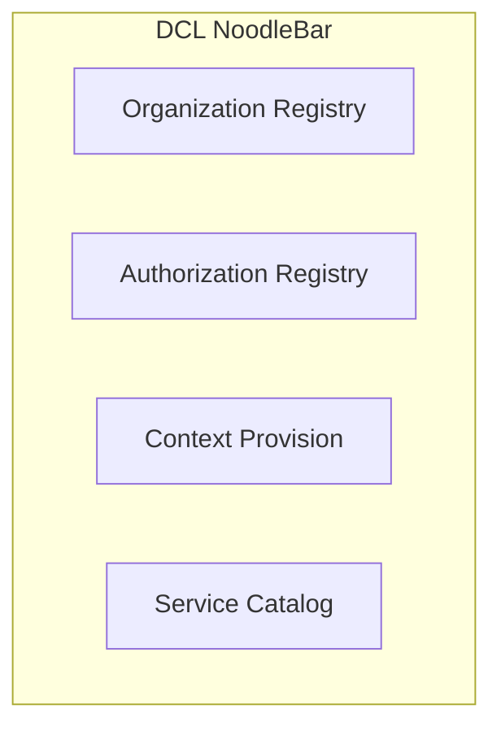

# Dataspace Container Logistics (DCL)

The Dataspace Container Logistics (DCL) is a specialized implementation of the NoodleBar dataspace designed for container logistics. It serves as a digital orchestration and flow control layer within the container logistics dataspace. This documentation provides an overview of the DCL NoodleBar, its features, and how it enables secure data transactions in container logistics.

## Overview

The DCL NoodleBar enables users to prepare, verify, and sign standard transactions within the container logistics domain. It supports context provision and stepper integration with process flows, dynamically linking contextual information to process steps. The system facilitates secure, controlled data sharing processes while ensuring data sovereignty for all participants.

### Key Features

- **Digital Transaction Orchestration**: Preparation, verification, and signing of standardized data transactions
- **Context Provision**: Dynamic linking of contextual information to process steps
- **Organization Registry**: Validation and management of logistics service providers
- **Authorization Registry**: Handling of access policies and digital mandates
- **Service Discovery**: Catalog functionality for available services within the dataspace

## Goals of the DCL NoodleBar

The DCL NoodleBar addresses key challenges in container logistics data sharing through several core goals:

1. **Promoting Discovery** - Adding catalog functionality to make it easier to discover available services within the dataspace. This catalog automatically generates service cards based on OpenAPI definitions, organization names, and logos from the Organization Registry.

2. **Federated Data Sharing** - Supporting data sharing between organizations based on open standards. Data owners maintain control over access and usage conditions, in alignment with data sovereignty principles.

3. **Secure Collaboration** - Addressing questions like "Who owns this data?" and "How do we share this data securely?", which aligns with European regulations such as the Data Governance Act and the Data Services Act.

4. **Standardization** - Providing a common framework for data exchange in container logistics, reducing fragmentation and complexity.

5. **Authorization Management** - Simplifying the complex process of determining who can access what information in a transparent and verifiable way.

## DCL NoodleBar Technical Structure

The DCL NoodleBar provides a comprehensive solution architecture designed specifically for container logistics data orchestration:

The architecture leverages Swagger and OpenAPI schemas for generating service descriptions, with attention to consistent presentation of descriptions in HTML and Markdown. The system includes five core functionalities: transaction processing, flow control, context provision, organization validation, and service discovery.

## Applications in Container Logistics

In the context of container logistics, the DCL NoodleBar provides:

- **Business Validation** - Verification of companies within the logistics chain
- **Data Enrichment** - Retrieval of additional data (such as Chamber of Commerce information)
- **Digital Authorization** - Generation and validation of digital mandates
- **Standardized Data Exchange** - Using container identifiers (ISO 6346), transport documents, and event data
- **Secure Collaboration** - Controlled access to sensitive logistics information

## Federated Data Sharing Principles

The DCL NoodleBar embodies the principles of federated data sharing by:

- **Data Sovereignty** - Data owners maintain control over access and usage conditions
- **Open Standards** - Utilizing open standards for interoperability
- **Security by Design** - Implementing security measures at all levels
- **Regulatory Compliance** - Alignment with European regulations like the Data Governance Act
- **Decentralized Architecture** - Avoiding central data storage while enabling efficient data discovery

The integration process follows the NoodleBar patterns, ensuring consistent implementation across different use cases in the container logistics domain.

For more technical details on implementing DCL connections, refer to the [NoodleBar documentation](../noodlebar/).
