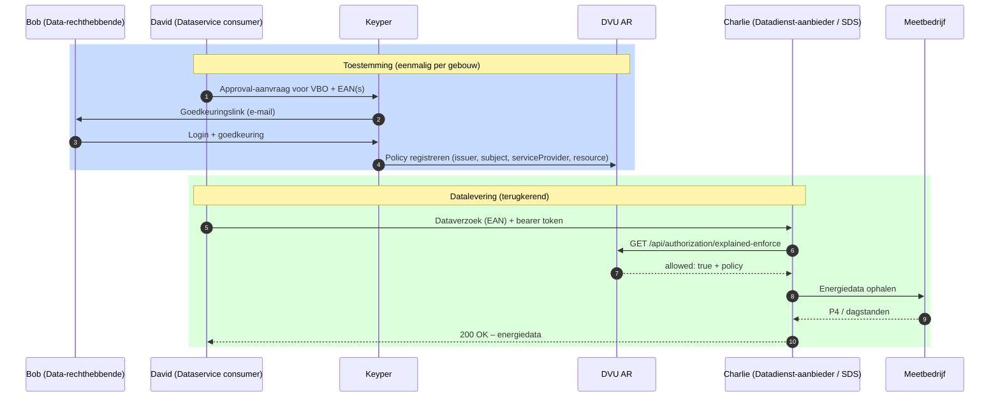

# DVU – Datastelsel Verduurzaming Utiliteit

DVU maakt gecontroleerde toegang tot energiedata van utiliteitsgebouwen mogelijk voor verduurzamingsdoeleinden. Een gebouweigenaar geeft via DVU expliciet toestemming aan een dataservice consumer om energiedata van een specifiek gebouw op te halen bij een datadienst-aanbieder. RVO is dataspace-beheerder; Poort8 levert het platform.

> **DVU 2.0 — NoodleBar Keycloak-variant.** Deze documentatie beschrijft de nieuwe DVU-implementatie op basis van NoodleBar met Keycloak, vergelijkbaar met PortlinQ en GIR. De [oudere DVU 1.0 documentatie](../dvu/) blijft voorlopig naast deze versie bestaan.

## Hoe werkt het?

DVU brengt drie partijen bij elkaar rond één gebouw:

- **Data-rechthebbende** (bv. gebouweigenaar) — geeft toestemming voor toegang tot energiedata van zijn gebouw(en).
- **Dataservice consumer** — een applicatie die namens een gebouweigenaar energiedata wil ophalen, bijvoorbeeld voor verduurzamingsadvies of rapportage.
- **Datadienst-aanbieder** — een platform (bv. SDS) dat de energiedata daadwerkelijk uitlevert, na verificatie van de toestemming bij DVU.

DVU bestaat uit drie kerncomponenten:

- **DVU Authorization Registry** — beheert policies (toestemmingen) en evalueert toegangscontrole via `explained-enforce`.
- **DVU Organization Registry** (Participant Registry) — beheert deelnemende organisaties en hun rollen.
- **Keyper** — verzorgt de goedkeuringsflow waarmee de data-rechthebbende toestemming geeft.

### Stappen

1. **Onboarden** — De dataservice consumer en datadienst-aanbieder worden geregistreerd in het DVU Participant Registry en krijgen Keycloak-credentials.
2. **Toestemming aanvragen** — De dataservice consumer maakt via Keyper een goedkeuringsverzoek aan voor een gebouw (VBO) en bijbehorende EAN's.
3. **Toestemming verlenen** — De data-rechthebbende keurt de aanvraag goed via een Keyper-link. Keyper registreert een policy in het DVU AR.
4. **Datalevering** — Bij elk dataverzoek controleert de datadienst-aanbieder de policy via `explained-enforce` en levert vervolgens de energiedata uit.

## Data-transacties

| Transactie | Doel | Richting |
|------------|------|----------|
| Toestemming (policy) | Gebouweigenaar geeft dataservice consumer toegang tot energiedata van een specifiek gebouw | Keyper → DVU AR |
| P4-meterdata | Standaard energieverbruik per meetpunt | Meetbedrijf → datadienst-aanbieder → dataservice consumer |
| Dagstanden | Dagelijkse meterstanden | Meetbedrijf → datadienst-aanbieder → dataservice consumer |

Zie [Dataproducten](dataproducten.md) voor details.

## Deelnemers en rollen

- **RVO** — dataspace-beheerder; verantwoordelijk voor governance en deelnemersregistratie.
- **Poort8** — platformleverancier (DVU AR, Participant Registry, Keyper).
- **Data-rechthebbenden** — gebouweigenaren die toestemming verlenen.
- **Dataservice consumers** — applicaties die namens gebouweigenaren energiedata willen ophalen.
- **Datadienst-aanbieders** — platforms die energiedata uitleveren (bv. SDS).
- **Meetbedrijven** — bron van de energiedata.

## Toegang en omgeving

- **Preview:** https://dvu-preview.poort8.nl/
- **Productie:** [TBD – beschikbaar na productie-deployment]

Authenticatie verloopt via het Keycloak-realm `dvu-preview` op `https://auth.poort8.nl/`.

## Aan de slag

| Wat je nodig hebt | Waar je het vindt |
|-------------------|-------------------|
| Concepten en proces begrijpen | [Lees hieronder](#hoe-werkt-het) en [Toegangsmodel](toegangsmodel.md) |
| Onboarding starten | [Onboarding & registratie](onboarding.md) |
| Toestemming organiseren als gebouweigenaar | [Aansluiten als data-rechthebbende](aansluiten-data-rechthebbende.md) |
| Implementeren als dataservice consumer | [Aansluiten als dataservice consumer](aansluiten-dataservice-consumer.md) |
| Implementeren als datadienst-aanbieder | [Aansluiten als datadienst-aanbieder](aansluiten-datadienst-aanbieder.md) |
| API-referentie | [DVU API docs ➚](https://dvu-preview.poort8.nl/scalar/v1) |
| Keyper-referentie | [Keyper API docs ➚](https://keyper-preview.poort8.nl/scalar/v1) |
| NoodleBar-concepten | [NoodleBar documentatie](../noodlebar/) |

## Meer informatie

- **[DVU bij RVO ➚](https://www.rvo.nl/onderwerpen/verduurzaming-utiliteitsbouw/dvu)**
- **[iSHARE Trust Framework ➚](https://ishare.eu/)**

Vragen? Neem contact op met Poort8 via **hello@poort8.nl** of met het DVU-beheerteam via **BeheerDVU@rvo.nl**.
