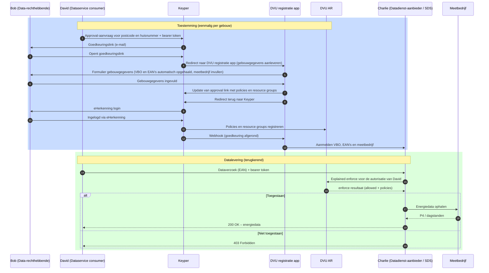

# DVU – Datastelsel Verduurzaming Utiliteit

DVU maakt gecontroleerde toegang tot energiedata van utiliteitsgebouwen mogelijk voor verduurzamingsdoeleinden. Een gebouweigenaar geeft via DVU expliciet toestemming aan een dataservice consumer om energiedata van een specifiek gebouw op te halen bij een datadienst-aanbieder. RVO is dataspace-beheerder; Poort8 levert de dataspace-componenten en -services.

> **DVU 2.0 — NoodleBar Keycloak-variant.** Deze documentatie beschrijft de nieuwe DVU-implementatie op basis van NoodleBar met Keycloak. De [oudere DVU 1.0 documentatie](../dvu/) blijft voorlopig naast deze versie bestaan.

## Hoe werkt het?

DVU brengt drie partijen bij elkaar rond één gebouw:

- **Data-rechthebbende** (bv. gebouweigenaar) — geeft toestemming voor toegang tot energiedata van zijn gebouw(en).
- **Dataservice consumer** — een applicatie die namens een gebouweigenaar energiedata wil ophalen, bijvoorbeeld voor verduurzamingsadvies of rapportage.
- **Datadienst-aanbieder** — een dienst (bv. SDS) die de energiedata daadwerkelijk uitlevert, na verificatie van de toestemming bij DVU.

DVU bestaat uit drie kerncomponenten:

- **DVU Autorisatieregister** — beheert policies (toestemmingen) en evalueert toegangscontrole via `explained-enforce`.
- **DVU Participantenregister** — beheert de deelnemende organisaties van de dataspace.
- **Keyper** — verzorgt de goedkeuringsflow waarmee de data-rechthebbende toestemming geeft.

### Stappen

1. **Onboarden** — De dataservice consumer en datadienst-aanbieder worden geregistreerd in het DVU Participantenregister en krijgen Keycloak-credentials.
2. **Toestemming aanvragen** — De dataservice consumer maakt via Keyper een goedkeuringsverzoek aan voor een gebouw op een postcode en huisnummer.
3. **Gebouwgegevens aanleveren** — De data-rechthebbende wordt via Keyper doorgestuurd naar de DVU registratie app. Het VBO en de bijbehorende EAN's worden automatisch opgehaald op basis van de postcode en het huisnummer; de data-rechthebbende vult alleen het meetbedrijf aan. De registratie app schrijft de policies en resource groups terug naar Keyper.
4. **Toestemming verlenen** — De data-rechthebbende keurt de aanvraag goed via eHerkenning. Keyper registreert policies en resource groups in het DVU AR.
5. **Gebouw activeren bij datadienst-aanbieder** — Na goedkeuring stuurt Keyper een webhook naar de DVU registratie app. De registratie app meldt het VBO, de EAN's en het meetbedrijf aan bij de datadienst-aanbieder, zodat die klaar is om dataverzoeken te verwerken.
6. **Datalevering** — Bij elk dataverzoek controleert de datadienst-aanbieder de policy via `explained-enforce` en levert vervolgens de energiedata uit.

## Deelnemers en rollen

- **RVO** — dataspace-beheerder; verantwoordelijk voor governance en deelnemersregistratie.
- **Poort8** — leverancier van de dataspace-componenten en -services (DVU AR en registratie app, Participantenregister, Keyper).
- **Data-rechthebbenden** — gebouweigenaren die toestemming verlenen.
- **Dataservice consumers** — applicaties die namens gebouweigenaren energiedata willen ophalen.
- **Datadienst-aanbieders** — diensten die energiedata uitleveren (bv. SDS).
- **Meetbedrijven** — bron van de energiedata.

## Toegang en omgeving

- **Preview:** https://dvu-preview.poort8.nl/

Authenticatie verloopt via het Keycloak-realm `dvu-preview` op `https://auth.poort8.nl/`.

## Aan de slag

| Wat je nodig hebt | Waar je het vindt |
|-------------------|-------------------|
| Concepten en proces begrijpen | [Lees hieronder](#hoe-werkt-het) en [Toegangsmodel](toegangsmodel.md) |
| Onboarding starten | [Onboarding & registratie](onboarding.md) |
| Toestemming organiseren als gebouweigenaar | [Aansluiten als data-rechthebbende](aansluiten-data-rechthebbende.md) |
| Implementeren als dataservice consumer | [Aansluiten als dataservice consumer](aansluiten-dataservice-consumer.md) |
| Implementeren als datadienst-aanbieder | [Aansluiten als datadienst-aanbieder](aansluiten-datadienst-aanbieder.md) |
| NoodleBar API | [DVU API docs ➚](https://dvu-preview.poort8.nl/scalar/v1) |
| Keyper API | [Keyper API docs ➚](https://keyper-preview.poort8.nl/scalar/v1) |
| NoodleBar-concepten | [NoodleBar documentatie](../noodlebar/) |

## Meer informatie

- **[DVU bij RVO ➚](https://www.rvo.nl/onderwerpen/verduurzaming-utiliteitsbouw/dvu)**

Vragen? Neem contact op met Poort8 via **hello@poort8.nl** of met het DVU-beheerteam via **BeheerDVU@rvo.nl**.
