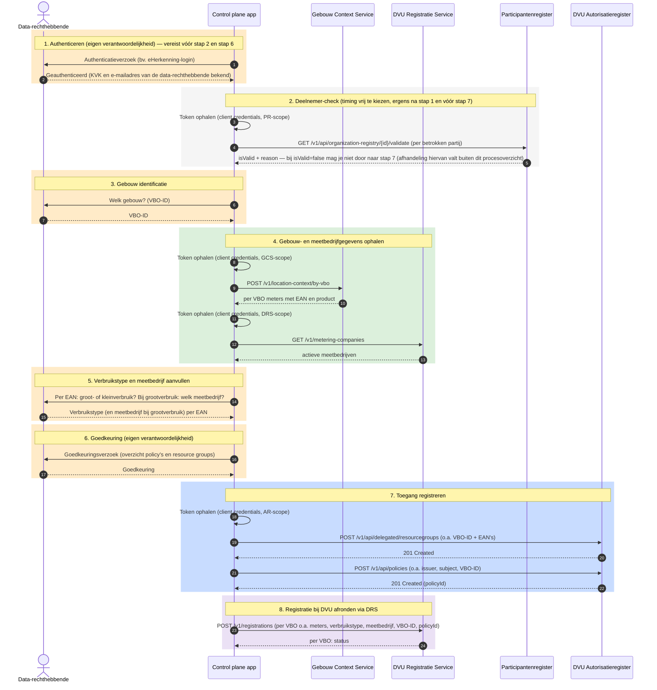

# Aansluiten als control plane app

Deze gids is voor ontwikkelaars die een **control plane app** bouwen die zelf de volledige DVU-toegangsverlening verzorgt, zonder gebruik te maken van Keyper. Deze app legt zelf de toestemming van de data-rechthebbende vast, controleert of de betrokken partijen deelnemer zijn in de dataspace, en registreert namens de data-rechthebbende de benodigde policies en resource groups in het DVU Autorisatieregister. eLoket (RVO) is hiervan het eerste voorbeeld.

Net als in de Keyper-flow geldt ook voor een control plane app dat de data-rechthebbende expliciet moet hebben ingestemd met de inhoud van een policy voordat de app die policy aanmaakt. Hoe die goedkeuring wordt vastgelegd is de verantwoordelijkheid van de control plane app zelf — bijvoorbeeld via een eHerkenning-login wanneer de gebruiker zelf de data-rechthebbende is.

## Voor wie is deze gids?

Voor applicaties die:

- Zelf de data-rechthebbende authenticeren (bijvoorbeeld via login met eHerkenning)
- Zelf de toestemming van de data-rechthebbende vastleggen
- Zelf controleren of de betrokken partijen op de policy deelnemer zijn in de dataspace
- Direct policies en resource groups aanmaken in het DVU Autorisatieregister via de NoodleBar API
- Hierbij bewust zijn dat ze de DVU use cases moeten volgen om de toestemming(en) correct vast te leggen

## Wat deze gids beschrijft

- Welke verantwoordelijkheid je als control plane app draagt (o.a. de deelnemer-check)
- Welke ondersteunende diensten je kunt gebruiken: de Gebouw Context Service (GCS) en de DVU Registratie Service (DRS)
- Welke gegevens je nodig hebt om correcte DVU-policies en resource groups aan te maken
- Hoe je die registraties uitvoert via de DVU API
- Hoe de verplichte aanvullende registratie bij DVU werkt, o.a. voor bijvoorbeeld het informeren van SDS dat een toestemming is vastgelegd
- Waar je de stappen vindt om daarna data op te vragen

> **Buiten scope van deze gids:** De standaard DVU-flow voor toegangsverlening verloopt via Keyper — een control plane app is bedoeld voor partijen die Poort8 expliciet heeft goedgekeurd. Als control plane app draag je zelf de volledige control-plane-verantwoordelijkheid. Lees ook de [DVU API documentatie ➚](<https://dvu-preview.poort8.nl/scalar/v1>) door; basiscontroles zoals het voorkomen van dubbele registraties zijn de verantwoordelijkheid van je app.

## De verantwoordelijkheid van een control plane app

Wie als control plane app policies inschiet, neemt daarmee de control-plane-verantwoordelijkheid over die in de standaardflow bij Keyper ligt. Concreet betekent dat:

- **Deelnemer-check.** Voordat je een policy inschiet, controleer je of de betrokken partijen deelnemers zijn van de dataspace. Dit doe je per organisatie-identifier via `GET /v1/api/organization-registry/{id}/validate`, dat teruggeeft of de organisatie bestaat en een actieve deelnemer is (`isValid` + `reason`). In de basis zal dit alleen een controle op de data-rechthebbende zijn, omdat de consumer en de provider respectievelijk de control plane app zelf en SDS zullen zijn, maar het is aan de control plane app zelf om dit vast te stellen. Let op: het Autorisatieregister **dwingt dit niet af** — je kunt technisch een policy inschieten voor een partij die niet is ingeschreven. Juist daarom is deze controle de verantwoordelijkheid van de control plane app zelf. Wat je doet als een partij nog geen deelnemer is (bijvoorbeeld eerst laten inschrijven), bepaal je zelf.
- **Toestemming vastleggen.** De data-rechthebbende moet geauthenticeerd zijn én hebben ingestemd met de policy. Wanneer de gebruiker zelf de data-rechthebbende is, kun je die authenticatie bijvoorbeeld via eHerkenning vastleggen.
- **Correcte identifiers.** De organisatie-identifier is een iSHARE-DID volgens de conventie `did:ishare:EU.NL.NTRNL-<KvK>` (NTR = National Trade Register; het nummer is het KvK-nummer).

## Procesoverzicht

Onderstaand staat een voorbeeld van een procesoverzicht. De timing van stap 2 (Deelnemer-check) is vrij te kiezen nadat stap 1 (Authenticeren) is afgerond en vóór stap 7; stap 1 moet daarnaast vóór stap 6 gebeuren.



## Voorwaarden

| Wat | Hoe |
|-----|-----|
| Organisatie + app geregistreerd en goedgekeurd in DVU Participantenregister | Zie [Onboarding](onboarding.md) |
| API-toegang tot de benodigde DVU API's | Via de catalogus in de portal, zie [Onboarding – Stap 4](onboarding.md) |
| Keycloak `client_id` + `client_secret` | Wordt bij het registreren van de app uitgegeven |
| Erkenning als control plane app door Poort8 | Vereist om de delegated endpoints in deze gids te mogen gebruiken; brengt de volledige control-plane-verantwoordelijkheid met zich mee (zie [De verantwoordelijkheid van een control plane app](#de-verantwoordelijkheid-van-een-control-plane-app)) |

## Ondersteunende diensten

Een control plane app hoeft het ophalen van gebouwgegevens en de registratie bij DVU niet zelf te bouwen. Twee generieke DVU-diensten nemen dat werk uit handen:

### Gebouw Context Service (GCS)

Herleidt een VBO-ID (of adres) tot de bijbehorende aansluitingen: de EAN's en het producttype (elektriciteit, gas). Zo hoef je PDOK en het EAN-codeboek niet zelf te bevragen.

```http
POST https://gcs-preview.poort8.nl/v1/location-context/by-vbo
Authorization: Bearer <ACCESS_TOKEN>
Content-Type: application/json

{ "vboIds": ["<VBO-ID>"] }
```

De response geeft per VBO de gevonden **meters** (met `ean` en `product`). Zie de [GCS API documentatie ➚](<https://gcs-preview.poort8.nl/scalar/v1>) voor het volledige schema.

### DVU Registratie Service (DRS)

Verzorgt de registratie bij DVU:

- meldt elke aansluiting aan bij SDS (`POST /Meteringpoints/v2`);
- genereert bij **grootverbruik** een bevestigings-PDF en mailt die naar SDS;
- levert de lijst met actieve meetbedrijven (`GET /v1/metering-companies`) die je gebruikt om bij grootverbruik het meetbedrijf te laten kiezen.

De DRS schrijft of leest het Autorisatieregister niet. Je geeft het VBO-ID en het `policyId` mee zodat de registratie te koppelen is aan de vastgelegde autorisatie. Het definitieve request-object wordt vastgelegd bij de DRS-implementatie; zie [Stap 8 — Registratie bij DVU afronden via DRS](#stap-8-registratie-bij-dvu-afronden-via-drs).

## Tokens ophalen

Voor elke dienst in deze gids vraag je een apart access token aan via OAuth2 client credentials — steeds bij hetzelfde token-endpoint, maar met een eigen `scope` per dienst (zie ook het procesoverzicht hierboven). De scope-naam per dienst volgt uit de API-catalogus in de portal (zie [Onboarding – Stap 4](onboarding.md)) en verschilt dus per aansluiting. Zo autoriseert een token je app alleen voor de dienst waarvoor het is uitgegeven; het regelt geen toegang tussen deelnemers in de dataspace — dat is de verantwoordelijkheid van de policies die je registreert.

| Dienst | Scope | Gebruikt in |
|-----|-----|-----|
| Participantenregister | eigen scope (PR-scope), zie catalogus | Stap 2 |
| Gebouw Context Service | eigen scope (GCS-scope), zie catalogus | Stap 4 |
| DVU Registratie Service | eigen scope (DRS-scope), zie catalogus | Stap 4 en stap 8 |
| DVU Autorisatieregister | eigen scope (AR-scope), zie catalogus | Stap 7 |

Voorbeeld token-aanvraag (vul de scope in die je voor de betreffende dienst uit de catalogus hebt gekregen):

```http
POST https://auth.poort8.nl/realms/dvu-preview/protocol/openid-connect/token
Content-Type: application/x-www-form-urlencoded

grant_type=client_credentials
&client_id=<YOUR-CLIENT-ID>
&client_secret=<YOUR-CLIENT-SECRET>
&scope=<SCOPE-UIT-CATALOGUS>
```

Voor het Participantenregister, de Gebouw Context Service, de DVU Registratie Service en het DVU Autorisatieregister vraag je op dezelfde manier een token aan, telkens met de scope die je bij de registratie van je app voor die dienst hebt gekregen.

## Policy- en resource group-conventies

DVU hanteert vaste waarden voor een aantal policy-velden. Een control plane app moet deze altijd exact overnemen.

### Vaste waarden

| Veld | Waarde | Toelichting |
|-----|-----|-----|
| `useCase` | `dvu` | Use case-identifier |
| `type` | `VBO-EAN` | Resource type (combi VBO + EAN's) |
| `action` | `GET` | Toegestane actie |
| `license` | `iSHARE.0002` | iSHARE-licentie |
| `attribute` | `*` | Alle data-attributen |
| `serviceProvider` | `did:ishare:EU.NL.NTRNL-55819206` | Datadienst-aanbieder (SDS) |

### In te vullen waarden

| Veld | Beschrijving | Voorbeeld |
|-----|-----|-----|
| `issuerId` | Data-rechthebbende | `did:ishare:EU.NL.NTRNL-12345678` |
| `subjectId` | De dataservice consumer die data ophaalt bij SDS (de control plane app zelf, of de partij namens wie wordt opgehaald) | `did:ishare:EU.NL.NTRNL-87654321` |
| `resourceId` | VBO-ID van het gebouw | `0599100000506575` |
| `notBefore` | Startmoment mandaat (Unix timestamp in seconds) | `1735686000` |
| `expiration` | Geldigheid mandaat (Unix timestamp in seconds) | `4102444800` |

### Resource group-hiërarchie

De resource group gebruikt het VBO-ID als `resourceGroupId`. De individuele EAN-codes van het gebouw worden als losse resources onder de resource group opgehangen. De policy verwijst met `resourceId` naar datzelfde VBO-ID, waardoor enforcement op EAN-niveau mogelijk is. Zie [Toegangsmodel – Policy-structuur](toegangsmodel.md#policy-structuur) voor de achtergrond hiervan.

Voor `name` en `description` gelden geen vaste conventies. Gebruik leesbare waarden die het gebouw identificeren, zoals het VBO-ID, het officiële adres of de naam van het pand.

## Stap 7 — Toegang registreren

Met de gegevens uit de vorige stappen (VBO-ID, EAN's, verbruikstype en meetbedrijfkeuzes, en de goedkeuring van de data-rechthebbende) registreer je de toegang in het DVU Autorisatieregister.

### Resource group aanmaken

Maak een resource group aan met het VBO-ID als `resourceGroupId` en de bijbehorende EAN-codes als resources. Een control plane app registreert namens de data-rechthebbende en gebruikt daarom de delegated endpoint, met de data-rechthebbende als `issuer`.

```http
POST https://dvu-preview.poort8.nl/v1/api/delegated/resourcegroups
Authorization: Bearer <ACCESS_TOKEN>
Content-Type: application/json
```

```json
{
  "issuer": "did:ishare:EU.NL.NTRNL-<DATA_RECHTHEBBENDE_KVK>",
  "resourceGroupId": "<VBO-ID>",
  "name": "<Naam van het gebouw>",
  "description": "<Omschrijving van het gebouw>",
  "useCase": "dvu",
  "resources": [
    {
      "resourceId": "<EAN1>",
      "useCase": "dvu",
      "name": "<Naam voor EAN1>",
      "description": "<Omschrijving voor EAN1>"
    },
    {
      "resourceId": "<EAN2>",
      "useCase": "dvu",
      "name": "<Naam voor EAN2>",
      "description": "<Omschrijving voor EAN2>"
    }
  ]
}
```

> **Let op:** De `useCase` van elke resource moet gelijk zijn aan de `useCase` van de resource group (`dvu`), anders wordt de aanvraag geweigerd.

> **Niet in de online API-documentatie:** Dit delegated endpoint is alleen beschikbaar voor goedgekeurde control plane apps en is daarom **niet** opgenomen in de [DVU API documentatie ➚](<https://dvu-preview.poort8.nl/scalar/v1>) (Scalar). Het request- en responseschema komt overeen met dat van het reguliere `resourcegroups`-endpoint, aangevuld met het verplichte `issuer`-veld. Heb je vragen over dit endpoint of het schema? Neem contact op via [**hello@poort8.nl**](<mailto:hello@poort8.nl>).

### Policy aanmaken

Maak een policy aan die de dataservice consumer toegang geeft tot het gebouw. De `resourceId` in de policy moet gelijk zijn aan de `resourceGroupId` van de zojuist aangemaakte resource group.

```http
POST https://dvu-preview.poort8.nl/v1/api/policies
Authorization: Bearer <ACCESS_TOKEN>
Content-Type: application/json
```

```json
{
  "useCase": "dvu",
  "issuerId": "did:ishare:EU.NL.NTRNL-<DATA_RECHTHEBBENDE_KVK>",
  "subjectId": "did:ishare:EU.NL.NTRNL-<CONSUMER_KVK>",
  "serviceProvider": "did:ishare:EU.NL.NTRNL-55819206",
  "action": "GET",
  "resourceId": "<VBO-ID>",
  "type": "VBO-EAN",
  "attribute": "*",
  "license": "iSHARE.0002",
  "notBefore": <UNIX_TIMESTAMP_NOTBEFORE>,
  "expiration": <UNIX_TIMESTAMP_EXPIRATION>
}
```

De response bevat het `policyId` van de aangemaakte policy. **Bewaar dit** — je hebt het nodig bij de registratie bij DVU (stap 8). Zie de [DVU API documentatie ➚](<https://dvu-preview.poort8.nl/scalar/v1>) voor het volledige schema.

## Stap 8 — Registratie bij DVU afronden via DRS

Na het registreren van de policy en resource group (stap 7) rond je de registratie af via de **DVU Registratie Service (DRS)**. De DRS meldt de aansluiting(en) aan bij de datadienst-aanbieder en verzorgt waar nodig de aanvullende afhandeling, zoals een bevestigings-PDF bij grootverbruik.

```http
POST https://<drs-host>/v1/registrations
Authorization: Bearer <ACCESS_TOKEN>
Content-Type: application/json
```

> **Let op:** onderstaand is een **functionele opsomming**; het definitieve request-schema wordt vastgelegd bij de implementatie van de DRS. Poort8 vult dit aan zodra dit bekend is.

- `issuerId`
- `issuerEmail`
- `dataServiceConsumerId`
- `dataServiceProviderId`
- `vboId`
- EAN's, elk met energietype, meetbedrijf en grootverbruik/kleinverbruik
- `policyId`
- `notBefore`
- `expiration`

Het KVK-nummer en e-mailadres van de data-rechthebbende ken je al uit stap 1; het verbruikstype en (bij grootverbruik) het meetbedrijf per EAN uit stap 5.

> **Let op:** het VBO-ID en `policyId` koppelen de registratie aan de vastgelegde autorisatie. Bij grootverbruik is een meetbedrijf verplicht; gebruik een `id` uit `GET /v1/metering-companies` (stap 4).

De DRS antwoordt per VBO met een status, zodat je precies ziet wat is gelukt en gericht kunt retryen.

## Data opvragen

Zodra de policy en resource group in het Autorisatieregister staan (stap 7) en de registratie bij DVU is afgerond via de DRS (stap 8), is de toegang volledig ingericht. Het daadwerkelijk **opvragen van energiedata** bij de datadienst-aanbieder verloopt daarna precies zoals bij een reguliere dataservice consumer: je haalt een token op met de scope van de aanbieder en stuurt het dataverzoek met dat bearer token. De aanbieder controleert via `explained-enforce` of er een geldige policy is en levert de data.

Zie [Aansluiten als dataservice consumer – Energiedata opvragen](aansluiten-dataservice-consumer.md#stap-4-energiedata-opvragen) voor de exacte stappen. Let op: het subject van de policy (`subjectId`) moet overeenkomen met de organisatie die het dataverzoek doet — dus de partij die je in stap 7 als `subjectId` hebt opgegeven.

## Policies en resource groups bijwerken of verwijderen

Een bestaande policy werk je bij of verwijder je via de policy-endpoints in de [DVU API documentatie ➚](<https://dvu-preview.poort8.nl/scalar/v1>) (Scalar), bijvoorbeeld om de `notBefore` of `expiration` aan te passen.

Bij het verwijderen gelden deze functionele regels:

- Een resource group is gekoppeld aan de issuer (de data-rechthebbende); resource groups van andere partijen spelen hierbij geen rol.
- Een resource group mag zonder actieve policy blijven bestaan, bijvoorbeeld om een overzicht van beschikbare gebouwen te tonen.
- De bijbehorende resources (EAN's) van een resource group worden **niet** automatisch verwijderd wanneer je de resource group verwijdert — verwijder die afzonderlijk via het resources-endpoint, eveneens te vinden in de [DVU API documentatie ➚](<https://dvu-preview.poort8.nl/scalar/v1>).

De data-rechthebbende die toestemming heeft verleend heeft het recht om de bijbehorende policies en resource groups te laten verwijderen.

## Foutafhandeling

| Code | Betekenis | Actie |
|-----|-----|-----|
| `401 Unauthorized` | Token ontbreekt, is verlopen of ongeldig | Vraag een nieuw token aan |
| `403 Forbidden` | Onvoldoende rechten om policies of resource groups aan te maken | Controleer of de control plane app-registratie bij Poort8 is afgerond |
| `400 Bad Request` | Verkeerde of ontbrekende velden | Controleer request parameters |
| `409 Conflict` | Resource group bestaat al | Controleer of de registratie al eerder is uitgevoerd |

## Hulp nodig?

- Algemene vragen over DVU: [**BeheerDVU@rvo.nl**](<mailto:BeheerDVU@rvo.nl>)
- Technische vragen of inhoudelijke ondersteuning: [**hello@poort8.nl**](<mailto:hello@poort8.nl>)
