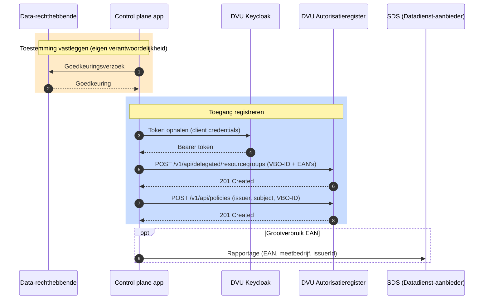

# Aansluiten als control plane app

Deze gids is voor ontwikkelaars die een **control plane app** bouwen die zelf de volledige DVU-toegangsverlening verzorgt, zonder gebruik te maken van Keyper. Deze app registreert zelf de benodigde policies en resource groups in het DVU Autorisatieregister namens de data-rechthebbende, en is zelf verantwoordelijk voor het vastleggen van diens toestemming.

Net als in de Keyper-flow geldt ook voor een control plane app dat de data-rechthebbende expliciet moet hebben ingestemd met de inhoud van een policy voordat de app die policy aanmaakt. Hoe die goedkeuring wordt vastgelegd is de verantwoordelijkheid van de control plane app zelf.

> **Belangrijk:** Een control plane app vereist aanvullende registratie bij Poort8 als vertrouwde control plane client. Vraag via de portal toegang aan tot de `noodlebar-api` voor je app (zie [Onboarding – Stap 4](onboarding.md)), en stuur op dat moment een e-mail naar **hello@poort8.nl** met de mededeling dat je je app als control plane app wilt registreren (vermeld de naam van je app). Je kunt intussen verdergaan met het bouwen van je integratie, maar aanroepen die policies of resource groups aanmaken namens een andere organisatie slagen pas nadat Poort8 je heeft geregistreerd.

## Voor wie is deze gids?

Voor applicaties die:

- Zelf de toestemming van de data-rechthebbende vastleggen, buiten Keyper om
- Direct policies en resource groups aanmaken in het DVU Autorisatieregister via de NoodleBar API
- Verantwoordelijk zijn voor het correct volgen van de DVU-conventies voor policies en resource groups

## Wat deze gids beschrijft

- Hoe je een control plane app registreert en de aansluiting op de NoodleBar API regelt
- Welke gegevens je nodig hebt om correcte DVU-policies en resource groups aan te maken
- Hoe je die registraties uitvoert via de DVU API
- Hoe je policies en resource groups bijwerkt of verwijdert
- Wanneer een rapportage bij SDS vereist is

> **Buiten scope van deze gids:** De standaard DVU-flow voor toegangsverlening verloopt via Keyper en de DVU metadata app — een control plane app is bedoeld voor partijen die Poort8 expliciet heeft goedgekeurd. Het ophalen van VBO-ID's en EAN-codes, het bepalen van het marktsegment (kleinverbruik of grootverbruik) en het correct rapporteren aan SDS zijn de verantwoordelijkheid van je eigen app. Lees ook de [DVU API documentatie ➚](https://dvu-preview.poort8.nl/scalar/v1) door; basiscontroles zoals het voorkomen van dubbele registraties zijn de verantwoordelijkheid van je app.

## Procesoverzicht



## Voorwaarden

| Wat | Hoe |
|-----|-----|
| Organisatie + app geregistreerd en goedgekeurd in DVU Participantenregister | Zie [Onboarding](onboarding.md) |
| API-toegang tot `noodlebar-api` | Via de catalogus in de portal, zie [Onboarding – Stap 4](onboarding.md) |
| Registratie als control plane app bij Poort8 | Neem contact op via **hello@poort8.nl** |
| Keycloak `client_id` + `client_secret` | Wordt bij het registreren van de app uitgegeven |
| Toestemming van de data-rechthebbende | Eigen verantwoordelijkheid van de control plane app |

## Stap 1 — Token ophalen

Authenticeer met de DVU API via OAuth2 client credentials met scope `noodlebar-api`. Het verkregen `access_token` autoriseert je app om namens zichzelf de NoodleBar API aan te roepen; het regelt geen toegang tussen deelnemers in de dataspace — dat is de verantwoordelijkheid van de policies die je registreert.

```http
POST https://auth.poort8.nl/realms/dvu-preview/protocol/openid-connect/token
Content-Type: application/x-www-form-urlencoded

grant_type=client_credentials
&client_id=<YOUR-CLIENT-ID>
&client_secret=<YOUR-CLIENT-SECRET>
&scope=noodlebar-api
```

## Policy- en resource group-conventies

DVU hanteert vaste waarden voor een aantal policy-velden. Een control plane app moet deze altijd exact overnemen.

### Vaste waarden

| Veld | Waarde | Toelichting |
|------|--------|-------------|
| `useCase` | `dvu` | Use case-identifier |
| `type` | `VBO-EAN` | Resource type (combi VBO + EANs) |
| `action` | `GET` | Toegestane actie |
| `license` | `iSHARE.0002` | iSHARE-licentie |
| `attribute` | `*` | Alle data-attributen |
| `serviceProvider` | `did:ishare:EU.NL.NTRNL-55819206` | Datadienst-aanbieder (SDS) |

### In te vullen waarden

| Veld | Beschrijving | Voorbeeld |
|------|--------------|-----------|
| `issuerId` | Data-rechthebbende | `did:ishare:EU.NL.NTRNL-12345678` |
| `subjectId` | De control plane app zelf (de geregistreerde consumer die data ophaalt bij SDS) | `did:ishare:EU.NL.NTRNL-87654321` |
| `resourceId` | VBO-ID van het gebouw | `0599100000506575` |
| `expiration` | Geldigheid mandaat (Unix timestamp) | `4102444800` |

### Resource group-hiërarchie

De resource group gebruikt het VBO-ID als `resourceGroupId`. De individuele EAN-codes van het gebouw worden als losse resources onder de resource group opgehangen. De policy verwijst met `resourceId` naar datzelfde VBO-ID, waardoor enforcement op EAN-niveau mogelijk is. Zie [Toegangsmodel – Policy-structuur](toegangsmodel.md#policy-structuur) voor de achtergrond hiervan.

Voor `name` en `description` gelden geen vaste conventies. Gebruik leesbare waarden die het gebouw identificeren, zoals het VBO-ID, het officiële adres of de naam van het pand.

## Stap 2 — Resource group aanmaken

Maak een resource group aan met het VBO-ID als `resourceGroupId` en de bijbehorende EAN-codes als resources. Een control plane app registreert namens de data-rechthebbende en gebruikt daarom de delegated endpoint, met de data-rechthebbende als `issuer`.

```http
POST https://dvu-preview.poort8.nl/v1/api/delegated/resourcegroups
Authorization: Bearer <ACCESS_TOKEN>
Content-Type: application/json
```

```json
{
  "issuer": "did:ishare:EU.NL.NTRNL-<DATA_RECHTHEBBENDE_KVK>",
  "resourceGroupId": "<VBO-ID>",
  "name": "<Naam van het gebouw>",
  "description": "<Omschrijving van het gebouw>",
  "useCase": "dvu",
  "resources": [
    {
      "resourceId": "<EAN1>",
      "useCase": "dvu",
      "name": "<Naam voor EAN1>",
      "description": "<Omschrijving voor EAN1>"
    },
    {
      "resourceId": "<EAN2>",
      "useCase": "dvu",
      "name": "<Naam voor EAN2>",
      "description": "<Omschrijving voor EAN2>"
    }
  ]
}
```

> **Let op:** De `useCase` van elke resource moet gelijk zijn aan de `useCase` van de resource group (`dvu`), anders wordt de aanvraag geweigerd.

> **Niet in de online API-documentatie:** Dit delegated endpoint is alleen beschikbaar voor goedgekeurde control plane apps en is daarom **niet** opgenomen in de [DVU API documentatie ➚](https://dvu-preview.poort8.nl/scalar/v1) (Scalar). Het request- en responseschema komt overeen met dat van het reguliere `resourcegroups`-endpoint, aangevuld met het verplichte `issuer`-veld. Heb je vragen over dit endpoint of het schema? Neem contact op via **hello@poort8.nl**.

## Stap 3 — Policy aanmaken

Maak een policy aan die de dataservice consumer toegang geeft tot het gebouw. De `resourceId` in de policy moet gelijk zijn aan de `resourceGroupId` van de zojuist aangemaakte resource group.

```http
POST https://dvu-preview.poort8.nl/v1/api/policies
Authorization: Bearer <ACCESS_TOKEN>
Content-Type: application/json
```

```json
{
  "useCase": "dvu",
  "issuerId": "did:ishare:EU.NL.NTRNL-<DATA_RECHTHEBBENDE_KVK>",
  "subjectId": "did:ishare:EU.NL.NTRNL-<CONSUMER_KVK>",
  "serviceProvider": "did:ishare:EU.NL.NTRNL-55819206",
  "action": "GET",
  "resourceId": "<VBO-ID>",
  "type": "VBO-EAN",
  "attribute": "*",
  "license": "iSHARE.0002",
  "expiration": <UNIX_TIMESTAMP_EXPIRATION>
}
```

Zie de [DVU API documentatie ➚](https://dvu-preview.poort8.nl/scalar/v1) voor het volledige schema.

## Policies en resource groups bijwerken of verwijderen

Gebruik `PUT /v1/api/policies` om een bestaande policy bij te werken, bijvoorbeeld om de `expiration` te verlengen. Gebruik `DELETE /v1/api/policies/{id}` om een policy te verwijderen.

Bij het verwijderen gelden deze functionele regels:

- Controleer of er andere actieve policies op dezelfde resource group bestaan voordat je die resource group verwijdert — andere partijen kunnen nog policy-gebaseerde toegang hebben tot hetzelfde gebouw.
- Een resource group mag zonder actieve policy blijven bestaan, bijvoorbeeld om een overzicht van beschikbare gebouwen te tonen.
- Gebruik `DELETE /v1/api/resourcegroups/{id}` om een resource group te verwijderen. Let op: de bijbehorende resources (EAN's) worden **niet** automatisch verwijderd — verwijder die afzonderlijk via `DELETE /v1/api/resourcegroups/{id}/resources/{resourceId}`.

De data-rechthebbende die toestemming heeft verleend heeft het recht om de bijbehorende policies en resource groups te laten verwijderen. Zie de [DVU API documentatie ➚](https://dvu-preview.poort8.nl/scalar/v1) voor de endpoint-specificaties.

## SDS-rapportage

Na het aanmaken van een policy en resource group moet de control plane app voor elke **grootverbruik** EAN een rapportage aanleveren bij SDS. Voor kleinverbruik EANs is dit niet vereist.

> **Nog niet beschikbaar:** Het is nog niet bekend hoe deze API-call bij SDS precies verloopt. Het exacte endpoint, het request-formaat en de authenticatie worden later aan deze gids toegevoegd.

De rapportage bevat:

| Gegeven | Beschrijving |
|---------|-------------|
| EAN-code | De EAN-code van de grootverbruikaansluiting |
| Meetbedrijf | De identifier van het meetbedrijf dat de meterdata levert voor dit EAN |
| Issuer ID | De data-rechthebbende, gelijk aan `issuerId` in de policy |

## Foutafhandeling

| Code | Betekenis | Actie |
|------|-----------|-------|
| `401 Unauthorized` | Token ontbreekt, is verlopen of ongeldig | Vraag een nieuw token aan |
| `403 Forbidden` | Onvoldoende rechten om policies of resource groups aan te maken | Controleer of de control plane app-registratie bij Poort8 is afgerond |
| `400 Bad Request` | Verkeerde of ontbrekende velden | Controleer request parameters |
| `409 Conflict` | Resource group of policy bestaat al | Controleer of de registratie al eerder is uitgevoerd |

## Hulp nodig?

- Algemene vragen over DVU: **BeheerDVU@rvo.nl**
- Technische vragen of inhoudelijke ondersteuning: **hello@poort8.nl**