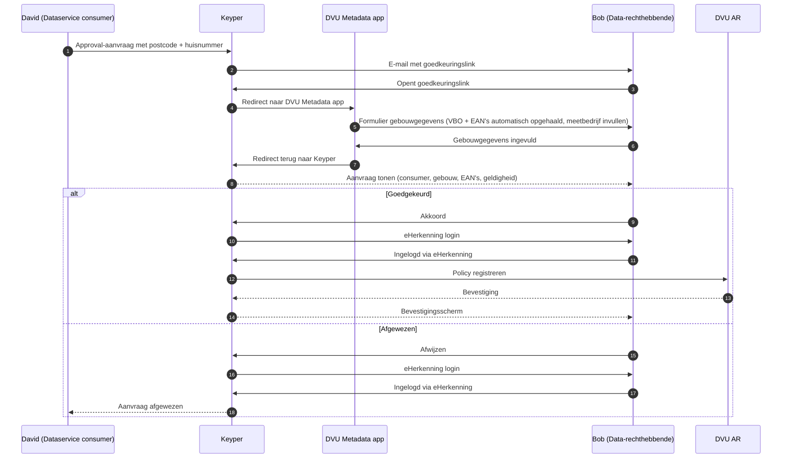

# Aansluiten als data-rechthebbende

Deze gids is voor gebouweigenaren (data-rechthebbenden) die toestemming geven om energiedata van hun gebouw(en) te laten delen via DVU. Goedkeuring verloopt via Keyper; de uiteindelijke policy wordt geregistreerd in het DVU Autorisatieregister.

## Wat doe jij in dit proces?

DVU ondersteunt twee varianten:

**Variant 1 – Self-service**: Jij start de aanvraag zelf via de DVU-portal met een postcode en huisnummer. Keyper stuurt je een goedkeuringslink.

**Variant 2 – Externe aanvraag**: Een dataservice consumer (zie [Aansluiten als dataservice consumer](aansluiten-dataservice-consumer.md)) vraagt toegang aan bij Keyper, waarna jij een goedkeuringslink per e-mail ontvangt.

In beide gevallen:

1. Open je de goedkeuringslink. Keyper stuurt je door naar de **DVU Metadata app**, die automatisch het VBO en de bijbehorende EAN's ophaalt op basis van de postcode en het huisnummer. Je vult het meetbedrijf aan en bevestigt.
2. De metadata app stuurt je terug naar Keyper. Je bekijkt de aanvraag (gebouw, EAN's, consumer, geldigheid) en klikt op goedkeuren of afwijzen.
3. Je logt in met **eHerkenning** om je keuze te bevestigen. Bij goedkeuring registreert Keyper daarna de policy in het DVU AR.

Bij goedkeuring registreert Keyper automatisch de bijbehorende policy in het DVU AR. Vanaf dat moment kan de datadienst-aanbieder energiedata uitleveren aan de aangewezen consumer.

## Voorwaarden

| Wat | Wie |
|-----|-----|
| Organisatie geregistreerd in DVU Participantenregister | Poort8 / RVO – zie [Onboarding](onboarding.md) |
| Tekenbevoegd persoon met eHerkenning | Eigen verantwoordelijkheid van de organisatie |

## Self-service (variant 1)

Wanneer je zelf de toegang start, gebruik je de DVU-portal om de aanvraag in gang te zetten. Je vult een postcode en huisnummer in. Keyper stuurt je een goedkeuringslink. Daarna zijn de stappen identiek aan variant 2: metadata app opent automatisch het VBO en de EAN's, je vult het meetbedrijf aan, en je keurt de aanvraag goed en bevestigt daarna via eHerkenning.

## Goedkeuringsflow (variant 2)

## Wat wordt er vastgelegd?

Bij goedkeuring registreert Keyper een policy met onder andere:

- **Issuer** – jouw organisatie als data-rechthebbende
- **Subject** – de dataservice consumer die toegang krijgt
- **Service provider** – de datadienst-aanbieder die de data uitlevert
- **Resource** – het gebouw (VBO) en de bijbehorende EAN's
- **Geldigheid** – een einddatum/`expiration`

Zie [Toegangsmodel – Policy-structuur](toegangsmodel.md#policy-structuur) voor de volledige policy-velden.

## Toestemming intrekken

Een eerder verleende toestemming kan worden ingetrokken via de **Keyper Manager**, beschikbaar op [keyper-preview.poort8.nl](https://keyper-preview.poort8.nl).

## Hulp nodig?

- Algemene vragen over DVU: **BeheerDVU@rvo.nl**
- Technische vragen of inhoudelijke ondersteuning: **hello@poort8.nl**
