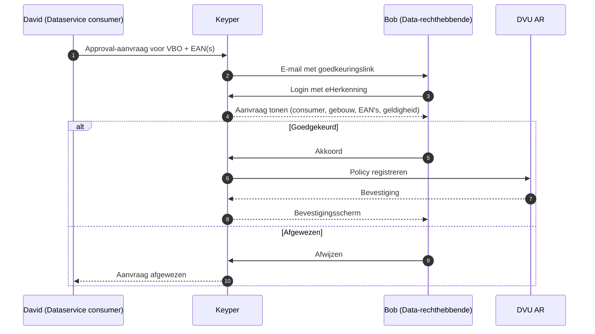

# Aansluiten als data-rechthebbende

Deze gids is voor gebouweigenaren (data-rechthebbenden) die toestemming geven om energiedata van hun gebouw(en) te laten delen via DVU. Goedkeuring verloopt via Keyper; de uiteindelijke policy wordt geregistreerd in het DVU Authorization Registry.

## Wat doe jij in dit proces?

Als data-rechthebbende ontvang je een **goedkeuringslink** van Keyper, op verzoek van een dataservice consumer (zie [Aansluiten als dataservice consumer](aansluiten-dataservice-consumer.md)). Op die link:

1. Authenticeer je met **eHerkenning**.
2. Bekijk je welke EAN's van welk gebouw worden gedeeld, met welke partij, voor welk doel en hoelang.
3. Keur je het verzoek goed of af.

Bij goedkeuring registreert Keyper automatisch de bijbehorende policy in het DVU AR. Vanaf dat moment kan de datadienst-aanbieder energiedata uitleveren aan de aangewezen consumer.

## Voorwaarden

| Wat | Wie |
|-----|-----|
| Organisatie geregistreerd in DVU Participant Registry | Poort8 / RVO – zie [Onboarding](onboarding.md) |
| Tekenbevoegd persoon met eHerkenning | Eigen verantwoordelijkheid van de organisatie |
| Toegang tot het e-mailadres dat als contactpersoon is opgegeven | Data-rechthebbende |

## Self-service (variant 1)

Wanneer je zelf de toegang start (bijvoorbeeld om je eigen energiedata in een verduurzamingsdashboard te tonen), gebruik je de DVU-portal om de aanvraag in gang te zetten. De stappen daarna zijn identiek aan variant 2.

[TBD – self-service portal-URL, screenshots en stap-voor-stap beschrijving toevoegen zodra dit deel van de NoodleBar Keycloak-variant operationeel is.]

## Goedkeuringsflow (variant 2)

## Wat wordt er vastgelegd?

Bij goedkeuring registreert Keyper een policy met onder andere:

- **Issuer** – jouw organisatie als data-rechthebbende
- **Subject** – de dataservice consumer die toegang krijgt
- **Service provider** – de datadienst-aanbieder die de data uitlevert
- **Resource** – het gebouw (VBO) en de bijbehorende EAN's
- **Geldigheid** – een einddatum/`expiration`

Zie [Toegangsmodel – Policy-structuur](toegangsmodel.md#policy-structuur) voor de volledige policy-velden.

## Toestemming intrekken

[TBD – beschrijven hoe een data-rechthebbende een eerder verleende toestemming kan intrekken in de NoodleBar Keycloak-variant (portaal-flow, of via supportverzoek).]

## Hulp nodig?

- Algemene vragen over DVU: **BeheerDVU@rvo.nl**
- Technische vragen of inhoudelijke ondersteuning: **hello@poort8.nl**
