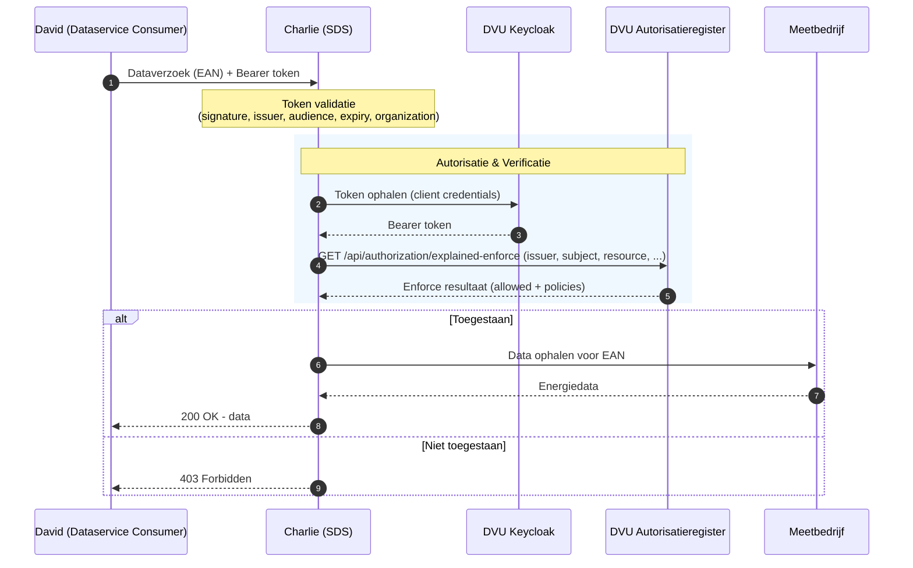

# DVU Autorisatie voor Datadienst-aanbieders

Deze gids is voor ontwikkelaars die een datadienst bouwen op DVU en autorisatiebeleid moeten verifiëren voordat zij energiedata uitleveren aan een dataservice consumer. De gids beschrijft hoe **Charlie (SDS)** het `explained-enforce` endpoint van het DVU Autorisatieregister bevraagt om te controleren of een geldige policy bestaat voor **David (Dataservice Consumer)** namens **Bob (Data-rechthebbende / gebouweigenaar)**.

SDS is in DVU terminologie een **datadienst-aanbieder** (`serviceProvider`): een dienst die namens een data-rechthebbende energiedata bij meetbedrijven ophaalt en aan een geautoriseerde consumer levert. Hoewel deze gids zich richt op SDS, is hetzelfde enforcement patroon toepasbaar op andere datadienst-aanbieders op DVU.

> **Let op:** DVU 2.0 wordt opgezet als NoodleBar Keycloak-variant. De policystructuur blijft inhoudelijk vergelijkbaar met de iSHARE-stijl die in DVU 1.0 werd gebruikt, maar wordt nu toegepast op de NoodleBar Keycloak-variant. De iSHARE-AR-implementatie laten we voor nu naast deze nieuwe variant bestaan.

[DVU API Docs ➚](https://dvu-preview.poort8.nl/scalar/v1)

## Voor wie is deze gids?

Deze gids is voor datadienst-aanbieders die:

- Energiemeterdata uitleveren binnen het DVU dataspace
- Moeten verifiëren of een dataservice consumer geautoriseerd is om data van een specifiek gebouw / EAN op te halen
- Het DVU autorisatiepatroon willen implementeren via `explained-enforce`

## Wat deze gids beschrijft

- Hoe policies werken in DVU en wat zij toestaan
- Hoe SDS het inkomende bearer token van de dataservice consumer valideert
- Hoe je een token ophaalt voor het DVU Autorisatieregister
- Hoe je het `explained-enforce` endpoint bevraagt
- Hoe je de response valideert

Deze gids beschrijft niet de structuur van het inkomende dataverzoek van David naar SDS, niet hoe policies worden aangemaakt (via Keyper of de Approval-flow), en niet de communicatie tussen SDS en het meetbedrijf.

## Procesbeschrijving

Wanneer SDS een dataverzoek verwerkt voor een specifieke EAN namens een data-rechthebbende, volg je deze stappen:

1. **Ontvang het verzoek**: SDS ontvangt een dataverzoek met daarin minimaal de EAN en een bearer token van David. De `identifier` van de data-rechthebbende is al intern bekend bij SDS.
2. **Valideer het inkomende token**: verifieer het bearer token van David en haal de organisatie `identifier` eruit.
3. **Token ophalen voor het Autorisatieregister**: haal een access token op bij het DVU Keycloak-realm via OAuth2 client credentials.
4. **Bevraag het Autorisatieregister**: roep `explained-enforce` aan om te controleren of een geldige policy bestaat voor de combinatie issuer / subject / resource.
5. **Valideer de response**: verifieer dat het verzoek is toegestaan en dat de gevonden policy past bij het dataverzoek.
6. **Lever uit of weiger**: bij autorisatie haalt SDS de data op bij het meetbedrijf en levert deze aan David. Anders retourneert SDS `403 Forbidden`.



## Autorisatiemodel

De DVU Approval-flow beschrijft hoe een policy wordt aangemaakt namens de data-rechthebbende (Bob), via Keyper of via een goedkeuringslink. Jouw dienst bevraagt die bestaande policy via `explained-enforce`.

### Policy velden

| Veld | Beschrijving | Voorbeeld |
| -- | -- | -- |
| `type` | Resource type — `VBO-EAN` (combi VBO + EANs) | `VBO-EAN` |
| `action` | Toegestane actie | `GET` |
| `license` | iSHARE licentie | `iSHARE.0002` |
| `useCase` | Use case | `dvu` |
| `issuerId` | Data-rechthebbende (Bob, gebouweigenaar) | `did:ishare:EU.NL.NTRNL-12345678` |
| `subjectId` | Dataservice consumer (David) | `did:ishare:EU.NL.NTRNL-87654321` |
| `serviceProvider` | Datadienst-aanbieder (Charlie, SDS) | `did:ishare:EU.NL.NTRNL-55819206` |
| `resourceId` | VBO-ID van het gebouw | `0599100000506575` |
| `attribute` | Data attributen | `*` |
| `expiration` | Geldigheid mandaat (Unix timestamp) | `2147483647` |

De policy hoort bij een **Resource Group** waarvan `resourceGroupId` gelijk is aan het VBO-ID en waar de individuele EANs als resources onder hangen. Door deze resource group hiërarchie is enforcement op EAN nummer mogelijk (zie [§ Stap 3](#stap-3-explained-enforce-request)). Hieronder een voorbeeld in JSON notatie om dit duidelijker te maken:

```json
{
  "resourceGroupId": "0599100000506575",
  "name": "Kantoorgebouw Voorbeeld",
  "useCase": "dvu",
  "resources": [
    { "resourceId": "871687119500493829" },
    { "resourceId": "871687119500493867" }
  ]
}
```

## Stap 1: Token validatie (inkomend verzoek van David)

Voordat SDS verder gaat met enforcement, valideert SDS het bearer token dat David heeft meegestuurd in zijn dataverzoek. Doel van deze stap is tweeledig: vaststellen dat het token authentiek is, en vaststellen welke organisatie David vertegenwoordigt — die organisatie-identifier wordt later als `subject` meegegeven aan `explained-enforce` (zie [§ Stap 3](#stap-3-explained-enforce-request)).

De validatie wordt door SDS lokaal uitgevoerd op basis van de OpenID Connect metadata van het DVU Keycloak-realm. SDS hoeft hiervoor geen call naar Keycloak te doen — de signing keys worden via de standaard JWKS-discovery opgehaald en gecached.

### Verplichte token-checks

| Check | Wat | Waarmee |
| -- | -- | -- |
| **Signature** | Het token is ondertekend door het DVU Keycloak-realm | Public keys via JWKS-discovery, authority `https://auth.poort8.nl/realms/dvu-preview` |
| **Issuer** | `iss`-claim komt overeen met het DVU Keycloak-realm | `https://auth.poort8.nl/realms/dvu-preview` |
| **Audience** | `aud`-claim is bedoeld voor SDS | API client ID waarmee SDS is geregistreerd in DVU (zie [§ Voorbereiding](#voorbereiding)) |
| **Expiry** | `exp` ligt in de toekomst en `nbf` (indien aanwezig) in het verleden | Lifetime validation met beperkte clock skew |

### Organisatie-identifier afleiden

Na een geslaagde token-validatie haalt SDS uit de `organization`-claim de organisatie-identifier waarmee David zich aanbiedt. De `organization`-claim is een Keycloak-specifieke JSON structuur. Deze bevat voor de organisatie verschillende identifier formats, weergegeven middels arrays met waarden.

SDS doorloopt de organisaties in de claim en pakt de eerste organisatie waarvoor het geconfigureerde attribuut (in DVU: `ISHARE`) aanwezig is en een niet-lege array bevat. Het eerste element van die array is de organisatie-identifier.

Schematisch:

```json
{
  <JWT payload claims>,
  "organization": {
    "NLNHR.87654321": {
      "KVK": [
        "87654321"
      ],
      "EORI": [
        "NL123456789"
      ],
      "ISHARE": [
        "did:ishare:EU.NL.NTRNL-87654321"
      ],
      "EUID": [
        "NLNHR.87654321"
      ],
      "id": "0fcb7593-f45d-48cc-97ac-3d50b498d5c5"
    }
  }
}
```

Het resultaat is een platte string-waarde — bijvoorbeeld `did:ishare:EU.NL.NTRNL-87654321` — die SDS gebruikt als `subject` in de `explained-enforce` aanroep.

Als één van de volgende situaties zich voordoet, weiger het verzoek met `403 Forbidden`:

- De `organization`-claim ontbreekt
- De `organization`-claim is geen geldig JSON-object
- De `organization`-claim bevat niet het verwachte attribuut (`ISHARE`) met een geldige identifier

## Stap 2: Token ophalen voor het DVU Autorisatieregister

Authenticeer met de DVU API via OAuth2 client credentials:

```http
POST https://auth.poort8.nl/realms/dvu-preview/protocol/openid-connect/token
Content-Type: application/x-www-form-urlencoded

grant_type=client_credentials
&client_id=<YOUR-CLIENT-ID>
&client_secret=<YOUR-CLIENT-SECRET>
&scope=noodlebar-api
```

Het verkregen access token authenticeert SDS als *applicatie* tegen het DVU AR. Het is uitdrukkelijk **geen** identiteitstoken tussen David en SDS — de identiteiten van issuer/subject/serviceProvider worden expliciet als query-parameters meegegeven aan `explained-enforce` (zie [§ Stap 3](#stap-3-explained-enforce-request)).

## Stap 3: Explained-enforce request

Roep `explained-enforce` aan om autorisatie te controleren. In DVU vereist de implementatie **7 query-parameters**:

```http
GET https://dvu-preview.poort8.nl/api/authorization/explained-enforce
  ?issuer=did:ishare:EU.NL.NTRNL-12345678
  &subject=did:ishare:EU.NL.NTRNL-87654321
  &serviceProvider=did:ishare:EU.NL.NTRNL-55819206
  &action=GET
  &resource=871687119500493829
  &type=VBO-EAN
  &useCase=dvu
Authorization: Bearer {sds_token}
```

### Query parameters

| Parameter | Beschrijving | Voorbeeld |
| -- | -- | -- |
| `issuer` | iSHARE ID van de data-rechthebbende (Bob), bekend in interne administratie van SDS behorende bij het EAN | `did:ishare:EU.NL.NTRNL-12345678` |
| `subject` | iSHARE ID van de dataservice consumer (David), uit de gevalideerde `organization`-claim van het bearer token (zie [§ Stap 1](#stap-1-token-validatie-inkomend-verzoek-van-david)) | `did:ishare:EU.NL.NTRNL-87654321` |
| `serviceProvider` | iSHARE ID van SDS zelf (Charlie) | `did:ishare:EU.NL.NTRNL-55819206` |
| `action` | Gevraagde actie | `GET` |
| `resource` | EAN uit de call van David | `871687119500493829` |
| `type` | Resource type | `VBO-EAN` |
| `useCase` | Use case | `dvu` |

## Stap 4: Explained-enforce response

**Toegestaan:**

```json
{
  "allowed": true,
  "explainPolicies": [
    {
      "policyId": "a1b2c3d4-e5f6-7890-abcd-ef1234567890",
      "useCase": "dvu",
      "issuedAt": 1738368000,
      "notBefore": 1738368000,
      "expiration": 2147483647,
      "issuerId": "did:ishare:EU.NL.NTRNL-12345678",
      "subjectId": "did:ishare:EU.NL.NTRNL-87654321",
      "serviceProvider": "did:ishare:EU.NL.NTRNL-55819206",
      "action": "GET",
      "resourceId": "871687119500493829",
      "type": "VBO-EAN",
      "attribute": "*",
      "license": "iSHARE.0002",
      "rules": null,
      "properties": []
    }
  ]
}
```

**Geweigerd:**

```json
{
  "allowed": false,
  "explainPolicies": []
}
```

## Stap 5: Validatie en response

De enige verplichte check is dat `allowed` gelijk is aan `true`. Het AR heeft dan zelf al gevalideerd dat er een passende, geldige policy bestaat voor de combinatie issuer / subject / serviceProvider / resource / action.

| Check | Vereiste |
| -- | -- |
| **Allowed** | `allowed` moet `true` zijn |

Als deze check faalt, behandel het verzoek als niet geautoriseerd.

### Optionele extra controles op `explainPolicies`

`explainPolicies` is **ondersteunend**: het laat zien op basis van welke policy(s) het AR `allowed: true` heeft teruggegeven. Een caller hoeft deze inhoud niet te valideren, maar **kan** dit doen om extra zekerheid in te bouwen — bijvoorbeeld om vroegtijdig configuratiefouten of een mismatch tussen SDS-context en AR-administratie te detecteren.

Als je deze extra zekerheid wilt, kun je verifiëren dat de gevonden policy past bij het inkomende dataverzoek:

| Check (optioneel) | Vereiste |
| -- | -- |
| **Issuer** | `explainPolicies[].issuerId` komt overeen met de `issuerId` zoals SDS die intern bij het EAN heeft staan |
| **Subject** | `explainPolicies[].subjectId` komt overeen met de geverifieerde identiteit van David uit het bearer token |
| **Service provider** | `explainPolicies[].serviceProvider` komt overeen met SDS's eigen iSHARE ID |
| **Resource** | `explainPolicies[].resourceId` komt overeen met de VBO-ID waaronder de aangevraagde EAN als resource hoort |
| **Expiration** | `explainPolicies[].notBefore` ligt in het verleden of is nu en `explainPolicies[].expiration` ligt in de toekomst |

### Foutafhandeling

| Code | Betekenis | Wanneer |
| -- | -- | -- |
| `200 OK` | Antwoord ontvangen | Bevat `allowed: true` (geautoriseerd) of `allowed: false` (niet geautoriseerd) |
| `401 Unauthorized` | Ongeldig of ontbrekend token | Bearer token ontbreekt, is ongeldig of is verlopen |
| `400 Bad Request` | Ongeldig verzoek | Een verplichte query-parameter (`subject`, `resource`, `action`) ontbreekt of de meegegeven `useCase` is niet bekend bij het AR |
| `500 Internal Server Error` | Technische fout | Onverwachte fout aan AR-zijde; log de fout en implementeer retry-logica waar passend |

## Voorbereiding

Voordat de enforcement flow werkt, moet het volgende zijn ingericht:

| Wat | Wie |
| -- | -- |
| SDS geregistreerd in DVU Participantenregister, inclusief App en API | Self-service via [dvu-preview.poort8.nl/portal](https://dvu-preview.poort8.nl/portal), zie [Onboarding](onboarding.md) |
| SDS Keycloak client credentials voor het DVU AR | Worden aangemaakt bij het registreren van de app in de portal |
| Data-rechthebbende (Bob) geregistreerd in DVU Participantenregister | Self-service via de portal; DVU-beheerder (RVO) keurt goed |
| Dataservice consumer (David) geregistreerd in DVU Participantenregister, inclusief App | Self-service via de portal; DVU-beheerder (RVO) keurt goed |
| Dataservice consumer (David) heeft API-toegang aangevraagd tot de SDS API | Via de catalogus in de portal, zie [Onboarding – Stap 4](onboarding.md) |
| Policy aangemaakt in DVU AR | Approval-flow / Keyper |
| Resource Group (VBO + EANs) aangemaakt voor het gebouw | Approval-flow / Keyper |
| Testscenario zonder passende policy, ter demonstratie van weigering | — |

## Testomgeving

| Service | URL |
| -- | -- |
| Token endpoint | `https://auth.poort8.nl/realms/dvu-preview/protocol/openid-connect/token` |
| DVU Autorisatieregister | `https://dvu-preview.poort8.nl` |
| Explained-enforce endpoint | `https://dvu-preview.poort8.nl/api/authorization/explained-enforce` |
| API documentatie | [DVU API docs ➚](https://dvu-preview.poort8.nl/scalar/v1) |

Vragen? Neem contact op met Poort8 via **hello@poort8.nl**.
