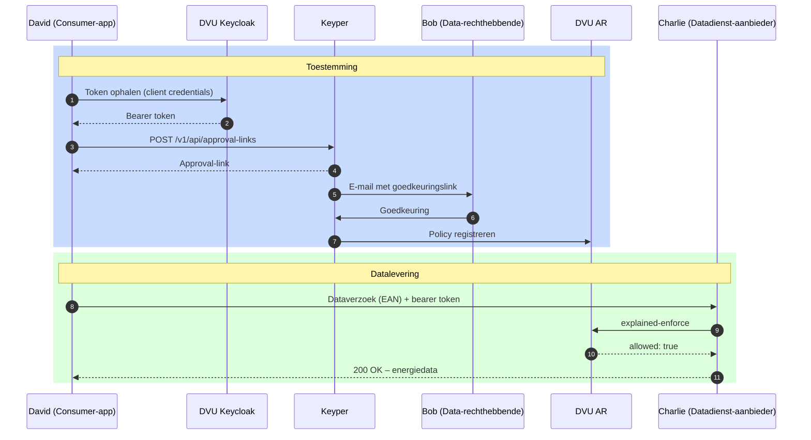

# Aansluiten als dataservice consumer

Deze gids is voor ontwikkelaars die een applicatie bouwen die namens een gebouweigenaar energiedata van een DVU-deelnemende datadienst-aanbieder wil ophalen. Je rol in DVU-terminologie is **dataservice consumer** (David).

## Voor wie is deze gids?

Voor applicaties die:

- Energiedata van utiliteitsgebouwen willen afnemen via DVU
- Een goedkeuringsverzoek bij de gebouweigenaar willen klaarzetten via Keyper
- Daarna periodiek data willen ophalen bij een datadienst-aanbieder zoals SDS

## Wat deze gids beschrijft

- Hoe je een goedkeuringsverzoek indient via Keyper
- Wat er gebeurt na goedkeuring
- Hoe je vervolgens energiedata opvraagt bij de datadienst-aanbieder

Wat hier **niet** in staat: hoe de datadienst-aanbieder zelf de policy controleert (zie [Aansluiten als datadienst-aanbieder](aansluiten-datadienst-aanbieder.md)) en hoe de data-rechthebbende goedkeurt (zie [Aansluiten als data-rechthebbende](aansluiten-data-rechthebbende.md)).

## Procesoverzicht



## Voorwaarden

| Wat | Hoe |
|-----|-----|
| Organisatie + App geregistreerd in DVU Participant Registry | Zie [Onboarding](onboarding.md) |
| Keycloak `client_id` + `client_secret` | Wordt door Poort8 uitgegeven |
| Geldige iSHARE-identifier | Door Poort8 toegewezen tijdens registratie |
| Akkoord van de gebouweigenaar (via Keyper) | Per gebouw / per use case |

## Stap 1: Token ophalen

```http
POST https://auth.poort8.nl/realms/dvu-preview/protocol/openid-connect/token
Content-Type: application/x-www-form-urlencoded

client_id=<YOUR-CLIENT-ID>
&client_secret=<YOUR-CLIENT-SECRET>
&grant_type=client_credentials
&scope=noodlebar-api
```

Het verkregen access token gebruik je voor zowel Keyper als voor verzoeken aan de datadienst-aanbieder.

## Stap 2: Goedkeuringsverzoek aanmaken via Keyper

Maak een approval-link aan voor de combinatie gebouw (VBO) + EAN(s) waarvoor je toegang wilt:

```http
POST https://keyper-preview.poort8.nl/v1/api/approval-links
Authorization: Bearer <ACCESS_TOKEN>
Content-Type: application/json
```

```json
{
  "requester": {
    "name": "<REQUESTER_NAME>",
    "email": "<REQUESTER_EMAIL>",
    "organization": "<REQUESTER_ORG>",
    "organizationId": "<REQUESTER_ORG_ID>"
  },
  "approver": {
    "name": "<DATA_OWNER_NAME>",
    "email": "<DATA_OWNER_EMAIL>",
    "organization": "<DATA_OWNER_ORG>",
    "organizationId": "<DATA_OWNER_ORG_ID>"
  },
  "dataspace": {
    "baseUrl": "https://dvu-preview.poort8.nl"
  },
  "reference": "<UNIQUE_REFERENCE>",
  "addPolicyTransactions": [
    {
      "type": "VBO-EAN",
      "action": "GET",
      "license": "iSHARE.0002",
      "useCase": "dvu",
      "issuerId": "<DATA_OWNER_ORG_ID>",
      "subjectId": "<REQUESTER_ORG_ID>",
      "serviceProvider": "[TBD – iSHARE-ID van de datadienst-aanbieder, bv. SDS]",
      "resourceId": "<VBO_ID>",
      "attribute": "*",
      "issuedAt": "<UNIX_TIMESTAMP>",
      "notBefore": "<UNIX_TIMESTAMP>",
      "expiration": "<UNIX_TIMESTAMP>"
    }
  ],
  "addResourceGroupTransactions": [
    {
      "resourceGroupId": "<VBO_ID>",
      "name": "<BUILDING_NAME>",
      "useCase": "dvu",
      "resources": [
        { "resourceId": "<EAN_1>" },
        { "resourceId": "<EAN_2>" }
      ]
    }
  ]
}
```

[TBD – de exacte velden voor `addPolicyTransactions` en `addResourceGroupTransactions` voor DVU 2.0 verifiëren met een werkend voorbeeld in de preview-omgeving.]

Zie de [Keyper API docs ➚](https://keyper-preview.poort8.nl/scalar/v1) voor het volledige schema.

## Stap 3: Wachten op goedkeuring

Keyper stuurt een e-mail naar de aangewezen approver. Na goedkeuring (of afwijzing) is de policy zichtbaar in het DVU AR.

[TBD – beschrijven of/hoe de status van een approval-link kan worden opgevraagd, en welke webhook of polling-strategie wordt aanbevolen.]

## Stap 4: Energiedata opvragen

Na goedkeuring stuur je dataverzoeken naar de datadienst-aanbieder (bv. SDS), met je DVU-bearer token:

```http
GET https://<datadienst-aanbieder>/<endpoint>?ean=<EAN>
Authorization: Bearer <ACCESS_TOKEN>
```

[TBD – per datadienst-aanbieder de exacte endpoints en responseformaten beschrijven of doorlinken.]

De datadienst-aanbieder valideert het token, controleert via `explained-enforce` of er een geldige policy bestaat, en levert daarna de data uit. Zie [Aansluiten als datadienst-aanbieder](aansluiten-datadienst-aanbieder.md) voor de aanbieder-kant van deze flow.

## Foutafhandeling

| Code | Betekenis | Actie |
|------|-----------|-------|
| `401 Unauthorized` | Token ontbreekt, is verlopen of ongeldig | Vraag een nieuw token aan |
| `403 Forbidden` | Geen geldige policy gevonden | Controleer of de approval-flow is afgerond en de gebouweigenaar heeft goedgekeurd |
| `400 Bad Request` | Verkeerde of ontbrekende parameters | Controleer EAN/VBO en `useCase` |

## Hulp nodig?

- Technische vragen of credential-verzoeken: **hello@poort8.nl**
- Toelating tot DVU: **BeheerDVU@rvo.nl**
