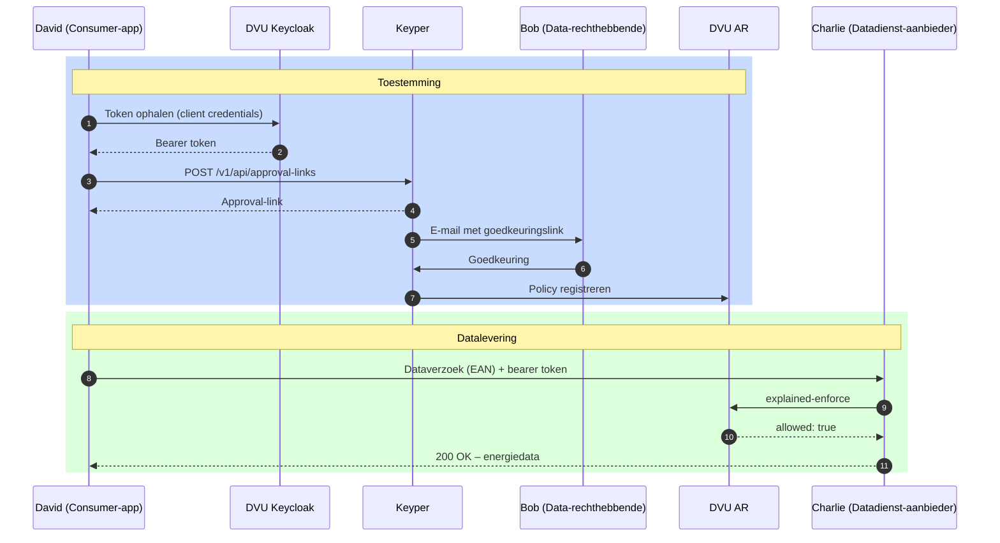

# Aansluiten als dataservice consumer

Deze gids is voor ontwikkelaars die een applicatie bouwen die namens een gebouweigenaar energiedata van een DVU-deelnemende datadienst-aanbieder wil ophalen. Je rol in DVU-terminologie is **dataservice consumer** (David).

## Voor wie is deze gids?

Voor applicaties die:

- Energiedata van utiliteitsgebouwen willen afnemen via DVU
- Een goedkeuringsverzoek bij de gebouweigenaar willen klaarzetten via Keyper
- Daarna periodiek data willen ophalen bij een datadienst-aanbieder zoals SDS

## Wat deze gids beschrijft

- Hoe je een goedkeuringsverzoek indient via Keyper
- Wat er gebeurt na goedkeuring
- Hoe je vervolgens energiedata opvraagt bij de datadienst-aanbieder

Wat hier **niet** in staat: hoe de datadienst-aanbieder zelf de policy controleert (zie [Aansluiten als datadienst-aanbieder](aansluiten-datadienst-aanbieder.md)) en hoe de data-rechthebbende goedkeurt (zie [Aansluiten als data-rechthebbende](aansluiten-data-rechthebbende.md)).

## Procesoverzicht



## Voorwaarden

| Wat | Hoe |
|-----|-----|
| Organisatie + App geregistreerd in DVU Participantenregister | Zie [Onboarding](onboarding.md) |
| API-toegang tot de datadienst-aanbieder API en Keyper | Via de catalogus in de portal, zie [Onboarding – Stap 4](onboarding.md) |
| Keycloak `client_id` + `client_secret` | Wordt bij het registreren van de app uitgegeven |
| Akkoord van de gebouweigenaar (via Keyper) | Per gebouw |

## Stap 1: Token ophalen voor Keyper

Voor het aanmaken van een goedkeuringsverzoek heb je een token nodig met scope `keyper-api`. Dit token is alleen geldig voor de Keyper API.

```http
POST https://auth.poort8.nl/realms/dvu-preview/protocol/openid-connect/token
Content-Type: application/x-www-form-urlencoded

grant_type=client_credentials
&client_id=<YOUR-CLIENT-ID>
&client_secret=<YOUR-CLIENT-SECRET>
&scope=keyper-api
```

Voor verzoeken aan de datadienst-aanbieder heb je later een apart token nodig met de scope van die aanbieder.

## Stap 2: Goedkeuringsverzoek aanmaken via Keyper

Maak een approval-link aan met flow `dvu.voeg-gebouw-toe@v1` (één gebouw) of `dvu.voeg-gebouwen-toe@v1` (meerdere gebouwen tegelijk). Je geeft geen policies of resource groups mee — die worden aangemaakt door de DVU Metadata app nadat de data-rechthebbende de link opent.

De payload bevat het adres (postcode + huisnummer als één string) en `dataServiceConsumer`: het organisatie-ID van jouw eigen organisatie (de consumer die na goedkeuring de data mag ophalen).

```http
POST https://keyper-preview.poort8.nl/v1/api/approval-links
Authorization: Bearer <ACCESS_TOKEN>
Content-Type: application/json
```

**Één gebouw (`dvu.voeg-gebouw-toe@v1`):**

```json
{
  "requester": {
    "name": "<REQUESTER_NAME>",
    "email": "<REQUESTER_EMAIL>",
    "organization": "<REQUESTER_ORG>",
    "organizationId": "did:ishare:EU.NL.NTRNL-<REQUESTER_KVK_NUMBER>"
  },
  "approver": {
    "email": "<DATA_OWNER_EMAIL>",
    "organization": "<DATA_OWNER_ORG>",
    "organizationId": "did:ishare:EU.NL.NTRNL-<DATA_OWNER_KVK_NUMBER>"
  },
  "dataspace": {
    "baseUrl": "https://dvu-preview.poort8.nl"
  },
  "reference": "<UNIQUE_REFERENCE>",
  "orchestration": {
    "flow": "dvu.voeg-gebouw-toe@v1",
    "payload": {
      "address": "1341 BA 1",
      "dataServiceConsumer": "did:ishare:EU.NL.NTRNL-<YOUR_KVK_NUMBER>"
    }
  }
}
```

**Meerdere gebouwen (`dvu.voeg-gebouwen-toe@v1`):**

```json
{
  "requester": {
    "name": "<REQUESTER_NAME>",
    "email": "<REQUESTER_EMAIL>",
    "organization": "<REQUESTER_ORG>",
    "organizationId": "did:ishare:EU.NL.NTRNL-<REQUESTER_KVK_NUMBER>"
  },
  "approver": {
    "email": "<DATA_OWNER_EMAIL>",
    "organization": "<DATA_OWNER_ORG>",
    "organizationId": "did:ishare:EU.NL.NTRNL-<DATA_OWNER_KVK_NUMBER>"
  },
  "dataspace": {
    "baseUrl": "https://dvu-preview.poort8.nl"
  },
  "reference": "<UNIQUE_REFERENCE>",
  "orchestration": {
    "flow": "dvu.voeg-gebouwen-toe@v1",
    "payload": {
      "addresses": [
        "1341 BA 1",
        "5261 AD 1"
      ],
      "dataServiceConsumer": "did:ishare:EU.NL.NTRNL-<YOUR_KVK_NUMBER>"
    }
  }
}
```

Zie de [Keyper API docs ➚](https://keyper-preview.poort8.nl/scalar/v1) voor het volledige schema.

## Stap 3: Wachten op goedkeuring

Keyper stuurt een e-mail naar de aangewezen approver. Na goedkeuring (of afwijzing) is de policy zichtbaar in het DVU AR.

> **Let op:** De `status` van een approval link geeft de toestand van de **approval link zelf** aan, niet de toestand van de policy die erdoor aangemaakt wordt. Een status `Approved` betekent dat de goedkeurder het verzoek heeft geaccepteerd en dat Keyper heeft geprobeerd de policy te registreren in het DVU AR — maar dit bevestigt niet automatisch dat de policy actief en geldig is. Controleer de policystatus separaat in het DVU Authorization Registry als je integratie afhankelijk is van een actieve policy.

## Stap 4: Energiedata opvragen

Na goedkeuring vraag je een nieuw token op, nu met de scope van de datadienst-aanbieder (de `client_id` van diens API zoals geregistreerd in de catalogus):

```http
POST https://auth.poort8.nl/realms/dvu-preview/protocol/openid-connect/token
Content-Type: application/x-www-form-urlencoded

grant_type=client_credentials
&client_id=<YOUR-CLIENT-ID>
&client_secret=<YOUR-CLIENT-SECRET>
&scope=<DATADIENST_AANBIEDER_API_CLIENT_ID>
```

Stuur daarna het dataverzoek naar de datadienst-aanbieder. De exacte URL, parameters en het responseformaat worden bepaald door de datadienst-aanbieder zelf — raadpleeg diens API-documentatie. Het enige dat DVU vereist is dat je een geldig bearer token meestuurt:

```http
GET https://<datadienst-aanbieder>/<endpoint-per-aanbieder>
Authorization: Bearer <ACCESS_TOKEN>
```

De datadienst-aanbieder valideert het token, controleert via `explained-enforce` of er een geldige policy bestaat, en levert daarna de data uit. Zie [Aansluiten als datadienst-aanbieder](aansluiten-datadienst-aanbieder.md) voor de aanbieder-kant van deze flow.

## Foutafhandeling

| Code | Betekenis | Actie |
|------|-----------|-------|
| `401 Unauthorized` | Token ontbreekt, is verlopen of ongeldig | Vraag een nieuw token aan |
| `403 Forbidden` | Geen geldige policy gevonden | Controleer of de approval-flow is afgerond en de gebouweigenaar heeft goedgekeurd |
| `400 Bad Request` | Verkeerde of ontbrekende parameters | Controleer request parameters |

## Hulp nodig?

- Technische vragen of credential-verzoeken: **hello@poort8.nl**
