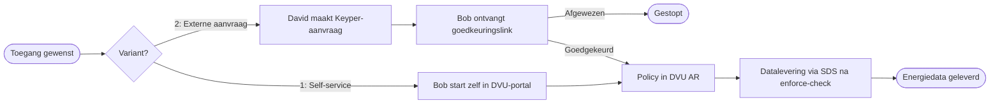

# Toegangsmodel

Het DVU-toegangsmodel beschrijft hoe een data-rechthebbende toestemming geeft om energiedata van zijn gebouw(en) te delen, en hoe die toestemming wordt vastgelegd als policy in het DVU Authorization Registry.

## Twee varianten

DVU ondersteunt twee varianten om een toegangsaanvraag te starten. Beide leiden tot dezelfde policystructuur in het AR.

| Variant | Initiator | Wanneer |
|---------|-----------|---------|
| **Variant 1 – Self-service** | De data-rechthebbende zelf | De gebouweigenaar wil zelf inzicht in zijn energiedata of dat van een dochteronderneming |
| **Variant 2 – Externe aanvraag** | Een dataservice consumer (derde applicatie) | Een externe partij wil namens de gebouweigenaar energiedata ophalen, bv. voor verduurzamingsadvies |

In beide varianten verleent de data-rechthebbende expliciete goedkeuring via Keyper voordat de policy actief wordt.

## Actoren

| Actor | Rol | Voorbeeld |
|-------|-----|-----------|
| Bob | Data-rechthebbende / gebouweigenaar | Eigenaar van een kantoorgebouw |
| David | Dataservice consumer | Verduurzamingsadviestool die energiedata wil ophalen |
| Charlie | Datadienst-aanbieder | SDS – levert energiedata na enforcement-check |
| Keyper | Goedkeuringsflow | Stuurt e-mail naar Bob, registreert policy na akkoord |
| DVU AR | Authorization Registry | Beheert policies, evalueert via `explained-enforce` |
| RVO | Dataspace-beheerder | Toelating en governance |

## Policy-structuur

Een DVU-policy autoriseert een specifieke combinatie van issuer (data-rechthebbende), subject (consumer) en resource (gebouw/EAN), uitvoerbaar door een aangewezen datadienst-aanbieder.

| Veld | Beschrijving | Voorbeeld |
|------|--------------|-----------|
| `type` | Resource type — `VBO-EAN` (combi VBO + EANs) of `EAN` (los, in afstemming) | `VBO-EAN` |
| `action` | Toegestane actie | `GET` |
| `license` | iSHARE-licentie | `iSHARE.0002` |
| `useCase` | Use case-identifier | `dvu` |
| `issuerId` | Data-rechthebbende (Bob) | `did:ishare:EU.NL.NTRNL-12345678` |
| `subjectId` | Dataservice consumer (David) | `did:ishare:EU.NL.NTRNL-87654321` |
| `serviceProvider` | Datadienst-aanbieder (Charlie / SDS) | `did:ishare:EU.NL.NTRNL-55819206` |
| `resourceId` | VBO-ID van het gebouw | `0599100000506575` |
| `attribute` | Data-attributen | `*` |
| `expiration` | Geldigheid mandaat (Unix timestamp) | `2147483647` |

Een policy hoort bij een **Resource Group** waarvan `resourceGroupId` gelijk is aan de VBO-ID; de individuele EAN's hangen daaronder als resources. Hierdoor kan enforcement plaatsvinden op EAN-niveau terwijl de toestemming op gebouwniveau is gegeven. Zie het voorbeeld in [Aansluiten als datadienst-aanbieder](aansluiten-datadienst-aanbieder.md#autorisatiemodel).

## Procesoverzicht

Voor de technische uitwerking per rol:

- [Aansluiten als data-rechthebbende](aansluiten-data-rechthebbende.md)
- [Aansluiten als dataservice consumer](aansluiten-dataservice-consumer.md)
- [Aansluiten als datadienst-aanbieder](aansluiten-datadienst-aanbieder.md)

## Marktsegmentatie

Voor energiedata is het onderscheid tussen kleinverbruik (KV) en grootverbruik (GV) relevant voor welke dataproducten geleverd kunnen worden. De segmentatie wordt bepaald op basis van de aansluitgegevens van het gebouw. Zie [Dataproducten](dataproducten.md) voor welke producten beschikbaar zijn per segment. [TBD – per dataproduct in detail beschrijven welke segmentatie geldt en hoe die wordt vastgesteld.]
