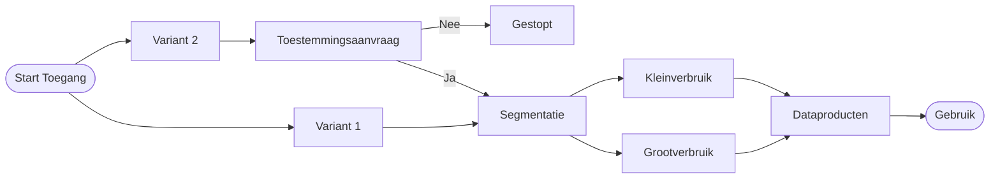

# DVU – Overzicht & Kernconcepten

DVU (Datastelsel Verduurzaming Utiliteit) biedt gecontroleerde, transparante en herleidbare toegang tot energie-data van gebouwen. Deze pagina geeft je een snel, functioneel begrip voordat je de implementatie handleidingen volgt.

## Wat lost DVU op?
Organisaties hebben vaak versnipperde, traag verkrijgbare of juridisch onduidelijke toegang tot energiedata voor verduurzamingsdoeleinden. DVU standaardiseert:

- Toestemmingen (via 2 varianten) – zie [Toestemmingsmodel](access-model.md) voor details
- Uniforme data voor verschillende marktsegmenten (kleinverbruik vs grootverbruik)
- Data-aflevering via Smart Data Solutions (SDS)

## Hoe start een toegangstraject?
Er zijn twee startpunten (varianten) die leiden naar één geconvergeerd proces. Dit voorkomt dubbele logica en maakt governance uniform. Zie het [toestemmingsmodel](access-model.md) voor een diepgaande uitleg van beide varianten.

| Route | Initiator | Wanneer gebruiken |
|-------|-----------|-------------------|
| Variant 1 (Self-service) | Rechthebbende (contractant / eigenaar) | Interne verduurzaming / eigen dashboards |
| Variant 2 (Externe aanvraag) | Dataservice-consumer (derde applicatie) | Externe tooling / adviesdienst |

### Waarom twee varianten?
Variant 1 (self-service): directe controle door rechthebbende  
Variant 2 (externe aanvraag): maakt integratie door derde applicaties mogelijk zonder voorafgaande directe relatie  
Beide varianten komen vroeg samen zodat downstream logica niet dubbel hoeft te bestaan.

## Procesoverzicht

Het volledige proces, inclusief segmentatie en automatisering, wordt functioneel uitgewerkt in het [toestemmingsmodel](access-model.md). Voor business context en achtergrondinformatie over beide varianten, raadpleeg [Access Energy Data](access-energydata.md) – deze pagina is vooral relevant voor dataserviceconsumers, maar bevat ook algemene procesinformatie.

Let op: de technische [implementatiegidsen](single-building.md), [bulk-buildings.md], en [direct-ean.md] zijn uitsluitend van toepassing op **variant 2** (externe aanvraag via dataserviceconsumer). Voor **variant 1** (self-service door rechthebbende) is er géén aparte technische implementatiegids; dit proces verloopt via de DVU-applicatie zelf.

Deze pagina biedt een beknopt overzicht; gedetailleerde sequence diagrammen vind je per relevante implementatiegids.

## Beschikbare Dataproducten (Functioneel)
**Operationeel:**

- Meterdata volgens P4 format (alleen jaarverbruik of alle data)
- RVO benchmark

**In voorbereiding (onder voorbehoud):**

- 24 maanden dagstanden
- Standaard jaarverbruik (uitbreiding op P4 context)

Uitbreiding wordt gefaseerd geactiveerd na governance + technische integratie.

## Wat heb je nodig als integrator?
- Keyper approval integratie (transactielink + redirect flow)
- Bekend zijn met entitlements / policies
- Endpoint toegang tot SDS levering (afhankelijk van product)

## Volgende stappen
Ga naar de implementatie handleidingen wanneer je de basis begrijpt:

- [Single Building Access](single-building.md) - Request energy data access for individual buildings
- [Bulk Building Access](bulk-buildings.md) - Request energy data access for multiple buildings simultaneously
- [Direct EAN Access](direct-ean.md) - Direct entitlement via EAN referenties

