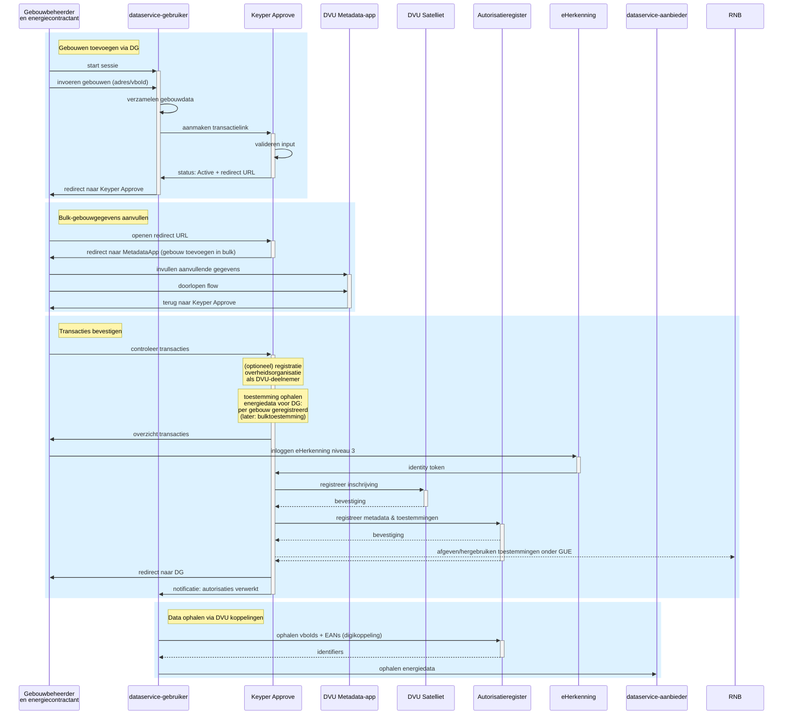

# DVU Implementation Context

DVU (Datastelsel Verduurzaming Utiliteit) provides secure access to energy data for buildings through the Keyper approval workflow.

## Overview

This section documents the DVU implementation patterns using Keyper Approve for energy data access requests. DVU enables secure, auditable access to building energy data through standardized approval workflows.

## Implementation Guides

- [Single Building Access](single-building.md) - Request energy data access for individual buildings
- [Bulk Building Access](bulk-buildings.md) - Request energy data access for multiple buildings simultaneously
- [Direct EAN Access](direct-ean.md) - Request energy data access for one or more EAN(s) instead of buildings

## Process Flow

The DVU approval process follows a structured workflow for energy data access:

1. **Data Request**: Users submit requests through DVU applications
2. **Keyper Approval**: Requests are processed through Keyper Approve workflow  
3. **Authorization**: Energy contractors approve data sharing permissions
4. **Data Access**: Authorized applications can access energy data

## Architecture

DVU integrates with several key components:

- **Keyper Approve**: Handles approval workflows and consent management
- **DVU Metadata App**: Manages building metadata and registration
- **DVU Satellite**: Core DVU infrastructure for data processing
- **Authorization Register**: Stores access permissions and policies
- **eHerkenning**: Provides secure identity verification

## Sequence Diagram: Bulk Building Access

The following sequence diagram shows the DVU approval process for multiple buildings:

## Next Steps

- Review the specific implementation guides for single and bulk building access
- Understand the authorization flow and integration points
- Implement the Keyper Approve workflow in your DVU application

---

*DVU is part of the broader energy data ecosystem, enabling secure and controlled access to building energy information.*
