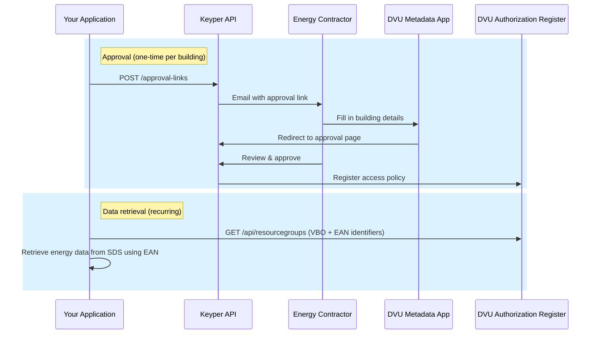

# DVU – Datastelsel Verduurzaming Utiliteit

DVU enables controlled access to energy data for building sustainability purposes. It combines NoodleBar modules (Authorization Register, Keyper Approve) with iSHARE-based authentication to connect data service consumers with energy data providers.

## How it works

Your application requests access to building energy data through Keyper. The energy contractor approves or rejects via an approval link. Once approved, policies are registered in the DVU Authorization Register and you can retrieve data.


```mermaid
sequenceDiagram
    participant App as Your Application
    participant Keyper as Keyper API
    participant EC as Energy Contractor
    participant DVU as DVU Metadata App
    participant AR as DVU Authorization Register

    rect rgb(221, 242, 255)
    note right of App: Approval (one-time per building)
    App->>Keyper: POST /approval-links
    Keyper->>EC: Email with approval link
    EC->>DVU: Fill in building details
    DVU->>Keyper: Redirect to approval page
    EC->>Keyper: Review & approve
    Keyper->>AR: Register access policy
    end

    rect rgb(221, 242, 255)
    note right of App: Data retrieval (recurring)
    App->>AR: GET /api/resourcegroups (VBO + EAN identifiers)
    App->>App: Retrieve energy data from SDS using EAN
    end
```

## Getting started

### Get your credentials

Contact Poort8 at **hello@poort8.nl** with your organization name, contact person, and use case description. You will receive:
- **Client ID & secret** for Keyper API authentication
- **KVK number** — your organization identifier in `NL.KVK.<8-digit>` format

### Test environment

| Service | URL |
|---------|-----|
| Token endpoint | `https://poort8.eu.auth0.com/oauth/token` |
| Keyper API | `https://keyper-preview.poort8.nl/v1/api/` |
| DVU dataspace | `https://dvu-test.azurewebsites.net` |

> The test environment does not perform complete verifications such as organization data validation. Use it only for functional testing.

### Authentication

Every Keyper API call requires an access token:

```http
POST https://poort8.eu.auth0.com/oauth/token
Content-Type: application/json
```
```json
{
  "client_id": "<CLIENT_ID>",
  "client_secret": "<CLIENT_SECRET>",
  "audience": "Poort8-Dataspace-Keyper-Preview",
  "grant_type": "client_credentials"
}
```

**200 OK**
```json
{
  "access_token": "eyJhbGciOiJSUzI1NiIsInR5cCI6IkpXVCJ9...",
  "token_type": "Bearer",
  "expires_in": 86400
}
```

Use the token in subsequent requests: `Authorization: Bearer <access_token>`. Implement automatic refresh when the token expires.

## Your first approval link

Create a test approval link for a single building using `POST /approval-links`:

```http
POST https://keyper-preview.poort8.nl/v1/api/approval-links
Accept: application/json
Authorization: Bearer <ACCESS_TOKEN>
Content-Type: application/json
```
```json
{
  "approver": {
    "email": "<YOUR_EMAIL>",
    "organization": "Test Energy Contractor",
    "organizationId": "NL.KVK.76660680"
  },
  "dataspace": {
    "baseUrl": "https://dvu-test.azurewebsites.net"
  },
  "requester": {
    "name": "Test Person",
    "email": "<YOUR_EMAIL>",
    "organization": "Test Company",
    "organizationId": "NL.KVK.12345678"
  },
  "description": "My first DVU test request",
  "reference": "TEST-001",
  "orchestration": {
    "flow": "dvu.voeg-gebouw-toe@v1",
    "payload": {
      "address": "1341 BA 1",
      "dataServiceConsumer": "NL.KVK.41265782"
    }
  }
}
```

**201 Created**
```json
{
  "id": "474e19af-8165-4b85-ad03-be81f9f8dcc2",
  "reference": "TEST-001",
  "url": "https://keyper-preview.poort8.nl/approve?id=474e19af-8165-4b85-ad03-be81f9f8dcc2&app=dvu",
  "expiresAtUtc": 1759834340,
  "status": "Active"
}
```

An email with the approval link is sent to the approver. The link is valid for 1 hour. Open it yourself to walk through the full approval flow in the test environment.

## Integration guides

| Guide | When to use |
|-------|-------------|
| **[Single Building Access](single-building.md)** | Request access for one building at a time |
| **[Bulk Building Access](bulk-buildings.md)** | Request access for multiple buildings simultaneously |
| **[Direct EAN Access](direct-ean.md)** | You already have EAN codes and want to skip address lookup |
| **[Retrieving VBO and EAN Data](vbo-ean-data-retrieval.md)** | Retrieve building identifiers after approval |
| **[Energy Data Retrieval from SDS](sds-data-retrieval.md)** | Retrieve actual energy data using EAN codes |
| **[Data Service Provider Integration](data-service-provider.md)** | Connect as a data service provider to DVU |

## More information

- [NoodleBar Documentation](../noodlebar/) — shared platform concepts and architecture
- [Keyper API Documentation ➚](https://keyper-preview.poort8.nl/scalar/?api=v1) — interactive API reference
- [DVU at RVO ➚](https://www.rvo.nl/onderwerpen/verduurzaming-utiliteitsbouw/dvu) — business context and governance
- [iSHARE ➚](https://ishare.eu/) — authentication and authorization standard
- **Support**: hello@poort8.nl