# DVU Toegangsmodel
Deze pagina beschrijft hoe toegang logisch wordt toegekend zonder in onderliggende implementatiedetails te duiken.

## Roltypen (functioneel)
| Rol | Doel | Interactie |
|-----|------|------------|
| Rechthebbende | Beheert rechten | Start zelf of keurt extern verzoek goed |
| Dataservice-consumer | Vraagt toegang aan | Initieert Variant 2 (externe aanvraag) |
| DVU Platform | Orkestreert | Segmentatie + entitlement |
| SDS | Levert data | Afhankelijk van productrechten |

## Volledige Entitlement & Flow Context
De mogelijkheid om toegang tot verschillende energiedata te krijgen hangt af van een aantal aspecten: 
- Gaat het om een energiemeter met kleinverbruik of grootverbruik? 
- Start de data-eigenaar zelf het proces, of wordt het door een derde aangevraagd? 
- Is er een tekenbevoegd persoon met eHerkenning betrokken?
- Kan de metadata van de meter met toestemming bij EDSN worden verkregen?

Onderstaande diagram toont de verschillende varianten en de flows in deze scenarios voor:
1. De **huidige DVU flow**
2. (work in progress) flow gestart vanuit **toestemmingsaanvraag**
3. (work in progress) flow voor **automatisering van CAR-gegevens** voor eenvoudigere registratie van gebouwen en meters
4. (work in progress) toevoeging voor uitbreiding naar **alle meetbedrijven**

```mermaid
flowchart TD
    Start[Proces Start]
    
    %% Route keuze
    Start --> Route1[Route 1: Data-rechthebbende<br/>start proces zelf]
    Start --> Route2[Route 2: Data service consumer<br/>vraagt toegang]

    %% Route 2 goedkeuring
    Route2 --> KeyperApproval[Keyper Approve<br/>Goedkeuring klaargezet voor<br/>data-rechthebbende]
    KeyperApproval --> ApprovalDecision{Data-rechthebbende<br/>keurt goed?}
    ApprovalDecision -->|Nee| ProcessEnd[Proces gestopt]
    ApprovalDecision -->|Ja| CARAttempt
    
    %% Route 1 direct naar CAR
    Route1 --> CARAttempt[CAR Automatisering Poging<br/>• Marktsegment bepalen 🚧<br/>• Aansluitgegevens ophalen 🚧<br/>• Autorisatie nieuwe dataproducten ⏳]
    %% NIEUWE TAK (as-is): Route1 direct naar volledige handmatige invoer
    Route1 --> ManualFallback

    %% CAR resultaat
    CARAttempt --> EDSNAuth[eHerkenning Level 3<br/>in EDSN omgeving]
    EDSNAuth --> CARSuccess{CAR Succes?<br/>Juiste EANs gevonden?<br/>Juiste KVK koppeling?<br/>Autorisatie gelukt?}
    
    %% CAR succes pad
    CARSuccess -->|Ja| MarketDetermined[Marktsegment Bepaald via CAR<br/>+ Autorisatie nieuwe producten]
    
    %% CAR faal pad
    CARSuccess -->|Nee<br/>Fout/Incomplete| ManualChoice{Gebruiker keuze<br/>Manual Fallback}
    CARSuccess -->|Automatische fout| ManualFallback[Volledige handmatige invoer ✅<br/><br/>NB. *Nieuwe KG dataproducten EDSN niet mogelijk*]
    
    ManualChoice -->|Ja| ManualFallback
    ManualChoice -->|Retry| CARAttempt
    
    %% Marktsegment splits
    MarketDetermined --> KGFlow{Kleinverbruik<br/>of<br/>Grootverbruik?}
    ManualFallback --> KGFlowManual{Kleinverbruik<br/>of<br/>Grootverbruik?<br/>Manual bepaling}
    
    %% Kleinverbruik flows
    KGFlow -->|Kleinverbruik| KGWithCAR[KG + CAR Automatisering<br/>Toegang tot 3 dataproducten via SDS:<br/>• Meterdata volgens P4-formaat<br/>• 24 maanden dagstanden<br/>• Standaard jaarverbruik]
    KGFlowManual -->|Kleinverbruik| KGManual[KG Manual<br/>Alleen meterdata volgens P4-formaat]
    
    %% Grootverbruik flows  
    KGFlow -->|Grootverbruik| GGContractInfo[Contractant info<br/>manueel invullen<br/>naam + email]
    GGContractInfo --> GGWithCAR[GG + CAR Automatisering<br/>- Meetbedrijf via CAR<br/>- Contractant info manueel]
    KGFlowManual -->|Grootverbruik| GGManual[GG Manual<br/>Meetbedrijf handmatig invoeren]
    
    %% Kleinverbruik naar SDS
    KGManual --> KGManualToSDS[Naar SDS voor toegang tot<br/>alleen meterdata volgens P4-formaat]
    
    KGManualToSDS --> KGManualResult[Toegang tot alleen:<br/>• Meterdata volgens P4-formaat via SDS<br/><br/>Geen nieuwe dataproducten]
    
    
    
    %% Grootverbruik Manual
    GGManual --> GGManualInfo[Meetbedrijf + Contractant info<br/>volledig manueel ingevuld]
    
    %% Grootverbruik → PDF → SDS
    GGWithCAR --> PDFGen[PDF genereren voor SDS<br/> ⏳ In geval route 2: KVK-change iSHARE noodzakelijk]
    GGManualInfo --> PDFGen
    GGManualInfo --> SelectMeetbedrijven[Toegang tot SDS dataproducten via enkele meetbedrijven]
    PDFGen --> SDS[PDF naar Smart Data Solutions<br/>🐛 Email bug]
    SDS --> GGResult[Toegang tot SDS dataproducten via alle meetbedrijven]

    %% Groeperingen (🚧 in development)
    subgraph Variant2["Toestemmingsaanvragen 🚧"]
        Route2
        KeyperApproval
        ApprovalDecision
        ProcessEnd
    end

    subgraph AsIs["Huidig DVU proces ✅"]
        Start
        Route1
        ManualFallback
        KGFlowManual
        KGManual
        KGManualToSDS
        KGManualResult
        GGManual
        GGManualInfo
        SelectMeetbedrijven
    end
    subgraph DekkingMeetbedrijven["Dekking Meetbedrijven 🚧"]
        PDFGen
        SDS
        GGResult
        
        
    end

    subgraph AutoCAR["Automatische CAR gegevens 🚧"]
        CARAttempt
        EDSNAuth
        CARSuccess
        ManualChoice
        MarketDetermined
        KGFlow
        KGWithCAR
        GGContractInfo
        GGWithCAR
    end
    
    %% Status legenda
    subgraph Status[" Status Legenda"]
        StatusItems["✅ Operationeel<br/>🚧 In ontwikkeling<br/>⏳ Pending met openstaande vragen<br/>🐛 Bug"]
    end
  
    
```

