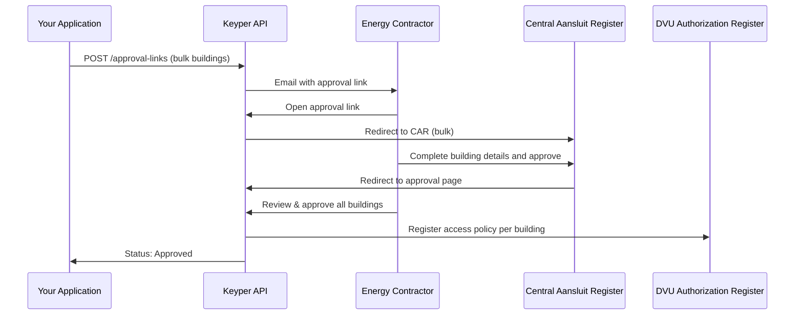

# Bulk Building Access

This guide explains how to request access to energy data for multiple buildings simultaneously through DVU using the Keyper Approve workflow.

## Overview

The bulk building flow works the same as Single Building Access (single-building.md), but accepts an array of addresses instead of a single address and a different flow dvu.voeg-gebouwen-toe@v1. The energy contractor approves all buildings in one approval link. Upon approval, Keyper registers a separate policy per building in DVU.

## Sequence diagram



## Minimum payload

| JSON path                                   | Filled by | Description                                                                         |
| :------------------------------------------ | :-------- | :---------------------------------------------------------------------------------- |
| `requester.*`                               | App       | Your name, email, organization, `organizationId` (`NL.KVK.<your KVK>`)              |
| `approver.*`                                | App       | Energy contractor email, organization, `organizationId` (`NL.KVK.<contractor KVK>`) |
| `dataspace.baseUrl`                         | Fixed     | `https://dvu-test.azurewebsites.net`                                                |
| `description`                               | App       | Shown to the approver (optional)                                                    |
| `reference`                                 | App       | Your internal tracking ID (optional)                                                |
| `orchestration.flow`                        | Fixed     | `dvu.voeg-gebouwen-toe@v1`                                                          |
| `orchestration.payload.addresses`           | App       | Array of building addresses — see formatting below                                  |
| `orchestration.payload.dataServiceConsumer` | App       | Your organization ID (`NL.KVK.<your KVK>`)                                          |

## JSON example

```text
POST https://keyper-preview.poort8.nl/v1/api/approval-links
Accept: application/json
Authorization: Bearer <ACCESS_TOKEN>
Content-Type: application/json
```

```json
{
  "approver": {
    "email": "somebody@domain.extension",
    "organization": "Poort8",
    "organizationId": "NL.KVK.76660680"
  },
  "dataspace": {
    "baseUrl": "https://dvu-test.azurewebsites.net"
  },
  "requester": {
    "name": "Alice Data End User",
    "email": "alice@dataenduser.nl",
    "organization": "wonderland",
    "organizationId": "NL.KVK.12345678"
  },
  "description": "DVU bulk building access request",
  "reference": "BULK-001",
  "orchestration": {
    "flow": "dvu.voeg-gebouwen-toe@v1",
    "payload": {
      "addresses": ["1341 BA 1", "3013 AK 45", "1012 JS 1"],
      "dataServiceConsumer": "NL.KVK.41265782"
    }
  }
}
```

### Building address formatting

Format each address as `"<postal code> <house number>"` (e.g., `"3013 AK 45"`). At least one valid address is required.

## Example response

**201 Created**

```json
{
  "id": "474e19af-8165-4b85-ad03-be81f9f8dcc2",
  "reference": "BULK-001",
  "url": "https://keyper-preview.poort8.nl/approve?id=474e19af-8165-4b85-ad03-be81f9f8dcc2&app=dvu",
  "expiresAtUtc": 1759834340,
  "status": "Active"
}
```

| Field          | Description                                                   |
| :------------- | :------------------------------------------------------------ |
| `id`           | Unique identifier for the approval link (generated by Keyper) |
| `reference`    | Your tracking reference                                       |
| `url`          | Approval link sent to the energy contractor via email         |
| `expiresAtUtc` | Unix timestamp when the link expires (1 hour after creation)  |
| `status`       | `Active`, `Approved`, `Rejected`, or `Expired`                |

## Common errors

| Status | Scenario                        | Solution                                                                                                                      |
| :----- | :------------------------------ | :---------------------------------------------------------------------------------------------------------------------------- |
| `400`  | Missing or invalid fields       | Check the `errors` object in the response for details                                                                         |
| `401`  | Missing or expired access token | Re-authenticate — see Authentication (README.md#authentication)                                                               |
| `500`  | Server error                    | Retry after a short delay. If persistent, contact [hello@poort8.nl](mailto:hello@poort8.nl) with your reference and timestamp |

> Keyper does not validate organization identifiers for format. Ensure KVK numbers are correct on your side, as invalid identifiers cause issues with access policies and data retrieval.

## Follow-up

After approval, retrieve each building's VBO identifier and associated EAN codes via the DVU API — see Retrieving VBO and EAN Data (vbo-ean-data-retrieval.md).

For requesting access to a single building, see Single Building Access (single-building.md).

