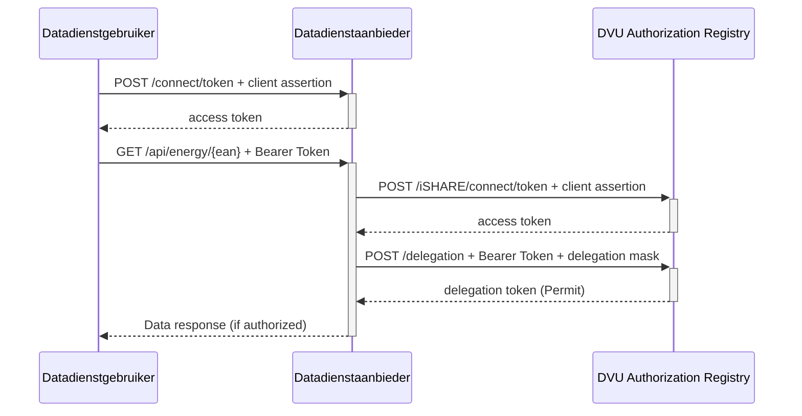

# Aansluiten als Datadienstaanbieder

## 1. Introductie

Deze gids beschrijft hoe een datadienstaanbieder (DSP) kan aansluiten op het DVU-stelsel. Een DSP levert data aan datadienstgebruikers, op basis van toegangsrechten die centraal worden beheerd via het DVU Authorization Registry (AR).

Deze pagina richt zich op implementatie: hoe een DSP zelf delegation evidence ophaalt en valideert.

## 2. Procesoverzicht

### Stap-voor-stap flow:

1. Datadienstgebruiker vraagt een access token op bij het token endpoint van de DSP met een client assertion
2. Datadienstgebruiker doet een verzoek richting de DSP, met een bearer token en resource identifier (bijv. EAN)
3. De DSP valideert het access token
4. De DSP vraagt delegation evidence op bij het DVU Authorization Registry
5. De DSP controleert of het verzoek geautoriseerd is
6. Bij akkoord levert de DSP de data uit

## 3. Autorisatiemodel binnen DVU

DVU gebruikt delegation evidence tokens volgens de iSHARE-specificatie. Deze tokens beschrijven welke partij (accessSubject) via welke policyIssuer toegang heeft tot welke resource bij welke datadienstaanbieder.

### 3.1 Relevante velden

| Veld | Verplicht | Uitleg | Toelichting (DVU) |
| -- | -- | -- | -- |
| `policyIssuer` | ✅ | De partij die de rechten heeft verleend | De EORI van de rechtmatige partij van wie de DSP weet dat die rechthebbende is van de data |
| `target.accessSubject` | ✅ | EORI van de datadienstgebruiker | De EORI uit het client assertion van de aanroepende partij |
| `resource.type` | ✅ | Type dataresource | `"P4"` (verbruik op EAN) of `"BenchmarkSnapshot"` |
| `resource.identifiers[]` | ✅ | Identificator van de resource | VBO-ID of EAN (bij type `P4`) of Benchmarksnapshot-ID. EANs worden in DVU gegroepeerd op VBO-ID waar integraal toestemming over kan worden verleend |
| `resource.attributes[]` | ✅ | Gegevenskenmerk | `"Jaarverbruik"` of `"*"` bij P4, `"*"` bij BenchmarkSnapshot |
| `actions[]` | ✅ | Toegestane actie | `"Read"` |
| `environment.serviceProviders[]` | ✅ | EORI van de DSP | Moet overeenkomen met de EORI van de provider zelf |
| `previous_steps[]` | ✅ | Bewijs namens wie delegation wordt opgevraagd | Verplicht veld, maar leeg in geval van DSP |

### 3.2 Toegestane combinaties

| `type` | `identifiers[]` | `attributes[]` | Voorbeeld |
| -- | -- | -- | -- |
| `P4` | VBO-ID of EAN (bijv. 8716…) | `"Jaarverbruik"` of `"*"` | EAN-verbruiksdata |
| `BenchmarkSnapshot` | Benchmarksnapshot-ID (bijv. 361adeb9-e817-4a16-91c2-427ad918baa8) | `"*"` | Gebouwbenchmarksnapshots |

### 3.3 Validatie-eisen voor DSP

* Standaard JWT validatie op delegation evidence token
* `effect = Permit` moet aanwezig zijn
* `policyIssuer` = EORI van vertrouwde issuer
* `accessSubject` = EORI uit client assertion van aanroepende partij
* `resource.type`, `identifiers[]` en `actions[]` moeten kloppen met opgevraagde data
* `serviceProviders[]` bevat eigen EORI van de DSP
* `notBefore` is nu of eerder
* `notOnOrAfter` is later dan nu

### 3.4 Voorbeeld delegation request

```json
{
  "delegationRequest": {
    "policyIssuer": "EU.EORI.NL860730499",
    "target": {
      "accessSubject": "EU.EORI.NLDVUPIRTEST1"
    },
    "policySets": [
      {
        "policies": [
          {
            "target": {
              "resource": {
                "type": "P4",
                "identifiers": ["870000000000000011"],
                "attributes": ["Jaarverbruik"]
              },
              "actions": ["Read"],
              "environment": {
                "serviceProviders": ["EU.EORI.NL851872426"]
              }
            },
            "rules": [
              {
                "effect": "Permit"
              }
            ]
          }
        ]
      }
    ]
  },
  "previous_steps": [""]
}
```

## 4. Testomgeving DVU

### Endpoints

* **Authorization Registry (Test):** `https://dvu-test-ar.azurewebsites.net`
* **iSHARE Satellite (Test):** `https://dvu3pirtest-mw.isharesatellite.eu`

### Testgegevens

| Parameter | Waarde |
| -- | -- |
| Policy Issuer | `EU.EORI.NL860730499` |
| Access Subject | `EU.EORI.NLDVUPIRTEST1` |
| Provider EORI | `EU.EORI.NL851872426` |
| Test EAN | `870000000000000011` |

➡️ In acceptatie en productie moeten de Authorization Registry URL en de iSHARE Satellite URL worden aangepast.

## 5. Implementatiestappen

### Stap 1: Service endpoint inrichten

Bijv. GET `/api/energy/{ean}`
Authorization: `Bearer {access_token_DSP}`

Leid uit het binnenkomende data verzoek de juiste gegevens af om de vervolgstappen uit te voeren.

### Stap 2: Token verkrijgen bij Authorization Registry

Verwijs naar de iSHARE-specificatie voor token requests:
POST `/iSHARE/connect/token`
Content-Type: `application/x-www-form-urlencoded`

Alle standaard iSHARE claims zijn van toepassing.

### Stap 3: Delegation evidence ophalen bij Authorization Registry

POST `/iSHARE/delegation`
Authorization: `Bearer {access_token_AR}`

Zie voorbeeld onder hoofdstuk 3.4.

### Stap 4: Validatie

Zie de validatie-eisen voor DSP in hoofdstuk 3.3.

### Stap 5: Data uitleveren

Lever de data uit indien validatie succesvol is

### Aanbevolen foutafhandeling

| Code | Betekenis | Actie |
| -- | -- | -- |
| `401 Unauthorized` | Ongeldig of verlopen access token | Vraag client om opnieuw in te loggen |
| `403 Forbidden` | Delegation evidence ontbreekt of is ongeldig | Verzoek weigeren |
| `400 Bad Request` | Ongeldige input | Valideer inputmasker |
| `500 Internal Server Error` | Technische fout | Loggen en retry-logica |

## 6. Voorbeeld: SDS implementatie

Smart Data Solutions (SDS) implementeert DVU-toegang zonder vooraf opgehaalde tokens. De DSP haalt zelf delegation evidence op bij de DVU AR.

* SDS gebruikt een `DelegationMask` om een `DelegationEvidence` op te vragen
* Validatie gebeurt met eigen logic of met behulp van tooling

### Optioneel: gebruik van Poort8.Ishare.Core

> **Tip:** Het open source package [`Poort8.Ishare.Core`](https://github.com/POORT8/Poort8.Ishare.Core) biedt ondersteuning voor authenticatie en autorisatie.
> ⚠️ *Er wordt geen support op dit package verleend.*

## 7. Sequence Diagram


