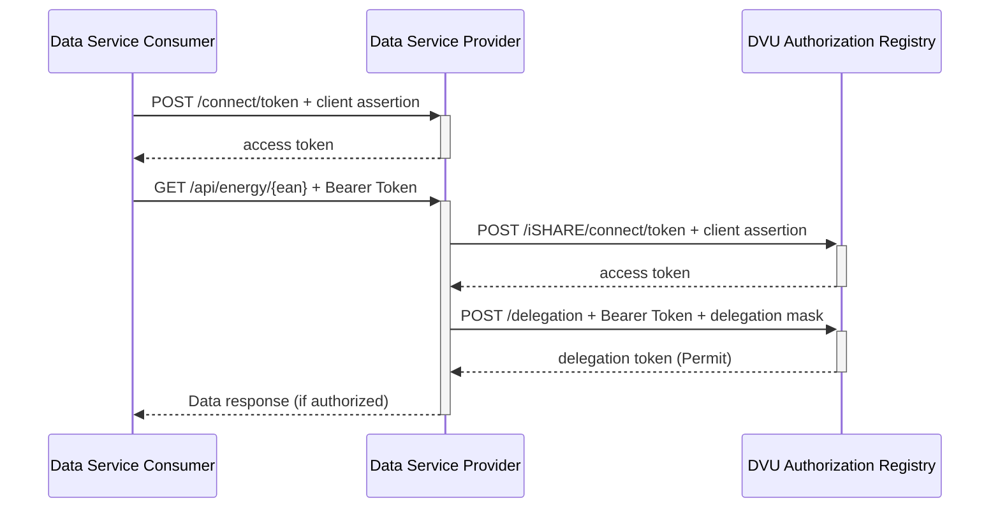

# Data Service Provider Integration

## Introduction

This guide describes how a data service provider (DSP) can connect to the DVU ecosystem. A DSP delivers data to data service consumers, based on access rights centrally managed via the DVU Authorization Registry (AR).

This page focuses on implementation: how a DSP retrieves and validates delegation evidence.

## Process overview

1. Data service consumer requests an access token at the DSP's token endpoint with a client assertion
2. Data service consumer makes a request to the DSP with a bearer token and resource identifier (e.g., EAN)
3. The DSP validates the access token
4. The DSP retrieves delegation evidence from the DVU Authorization Registry
5. The DSP checks whether the request is authorized
6. If authorized, the DSP delivers the data

## Authorization model

DVU uses delegation evidence tokens according to the iSHARE specification. These tokens describe which party (accessSubject) via which policyIssuer has access to which resource at which data service provider.

### Relevant fields

| Field | Required | Description | DVU context |
|-------|----------|-------------|-------------|
| `policyIssuer` | Yes | The party that granted the rights | The KVK of the rightful party from whom the DSP knows is the rights holder of the data |
| `target.accessSubject` | Yes | Organization ID of the data service consumer | The KVK from the client assertion of the calling party |
| `resource.type` | Yes | Type of data resource | `"P4"` (consumption per EAN) or `"BenchmarkSnapshot"` |
| `resource.identifiers[]` | Yes | Resource identifier | VBO-ID or EAN (for type `P4`) or Benchmarksnapshot-ID. EANs in DVU are grouped by VBO-ID for integral consent |
| `resource.attributes[]` | Yes | Data attribute | `"Jaarverbruik"` or `"*"` for P4, `"*"` for BenchmarkSnapshot |
| `actions[]` | Yes | Permitted action | `"Read"` |
| `environment.serviceProviders[]` | Yes | Organization ID of the DSP | Must match the DSP's own identifier |
| `previous_steps[]` | Yes | Evidence on whose behalf delegation is requested | Required field, but empty for DSP |

### Permitted combinations

| `type` | `identifiers[]` | `attributes[]` | Example |
|--------|-----------------|-----------------|---------|
| `P4` | VBO-ID or EAN (e.g., 8716…) | `"Jaarverbruik"` or `"*"` | EAN consumption data |
| `BenchmarkSnapshot` | Benchmarksnapshot-ID (e.g., 361adeb9-e817-4a16-91c2-427ad918baa8) | `"*"` | Building benchmark snapshots |

### Validation requirements for DSP

- Standard JWT validation on delegation evidence token
- `effect = Permit` must be present
- `policyIssuer` = identifier of trusted issuer
- `accessSubject` = identifier from client assertion of calling party
- `resource.type`, `identifiers[]` and `actions[]` must match requested data
- `serviceProviders[]` contains the DSP's own identifier
- `notBefore` is now or earlier
- `notOnOrAfter` is later than now

### Example delegation request

```json
{
  "delegationRequest": {
    "policyIssuer": "NL.KVK.86073049",
    "target": {
      "accessSubject": "NL.KVK.12345678"
    },
    "policySets": [
      {
        "policies": [
          {
            "target": {
              "resource": {
                "type": "P4",
                "identifiers": ["870000000000000011"],
                "attributes": ["Jaarverbruik"]
              },
              "actions": ["Read"],
              "environment": {
                "serviceProviders": ["NL.KVK.55819206"]
              }
            },
            "rules": [
              {
                "effect": "Permit"
              }
            ]
          }
        ]
      }
    ]
  },
  "previous_steps": [""]
}
```

## Test environment

### Endpoints

- **Authorization Registry (Test):** `https://dvu-test-ar.azurewebsites.net`
- **iSHARE Satellite (Test):** `https://dvu3pirtest-mw.isharesatellite.eu`

### Test data

| Parameter | Value |
|-----------|-------|
| Policy Issuer | `NL.KVK.86073049` |
| Access Subject | `NL.KVK.12345678` |
| Provider (SDS) | `NL.KVK.55819206` |
| Test EAN | `870000000000000011` |

> In acceptance and production, the Authorization Registry URL and the iSHARE Satellite URL must be updated.

## Implementation steps

### Step 1: Set up service endpoint

E.g., `GET /api/energy/{ean}` with `Authorization: Bearer {access_token}`.

Derive from the incoming data request the correct parameters for the following steps.

### Step 2: Obtain token from Authorization Registry

Refer to the iSHARE specification for token requests:
`POST /iSHARE/connect/token` with `Content-Type: application/x-www-form-urlencoded`.

All standard iSHARE claims apply.

### Step 3: Retrieve delegation evidence from Authorization Registry

`POST /iSHARE/delegation` with `Authorization: Bearer {access_token_AR}`.

See the example delegation request above.

### Step 4: Validation

See the validation requirements above.

### Step 5: Deliver data

Deliver the data if validation is successful.

### Recommended error handling

| Code | Meaning | Action |
|------|---------|--------|
| `401 Unauthorized` | Invalid or expired access token | Ask client to re-authenticate |
| `403 Forbidden` | Delegation evidence missing or invalid | Reject request |
| `400 Bad Request` | Invalid input | Validate input format |
| `500 Internal Server Error` | Technical error | Log and implement retry logic |

## Example: SDS implementation

Smart Data Solutions (SDS) implements DVU access without pre-fetched tokens. The DSP retrieves delegation evidence from the DVU AR itself.

- SDS uses a `DelegationMask` to request a `DelegationEvidence`
- Validation is done with own logic or with tooling

> **Tip:** The open source package [Poort8.Ishare.Core ➚](https://github.com/POORT8/Poort8.Ishare.Core) provides support for authentication and authorization. ⚠️ No support is provided on this package.

## Sequence diagram


```mermaid
sequenceDiagram
    participant Consumer as Data Service Consumer
    participant DSP as Data Service Provider
    participant AR as DVU Authorization Registry

    Consumer->>+DSP: POST /connect/token + client assertion
    DSP-->>-Consumer: access token
    Consumer->>+DSP: GET /api/energy/{ean} + Bearer Token
    DSP->>+AR: POST /iSHARE/connect/token + client assertion
    AR-->>-DSP: access token
    DSP->>+AR: POST /delegation + Bearer Token + delegation mask
    AR-->>-DSP: delegation token (Permit)
    DSP-->>-Consumer: Data response (if authorized)
```
