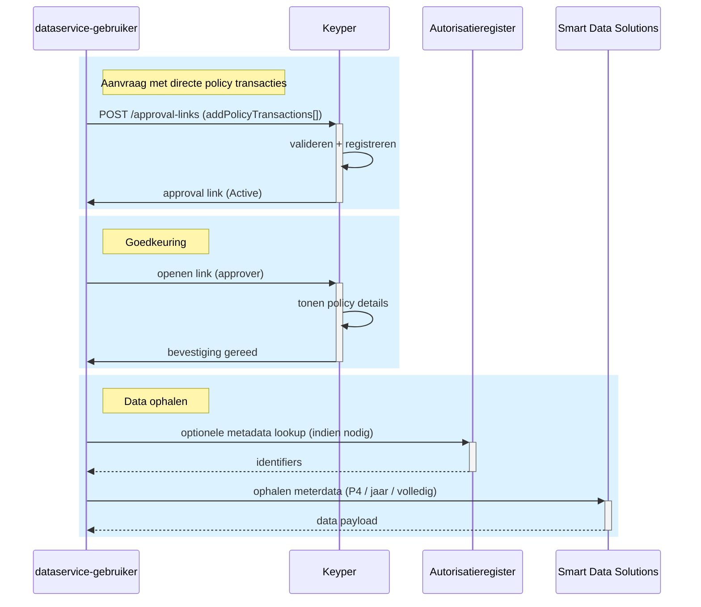

# DVU Implementation: Access to EAN(s) directly
This guide explains how to implement the Keyper Approve workflow for requesting access to meter data directly. This can be achieved by providing the data access policy yourself when creating the approval link, dismissing the need to use the DVU metadata services.

## Overview
If you want your application to have access to data for a building through DVU, you need approval from the energy contractor. This request for approval will be facilitated by Keyper.

This is how that works, step by step:
1. **Your application** prepares the data that is required in order to create an approval link. This is data about: 
   - The requesting party (you/your application)
   - The approving party (the energy contractor)
   - The EAN code of the meter for which you want to access data
2. **Your application** sends the approval request to the Keyper API, containing the data from the previous step.
3. **Keyper** uses the data your application provided to create an approval link. This link will then get sent to the approving party - the energy contractor.
4. **The energy contractor** opens the approval link, and arrives in the Keyper Approve webapp. The energy contractor then reviews your approval request.
5. If your request is approved, **Keyper** registers a policy in DVU. This policy lets DVU know that you have access to the data of the respective meter(s). 
6. **You** can now access the data of the respective meter.
   - You can now also retrieve the meters data via the DVU API. More on this can be found in the [documentation on how to retrieve VBO and EAN data](vbo-ean-data-retrieval.md).

This approach differs from the standard DVU flow, which uses DVU metadata services to assemble the required policies based on address lookups. In the direct EAN flow, your application constructs the policy and provides this with the request to create an approval link.

## Implementation steps
In order to implement the Keyper Approve workflow within your application, follow the steps below.

### Step 1: Prepare the required data
Your application needs to prepare the data required for the approval request. How you gather this data (e.g., through a form, API call, configuration file, or database query) is up to your implementation.

#### Requester information
- Name
- Email address
- Organization name
- Organization ID (EORI format, example: EU.EORI.NL860730499)

#### Energy contractor information
- Email address
- Organization name
- Organization ID (EORI format, example: EU.EORI.NL860730499)

#### Meter(s) information
- EAN code

#### Your application's identifiers
- Application reference - A unique identifier from your system for tracking this specific approval request. This could be:
  - An internal transaction ID
  - A case number
  - A database record ID
  - Any string that helps you correlate this approval request with your business process
- Your organization ID (EORI format, example: EU.EORI.NL860730499)

**Validation requirements**
- All fields are required and cannot be empty.
- All email addresses and EORI numbers must be properly formatted.

### Step 2: Keyper API authentication
Every call to the Keyper API needs to be authenticated using a token. A token can be retrieved through the following request:
```http
POST https://poort8.eu.auth0.com/oauth/token
Content-Type: application/json
```
With the following JSON body:
```json
{
  "client_id": "<REQUESTER_CLIENT_ID>",
  "client_secret": "<REQUESTER_CLIENT_SECRET>",
  "audience": "Poort8-Dataspace-Keyper-Preview",
  "grant_type": "client_credentials"
}
```

### Step 3: Keyper API integration
When the required data is ready, and an access token for the Keyper API has been fetched, send a request to the Keyper API to create an approval link.

The following request needs to be made, with the authentication from the previous step:
```http
POST https://keyper-preview.poort8.nl/v1/api/approval-links
Accept: application/json
Authorization: Bearer <ACCESS_TOKEN>
Content-Type: application/json
```
The provided JSON body must include an `addPolicyTransactions` array containing the policy that grants access to the specified EAN.
```json
{
  "requester": {
    "name": "<REQUESTER_NAME>",
    "email": "<REQUESTER_EMAIL>",
    "organization": "<REQUESTER_ORGANIZATION>",
    "organizationId": "<REQUESTER_EORI>"
  },
  "approver": {
    "email": "<ENERGY_CONTRACTOR_EMAIL>",
    "organization": "<ENERGY_CONTRACTOR_ORGANIZATION>",
    "organizationId": "<ENERGY_CONTRACTOR_EORI>"
  },
  "dataspace": {
    "baseUrl": "https://dvu-test.azurewebsites.net"
  },
  "description": "Request for access to EAN via DVU",
  "reference": "<YOUR_REFERENCE>",
  "addPolicyTransactions": [  
    {
      "useCase": "dvu",
      "issuedAt": "<NOW>", // Unix timestamp - Not active in the DVU dataspace as it will always default to NOW
      "notBefore": "<NOW>", // Unix timestamp - Not active in the DVU dataspace as it will always default to NOW
      "expiration": "<EXPIRATION>", // Expiration date (up to you) as a unix timestamp
      "issuerId": "<ENERGY_CONTRACTOR_ORGANIZATION_ID>",
      "subjectId": "<YOUR_ORGANIZATION_ID>",
      "serviceProvider": "EU.EORI.NL851872426", // Organisation ID of Smart Data Solutions (SDS)
      "action": "Read",
      "resourceId": "dvu:resource:<UUID>", // Provide a unique identifier (e.g., UUID or GUID) generated by your implementation
      "type": "P4",
      "attribute": "*",
      "license": "iSHARE.0002" // Not active in the DVU dataspace as it will always default to iSHARE.0002
    }
  ],
  "addResourceGroupTransactions": [
    {
      "resourceGroupId": "dvu:resource:<UUID>", // This should be the same as the resourceId from the policy provided in addPolicyTransactions
      "useCase": "dvu",
      "name": "<UUID>",
      "description": "ean group: <UUID>",
      "provider": "DVU",
      "resources": [ // Provide a list of resource objects, with an entry for each EAN code (also if it's a single EAN code)
        {
          "resourceId": "dvu:resource:<EAN_CODE_1>",
          "useCase": "dvu",
          "name": "<EAN_CODE_1>",
          "description": "ean: <EAN_CODE_1>",
          "properties": [] // Additional properties should be supplied by CAR-connection when available
        },
        {
          "resourceId": "dvu:resource:<EAN_CODE_2>",
          "useCase": "dvu",
          "name": "<EAN_CODE_2>",
          "description": "ean: <EAN_CODE_2>",
          "properties": [] // Additional properties should be supplied by CAR-connection when available
        }
      ]
    }
  ],
  "orchestration": {
    "flow": "dvu.direct-ean@v1"
  }
}
```

**Note:**
- DVU needs additional info on EANs to be able to get the data (stored in the `properties` of each EAN `resource`), it is not expected that users will supply this info. Therefore, the availability of this flow depends on the implementation of info from CAR (Centraal Aansluitingen Register).
- DVU requires EANs to be grouped. For this direct EAN flow, you choose a user-friendly group name, as it will be shown to the approver.

#### Successful response
When the approval link is successfully created, you'll receive the following response.

**201 Created**
```json
{
  "id": "474e19af-8165-4b85-ad03-be81f9f8dcc2",
  "reference": "<YOUR_APPLICATION_REFERENCE>",
  "url": "https://keyper-preview.poort8.nl/approve?id=474e19af-8165-4b85-ad03-be81f9f8dcc2&app=dvu",
  "expiresAtUtc": 1759834340,
  "status": "Active"
}
```

**Response fields**
- `id`: Unique identifier for the approval link (generated by Keyper).
- `reference`: Your application reference (from the request).
- `url`: The approval link, which has now been sent to the energy contractor via email.
- `expiresAtUtc`: Unix timestamp of when the link expires (1 hour after creation).
- `status`: Current status of the approval link, which will be `Active` upon successful creation. Other status include:
  - `Approved`: The energy contractor has approved the approval request.
  - `Rejected`: The energy contractor has rejected the approval request.
  - `Expired`: The approval link has expired and can no longer be used.

#### Error responses
The Keyper API may return the following error responses:

##### 400 Bad Request
This response indicates that your request is missing required data, or contains invalid data. Keyper validates the contents of your request. When an error occurs during this process, you'll receive a response that looks like this:
```json
{
  "statusCode": 400,
  "message": "One or more errors occurred!",
  "errors": {
    "requester.email": [
      "Email cannot be empty."
    ]
  }
}
```

**Response fields**
- `statusCode`: The HTTP status code describing your request, in this case 400 (bad request).
- `message`: A message explaining what went wrong.
- `errors`: This object lists which input fields could not be validated, and explains per input what the issue is.

>**Note**: There is no set format for organization identifiers within Keyper, so the API will not validate any organization identifier field for a valid EORI. Within DVU, invalid EORI numbers can cause issues surrounding access policies and data retrieval, hence we expect EORI format validation to be performed on the client side.

**What to do:** Review the `errors` object in the response and correct the indicated fields in your request.

##### 401 Unauthorized - Missing or invalid access token
If you don't provide an access token or provide an invalid/expired token, you'll receive an empty response with HTTP status 401.

**What to do:** Ensure you've included the `Authorization: Bearer <ACCESS_TOKEN>` header with a valid token from Step 2. If your token has expired, request a new one.

##### 500 Internal Server Error
This response indicates that there was a server-side error, meaning that something went wrong within Keyper. In this case, you'll receive a response that looks like this:
```json
{
  "status": "Internal Server Error!",
  "code": 500,
  "reason": "Object reference not set to an instance of an object.",
  "note": "See application log for stack trace."
}
```

**What to do:** 
1. Retry your request after a short delay (the error may be transient).
2. If the error persists, contact Poort8 support at **hello@poort8.nl** with:
   - Your application reference value
   - The timestamp of the request
   - The complete error response

>**Note:** Poort8's monitoring system automatically tracks 500 errors, so the team may already be investigating the issue.

#### Test environment
As Keyper is still in development, it is only available in a test environment. This environment does **not perform complete verifications** such as organization data validation.

Use the test environment only for functional testing.

## Sequence Diagram (Direct EAN Flow)


## Next steps
- Read the [documentation on how to retrieve VBO and EAN data](vbo-ean-data-retrieval.md)
- Implement error handling for API responses
- Set up monitoring for approval link usage
- Test the complete flow in the test environment
- Plan migration to production environment