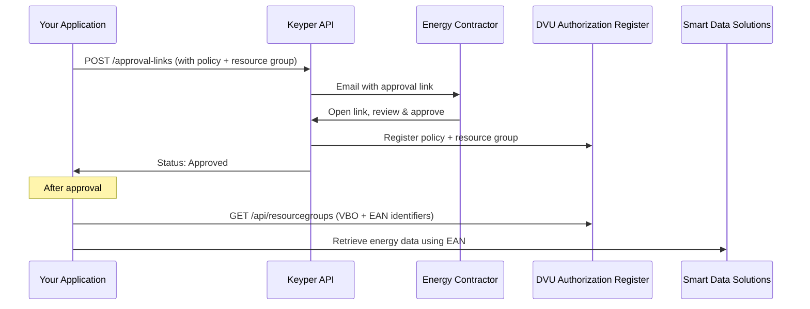

# Direct EAN Access

This guide explains how to request access to meter data directly by providing the access policy yourself, bypassing the DVU metadata app address lookup.

## Overview

In the standard DVU flow (Single Building (single-building.md) / Bulk Building (bulk-buildings.md)), the DVU metadata app assembles policies based on address lookups. In the direct EAN flow, your application constructs the policy and resource group transactions and includes them in the approval link request. The energy contractor reviews and approves directly in Keyper without visiting CAR.

> DVU needs additional info on EANs to retrieve data (stored in the `properties` of each EAN resource). It is not expected that users will supply this info. Therefore, the availability of this flow depends on the implementation of info from the CAR (Centraal Aansluitingen Register).

## Sequence diagram


```mermaid
sequenceDiagram
    participant App as Your Application
    participant Keyper as Keyper API
    participant EC as Energy Contractor
    participant AR as DVU Authorization Register
    participant SDS as Smart Data Solutions
    App->>Keyper: POST /approval-links (with policy + resource group)
    Keyper->>EC: Email with approval link
    EC->>Keyper: Open link, review & approve
    Keyper->>AR: Register policy + resource group
    Keyper->>App: Status: Approved
    Note over App: After approval
    App->>AR: GET /api/resourcegroups (VBO + EAN identifiers)
    App->>SDS: Retrieve energy data using EAN
```

## Minimum payload

| JSON path                         | Filled by | Description                                                                         |
| :-------------------------------- | :-------- | :---------------------------------------------------------------------------------- |
| `requester.*`                     | App       | Your name, email, organization, `organizationId` (`NL.KVK.<your KVK>`)              |
| `approver.*`                      | App       | Energy contractor email, organization, `organizationId` (`NL.KVK.<contractor KVK>`) |
| `dataspace.baseUrl`               | Fixed     | `https://dvu-test.azurewebsites.net`                                                |
| `description`                     | App       | Shown to the approver (optional)                                                    |
| `reference`                       | App       | Your internal tracking ID (optional)                                                |
| `addPolicyTransactions[0]`        | App       | Access policy — see JSON example below                                              |
| `addResourceGroupTransactions[0]` | App       | EAN resource group — see JSON example below                                         |
| `orchestration.flow`              | Fixed     | `dvu.direct-ean@v1`                                                                 |

## JSON example

```text
POST https://keyper-preview.poort8.nl/v1/api/approval-links
Accept: application/json
Authorization: Bearer <ACCESS_TOKEN>
Content-Type: application/json
```

```json
{
  "requester": {
    "name": "Alice Data End User",
    "email": "alice@dataenduser.nl",
    "organization": "wonderland",
    "organizationId": "NL.KVK.12345678"
  },
  "approver": {
    "email": "somebody@domain.extension",
    "organization": "Poort8",
    "organizationId": "NL.KVK.76660680"
  },
  "dataspace": {
    "baseUrl": "https://dvu-test.azurewebsites.net"
  },
  "description": "Request for direct EAN access via DVU",
  "reference": "DIRECT-EAN-001",
  "addPolicyTransactions": [
    {
      "useCase": "dvu",
      "issuedAt": "<NOW>",
      "notBefore": "<NOW>",
      "expiration": "<EXPIRATION>",
      "issuerId": "NL.KVK.76660680",
      "subjectId": "NL.KVK.12345678",
      "serviceProvider": "NL.KVK.55819206",
      "action": "Read",
      "resourceId": "dvu:resource:<UUID>",
      "type": "P4",
      "attribute": "*",
      "license": "iSHARE.0002"
    }
  ],
  "addResourceGroupTransactions": [
    {
      "resourceGroupId": "dvu:resource:<UUID>",
      "useCase": "dvu",
      "name": "<UUID>",
      "description": "ean group: <UUID>",
      "provider": "DVU",
      "resources": [
        {
          "resourceId": "dvu:resource:<EAN_CODE_1>",
          "useCase": "dvu",
          "name": "<EAN_CODE_1>",
          "description": "ean: <EAN_CODE_1>",
          "properties": []
        },
        {
          "resourceId": "dvu:resource:<EAN_CODE_2>",
          "useCase": "dvu",
          "name": "<EAN_CODE_2>",
          "description": "ean: <EAN_CODE_2>",
          "properties": []
        }
      ]
    }
  ],
  "orchestration": {
    "flow": "dvu.direct-ean@v1"
  }
}
```

### Key fields

| Field                                 | Notes                                                           |
| :------------------------------------ | :-------------------------------------------------------------- |
| `issuedAt`, `notBefore`, `expiration` | Unix timestamps. DVU defaults `issuedAt` and `notBefore` to now |
| `issuerId`                            | KVK of the energy contractor (approver)                         |
| `subjectId`                           | Your KVK (the data service consumer)                            |
| `serviceProvider`                     | `NL.KVK.55819206` (Smart Data Solutions)                        |
| `resourceId` / `resourceGroupId`      | Must match — use the same UUID for both                         |
| `license`                             | DVU defaults to `iSHARE.0002`                                   |
| `properties`                          | Should be supplied by the CAR connection when available         |

> DVU requires EANs to be grouped. For this flow, you choose a user-friendly group name as it will be shown to the approver.

## Example response

**201 Created**

```json
{
  "id": "474e19af-8165-4b85-ad03-be81f9f8dcc2",
  "reference": "DIRECT-EAN-001",
  "url": "https://keyper-preview.poort8.nl/approve?id=474e19af-8165-4b85-ad03-be81f9f8dcc2&app=dvu",
  "expiresAtUtc": 1759834340,
  "status": "Active"
}
```

## Common errors

| Status | Scenario                        | Solution                                                                                                                      |
| :----- | :------------------------------ | :---------------------------------------------------------------------------------------------------------------------------- |
| `400`  | Missing or invalid fields       | Check the `errors` object in the response for details                                                                         |
| `401`  | Missing or expired access token | Re-authenticate — see Authentication (README.md#authentication)                                                               |
| `500`  | Server error                    | Retry after a short delay. If persistent, contact [hello@poort8.nl](mailto:hello@poort8.nl) with your reference and timestamp |

> Keyper does not validate organization identifiers for format. Ensure KVK numbers are correct on your side, as invalid identifiers cause issues with access policies and data retrieval.

## Follow-up

After approval, retrieve the EAN data via the DVU API — see Retrieving VBO and EAN Data (vbo-ean-data-retrieval.md).
