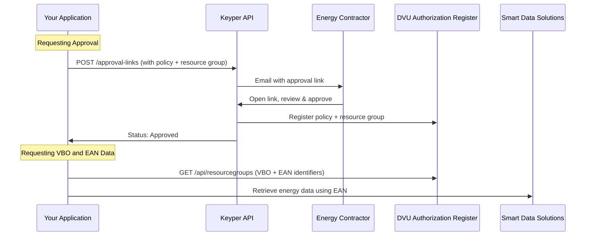

# Direct EAN Access

This guide explains how to request access to meter data directly by providing the access policy yourself, bypassing the DVU metadata app address lookup.

## Overview

In the standard DVU flow ([Single Building Access](single-building.md) / [Bulk Building Access](bulk-building.md)), the DVU metadata app assembles policies based on address lookups. In the direct EAN flow, your application constructs the policy and resource group transactions and includes them in the approval link request. The energy contractor reviews and approves directly in Keyper without visiting CAR.

## Sequence diagram


```mermaid
sequenceDiagram
    participant App as Your Application
    participant Keyper as Keyper API
    participant EC as Energy Contractor
    participant AR as DVU Authorization Register
    participant SDS as Smart Data Solutions
    Note over App: Requesting Approval
    App->>Keyper: POST /approval-links (with policy + resource group)
    Keyper->>EC: Email with approval link
    EC->>Keyper: Open link, review & approve
    Keyper->>AR: Register policy + resource group
    Keyper->>App: Status: Approved
    Note over App: Requesting VBO and EAN Data
    App->>AR: GET /api/resourcegroups (VBO + EAN identifiers)
    App->>SDS: Retrieve energy data using EAN
```

## Minimum payload

| JSON path                         | Filled by | Description                                                                         |
| :-------------------------------- | :-------- | :---------------------------------------------------------------------------------- |
| `requester.*`                     | App       | Your name, email, organization, `organizationId` (`did:ishare:EU.NL.NTRNL-<your KVK>`)              |
| `approver.*`                      | App       | Energy contractor email, organization, `organizationId` (`did:ishare:EU.NL.NTRNL-<contractor KVK>`) |
| `dataspace.baseUrl`               | Fixed     | `https://dvu-preview.poort8.nl`                                                |
| `description`                     | App       | Shown to the approver (optional)                                                    |
| `reference`                       | App       | Your internal tracking ID (optional)                                                |
| `addPolicyTransactions[]`         | App       | Access policy — see JSON example below                                              |
| `addResourceGroupTransactions[]`  | App       | EAN resource group — see JSON example below                                         |
| `orchestration.flow`              | Fixed     | `dvu.direct-ean@v1`                                                                 |

## JSON example

```text
POST https://keyper-preview.poort8.nl/v1/api/approval-links
Accept: application/json
Authorization: Bearer <ACCESS_TOKEN>
Content-Type: application/json
```

```json
{
  "requester": {
    "name": "Data Requester",
    "email": "requester@domain.extension",
    "organization": "Requester",
    "organizationId": "<REQUESTING_ORGANISATION_ID>"
  },
  "approver": {
    "email": "approver@domain.extension",
    "organization": "Approver",
    "organizationId": "<APPROVING_ORGANISATION_ID>"
  },
  "dataspace": {
    "baseUrl": "https://dvu-preview.poort8.nl"
  },
  "description": "<Suitable description for your approval link>",
  "reference": "<YOUR-DIRECT-EAN-REFERENCE>",
  "addPolicyTransactions": [
    {
      "issuedAt": "<NOW>",
      "notBefore": "<NOW>",
      "expiration": "<EXPIRATION>",
      "issuerId": "<APPROVING_ORGANISATION_ID>",
      "subjectId": "<REQUESTING_ORGANISATION_ID>",
      "serviceProvider": "did:ishare:EU.NL.NTRNL-55819206",
      "action": "Read",
      "resourceId": "<UUID>",
      "type": "P4",
      "attribute": "*",
      "license": "iSHARE.0002"
    }
  ],
  "addResourceGroupTransactions": [
    {
      "resourceGroupId": "<UUID>",
      "name": "<Suitable name for UUID>",
      "description": "<Suitable description for UUID>",
      "resources": [
        {
          "resourceId": "<EAN1>",
          "name": "<Suitable name for EAN1>",
          "description": "<Suitable description for EAN1>"
        },
        {
          "resourceId": "<EAN2>",
          "name": "<Suitable name for EAN2>",
          "description": "<Suitable description for EAN2>"
        }
      ]
    }
  ],
  "orchestration": {
    "flow": "dvu.direct-ean@v1"
  }
}
```

### Key fields

| Field                                        | Notes                                                             |
| :------------------------------------------- | :---------------------------------------------------------------- |
| `issuedAt`, `notBefore`, `expiration`        | Unix timestamps. DVU defaults `issuedAt` and `notBefore` to now   |
| `issuerId`                                   | iSHARE identifier of the energy contractor (approver)             |
| `subjectId`                                  | iSHARE identifier of the requesting organisation                  |
| `serviceProvider`                            | `did:ishare:EU.NL.NTRNL-55819206` (Smart Data Solutions)          |
| `policy.resourceId` / `resourceGroupId`      | Must match — use the same UUID for both                           |
| `license`                                    | DVU defaults to `iSHARE.0002`                                     |

> DVU requires EANs to be grouped. For this flow, you choose a user-friendly group name as it will be shown to the approver.

## Example response

**200 OK**

```json
{
  "id": "474e19af-8165-4b85-ad03-be81f9f8dcc2",
  "reference": "DIRECT-EAN-001",
  "url": "https://keyper-preview.poort8.nl/approve?id=474e19af-8165-4b85-ad03-be81f9f8dcc2&app=dvu",
  "expiresAtUtc": 1759834340,
  "status": "Active"
}
```

> **Note:** The `status` field reflects the state of the **approval link** (`Active`, `Approved`, `Rejected`, or `Expired`). It does **not** indicate whether the resulting policy is active or valid in the DVU Authorization Registry. Policy state is managed separately.

## Common errors

| Status | Scenario                        | Solution                                                                                                                      |
| :----- | :------------------------------ | :---------------------------------------------------------------------------------------------------------------------------- |
| `400`  | Missing or invalid fields       | Check the `errors` object in the response for details                                                                         |
| `401`  | Missing or expired access token | Re-authenticate — see [Getting Started](getting-started.md)                                                                   |
| `500`  | Server error                    | Retry after a short delay. If persistent, contact [hello@poort8.nl](mailto:hello@poort8.nl) with your reference and timestamp |

## Follow-up

After approval, retrieve VBO and EAN data via DVU API — see [Retrieving VBO and EAN Data via DVU](vbo-ean-data-retrieval.md).
