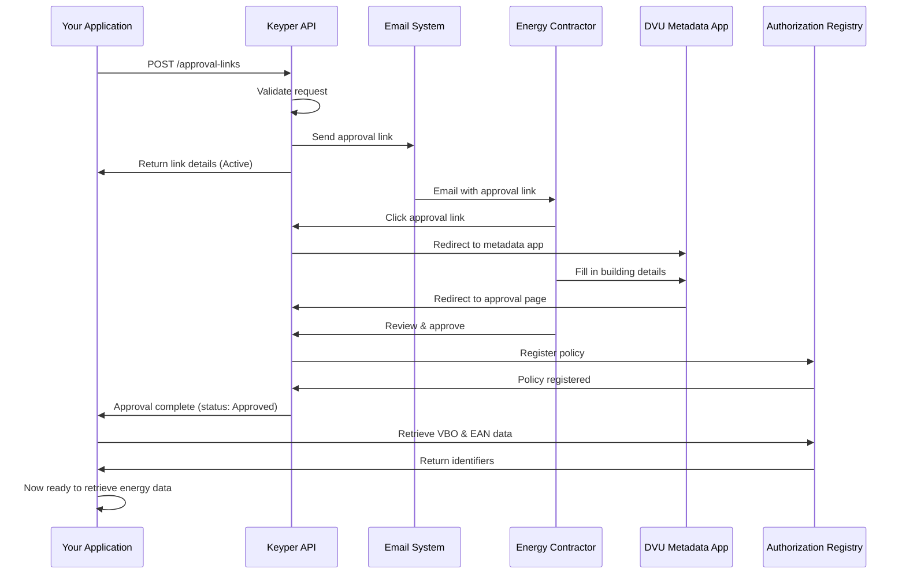

# Getting Started with DVU Integration

This guide helps you understand how DVU integration works before you dive into implementation.

**Prerequisites:**
- Basic understanding of REST APIs
- Have read the [Overzicht & Kernconcepten](overview.md)

## Your first approval link

### Step 1. Get your credentials (required before implementation)
**Important:** You cannot integrate with DVU without the required credentials.

#### What you need
- **Client ID & secret** - For Keyper API authentication. To get these, contact Poort8 at **hello@poort8.nl** with:
  - Your organization name
  - Contact person details
  - Use case description 
- **EORI number** - If you don't have one yet, [consult this website](https://business.gov.nl/international/doing-business-abroad/eori-number-for-all-customs-operations/).

### Step 2. Understanding Keyper integration
**Keyper** is a standalone approval orchestration API, used by DVU to manage access requests. Requests can be sent to this API to create and view approval links.

#### Test environment URLs
- **Token endpoint:** `https://poort8.eu.auth0.com/oauth/token`
- **Keyper API:** `https://keyper-preview.poort8.nl/v1/api/`
- **DVU Dataspace:** `https://dvu-test.azurewebsites.net`

>**Note:** The test environment does not perform complete verifications (such as organization data validation). Use it only for functional testing.

### Step 3. How authentication works
Every API call to Keyper requires an access token, here's how authentication works.

#### Authentication request
Send the following request:
```http
POST https://poort8.eu.auth0.com/oauth/token
Content-Type: application/json
{
  "client_id": "<CLIENT_ID>",
  "client_secret": "<CLIENT_SECRET>",
  "audience": "Poort8-Dataspace-Keyper-Preview",
  "grant_type": "client_credentials"
}
```

Replace with your credentials:
- `CLIENT_ID` - Provided by Poort8
- `CLIENT_SECRET` - Provided by Poort8

#### Successful response (200 OK)
```json
{
  "access_token": "eyJhbGciOiJSUzI1NiIsInR5cCI6IkpXVCJ9...",
  "token_type": "Bearer",
  "expires_in": 86400
}
```

**Key points**
- Save the `access_token` for subsequent API calls
- Use in Authorization header: `Authorization: Bearer {access_token}`
- Implement automatic refresh when token expires (`expires_in`)

#### Error response (401 Unauthorized)
```json
{
    "error": "access_denied",
    "error_description": "Unauthorized"
}
```

**Possible causes**
- One or more fields were missing
- `client_id` and/or `client_secret` are invalid

### Step 4. Create your first approval link
Now let's create an approval link for a test building using the **Single Building flow**. Make the following request:
```http
POST https://keyper-preview.poort8.nl/v1/api/approval-links
Accept: application/json
Authorization: Bearer <ACCESS_TOKEN>
Content-Type: application/json
```

Use this sample data, and replace the email placeholders with your actual email address:
```json
{
  "requester": {
    "name": "Test Person",
    "email": "<YOUR_EMAIL>",
    "organization": "Test Company",
    "organizationId": "EU.EORI.NL123456789"
  },
  "approver": {
    "email": "<YOUR_EMAIL>",
    "organization": "Test Energy Contractor",
    "organizationId": "EU.EORI.NL123456789"
  },
  "dataspace": {
    "baseUrl": "https://dvu-test.azurewebsites.net"
  },
  "description": "My first DVU test request",
  "reference": "TEST-001",
  "orchestration": {
    "flow": "dvu.voeg-gebouw-toe@v1",
    "payload": {
      "address": "3013 AK 45",
      "dataServiceConsumer": "EU.EORI.NL123456789"
    }
  }
}
```

**Keep these test values:**
- `EU.EORI.NL123456789` → Test EORI
- `3013 AK 45` → Test building address

#### Expected Response (201 Created)
```json
{
  "id": "474e19af-8165-4b85-ad03-be81f9f8dcc2",
  "reference": "TEST-001",
  "url": "https://keyper-preview.poort8.nl/approve?id=474e19af-8165-4b85-ad03-be81f9f8dcc2&app=dvu",
  "expiresAtUtc": 1759834340,
  "status": "Active"
}
```
**You've created your first approval link!**

##### Response fields explained
- **`id`**: Unique identifier for this approval link (generated by Keyper)
- **`reference`**: Your tracking reference (`TEST-001`)
- **`url`**: The approval link sent to the approver
- **`expiresAtUtc`**: Unix timestamp when the link expires (1 hour from creation)
- **`status`**: Current status (`Active`, `Approved`, `Rejected`, or `Expired`)

##### What just happened?
1. You requested access to building at address "3013 AK 45" (Rotterdam).
2. Keyper created an approval link valid for 1 hour.
3. An email was sent to your email address.
4. You can now approve or reject your request via the link.

#### Common errors

##### 400 Bad Request
Example error response:
```json
{
  "statusCode": 400,
  "message": "One or more errors occurred!",
  "errors": {
    "requester.email": [
      "Email cannot be empty."
    ]
  }
}
```

**What to do** 
- Check the `errors` object - it shows exactly which fields are invalid.
- Common issues include: missing required fields, invalid email format.

##### 401 Unauthorized
Caused by a missing or invalid access token

**What to do**
- Verify you included the `Authorization: Bearer YOUR_ACCESS_TOKEN` header.
- Check that your token hasn't expired.
- Go back to Step 3 to get a new token.

##### 500 Internal Server Error
Example error response:
```json
{
  "status": "Internal Server Error!",
  "code": 500,
  "reason": "Object reference not set to an instance of an object.",
  "note": "See application log for stack trace."
}
```

**What to do**
1. Retry your request after a short delay (may be transient)
2. If the error persists, contact Poort8 via hello@poort8.nl with:
   - Your reference value (`TEST-001`)
   - The timestamp of the request
   - The complete error response

> **Note:** Poort8's monitoring system automatically tracks 500 errors, so the team may already be investigating.

### Step 5. Understanding the complete flow
Let's understand what happens after you create an approval link:

#### The complete journey


#### Key concepts
**Requester** = You / Your application
- Wants access to energy data
- Identified by your EORI number
- Initiates the approval request

**Approver** = Energy contractor
- Owns/manages the building's energy contract
- Controls access to energy data
- Approves or rejects your request via email link

**Approval link** = The bridge
- Valid for 1 hour after creation
- Contains all request details
- Contractor clicks to review and approve/reject

**Reference** = Your tracking ID
- Any string you choose (e.g., `TEST-001`)
- Helps you correlate requests with your business process
- Examples: case number, building identifier with a prefix or suffix

**VBO ID** = Building identifier
- Retrieved after approval is granted
- Required to get energy data from SDS
- See [VBO/EAN Data Retrieval](vbo-ean-data-retrieval.md)

**EAN code** = Meter identifier
- Energy meter number (18 digits)
- Associated with the building's VBO ID
- Used to retrieve actual energy consumption data

### Step 6. What happens next?
After creating your first approval link, here's what typically happens:

#### 1. Energy Contractor Receives Email
The approver (`test.approver@example.com`) receives an email with:
- Your organization name
- The building address you're requesting
- A link to review and approve/reject

#### 2. Contractor reviews request
When they click the link:
1. Redirected to DVU metadata app
2. Confirms/fills in building details (VBO-ID, EAN codes)
3. Redirected to Keyper Approve
4. Reviews the complete request
5. Approves or rejects

#### 3. You get access (if approved)
Once approved:
- Policy is registered in DVU Authorization Registry
- Your approval link status changes to `Approved`
- You can retrieve the building's VBO-ID and EAN codes
- You can request energy data from SDS

#### 4. Testing the approval flow (optional)
Since this is a test environment, you can:
1. Open the `url` from the response in your browser
2. Click through the approval flow yourself
3. See what the energy contractor experiences
4. Complete the approval to test the full integration

> **Tip:** In the test environment, you don't need real building data - the system accepts test addresses for functional testing.

## Next Steps: Choose your implementation path
Now that you understand the basics, choose the implementation guide that matches your use case:

### Option 1: Single Building Access (Start Here)
**When to use:** Requesting access to one building at a time

→ **[Single Building Access Guide](single-building.md)**

**Use cases:**
- User enters a building address in your application
- One-off data requests
- Simple integrations

**What you'll learn:**
- Complete request/response cycle
- Address formatting rules
- Error handling
- Building address validation

### Option 2: Bulk Building Access
**When to use:** Requesting access to multiple buildings simultaneously

→ **[Bulk Building Access Guide](bulk-buildings.md)**

**Use cases:**
- Portfolio management (multiple buildings)
- Batch processing
- Efficiency at scale

**What you'll learn:**
- Array-based address submission
- Batch processing best practices
- Handling partial failures
- Performance optimization

### Option 3: Direct EAN Access (Advanced)
**When to use:** You already have VBO-ID and EAN codes

→ **[Direct EAN Access Guide](direct-ean.md)**

**Use cases:**
- You have building identifiers from another source
- Skip the address lookup step
- Direct meter-level access

**What you'll learn:**
- Policy transaction structure
- Resource group management
- VBO-ID and EAN validation
- Advanced integration patterns

### After Approval: Data Retrieval
Once you have approval, retrieve the actual energy data:

**Step 1: Get Building Identifiers**
→ **[VBO/EAN Data Retrieval](vbo-ean-data-retrieval.md)**
- Retrieve VBO-ID and associated EAN codes
- Using the DVU Authorization Registry API

**Step 2: Get Energy Data**
→ **[SDS Data Retrieval](sds-data-retrieval.md)**
- Retrieve actual meter data
- Different data products (P4, benchmarks, etc.)
- Using the Smart Data Solutions API

## Production preparation checklist
Before moving to production, ensure you:

### Credentials & Configuration
- Request production credentials from Poort8 (hello@poort8.nl)
- Update base URLs to production endpoints:
  - Auth: Same (`https://poort8.eu.auth0.com/oauth/token`)
  - Keyper: `https://keyper.poort8.nl/v1/api/`
  - DVU Dataspace: production URL (contact Poort8)
- Update `audience` to production value (contact Poort8)

### Implementation
- Implement automatic token refresh logic
- Add comprehensive error handling (see implementation guides)
- Validate all user inputs before sending to API
- Store approval link IDs for tracking
- Handle all possible status values (`Active`, `Approved`, `Rejected`, `Expired`)

### Testing
- Test with real building addresses
- Test error scenarios (invalid email, missing fields, etc.)
- Test token expiration handling
- Test approval link expiration (1 hour)
- Validate complete end-to-end flow

### Monitoring & Support
- Set up logging for all API calls
- Monitor token refresh failures
- Track approval link status changes
- Document your integration for your team
- Know when to contact support (hello@poort8.nl)

## Additional Resources
### Documentation
- **[Overzicht & Kernconcepten](overview.md)** - Understand DVU fundamentals
- **[Toegangsmodel](access-model.md)** - Deep dive into the access model
- **[Dataproducten](data-products.md)** - Available data products
- **[FAQ](faq.md)** - 30+ frequently asked questions
- **[Woordenlijst](glossary.md)** - Glossary of 40+ terms

### Support
- **Email:** hello@poort8.nl
- **DVU Participant Registration:** BeheerDVU@rvo.nl
- **When contacting support, include:**
  - Your reference ID
  - Request timestamp
  - Complete error message
  - What you were trying to do

### External Resources
- **[Info about DVU](https://www.rvo.nl/onderwerpen/verduurzaming-utiliteitsbouw/dvu)** - Business context and governance
- **[iSHARE](https://ishare.eu/)** - Authentication/authorization standard

---

**You're all set!**

You've successfully:
- Authenticated with Keyper
- Created your first approval link
- Understood the complete flow

**Next:** Choose your implementation guide and start building your integration