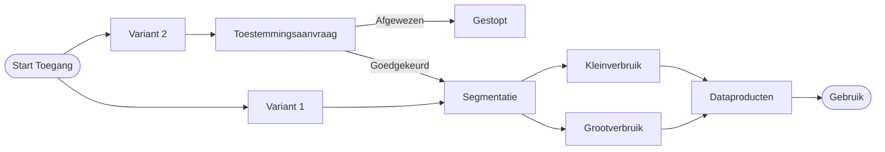

# DVU – Overzicht & Kernconcepten

Via DVU (Datastelsel Verduurzaming Utiliteit) kunnen gebouweigenaren toegang tot energiedata van hun gebouwen beheren op een gecontroleerde, transparante en herleidbare manier. Deze pagina geeft je een snel, functioneel begrip voordat je de implementatiegidsen volgt.

## Wat lost DVU op?
Organisaties hebben vaak versnipperde, traag verkrijgbare of juridisch onduidelijke toegang tot energiedata voor verduurzamingsdoeleinden. DVU standaardiseert:

- Toestemmingen (via 2 varianten) – zie [Toegangsmodel](access-model.md) voor details
- Uniforme data voor verschillende marktsegmenten (kleinverbruik vs grootverbruik)
- Data-aflevering via Smart Data Solutions (SDS)

## Hoe start een toegangsaanvraag?
Er zijn twee manieren (varianten) om een toegangsaanvraag te starten, beiden leiden vroegtijdig naar één standaard proces. Dit voorkomt dubbele logica, en hierdoor blijft het beheer overzichtelijk. Zie het [toegangsmodel](access-model.md) voor een diepgaande uitleg van beide varianten.

| Route | Initiator | Toelichting | Wanneer gebruiken |
|-------|-----------|-------------|-------------------|
| Variant 1 (Self-service) | Rechthebbende (contractant / eigenaar) | De gebruiker is de rechthebbende van de data en kan de aanvraag direct controleren | Interne verduurzaming / eigen dashboards |
| Variant 2 (Externe aanvraag) | Dataservice consumer (derde applicatie) | Een derde applicatie wil toegang tot de data van de rechthebbende en start te aanvraag | Externe tooling / adviesdienst |

## Procesoverzicht
Deze pagina biedt een beknopt overzicht van het proces van een toegangsaanvraag. Het volledige proces, inclusief segmentatie en automatisering, wordt functioneel uitgewerkt in het [toegangsmodel](access-model.md). Voor businesscontext en achtergrondinformatie over beide varianten, raadpleeg [Access Energy Data](access-energydata.md) – deze pagina is vooral relevant voor dataservice consumers, maar bevat ook algemene procesinformatie.

Hieronder wordt de basis van het proces weergegeven in een flowchart. In de technische implementatiegidsen ([Single Building Access](single-building.md), [Bulk Building Access](bulk-buildings.md), en [Direct EAN Access](direct-ean.md)) zijn gedetailleerde sequence-diagrammen te vinden. Let op: deze implementatiegidsen zijn uitsluitend van toepassing op **variant 2** (externe aanvraag via dataservice consumer). Voor **variant 1** (self-service door rechthebbende) is er géén aparte technische implementatiegids, omdat dit proces via de DVU-applicatie zelf verloopt.

## Beschikbare dataproducten
**Operationeel:**

- Meterdata volgens P4-formaat (alleen jaarverbruik of alle data)
- RVO-benchmark

**In voorbereiding (onder voorbehoud):**

- 24 maanden dagstanden
- Standaard jaarverbruik (uitbreiding op P4-context)

Uitbreiding wordt gefaseerd geactiveerd na governance en technische integratie.

## Wat heb je nodig voor integratie?
Als je DVU wilt integreren binnen je eigen applicatie, dan is het volgende nodig:
- Keyper Approve-integratie (transactielink + redirect flow)
- Bekendheid met policies
- Endpoint-toegang tot SDS-levering (afhankelijk van product)

## Volgende stappen
Als de basis duidelijk is, kunnen de implementatiegidsen worden geraadpleegd:

**Nieuw bij DVU?**
- [Getting Started](getting-started.md) - Van nul naar je eerste API call in 30 minuten

**Implementatiegidsen (Variant 2 - Externe aanvraag):**
- [Single Building Access](single-building.md) - Toegangsaanvraag voor energiedata van een enkel gebouw
- [Bulk Building Access](bulk-buildings.md) - Toegangsaanvraag voor energiedata van meerdere gebouwen
- [Direct EAN Access](direct-ean.md) - Toegangsaanvraag voor energiedata van gebouwen via EAN referenties
