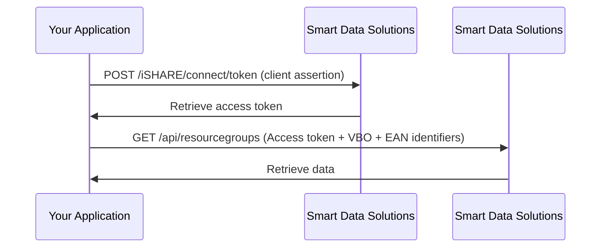

**⚠️ Note**: This documentation is a work in progress, and therefore not yet complete.

# Energy Data Retrieval from SDS

This guide explains how to retrieve energy data from Smart Data Solutions (SDS). All API calls to SDS require a valid iSHARE access token — more information on iSHARE can be found on iSHARE's [Website ➚](https://ishare.eu/) and [Developer Portal ➚](https://dev.ishare.eu/).

## Sequence Diagram

**⚠️ Note**: Complete documentation for SDS data endpoints will be updated once SDS implements query parameter support.



## Generate a client assertion JWT

An iSHARE access token is required to use the SDS API. Generate a client assertion JWT signed with your private key and including your X.509 certificate chain.

### Headers
| JSON path | Filled by | Description                                     |
| :-------- | :-------- | :---------------------------------------------- |
| `alg`     | Fixed     | `RS256`                                         |
| `type`    | Fixed     | `JWT`                                           |
| `x5c`     | App       | Certificate chain `["MIIEfzCCAmegAwIBAgII..."]` |

### Claims
| JSON path | Filled by | Description                                         |
| :-------- | :-------- | :-------------------------------------------------- |
| `iss`     | App       | Your organisation identifier`NL.KVK.<your KVK>`     |
| `sub`     | App       | Your organisation identifier`NL.KVK.<your KVK>`     |
| `aud`     | Fixed     | SDS organisation identifier `NL.KVK.55819206`       |
| `iat`     | App       | Issued at timestamp `<UNIX_TIMESTAMP_NOW>`          |
| `exp`     | App       | Expires at timestamp `<UNIX_TIMESTAMP_NOW_PLUS_30>` |
| `jti`     | App       | JWT identifier `<UUID>`                             |

### Implementation tools

- **.NET**: [Poort8.iSHARE.Core NuGet package ➚](https://github.com/POORT8/Poort8.Ishare.Core/blob/master/README.md)
- **Python**: [iSHARE Python code snippets ➚](https://github.com/iSHAREScheme/code-snippets/blob/master/Python/access_token.py)
- **Other**: [iSHARE Client Assertion specification ➚](https://dev.ishare.eu/reference/ishare-jwt/client-assertion)


## Obtain an iSHARE access token

```http
POST https://dvu-test.azurewebsites.net/iSHARE/connect/token
Content-Type: application/x-www-form-urlencoded
```

| Key | Value |
|-----|-------|
| `grant_type` | `client_credentials` |
| `scope` | `iSHARE` |
| `client_assertion_type` | `urn:ietf:params:oauth:client-assertion-type:jwt-bearer` |
| `client_id` | `NL.KVK.<YOUR_KVK>` |
| `client_assertion` | `<CLIENT_ASSERTION>` |

**200 OK**
```json
{
  "access_token": "<ACCESS_TOKEN>",
  "token_type": "Bearer",
  "expires_in": 3600
}
```

### Step 3: Retrieve SDS energy data

**⚠️ Note**: Complete documentation for SDS data endpoints will be updated once SDS implements query parameter support.

```http
GET https://dvu-test.smartdatasolutions.nl/service
Authorization: Bearer <ACCESS_TOKEN>
```

## Important notes

- **Token validity**: Access tokens are valid for 1 hour (`expires_in: 3600`)
- **Rate limiting**: Respect any API rate limits
- **Client assertion**: Use a new `jti` (JWT ID) for each client assertion to prevent replay attacks
