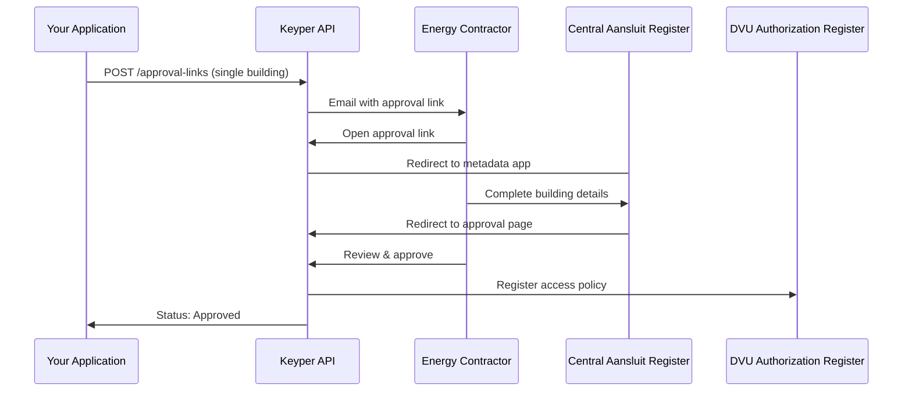

# Single Building Access

This guide explains how to request access to energy data for a single building through DVU using the Keyper Approve workflow.

## Overview

To access energy data for a building through DVU, you need approval from the energy contractor. Your application creates an approval link via the Keyper API. The energy contractor receives the link by email, fills in building details by using CAR information, and approves the request in Keyper. Once approved, a policy is registered in DVU granting you access.

## Sequence diagram



## Minimum payload

| JSON path                                   | Filled by | Description                                                                         |
| :------------------------------------------ | :-------- | :---------------------------------------------------------------------------------- |
| `requester.*`                               | App       | Your name, email, organization, `organizationId` (`NL.KVK.<your KVK>`)              |
| `approver.*`                                | App       | Energy contractor email, organization, `organizationId` (`NL.KVK.<contractor KVK>`) |
| `dataspace.baseUrl`                         | Fixed     | `https://dvu-test.azurewebsites.net`                                                |
| `description`                               | App       | Shown to the approver (optional)                                                    |
| `reference`                                 | App       | Your internal tracking ID (optional)                                                |
| `orchestration.flow`                        | Fixed     | `dvu.voeg-gebouw-toe@v1`                                                            |
| `orchestration.payload.address`             | App       | Building address — see formatting below                                             |
| `orchestration.payload.dataServiceConsumer` | App       | Your organization ID (`NL.KVK.<your KVK>`)                                          |

## JSON example

```text
POST https://keyper-preview.poort8.nl/v1/api/approval-links
Accept: application/json
Authorization: Bearer <ACCESS_TOKEN>
Content-Type: application/json
```

```json
{
  "approver": {
    "email": "somebody@domain.extension",
    "organization": "Poort8",
    "organizationId": "NL.KVK.76660680"
  },
  "dataspace": {
    "baseUrl": "https://dvu-test.azurewebsites.net"
  },
  "requester": {
    "name": "Alice Data End User",
    "email": "alice@dataenduser.nl",
    "organization": "wonderland",
    "organizationId": "NL.KVK.12345678"
  },
  "description": "DVU energy data access request for single building",
  "reference": "BUILDING-001",
  "orchestration": {
    "flow": "dvu.voeg-gebouw-toe@v1",
    "payload": {
      "address": "1341 BA 1",
      "dataServiceConsumer": "NL.KVK.41265782"
    }
  }
}
```

### Building address formatting

- Postal code + house number only: `"<postal code> <house number>"` (e.g., `"1341 BA 1"`)

- Full address: `"<street name> <house number> <postal code> <city>"` (e.g., `"Stationsplein 45 3013 AK Rotterdam"`)

## Example response

**200 OK**

```json
{
  "id": "474e19af-8165-4b85-ad03-be81f9f8dcc2",
  "reference": "BUILDING-001",
  "url": "https://keyper-preview.poort8.nl/approve?id=474e19af-8165-4b85-ad03-be81f9f8dcc2&app=dvu",
  "expiresAtUtc": 1759834340,
  "status": "Active"
}
```

| Field          | Description                                                   |
| :------------- | :------------------------------------------------------------ |
| `id`           | Unique identifier for the approval link (generated by Keyper) |
| `reference`    | Your tracking reference                                       |
| `url`          | Approval link sent to the energy contractor via email         |
| `expiresAtUtc` | Unix timestamp when the link expires (1 hour after creation)  |
| `status`       | `Active`, `Approved`, `Rejected`, or `Expired`                |

## Common errors

| Status | Scenario                        | Solution                                                                                                                      |
| :----- | :------------------------------ | :---------------------------------------------------------------------------------------------------------------------------- |
| `400`  | Missing or invalid fields       | Check the `errors` object in the response for details                                                                         |
| `401`  | Missing or expired access token | Re-authenticate — see Authentication (README.md#authentication)                                                               |
| `500`  | Server error                    | Retry after a short delay. If persistent, contact [hello@poort8.nl](mailto:hello@poort8.nl) with your reference and timestamp |

> Keyper does not validate organization identifiers for format. Ensure KVK numbers are correct on your side, as invalid identifiers cause issues with access policies and data retrieval.

## Follow-up

After approval, retrieve the building's VBO identifier and associated EAN codes via the DVU API — see Retrieving VBO and EAN Data (vbo-ean-data-retrieval.md).

For requesting access to multiple buildings at once, see Bulk Building Access (bulk-buildings.md).
