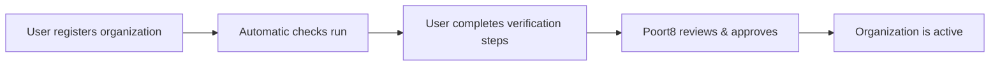

# Organization Registration

> **Note:** This documentation describes the **future state** of the GDS platform. Some features and `gds-preview` links are not yet available.

This page covers how organizations join the Green Data Space — from self-service registration through verification and approval.

## Registration process overview

## Self-service registration

Any user can register their organization through the [Self-Service Portal](https://gds-preview.poort8.nl/portal). The registering user:

1. **Provides organization details** — KvK number (auto-verified via KvK API), organization name, VAT number (optional)
2. **Creates a user account** — name, email, and phone number
3. **Accepts conditions of use**
4. **Receives a password setup email** to activate their account

After registration, the organization has status **"review-pending"** and awaits approval by Poort8.

## Verifications

Each organization undergoes verification checks in three categories.

### Automatic checks

These run automatically during registration:

| Check | What it does | Outcome |
|-------|-------------|---------|
| **Business register (KvK)** | Validates the KvK number via the KvK API and checks the official name | Approved if name matches; rejected if mismatch or not found |

### Organization checks

These require action from the organization's members:

| Check | What it does | Outcome |
|-------|-------------|---------|
| **Email verification** | Confirms the user's email via a verification link | Approved when user clicks the link |

### Dataspace operator checks

| Check | What it does | Outcome |
|-------|-------------|----------|
| **Onboarding approval** | Poort8's final decision on participation | Approved, rejected, or revoked |

## Approval process

After registration, Poort8 reviews the organization's details — including the business register check, and email verification status — and approves or rejects participation.

> **EUID cannot be changed.** If an organization registered with an incorrect KvK number, it must be deleted and re-registered with the correct details. Contact Poort8 if this occurs.

## Organization identifiers

Each organization in GDS is identified by an EUID (European Unique Identifier):

| Country | Format | Example |
|---------|--------|---------|
| Netherlands | `NLNHR.{kvkNumber}` | `NLNHR.12345678` |

This identifier is used throughout the dataspace for policies, tokens, and authorization checks.
