# Green Data Space (GDS)

The Green Data Space (GDS) is a dataspace for secure, sovereign data sharing in the built environment. It enables building management platforms to access IoT sensor data — with explicit building owner approval — while keeping data owners in full control.

GDS is built on Poort8's NoodleBar dataspace technology and uses a Keycloak-based Participant Registry for identity management.

## Key capabilities

- **Organization onboarding** — Self-service registration with automated business register (KvK) verification
- **API catalogue** — Discover and request access to data services registered by providers
- **OAuth2-based access** — Standardized token-based authentication for machine-to-machine API calls
- **Policy-based authorization** — Building owners approve access through Keyper; policies are enforced on every data request
- **Data sovereignty** — Building owners maintain control and can revoke access at any time

## Participants

GDS involves four participant personas:

| Persona | Role | Primary tool |
|---------|------|--------------|
| **Alice** — Building Manager | Manages building operations, consumes sensor data | Self-Service Portal |
| **Bob** — Building Owner | Owns or controls building data; approves or rejects access requests | Self-Service Portal / Email |
| **Charlie** — IoT Sensor Platform | Registers APIs and provides building sensor data | Self-Service Portal |
| **David** — Building Management Platform | Registers applications that consume building data APIs | Self-Service Portal |

## How it works

```mermaid
flowchart LR
    subgraph Onboarding
        A[Organization registers] --> B[Admin verifies & approves]
    end
    subgraph Access
        C[David registers application] --> D[David requests API access]
        D --> E[Charlie approves access]
    end
    subgraph Authorization
        F[David requests building data via Keyper] --> G[Bob approves]
        G --> H[Policy registered in GDS]
    end
    subgraph Data Exchange
        I[David calls Charlie's API] --> J[Charlie checks policy]
        J --> K[Data delivered]
    end

    B --> C
    E --> F
    H --> I
```

## Two layers of access control

GDS uses two complementary access control mechanisms:

| Layer | Purpose | Managed by |
|-------|---------|------------|
| **API access** (Participant Registry) | Controls which applications can call which APIs | Charlie approves David's access request |
| **Data authorization** (Authorization Registry) | Controls which data a consumer can access for specific buildings | Bob approves via Keyper |

API access grants the ability to call an API. Data authorization determines which buildings and actions are permitted within that API.

## Environments

| Environment | URL |
|-------------|-----|
| Self-Service Portal | [gds-preview.poort8.nl/portal ➚](https://gds-preview.poort8.nl/portal) |
| GDS API documentation | [gds-preview.poort8.nl/scalar ➚](https://gds-preview.poort8.nl/scalar/) |
| Keyper (approval workflow) | [keyper-preview.poort8.nl ➚](https://keyper-preview.poort8.nl/) |

## Choose your path

| I want to... | Read |
|--------------|------|
| Understand the technical architecture | [Architecture](architecture.md) |
| Register my organization | [Organization Registration](onboarding.md) |
| Use the self-service portal | [Self-Service Portal](portal-guide.md) |
| Consume building data (David) | [Requesting API Access](requesting-api-access.md) then [Keyper Approval Workflow](approval-workflow.md) |
| Provide building data (Charlie) | [Validating API Tokens](validating-api-tokens.md) then [Authorization Enforcement](authorization.md) |

## Background

For background on Organization Registry, Authorization Registry, and core dataspace concepts, see the [NoodleBar documentation](../noodlebar/).
