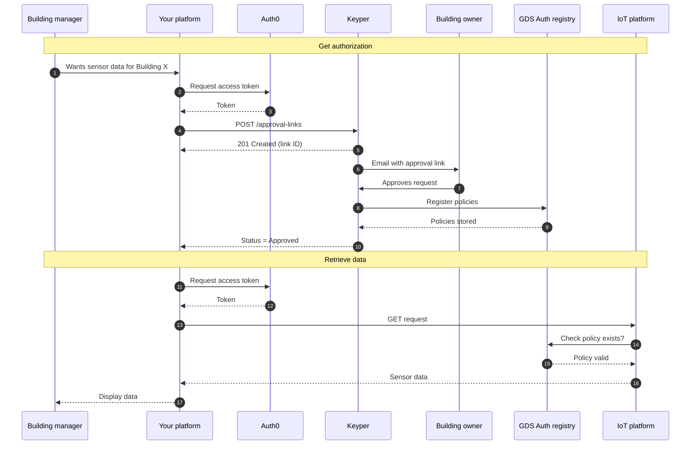

# GDS Architecture
This guide explains the architecture of GDS, displaying the system beyond the high-level overview.

## System components
GDS consists of several interconnected components, each with a specific responsibility:

### NoodleBar (core infrastructure)
NoodleBar is Poort8's dataspace technology providing the foundation for GDS. It consists of:
- **Organization Registry**: Maintains a registry of all participating organizations (IoT providers, building management platforms, building owners)
- **Authorization Registry**: Stores and enforces access policies determining who can access what data
- **Authentication Service**: Verifies participant identities using OAuth2 tokens

Think of NoodleBar as the "trust layer" – it ensures all participants are who they claim to be and enforces the rules about data access.

### Keyper Approve (approval workflow manager)
Keyper manages the approval workflow when a building management platform requests access to building data:
- Sends approval requests to building owners via email
- Provides a secure web interface for reviewing and approving/rejecting requests
- Verifies approver identity through email-based one-time codes
- Registers approved policies in the Authorization Registry

Keyper bridges the gap between technical authorization systems and human decision-making.

### Data service provider connector (IoT platform side)
The IoT sensor platform (Charlie) implements a connector that:
- Exposes standardized REST API endpoints for sensor data
- Checks the Authorization Registry before responding to any data request
- Only returns data when valid policies exist
- Provides endpoints for all data transactions (measurements, control)

This connector enables existing IoT platforms to participate in the dataspace without major system redesign.

### Data service consumer application (building management side)
The building management platform (David) implements:
- Integration with Keyper to request approvals
- API calls to Data Service Provider connectors to retrieve/send data
- User interface for building managers (Bob) to work with sensor data
- Business logic for optimization, analytics, etc.

In the GDS proof-of-concept, Poort8 developed a demo prototype demonstrating this role.

## How authorization works
Authorization in GDS follows a **policy-based** model. Understanding this is key to understanding how the system maintains data sovereignty.

### Policy basics
A **policy** is a formal statement granting permission. Each policy specifies:
- **Who** is allowed to do something (the data service consumer organization)
- **What action** they can perform (`GET` for just viewing the data, or `POST` to set control setpoints)
- **Which resource** they can access (a specific building, identified by BAG number)
- **What data** they can access (sensor metadata, measurements, control capabilities)
- **Time constraints** (when the permission is valid, when it expires)
- **Who granted it** (the building owner organization)

These are some basic fundamental properties that each policy will contain:
- **`issuer`**: The party who grants the permission, in this case the building owner organization (Alice's company).
- **`subject`**: The party to whom the policy is granted to, in this case the building management platform (David's company).
- **`serviceProvider`**: The party provides the data, in this case the IoT sensor platform (Charlie's company).
- **`action`**: The action that the subject can perform, in this case `GET` or `POST`.
- **`resource`**: The resource for which the subject can perform the action, in this case a specific building identified by its BAG number.

For complete policy details and how to request policies, see the [developer guide for building management platforms](consumer-approval-guide.md).

### Policy enforcement flow
Every time a data request occurs:
1. **Data service consumer** sends request to **data service provider** with authentication token.
2. **Data service provider** extracts requestor identity from token.
3. **Data service provider** queries **Authorization Registry**: "Does a policy exist allowing this organization to perform this action on this resource?"
4. **Authorization Registry** checks stored policies:
   - If valid policy exists: the organization is allowed to perform the action on the resource
   - If no policy exists or policy expired: the organization is not allowed to perform the action on the resource
5. **Data service provider** either fulfills or rejects the request accordingly

## Approval workflow
Let's trace what happens when a building management platform requests access to sensor data.

### Step-by-step approval process

#### 1. Request initiation
- Building manager (Bob) identifies a building needing sensor data
- The building management platform (David) that Bob uses sends approval request to Keyper API
- Request includes:
  - What data is needed (sensor metadata, measurements, control)
  - Which building (BAG number)
  - Who is requesting (David's organization ID)
  - Who should approve (Alice's organization ID)
  - On whose behalf (Bob's name/email)

#### 2. Keyper creates approval link
- Keyper receives request and validates it
- Creates a unique approval link (secure, time-limited URL)
- Stores request details temporarily
- Returns approval link ID to requesting platform

#### 3. Building owner notification
- Keyper sends email to building owner (Alice)
- Email contains:
  - Clear description of what's being requested
  - Secure link to approval interface
  - Expiration time (approval links expire if not used)

#### 4. Review & decision
- Keyper displays request details in human-readable format
- Alice sees:
  - Which platform wants access (David)
  - Who will use it (building manager Bob)
  - What data is requested (measurements, control, etc.)
  - Which building (BAG number)
  - How long access will last
- Alice can:
  - Approve (proceed to verification step)
  - Reject (request is denied, requesting party will not be notified)

#### 5. Email verification
If Alice chooses to approve or reject:
- Keyper sends a one-time verification code to Alice's email
- Alice must enter this code to confirm her decision
- This verifies:
  - Alice has access to the registered email address
  - The approval/rejection is intentional and not accidental
  - Alice's identity as the authorized approver

#### 6. Policy registration
- If Alice had approved the request:
  - Keyper registers the policies in GDS
  - The policies are active upon registration
- If Alice had rejected the request:
  - Keyper does not register the policies in GDS

#### 7. Confirmation
- If Alice had approved the request:
  - Alice sees confirmation of her approval
  - Bob can now access the data through the building management platform
- If Alice had rejected the request:
  - Alice sees confirmation of her rejection
  - Bob cannot access the data through the building management platform

### Approval bundling
To reduce approval friction, multiple permissions can be bundled in one request:
- Single approval flow for Bob
- Single email for Alice
- Single authentication session
- Multiple policies created upon approval

Example bundled request:
- Permission to retrieve measurements (read data)
- Permission to send control commands (control)

Alice approves once, two policies are created.

### Important characteristics
**Time-Limited**: Approval links expire (typically after a few days). If Alice doesn't respond, the request becomes invalid and must be re-initiated.
**Revocable**: After approval, Alice can revoke policies anytime through the organization management interface. Revoked policies immediately stop authorizing requests.
**Auditable**: All approval actions are logged. Organizations can see who approved what and when.
**Secure**: Email-based verification ensures only authorized representatives with access to the registered email can approve requests. The one-time code mechanism prevents unauthorized approvals.

### Sequence diagram

## Data exchange process
Once authorization is in place (policies exist), data can flow. Here's how the two transactions work:

### Real-time measurements
**Purpose**: Retrieve current sensor readings.

#### Flow
1. David sends `GET` request to measurements endpoint
2. Request specifies building and optionally sensor group or specific sensors
3. Authorization check validates `GET` permission for measurements
4. If authorized, returns current values
5. David's platform processes data for analytics, dashboards, optimization

### Control commands
**Purpose**: Send setpoint adjustments to building systems.

#### Flow
1. Based on optimization algorithms, David determines desired setpoint changes
2. Sends `POST` request to control endpoint
3. Authorization check validates `POST` permission
4. If authorized, Charlie's platform applies change to building systems

## Security & authentication
GDS implements multiple security measures to ensure safe, sovereign data sharing.

### Participant authentication (OAuth2)
All API requests require authentication tokens:

- Participants authenticate with NoodleBar using **OAuth2 client credentials flow**
- Each organization has client credentials (client ID + secret)
- Authentication returns a JWT (JSON Web Token) containing:
  - Organization identity
  - Token expiration
  - Scopes/permissions

Tokens are short-lived (typically minutes to hours) and must be refreshed regularly.

### Request authorization (policy enforcement)
Even with valid authentication, requests are only fulfilled if:
- A policy exists granting the specific permission
- The policy is currently valid (not expired, not revoked)
- The request scope matches the policy scope

**Authentication** answers "Who are you?"  
**Authorization** answers "What are you allowed to do?"

### Owner approval (email verification)
Building owners verify their identity using **email-based one-time codes**:
- Verification code sent to registered email address
- Code must be entered to confirm approval or rejection decisions
- Time-limited codes (typically expire after a few minutes)
- Ensures approver has access to the authorized email account

This ensures only authorized representatives with access to the registered email can approve data sharing.

### Layer 4: Transport security
- All API communication over HTTPS (TLS 1.2+)
- Prevents eavesdropping and man-in-the-middle attacks
- Certificate validation ensures endpoint authenticity

### Layer 5: Audit logging
All authorization decisions and data access are logged:
- Who accessed what data
- When access occurred
- What action was performed
- Whether authorization succeeded or failed

Logs support compliance, debugging, and incident response.

### Privacy considerations
While GDS focuses on building sensor data (not personal data), privacy principles are built-in:
- **Data minimization**: Only approved data is shared
- **Purpose limitation**: Policies can specify intended use
- **Transparency**: Building owners see exactly what's shared
- **Control**: Easy revocation of access

If GDS were extended to include personal data (e.g., occupancy sensors identifying individuals), GDPR compliance would require additional privacy measures.

## Technical standards
GDS builds on established and emerging standards.

### OAuth 2.0
Industry-standard authentication protocol. GDS uses:
- **Client credentials grant**: For machine-to-machine authentication between systems
- **JWT tokens**: For conveying participant identity and permissions

### iSHARE
GDS is designed to be **iSHARE-ready**:
- iSHARE is a framework for sovereign data sharing
- Specifies authentication, authorization, and trust frameworks
- GDS's policy-based authorization aligns with iSHARE delegation evidence model
- Future versions may implement full iSHARE compliance

### REST API architecture
All data exchanges use RESTful APIs:
- Standard HTTP methods (GET, POST, PUT, DELETE)
- JSON payloads
- Predictable resource naming
- HTTP status codes for responses

### OpenAPI/Scalar
API documentation uses:
- **OpenAPI 3.x** specification for API definitions
- **Scalar** for interactive API documentation
- Enables developers to explore and test APIs easily

## Deployment architecture

### Current proof-of-concept setup
The GDS PoC is deployed with the following structure:

**NoodleBar instance**:
- Hosted by Poort8
- URL: `https://gds-preview.poort8.nl`
- Provides Organization Registry and Authorization Registry APIs
- Shared infrastructure serving all GDS participants

**Keyper**:
- Hosted by Poort8
- URL: `https://keyper-preview.poort8.nl`
- Manages approval workflows

**Data service provider connector**:
- Deployed by IoT sensor platform (Charlie)
- Implements GDS-compliant REST API
- Communicates with NoodleBar for authorization checks
- Connects to internal sensor data systems

**Data service consumer application**:
- Deployed by building management platform (David)
- Or: Demo prototype hosted by Poort8 for PoC demonstration
- Implements approval request flows
- Calls data service provider APIs for data retrieval

## Summary
GDS demonstrates that **sovereign, federated data sharing** is achievable through:
1. **Clear component separation**: Each system has a specific role (authorization, approval, data provision, data consumption)
2. **Policy-based authorization**: Formal policies enforced on every request
3. **Human-friendly approval**: Building owners make informed decisions through clear interfaces
4. **Standards-based integration**: OAuth2 and REST APIs
5. **Security in depth**: Multiple layers from authentication to audit logging

The architecture enables **interoperability** (participants can join without custom integration), **sovereignty** (data owners maintain control), and **scalability** (adding participants doesn't require n-to-n integrations).

## Next Steps

### For building management platform developers
Ready to implement GDS integration? See the developer guide:
- **[Requesting Building Data Access](consumer-approval-guide.md)** – Implement the Keyper approval workflow to request access to building sensor data

### If you have questions
Contact Poort8 for more information about implementing GDS connectors or participating in dataspace initiatives.

### Learn More About Underlying Technology
- **[NoodleBar Documentation](../noodlebar/)** – Detailed docs on the dataspace platform
- **[Keyper Documentation](https://keyper-preview.poort8.nl/scalar/?api=v1)** – API reference for approval workflows