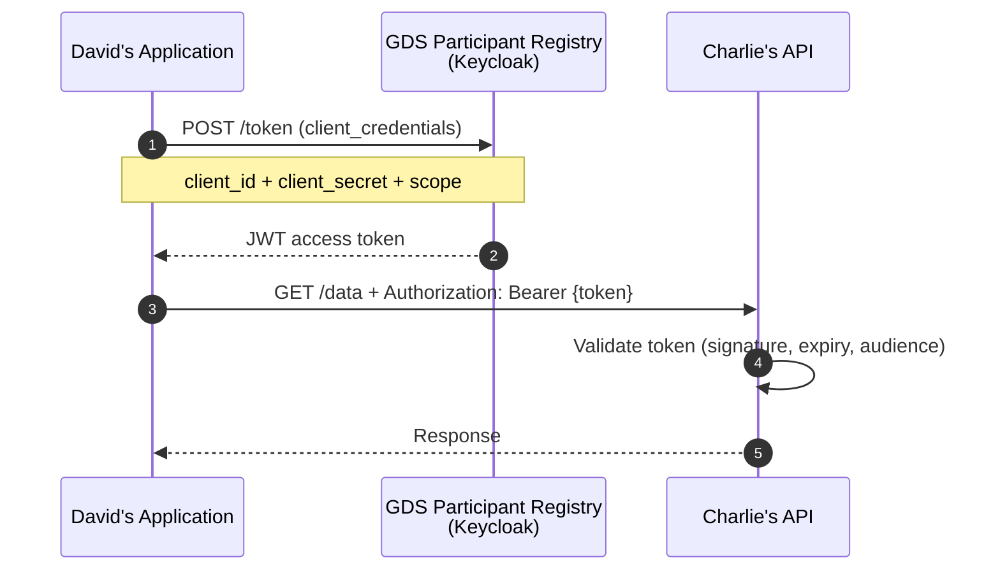
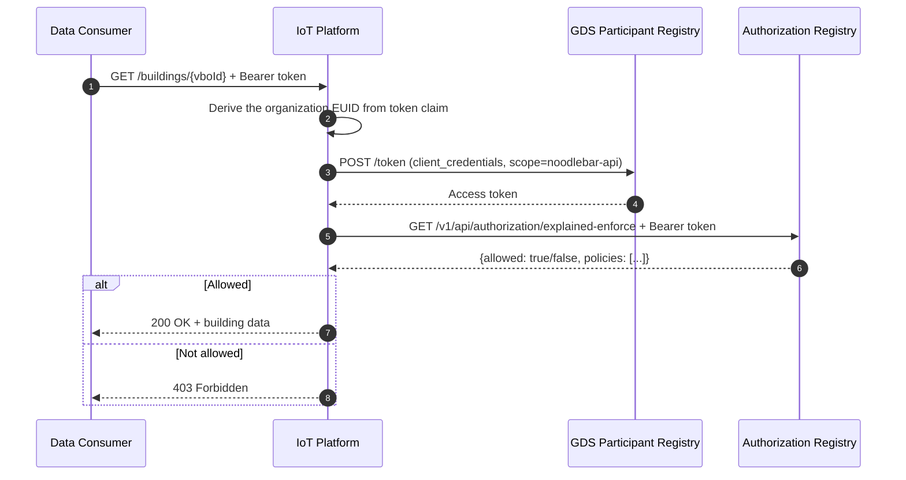

# Architecture

This guide explains how the GDS components work together to enable sovereign building data sharing.

## System components

This sequence shows the end-to-end interaction order in two phases: first approval and policy registration, then data access with policy enforcement.

```likec4
// view: architecture_end_to_end
specification {
    element actor
    element system
}

model {
    david = actor 'David\'s Platform'
    kc = system 'GDS Participant Registry (Keycloak)'
    keyper = system 'Keyper Approve'
    bob = actor 'Building Owner (Bob)'
    ar = system 'GDS Authorization Registry'
    charlie = system 'Charlie\'s IoT Platform'
}

views {
    dynamic view architecture_end_to_end {
        title 'GDS End-to-End Flow'
        variant sequence

        david -> kc 'Request token for Keyper API'
        kc -> david 'JWT access token'
        david -> keyper 'POST /v1/api/approval-links'
        keyper -> david '201 Created (approval link ID)'
        keyper -> bob 'Email with approval link'
        bob -> keyper 'Approves + enters verification code'
        keyper -> ar 'Registers policies'
        ar -> keyper 'Policies stored'

        david -> kc 'Request token for provider API'
        kc -> david 'JWT access token'
        david -> charlie 'GET /data + Bearer token'
        charlie -> kc 'Request token for NoodleBar API (client_credentials)'
        kc -> charlie 'Access token'
        charlie -> ar 'GET /v1/api/authorization/explained-enforce + Bearer token'
        ar -> charlie 'HTTP 200: {allowed: true/false, policies}'
        charlie -> david 'If allowed: 200 + data / If denied: 403'
    }
}
```

### GDS Participant Registry

The Participant Registry is a Keycloak-based identity service that manages:

- **Organization identities** — Registration, verification, and approval
- **User accounts** — Credentials, email verification, and organization membership
- **Application registrations** — OAuth2 clients for data service consumers (David)
- **API registrations** — Service definitions for data service providers (Charlie)
- **Access management** — API-level access grants between consumers and providers

The Participant Registry acts as the OAuth2 authorization server. It issues JWT access tokens that consumers present to providers.

**URL:** `https://gds-preview.poort8.nl`

### GDS Authorization Registry (NoodleBar)

The Authorization Registry stores and enforces data-level access policies:

- **Organization Registry** — Master list of all participating organizations
- **Authorization Registry** — Policy storage and enforcement (who can access what building data)

Policies are registered by Keyper after building owner approval. Data service providers query the Authorization Registry on every data request to verify the consumer is authorized.

**URL:** `https://gds-preview.poort8.nl` (same deployment, different API surface)

### Keyper Approve

Keyper manages the human approval workflow:

- Receives approval requests from data service consumers
- Sends email notifications to building owners
- Provides a secure web interface for reviewing and approving requests
- Verifies approver identity through email-based one-time codes
- Registers approved policies in the Authorization Registry

**URL:** `https://keyper-preview.poort8.nl`

## Authentication flow

All API communication uses OAuth2 with Keycloak as the identity provider.


```mermaid
sequenceDiagram
    autonumber
    participant App as David's Application
    participant KC as GDS Participant Registry<br/>(Keycloak)
    participant API as Charlie's API

    App->>KC: POST /token (client_credentials)
    Note over App,KC: client_id + client_secret + scope
    KC-->>App: JWT access token
    App->>API: GET /data + Authorization: Bearer {token}
    API->>API: Validate token (signature, expiry, audience)
    API-->>App: Response
```

**Token endpoint:**
```
https://auth.poort8.nl/realms/gds-preview/protocol/openid-connect/token
```

**JWKS endpoint (for token validation):**
```
https://auth.poort8.nl/realms/gds-preview/protocol/openid-connect/certs
```

Tokens are short-lived (5 minutes) and include an `organization` claim identifying the consumer's verified organization. The same token endpoint serves both provider API calls (scope: the API's client ID) and Keyper API calls (scope: `keyper-api`), so a single registered M2M application is sufficient for all GDS interactions.

## Authorization model

Authentication answers "who are you?" — authorization answers "what are you allowed to do?"

GDS uses a **policy-based** authorization model. Even with a valid token and API access, data requests are only fulfilled when a matching policy exists in the Authorization Registry.

### Policy structure

Each policy specifies:

| Field | Description | Example |
|-------|-------------|---------|
| `issuerId` | Building owner who granted access (Bob) | `NLNHR.87654321` |
| `subjectId` | Organization consuming data (David) | `NLNHR.12345678` |
| `serviceProvider` | IoT platform providing data (Charlie) | `NLNHR.23456789` |
| `type` | Resource type: `building` or `asset` | `building` |
| `resourceId` | Resource identifier (VBO ID or asset ID) | `0363010000659001` |
| `action` | Permitted action: `GET` or `POST` | `GET` |

### Policy enforcement flow


```mermaid
sequenceDiagram
    autonumber
    participant David as Data Consumer
    participant Charlie as IoT Platform
    participant KC as GDS Participant Registry
    participant AR as Authorization Registry

    David->>Charlie: GET /buildings/{vboId} + Bearer token
    Charlie->>Charlie: Derive the organization EUID from token claim
    Charlie->>KC: POST /token (client_credentials, scope=noodlebar-api)
    KC-->>Charlie: Access token
    Charlie->>AR: GET /v1/api/authorization/explained-enforce + Bearer token
    AR-->>Charlie: {allowed: true/false, policies: [...]}
    alt Allowed
        Charlie-->>David: 200 OK + building data
    else Not allowed
        Charlie-->>David: 403 Forbidden
    end
```

## Two access control layers

GDS separates API-level access from data-level authorization:

| Layer | What it controls | Who decides | When |
|-------|-----------------|-------------|------|
| **API access** | Can David's app call Charlie's API at all? | Charlie (via portal) | During onboarding |
| **Data authorization** | Can David access building X's sensor data? | Bob (via Keyper) | Per building, on request |

Both layers must be satisfied for data to flow. A consumer needs:
1. API access (granted by the provider through the portal)
2. A valid policy for the specific building (granted by the building owner through Keyper)

## Security layers

| Layer | Mechanism | Purpose |
|-------|-----------|---------|
| Transport | HTTPS (TLS 1.2+) | Encrypted communication |
| Authentication | OAuth2 + JWT | Verified participant identity |
| API access | Keycloak audience/scope | Authorized to call the API |
| Data authorization | Policy enforcement | Authorized to access specific data |
| Approval | Email verification (one-time code) | Human consent for data sharing |
| Audit | Logged authorization decisions | Compliance and incident response |

## Technical standards

| Standard | Usage in GDS |
|----------|--------------|
| OAuth 2.0 (client credentials) | Machine-to-machine authentication |
| JWT (RS256) | Token format with organization identity |
| JWKS | Public key distribution for token validation |
| REST / JSON | All API communication |
| OpenAPI 3.x | API specification format |
| iSHARE | Policy model for authorization enforcement |
