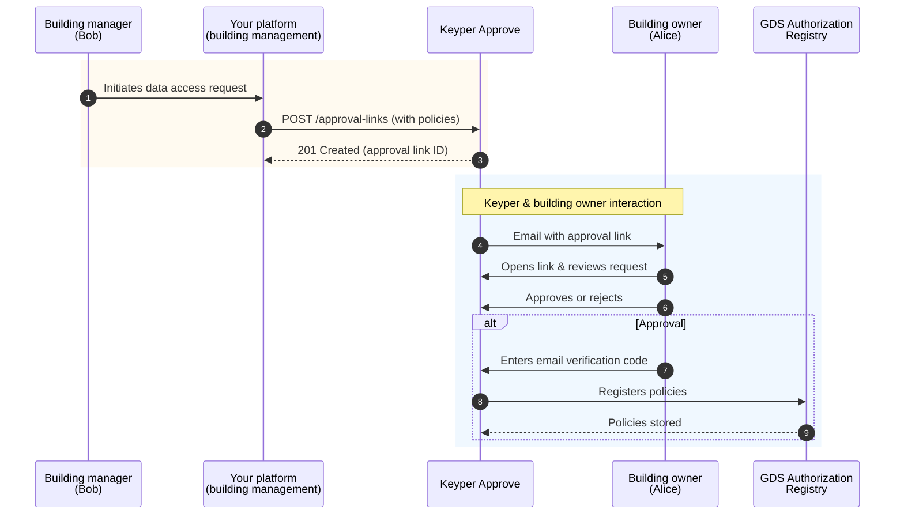

# GDS Implementation Guide: Requesting Building Data Access

**For building management platforms**

This guide is for developers building **building management platforms** who need to request access to building sensor data through GDS. It covers how to implement the Keyper Approve workflow to obtain authorization from building owners.

> **Note:** Building management platforms are a type of **data service consumer** in GDS terminology – any platform that consumes data from data service providers. While this guide focuses on building management platforms specifically, the same workflow applies to other types of data service consumers.

## Who is this guide for?
This guide is specifically for **building management platforms** that:
- Provide building optimization, analytics, or management services
- Need access to sensor data from buildings
- Must obtain building owner approval before accessing data


## What this guide covers
This guide focuses **exclusively on the approval request process** through Keyper:
- Authenticating with the Keyper API
- Creating approval requests
- Understanding policy types (GET for data retrieval, POST for control)
- Bundling multiple permissions in one request
- Handling approval responses and errors

**What this guide does NOT cover:**
- How to retrieve actual sensor data after approval (covered in a separate guide)
- How to send control commands after approval (covered in a separate guide)
- How to implement a data service provider connector (IoT platform integration)


## Overview of the approval workflow
Before diving into implementation, this is what the approval workflow looks like:




## Before You Begin

### Prerequisites
- **OAuth2 client credentials for Keyper**: Contact Poort8 at hello@poort8.nl to request client credentials.
- **HTTP client**: Any REST client (curl, Postman, or your programming language's HTTP library).

### Development environment
- **Test environment**: `https://keyper-preview.poort8.nl`
- **Production environment**: Contact Poort8 for production access.


## Step 1: Prepare required data
Before making an approval request, gather the following information:

### Requester information (your platform)
- `name`: Name of the person initiating the request (e.g., "Bob Anderson")
- `email`: Email address of the person initiating the request
- `organization`: Your organization's name (e.g., "Building Optimization Corp")
- `organizationId`: Your organization's identifier in KvK format (e.g., "NL.KVK.12345678")

### Approver information (building owner)
- `name`: Name of the building owner who will approve (e.g., "Alice Johnson")
- `email`: Email address where approval link will be sent
- `organization`: Building owner's organization name
- `organizationId`: Building owner's organization identifier in KvK format (e.g., "NL.KVK.87654321")
  - How to get: Ask the building owner directly, or look up via [KvK Business Register](https://www.kvk.nl/english/)
  - **Note**: This must be registered in the GDS Organization Registry. Contact Poort8 if you encounter organizations not yet registered.

### Dataspace information
- `baseUrl`: GDS dataspace URL: `https://gds-preview.poort8.nl`

### Request tracking
- `reference`: A unique identifier from your system to track this approval request (e.g., transaction ID, case number, or any string that helps you correlate this request with your business process)

### Building and policy information
For each building you need access to, prepare:
- `resourceId`: The building identifier (BAG number)
  - **What it is**: BAG (Basisregistratie Adressen en Gebouwen) is the Dutch national building registry number
  - **Format**: 16 digits (e.g., "0363010000659001")
  - **How to get it**: Building owners typically provide this, or you can look it up via [PDOK BAG API](https://www.pdok.nl/introductie/-/article/basisregistratie-adressen-en-gebouwen-ba-1) using the building address
  - **Important**: This must match exactly - an incorrect BAG number will result in authorization failures
- `serviceProvider`: The IoT platform organization ID that manages the building's sensors in KvK format (e.g., "NL.KVK.23456789")
  - How to get: Ask the building owner which company installed/manages their sensors, they should know their IoT service provider's organization details
- **Policy type(s)**: What access you need (see Step 3 for details)


## Step 2: Authenticate with Keyper API
Every request to the Keyper API requires an access token obtained via OAuth2.

> **Getting client credentials:** If you don't have OAuth2 client credentials yet, contact Poort8 at **hello@poort8.nl** to request them.

### Get access token
**Endpoint:**
```http
POST https://poort8.eu.auth0.com/oauth/token
Content-Type: application/json
```

**Request body:**
```json
{
  "client_id": "<YOUR_CLIENT_ID>",
  "client_secret": "<YOUR_CLIENT_SECRET>",
  "audience": "Poort8-Dataspace-Keyper-Preview",
  "grant_type": "client_credentials"
}
```

**Placeholder values:**
- `<YOUR_CLIENT_ID>`: Your client ID (provided by Poort8)
- `<YOUR_CLIENT_SECRET>`: Your client secret (provided by Poort8)

### Successful response
**Status: 200 OK**
```json
{
  "access_token": "eyJhbGciOiJSUzI1NiIsInR5cCI6IkpXVCJ9...",
  "token_type": "Bearer",
  "expires_in": 3600
}
```

**Response fields:**
- `access_token`: Use this token in the `Authorization` header for Keyper API requests
- `token_type`: Always "Bearer"
- `expires_in`: Token validity in seconds (typically 3600 = 1 hour)

**Important:** Store the token and reuse it for multiple requests until it expires. Request a new token only when needed.


## Step 3: Understand policy types
GDS uses **policies** to control what actions your platform can perform on building data. There are two policy types:

### Policy type 1: GET (data retrieval)
Grants permission to **retrieve sensor data** from a building.

**Policy properties:**
- `action`: `"GET"`
- `type`: `"/public-api/buildings/"`
- `license`: `"0005"` (fixed value for GDS)
- `useCase`: `"ishare"` (fixed value for GDS)

### Policy Type 2: POST (Control Commands)
Grants permission to **send control commands** to building systems.

**Policy properties:**
- `action`: `"POST"`
- `type`: `"/public-api/buildings/"`
- `license`: `"0005"` (fixed value for GDS)
- `useCase`: `"ishare"` (fixed value for GDS)

### Bundling policies
You can request **both GET and POST permissions in a single approval request** by including multiple policies in the `addPolicyTransactions` array. This reduces approval friction:
- Building owner receives one email
- One approval decision grants both permissions
- Fewer emails and clicks for the approver

**Recommended approach:** Bundle GET and POST together if you need both types of access.


## Step 4: Create approval request
Now you're ready to request approval from the building owner via Keyper.

### Endpoint
```http
POST https://keyper-preview.poort8.nl/v1/api/approval-links
Accept: application/json
Authorization: Bearer <ACCESS_TOKEN>
Content-Type: application/json
```

### Request body structure
**Replace the placeholders** in the example below with the data you prepared in Step 1. The example shows a request for **both GET and POST permissions** in a single approval request (bundled).
```json
{
  "requester": {
    "name": "<REQUESTER_NAME>",              // From Step 1: Requester information
    "email": "<REQUESTER_EMAIL>",
    "organization": "<YOUR_ORGANIZATION_NAME>",
    "organizationId": "<YOUR_ORGANIZATION_ID>"  // Your org ID (KvK format)
  },
  "approver": {
    "name": "<BUILDING_OWNER_NAME>",         // From Step 1: Approver information
    "email": "<BUILDING_OWNER_EMAIL>",       // Approval link will be sent here
    "organization": "<BUILDING_OWNER_ORGANIZATION>",
    "organizationId": "<BUILDING_OWNER_ORGANIZATION_ID>"  // Building owner's org ID (KvK format)
  },
  "dataspace": {
    "baseUrl": "https://gds-preview.poort8.nl"  // Fixed value for GDS
  },
  "reference": "<YOUR_UNIQUE_REFERENCE>",    // From Step 1: Your tracking identifier
  "addPolicyTransactions": [
    {
      // Policy 1: GET permission (data retrieval)
      "type": "/public-api/buildings/",      // Fixed value for GDS
      "action": "GET",                        // Data retrieval action
      "license": "0005",                      // Fixed value for GDS
      "useCase": "ishare",                    // Fixed value for GDS
      "issuedAt": <CURRENT_UNIX_TIMESTAMP>,  // Current time (Unix seconds)
      "issuerId": "<BUILDING_OWNER_ORGANIZATION_ID>",  // Who grants permission, so the approver org ID 
      "attribute": "*",                       // All building data
      "notBefore": <CURRENT_UNIX_TIMESTAMP>, // When policy becomes valid
      "subjectId": "<YOUR_ORGANIZATION_ID>", // Who receives permission (you), so the requester org ID
      "expiration": <EXPIRATION_UNIX_TIMESTAMP>,  // When policy expires (e.g., 2147483647 for max)
      "resourceId": "<BUILDING_BAG_NUMBER>", // 16-digit BAG number
      "serviceProvider": "<IOT_PLATFORM_ORGANIZATION_ID>"  // Who provides the data
    },
    {
      // Policy 2: POST permission (control commands)
      "type": "/public-api/buildings/",
      "action": "POST",                       // Control action
      "license": "0005",
      "useCase": "ishare",
      "issuedAt": <CURRENT_UNIX_TIMESTAMP>,
      "issuerId": "<BUILDING_OWNER_ORGANIZATION_ID>",
      "attribute": "*",
      "notBefore": <CURRENT_UNIX_TIMESTAMP>,
      "subjectId": "<YOUR_ORGANIZATION_ID>",
      "expiration": <EXPIRATION_UNIX_TIMESTAMP>,
      "resourceId": "<BUILDING_BAG_NUMBER>",
      "serviceProvider": "<IOT_PLATFORM_ORGANIZATION_ID>"
    }
  ],
  "orchestration": {
    "flow": "gds.sensor-optimization@v1"     // Fixed value for GDS
  }
}
```

**Key notes:**
- **Unix timestamps**: Use seconds since epoch, not milliseconds
- **Fixed values**: `type`, `license`, `useCase`, and `orchestration.flow` must match exactly as shown
- `issuerId`: Building owner's organization ID (who grants permission)
- `subjectId`: Your organization ID (who receives permission)
- `expiration`: Use `2147483647` for effectively "no expiration" (max Unix timestamp, year 2038)

For complete field documentation, see the [Keyper API reference](https://keyper-preview.poort8.nl/scalar/?api=v1#tag/approval-links/post/v1/api/approval-links).

### Example with real values
Here's a concrete example with all placeholders replaced:
```json
{
  "requester": {
    "name": "Bob Anderson",
    "email": "bob@buildingopt.com",
    "organization": "Building Optimization Corp",
    "organizationId": "NL.KVK.12345678"
  },
  "approver": {
    "name": "Alice Johnson",
    "email": "alice@ownerco.com",
    "organization": "Property Management Inc",
    "organizationId": "NL.KVK.87654321"
  },
  "dataspace": {
    "baseUrl": "https://gds-preview.poort8.nl"
  },
  "reference": "SENSOR-OPT-2025-Q4-001",
  "addPolicyTransactions": [
    {
      "type": "/public-api/buildings/",
      "action": "GET",
      "license": "0005",
      "useCase": "ishare",
      "issuedAt": 1730736000,
      "issuerId": "NL.KVK.87654321",
      "attribute": "*",
      "notBefore": 1730736000,
      "subjectId": "NL.KVK.12345678",
      "expiration": 2147483647,
      "resourceId": "0363010000659001",
      "serviceProvider": "NL.KVK.23456789"
    },
    {
      "type": "/public-api/buildings/",
      "action": "POST",
      "license": "0005",
      "useCase": "ishare",
      "issuedAt": 1730736000,
      "issuerId": "NL.KVK.87654321",
      "attribute": "*",
      "notBefore": 1730736000,
      "subjectId": "NL.KVK.12345678",
      "expiration": 2147483647,
      "resourceId": "0363010000659001",
      "serviceProvider": "NL.KVK.23456789"
    }
  ],
  "orchestration": {
    "flow": "gds.sensor-optimization@v1"
  }
}
```


## Step 5: Handle responses

### Successful response
**Status: 201 Created**
```json
{
  "id": "474e19af-8165-4b85-ad03-be81f9f8dcc2",
  "reference": "SENSOR-OPT-2025-Q4-001",
  "url": "https://keyper-preview.poort8.nl/approve/474e19af-8165-4b85-ad03-be81f9f8dcc2",
  "expiresAtUtc": 1730739600,
  "status": "Active"
}
```

**Response fields:**
- `id`: Unique approval link ID (generated by Keyper)
- `reference`: Your tracking reference (echoed from request)
- `url`: The approval link sent to the building owner via email
- `expiresAtUtc`: Unix timestamp when the link expires (typically 1 hour after creation)
- `status`: Current status of the approval request

**Possible status values:**
- `Active`: Approval link created and sent, awaiting building owner's decision
- `Approved`: Building owner approved the request, policies are registered
- `Rejected`: Building owner rejected the request
- `Expired`: Approval link expired before building owner responded

**What happens next:**
1. Keyper sends an email to the building owner (`approver.email`)
2. Building owner clicks the link and reviews the request
3. Building owner approves or rejects
4. If approved, building owner enters email verification code
5. Keyper registers policies in GDS Authorization Registry
6. Your platform is notified (see "Checking approval status" below)

### Error responses

#### 400 Bad Request
**Cause:** Missing required fields or invalid data format.

**Example response:**
```json
{
  "statusCode": 400,
  "message": "One or more errors occurred!",
  "errors": {
    "requester.email": [
      "Email cannot be empty."
    ]
  }
}
```

**What to do:**
- Review the `errors` object to identify problematic fields
- Correct the indicated fields
- Retry the request

#### 401 Unauthorized
**Cause:** Missing, invalid, or expired access token.

**Response:** Empty body with HTTP 401 status

**What to do:**
1. Verify you included the `Authorization: Bearer <ACCESS_TOKEN>` header
2. Check if your token has expired (tokens expire after 1 hour)
3. Request a new token from the authentication endpoint (Step 2)
4. Retry with the new token

#### 500 Internal Server Error
**Cause:** Server-side error in Keyper.

**Example response:**
```json
{
  "status": "Internal Server Error!",
  "code": 500,
  "reason": "Object reference not set to an instance of an object.",
  "note": "See application log for stack trace."
}
```

**What to do:**
1. Retry your request after a short delay (the error may be transient)
2. If the error persists, contact Poort8 support at **hello@poort8.nl** with:
   - Your `reference` value
   - The request timestamp
   - The complete error response

> **Note:** Poort8's monitoring system automatically tracks 500 errors, so the team may already be investigating.


## Step 6: Check approval status
After creating an approval request, you can check if the building owner has approved or rejected it by querying Keyper:

**Endpoint:**
```http
GET https://keyper-preview.poort8.nl/v1/api/approval-links/<APPROVAL_LINK_ID>
Authorization: Bearer <ACCESS_TOKEN>
```

**Response:**
```json
{
  "id": "474e19af-8165-4b85-ad03-be81f9f8dcc2",
  "reference": "SENSOR-OPT-2025-Q4-001",
  "status": "Approved",
  "expiresAtUtc": 1730739600
}
```

**Recommended strategy:**
- Poll every 5-10 minutes while status is `Active`
- Stop polling when status changes to `Approved`, `Rejected`, or `Expired`


## Next steps

### After approval is granted
Once the building owner approves your request and the status becomes `Approved`:
1. **Policies are active**: The GET and/or POST policies are now registered in the GDS Authorization Registry
2. **You can access data**: Your building management platform can now make requests to the data service provider (IoT platform)

### Testing
**Test environment:** `https://keyper-preview.poort8.nl`

The test environment is **fully functional** and will:
- Send real emails to the approver's email address
- Create actual policies in the preview Authorization Registry
- Enforce policies when accessing preview data service providers

The test environment uses **separate non-production resources** (preview database, preview registry) so you can safely test without affecting production data.

**Recommendation:** Use the test environment to validate your complete integration before moving to production.

### Production considerations
Before going to production:
1. **Error handling**: Implement robust error handling for all error responses
2. **Token management**: Implement token refresh logic before expiration
3. **Retry logic**: Add exponential backoff for transient errors (500 responses)
4. **Monitoring**: Track approval request success/failure rates
5. **Logging**: Log all requests and responses for debugging
6. **Security**: Never log or expose client secrets


## FAQ

### Q: Can I request access to multiple buildings in one approval request?
**A:** Currently, each approval request is for one building. To request access to multiple buildings, you need to create separate approval requests for each building.

### Q: How long does the building owner have to approve?
**A:** Approval links typically expire after 1 hour. If not approved within this time, you'll need to create a new approval request.

### Q: Can I request only GET or only POST permission instead of both?
**A:** Yes. Simply include only the policy type you need in the `addPolicyTransactions` array. However, bundling both reduces approval friction if you need both types eventually.

### Q: What happens if the building owner rejects my request?
**A:** The approval status will change to `Rejected`. The building owner is not required to provide a reason. You can create a new approval request if needed.

### Q: How do I know which IoT platform organization ID to use for `serviceProvider`?
**A:** The IoT platform organization ID should be provided by the building owner or discovered through the GDS organization registry. Contact Poort8 support if you need assistance identifying the correct service provider.

### Q: Do policies expire?
**A:** Yes, based on the `expiration` timestamp in the policy. The example uses `2147483647` (year 2038) which is effectively permanent for current purposes. You can set a specific expiration date if needed.

### Q: Can I revoke policies after they're approved?
**A:** Policy revocation is managed by the building owner through the organization management interface. Building management platforms cannot revoke policies themselves – only the building owner who granted the permission can revoke it.


## Support
For questions, issues, or support with implementing the Keyper approval workflow:

**Contact Poort8:**  
Email: hello@poort8.nl

**API documentation:**  
Interactive API reference: https://keyper-preview.poort8.nl/scalar/?api=v1

**Related documentation:**
- [GDS Overview](overview.md) – Understanding GDS and its value
- [GDS Architecture](architecture.md) – How GDS components work together