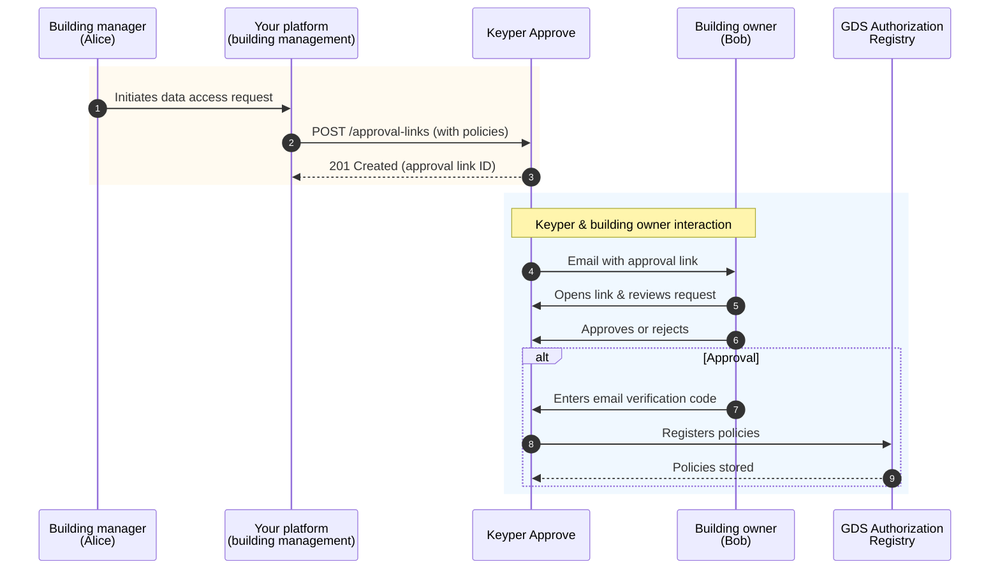

# GDS Implementation Guide: Requesting Building Data Access

**For building management platforms**

This guide is for developers building **building management platforms** who need to request access to building sensor data through GDS. It covers how to implement the Keyper Approve workflow to obtain authorization from building owners.

> **Note:** Building management platforms are a type of **data service consumer** in GDS terminology – any platform that consumes data from data service providers. While this guide focuses on building management platforms specifically, the same workflow applies to other types of data service consumers.

## Who is this guide for?
This guide is specifically for **building management platforms** that:
- Provide building optimization, analytics, or management services
- Need access to sensor data from buildings
- Must obtain building owner approval before accessing data


## What this guide covers
This guide focuses **exclusively on the approval request process** through Keyper:
- Authenticating with the Keyper API
- Creating approval requests
- Understanding policy types (GET for data retrieval, POST for control)
- Bundling multiple permissions in one request
- Handling approval responses and errors

**What this guide does NOT cover:**
- How the data service provider (IoT platform) verifies policies and delivers data — see [Get Building Data (Provider Guide)](provider-enforcement-guide.md)
- How to send control commands after approval (covered in a separate guide)


## Overview of the approval workflow
Before diving into implementation, this is what the approval workflow looks like:


```mermaid
sequenceDiagram
    autonumber
    participant Alice as Building manager<br/>(Alice)
    participant Consumer as Your platform<br/>(building management)
    participant Keyper as Keyper Approve
    participant Owner as Building owner<br/>(Bob)
    participant Auth as GDS Authorization<br/>Registry

    rect rgb(255,250,240)
    Alice->>Consumer: Initiates data access request
    Consumer->>Keyper: POST /approval-links (with policies)
    Keyper-->>Consumer: 201 Created (approval link ID)
    end

    rect rgb(240,248,255)
    note over Keyper,Owner: Keyper & building owner interaction
    Keyper->>Owner: Email with approval link
    Owner->>Keyper: Opens link & reviews request
    Owner->>Keyper: Approves or rejects
    alt Approval
        Owner->>Keyper: Enters email verification code
        Keyper->>Auth: Registers policies
        Auth-->>Keyper: Policies stored
    end
    end
```


## Before You Begin

### Prerequisites
- **OAuth2 client credentials for Keyper**: Contact Poort8 at hello@poort8.nl to request client credentials.
- **HTTP client**: Any REST client (curl, Postman, or your programming language's HTTP library).

### Development environment
- **Test environment**: `https://keyper-preview.poort8.nl`
- **Production environment**: Contact Poort8 for production access.


## Step 1: Prepare required data
Before making an approval request, gather the following information:

### Requester information (your platform's user)
- `name`: Name of the person initiating the request on your platform (e.g., "Alice Anderson")
- `email`: Email address of the person initiating the request
- `organization`: The data service consumer organization's name (e.g., "Building Optimization Corp")
- `organizationId`: The data service consumer organization's identifier in KvK format (e.g., "NL.KVK.12345678")

### Approver information (building owner)
- `name`: Name of the building owner who will approve (e.g., "Bob Johnson")
- `email`: Email address where approval link will be sent
- `organization`: Building owner's organization name
- `organizationId`: Building owner's organization identifier in KvK format (e.g., "NL.KVK.87654321")
  - How to get: Ask the building owner directly, or look up via [KvK Business Register](https://www.kvk.nl/english/)
  - **Note**: This must be registered in the GDS Organization Registry. Contact Poort8 if you encounter organizations not yet registered.

### Dataspace information
- `baseUrl`: GDS dataspace URL: `https://gds-preview.poort8.nl`

### Request tracking
- `reference`: A unique identifier from your system to track this approval request (e.g., transaction ID, case number, or any string that helps you correlate this request with your business process)

### Building and policy information
For each building you need access to, prepare:
- `resourceId`: The building identifier (VBO ID)
  - **What it is**: VBO (verblijfsobject) is a unit in the Dutch BAG (Basisregistratie Adressen en Gebouwen) national building registry
  - **Format**: 16 digits (e.g., "0363010000659001")
  - **How to get it**: Building owners typically provide this, or you can look it up via [PDOK BAG API](https://www.pdok.nl/introductie/-/article/basisregistratie-adressen-en-gebouwen-ba-1) using the building address
  - **Important**: This must match exactly — an incorrect VBO ID will result in authorization failures
- `serviceProvider`: The IoT platform organization ID that manages the building's sensors in KvK format (e.g., "NL.KVK.23456789")
  - How to get: Ask the building owner which company installed/manages their sensors, they should know their IoT service provider's organization details
- **Policy type(s)**: What access you need — see Step 3 for the [policy levels](#policy-levels)


## Step 2: Authenticate with Keyper API
Every request to the Keyper API requires an access token obtained via OAuth2.

> **Getting client credentials:** If you don't have OAuth2 client credentials yet, contact Poort8 at **hello@poort8.nl** to request them.

### Get access token
**Endpoint:**
```http
POST https://poort8.eu.auth0.com/oauth/token
Content-Type: application/json
```

**Request body:**
```json
{
  "client_id": "<YOUR_CLIENT_ID>",
  "client_secret": "<YOUR_CLIENT_SECRET>",
  "audience": "Poort8-Dataspace-Keyper-Preview",
  "grant_type": "client_credentials"
}
```

**Placeholder values:**
- `<YOUR_CLIENT_ID>`: Your client ID (provided by Poort8)
- `<YOUR_CLIENT_SECRET>`: Your client secret (provided by Poort8)

### Successful response
**Status: 200 OK**
```json
{
  "access_token": "eyJhbGciOiJSUzI1NiIsInR5cCI6IkpXVCJ9...",
  "token_type": "Bearer",
  "expires_in": 3600
}
```

**Response fields:**
- `access_token`: Use this token in the `Authorization` header for Keyper API requests
- `token_type`: Always "Bearer"
- `expires_in`: Token validity in seconds (typically 3600 = 1 hour)

**Important:** Store the token and reuse it for multiple requests until it expires. Request a new token only when needed.


## Step 3: Understand the authorization model
GDS uses **policies** to control what actions a data service consumer can perform on building data. Each policy combines a **resource type**, a **resource identifier**, an **attribute**, and an **action**.

### Policy levels

GDS supports authorization at different resource levels:

| Level | Resource type | Resource ID | Attribute | Actions | Description |
|-------|--------------|-------------|-----------|---------|-------------|
| Building | `building` | VBO ID | `*` | `GET` / `POST` | Access to the entire building and all its assets |
| Asset | `asset` | Asset ID | `*` | `GET` / `POST` | Access to a specific sensor or control point |

**Action semantics:**
- `GET` — Read data (sensor measurements, metadata)
- `POST` — Write data or send control commands (setpoints). A `POST` policy implicitly grants `GET` access

> **Pilot scope:** During the test phase, only a **`GET` policy on building level** (VBO ID) is used. This grants read access to the building and all its assets. The other policy levels will be supported in future phases.

### Fixed policy properties
All policies share these fixed values:
- `license`: `"0005"`
- `useCase`: `"ishare"`

> **Note:** These fixed properties are required for legal compliance within the iSHARE trust framework. They have no functional impact during the pilot and will likely be changed or replaced before production use of GDS.

### Bundling policies
You can request **multiple permissions in a single approval request** by including multiple policies in the `addPolicyTransactions` array. This reduces approval friction:
- Building owner receives one email
- One approval decision grants all requested permissions
- Fewer emails and clicks for the approver

For example, you can bundle `GET` and `POST` on the same building, or request access to multiple resource types at once.


## Step 4: Create approval request
Now you're ready to request approval from the building owner via Keyper.

### Endpoint
```http
POST https://keyper-preview.poort8.nl/v1/api/approval-links
Accept: application/json
Authorization: Bearer <ACCESS_TOKEN>
Content-Type: application/json
```

### Request body structure
**Replace the placeholders** in the example below with the data you prepared in Step 1. The example shows the **pilot configuration**: a single `GET` policy on building level.
```json
{
  "requester": {
    "name": "<REQUESTER_NAME>",              // From Step 1: Requester information
    "email": "<REQUESTER_EMAIL>",
    "organization": "<YOUR_ORGANIZATION_NAME>",
    "organizationId": "<YOUR_ORGANIZATION_ID>"  // Your org ID (KvK format)
  },
  "approver": {
    "name": "<BUILDING_OWNER_NAME>",         // From Step 1: Approver information
    "email": "<BUILDING_OWNER_EMAIL>",       // Approval link will be sent here
    "organization": "<BUILDING_OWNER_ORGANIZATION>",
    "organizationId": "<BUILDING_OWNER_ORGANIZATION_ID>"  // Building owner's org ID (KvK format)
  },
  "dataspace": {
    "baseUrl": "https://gds-preview.poort8.nl"  // Fixed value for GDS
  },
  "reference": "<YOUR_UNIQUE_REFERENCE>",    // From Step 1: Your tracking identifier
  "addPolicyTransactions": [
    {
      // Pilot policy: GET on building level
      "type": "building",                     // Resource type (see Step 3)
      "action": "GET",                        // Data retrieval action
      "license": "0005",                      // Fixed value for GDS
      "useCase": "ishare",                    // Fixed value for GDS
      "issuedAt": <CURRENT_UNIX_TIMESTAMP>,  // Current time (Unix seconds)
      "issuerId": "<BUILDING_OWNER_ORGANIZATION_ID>",  // Who grants permission, so the approver org ID
      "attribute": "*",                       // All building data
      "notBefore": <CURRENT_UNIX_TIMESTAMP>, // When policy becomes valid
      "subjectId": "<DATA_SERVICE_CONSUMER_ORGANIZATION_ID>", // Who receives permission (the data service consumer org ID)
      "expiration": <EXPIRATION_UNIX_TIMESTAMP>,  // When policy expires (e.g., 2147483647 for max)
      "resourceId": "<BUILDING_VBO_ID>",     // 16-digit VBO ID (BAG verblijfsobject)
      "serviceProvider": "<IOT_PLATFORM_ORGANIZATION_ID>"  // Who provides the data
    }
  ],
  "orchestration": {
    "flow": "gds.sensor-optimization@v1"     // Fixed value for GDS
  }
}
```

**Key notes:**
- **Unix timestamps**: Use seconds since epoch, not milliseconds
- **Fixed values**: `license`, `useCase`, and `orchestration.flow` must match exactly as shown
- `type`: Resource type — `"building"` for building-level access (pilot), or `"asset"` for asset-level access (future)
- `issuerId`: Building owner's organization ID (who grants permission)
- `subjectId`: The data service consumer organization ID (who receives permission). The requester is typically a user of the data service consumer platform
- `resourceId`: The VBO ID (BAG verblijfsobject number, 16 digits) for building-level policies, or an asset ID for asset-level policies
- `expiration`: Use `2147483647` for effectively "no expiration" (max Unix timestamp, year 2038)

> **Bundling example:** To request both `GET` and `POST` permission on the same building, add a second object to the `addPolicyTransactions` array with `"action": "POST"` and the same `type`, `resourceId`, and other fields. See the [policy levels](#policy-levels) in Step 3 for all combinations.

For complete field documentation, see the [Keyper API reference](https://keyper-preview.poort8.nl/scalar/?api=v1#tag/approval-links/post/v1/api/approval-links).


## Step 5: Handle responses

### Successful response
**Status: 201 Created**
```json
{
  "id": "474e19af-8165-4b85-ad03-be81f9f8dcc2",
  "reference": "SENSOR-OPT-2025-Q4-001",
  "url": "https://keyper-preview.poort8.nl/approve/474e19af-8165-4b85-ad03-be81f9f8dcc2",
  "expiresAtUtc": 1730739600,
  "status": "Active"
}
```

**Response fields:**
- `id`: Unique approval link ID (generated by Keyper)
- `reference`: Your tracking reference (echoed from request)
- `url`: The approval link sent to the building owner via email
- `expiresAtUtc`: Unix timestamp when the link expires (typically 1 hour after creation)
- `status`: Current status of the approval request

**Possible status values:**
- `Active`: Approval link created and sent, awaiting building owner's decision
- `Approved`: Building owner approved the request, policies are registered
- `Rejected`: Building owner rejected the request
- `Expired`: Approval link expired before building owner responded

**What happens next:**
1. Keyper sends an email to the building owner (`approver.email`)
2. Building owner clicks the link and reviews the request
3. Building owner approves or rejects
4. If approved, building owner enters email verification code
5. Keyper registers policies in GDS Authorization Registry
6. Your platform is notified (see "Checking approval status" below)

### Error responses

#### 400 Bad Request
**Cause:** Missing required fields or invalid data format.

**Example response:**
```json
{
  "statusCode": 400,
  "message": "One or more errors occurred!",
  "errors": {
    "requester.email": [
      "Email cannot be empty."
    ]
  }
}
```

**What to do:**
- Review the `errors` object to identify problematic fields
- Correct the indicated fields
- Retry the request

#### 401 Unauthorized
**Cause:** Missing, invalid, or expired access token.

**Response:** Empty body with HTTP 401 status

**What to do:**
1. Verify you included the `Authorization: Bearer <ACCESS_TOKEN>` header
2. Check if your token has expired (tokens expire after 1 hour)
3. Request a new token from the authentication endpoint (Step 2)
4. Retry with the new token

#### 500 Internal Server Error
**Cause:** Server-side error in Keyper.

**Example response:**
```json
{
  "status": "Internal Server Error!",
  "code": 500,
  "reason": "Object reference not set to an instance of an object.",
  "note": "See application log for stack trace."
}
```

**What to do:**
1. Retry your request after a short delay (the error may be transient)
2. If the error persists, contact Poort8 support at **hello@poort8.nl** with:
   - Your `reference` value
   - The request timestamp
   - The complete error response

> **Note:** Poort8's monitoring system automatically tracks 500 errors, so the team may already be investigating.


## Step 6: Check approval status
After creating an approval request, you can check if the building owner has approved or rejected it by querying Keyper:

**Endpoint:**
```http
GET https://keyper-preview.poort8.nl/v1/api/approval-links/<APPROVAL_LINK_ID>
Authorization: Bearer <ACCESS_TOKEN>
```

**Response:**
```json
{
  "id": "474e19af-8165-4b85-ad03-be81f9f8dcc2",
  "reference": "SENSOR-OPT-2025-Q4-001",
  "status": "Approved",
  "expiresAtUtc": 1730739600
}
```

**Recommended strategy:**
- Poll every 5-10 minutes while status is `Active`
- Stop polling when status changes to `Approved`, `Rejected`, or `Expired`


## Next steps

### After approval is granted
Once the building owner approves your request and the status becomes `Approved`:
1. **Policies are active**: The GET and/or POST policies are now registered in the GDS Authorization Registry
2. **You can access data**: Your building management platform can now make requests to the data service provider (IoT platform)

For details on how the data service provider (IoT platform) verifies these policies and delivers data, see [Get Building Data (Provider Guide)](provider-enforcement-guide.md).

### Testing
**Environment:** `https://keyper-preview.poort8.nl`

The preview environment is used for the **pilot phase** and is fully functional:
- Sends real emails to the approver's email address
- Creates actual policies in the preview Authorization Registry
- Enforces policies when accessing preview data service providers

> **Important:** The preview environment contains **pilot data** and is shared among pilot participants. It is not a free experimental sandbox — treat it as a live environment for pilot purposes.


## Support
For questions, issues, or support with implementing the Keyper approval workflow:

**Contact Poort8:**  
Email: hello@poort8.nl

**API documentation:**  
Interactive API reference: https://keyper-preview.poort8.nl/scalar/?api=v1

**Related documentation:**
- [GDS Overview](overview.md) – Understanding GDS and its value
- [GDS Architecture](architecture.md) – How GDS components work together
- [Get Building Data (Provider Guide)](provider-enforcement-guide.md) – How the IoT platform verifies policies and delivers data