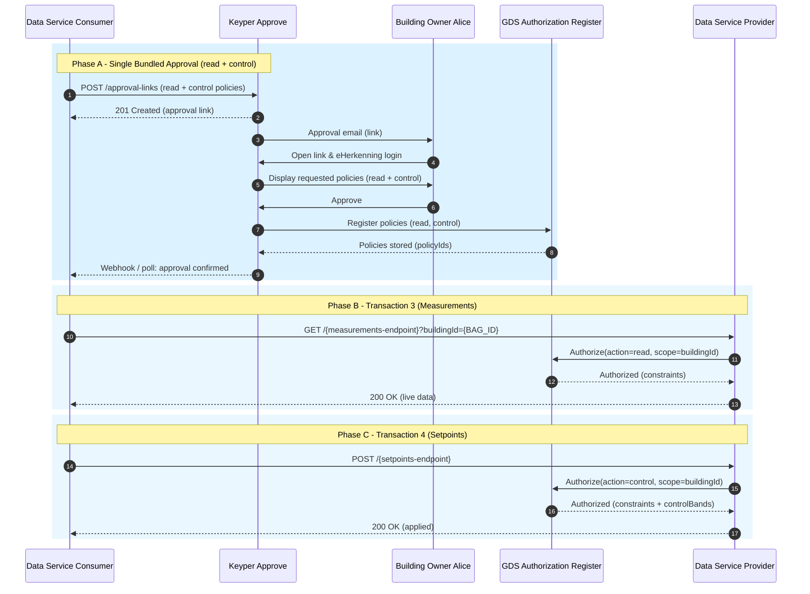

# Data Exchange Flow – Access & Control

This guide describes the end-to-end process for a data consumer (data service consumer) to obtain authorization and then exchange data with a data provider (data service provider) through the GDS dataspace. It covers:

- A single bundled approval request (policies for BOTH real-time data read and control/setpoints)
- Transaction 3: Real-time measurement retrieval
- Transaction 4: Control (setpoint) submission

Earlier drafts separated approvals for read and control; the recommended approach is to bundle them to reduce approval friction while keeping explicit action scoping.

---

## 1. Sequence Diagram – Bundled Approval + Data Transactions



---

## 2. Bundled Approval Request (Single `POST /approval-links`)

The data service consumer creates ONE approval link containing multiple `addPolicyTransactions`. Each transaction represents a policy to be registered after the building owner approves.

### Endpoint
`POST <KEYPER_API_URL>/approval-links`

### Required Headers
- `Content-Type: application/json`
- `Authorization: Bearer <KEYPER_ACCESS_TOKEN>`

### Example Payload (Bundled Read + Control — Keyper Spec Compliant)

Below is a minimized, spec-aligned structure based on the Keyper Scalar API (`POST /api/approval-links`).

Key differences vs earlier draft:
* `policyLabel`, `purpose`, `constraints`, `timeWindow`, etc. are not top-level schema fields in Keyper. We map these semantics into the transaction `properties` array (extensible key/value pairs) so they remain queryable.
* Separate `successRedirectUrl` / `failureRedirectUrl` are consolidated into a single `redirectUrl` (the application distinguishes outcome via query params or a follow-up GET).
* Actor naming uses the standard `requester` / `approver` fields with `organization`, `organizationId`, and optional `email`.
* Ownership / trust chain: `issuerId` = data owner (approver org), `subjectId` = data service consumer, `serviceProvider` = technical platform delivering the data/control service (optional if implicit).

```json
{
    "authenticationMethods": ["eHerkenning"],
    "requester": {
        "organization": "<Data Service Consumer>",
        "organizationId": "NL.KVK.12345678",
        "email": "tech@consumer.example"
    },
    "approver": {
        "organization": "<Data Owner>",
        "organizationId": "NL.KVK.87654321",
        "email": "owner@building.example"
    },
    "dataspace": {
        "name": "GDS"
    },
    "description": "Request read of building sensor data and control capability for optimization.",
    "reference": "GDS-READ-CONTROL-REQ-001",
    "redirectUrl": "https://consumer.example/app/approval/callback",
    "orchestration": { "flow": "gds.basic@1" },
    "addPolicyTransactions": [
    {
        "useCase": "GDS",
        "issuedAt": "<NOW>", // Unix timestamp - Keyper may override if in past
        "notBefore": "<NOW>", // Keyper may override if in past
        "expiration": "<NOW_PLUS_1Y>",
        "issuerId": "NL.KVK.87654321",
        "subjectId": "NL.KVK.12345678",
        "serviceProvider": "NL.KVK.11223344",
        "action": "read",
        "resourceId": "0363010000659001",
        "type": "buildingId",
        "attribute": "*",
        "license": "GDS-POC-1.0",
        "properties": []
    },
    {
        "useCase": "GDS",
        "issuedAt": "<NOW>", // Unix timestamp - Keyper may override if in past
        "notBefore": "<NOW>", // Keyper may override if in past
        "expiration": "<NOW_PLUS_1Y>",
        "issuerId": "NL.KVK.87654321",
        "subjectId": "NL.KVK.12345678",
        "serviceProvider": "NL.KVK.11223344",
        "action": "control",
        "resourceId": "0363010000659001",
        "type": "buildingId",
        "attribute": "*",
        "license": "GDS-POC-1.0",
        "properties": []
    }
    ]
}
```


### Expected Response (201 Created)
```json
{
  "approvalLinkId": "4f2d9a1c-bb89-4e9c-9a02-f0b4e6b7b921",
  "status": "Active",
  "approverOrganizationId": "NL.KVK.87654321",
  "url": "https://keyper-preview.poort8.nl/approve/4f2d9a1c-bb89-4e9c-9a02-f0b4e6b7b921",
  "expiresAt": "2025-09-15T12:00:00Z"
}
```

---

## 3. Real-time Measurements (Transaction 3)

Once the approval is granted and the `read` policy is registered, the data service consumer can retrieve live measurements from the data service provider.

### Request
```bash
curl -X GET "<Data Service Provider Domain>/{measurements-endpoint}?buildingId=0363010000659001&group=EnvSensors" \
  -H "Authorization: Bearer <ACCESS_TOKEN>"
```

### Typical Response (Example)
> ⚠️ **Draft Example:**  
> The structure shown below is illustrative and will change.

```json
{
  "buildingId": "0363010000659001",
  "timestamp": "2025-09-08T10:15:12Z",
  "measurements": [
    { "sensorId": "env-temp-001", "type": "temperature", "value": 22.3, "unit": "C" },
    { "sensorId": "env-hum-014", "type": "humidity", "value": 45.1, "unit": "%" },
    { "sensorId": "energy-meter-7A", "type": "power", "value": 12.4, "unit": "kW" }
  ]
}
```

---

## 4. Control Commands (Transaction 4)
> ⚠️ **Draft Example:**  
> The structure shown below is illustrative and will change.
The `control` policy authorizes setpoint adjustments within approved control bands exposed by the data service provider.

### Request
```bash
curl -X POST "https://dataspace.poort8.nl/gds/{setpoints-endpoint}" \
  -H "Authorization: Bearer <ACCESS_TOKEN>" \
  -H "Content-Type: application/json" \
  -d '{
    "buildingId": "0363010000659001",
    "commands": [
      { "actuatorId": "hvac-zone-101", "target": "temperature", "setpoint": 21.5 },
      { "actuatorId": "hvac-zone-101", "target": "co2", "setpoint": 800 }
    ],
    "correlationId": "5c9d3f0e-1a6d-4f3c-b8a1-d2a54ef90111"
  }'
```

### Example Response
```json
{
  "buildingId": "0363010000659001",
  "accepted": true,
  "applied": [
    { "actuatorId": "hvac-zone-101", "target": "temperature", "setpoint": 21.5, "scheduledFor": "2025-09-08T10:16:00Z" },
    { "actuatorId": "hvac-zone-101", "target": "co2", "setpoint": 800, "scheduledFor": "2025-09-08T10:16:00Z" }
  ],
  "policyReferences": ["GDS-CONTROL-BUILDING"],
  "correlationId": "5c9d3f0e-1a6d-4f3c-b8a1-d2a54ef90111"
}
```

---

## 5. Next Step
If you have not yet completed sensor discovery & configuration import, see the [Setup Flow](setup-flow.md) for how the data service consumer retrieves and imports sensor metadata from the data service provider.