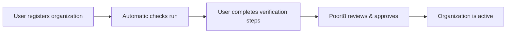

# Organization Registration

This page covers how organizations join the Green Data Space — from self-service registration through verification and approval.

## Registration process overview

## Self-service registration

Any user can register their organization through the [Self-Service Portal](https://gds-preview.poort8.nl/portal). The registering user:

1. **Provides organization details** — KvK number, organization name
2. **Provides user details** — name, email, and phone number
3. **Receives a password setup email** to activate their account

After registration, the organization will be under review for approval by Poort8.

## Verifications

Each organization undergoes verification checks across automatic, member, and dataspace administrator-controlled steps:

| Verification step | Owner | What it does | Outcome |
|-------------------|-------|--------------|---------|
| **Business register (KvK)** | Automatic | Validates the KvK number via the KvK API and checks the official name against the name entered during onboarding | If the name matches, onboarding continues. If it does not match, the user is asked to confirm whether they intended to onboard the KvK-registered organization |
| **Onboarding user's email verification** | Original onboarding user | Verifies that the person who started onboarding controls the submitted email address (via verification link). This user automatically becomes the organization's administrator in the dataspace. | Approved when that user confirms the email address |
| **Onboarding approval** | Dataspace administrator (Poort8) | Poort8's final decision on participation | Approved, rejected, or revoked |

## Approval process

After registration, Poort8 reviews the organization's details and approves or rejects participation.

## Organization identifiers

Each organization in GDS is identified by an EUID (European Unique Identifier):

| Country | Format | Example |
|---------|--------|---------|
| Netherlands | `NLNHR.{kvkNumber}` | `NLNHR.12345678` |

This identifier is used throughout the dataspace for policies, tokens, and authorization checks.
