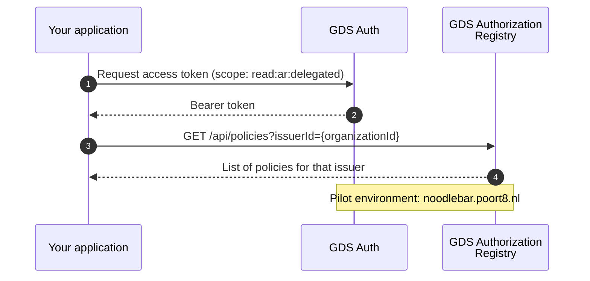

# GDS Portal Guide

**For parties querying granted access rights**

> **Pilot phase — demo environment**
> During the pilot phase, the GDS dataspace is not yet used. Instead, all parties work against the **Poort8 demo environment** hosted at `noodlebar.poort8.nl`. The API structure and authentication flow are identical to the production GDS environment. All URLs in this guide point to the demo environment.

This guide explains how to use the GDS portal API to retrieve policies — the granted access rights that building owners have issued to data service consumers. This is useful for parties who need to inspect which organizations have been granted access to building data (e.g., for auditing, dashboards, or administrative tooling).

## Flow overview



## Step 1: Get an access token

Authenticate against the GDS token endpoint to obtain a bearer token.

**Reference:** [NoodleBar API — Authentication](https://noodlebar.poort8.nl/scalar/#description/authentication) *(pilot environment)*

### Required parameters

| Parameter | Value |
|-----------|-------|
| `scope` | `read:ar:delegated` |
| `audience` | `https://noodlebar.poort8.nl` |

> **Important:** The `audience` must be set to `https://noodlebar.poort8.nl` for the pilot environment. Tokens issued for a different audience will be rejected. This value will change to `https://gds.poort8.nl` when the production GDS environment goes live.

The `read:ar:delegated` scope grants read access to policies across organizations — including policies issued by issuers other than your own organization. This is the delegated variant of the read scope.

### Example token request

```http
POST /connect/token
Host: <auth-server>
Content-Type: application/x-www-form-urlencoded

grant_type=client_credentials
&client_id=<your-client-id>
&client_secret=<your-client-secret>
&scope=read:ar:delegated
&audience=https://noodlebar.poort8.nl
```

The response contains a `access_token` (JWT bearer token) that you include in all subsequent API calls.

## Step 2: Query policies for an issuer

Use the bearer token to retrieve policies for a specific issuer (data rights holder — typically the building owner who granted access).

**Reference:** [NoodleBar API — GET /api/policies](https://noodlebar.poort8.nl/scalar/#tag/policies/GET/api/policies) *(pilot environment)*

### Example request

```http
GET /api/policies?issuerId=NLNHR.87654321
Host: noodlebar.poort8.nl
Authorization: Bearer <access_token>
```

Filter by `issuerId` to retrieve all policies issued by a specific organization (the data rights holder / building owner).

### Policy definition

For a full description of all policy fields and how they interact, see the [Policy Fields reference](provider-enforcement-guide?id=policy-fields).

### Example response

```json
[
  {
    "policyId": "3fa85f64-5717-4562-b3fc-2c963f66afa6",
    "useCase": "ishare",
    "issuedAt": 1700000000,
    "notBefore": 1700000000,
    "expiration": 1800000000,
    "issuerId": "NLNHR.87654321",
    "subjectId": "NLNHR.12345678",
    "serviceProvider": "NLNHR.23456789",
    "type": "building",
    "resourceId": "0363010000659001",
    "action": "GET",
    "attribute": "*",
    "license": "0005",
    "rules": null,
    "properties": []
  }
]
```

Timestamps (`issuedAt`, `notBefore`, `expiration`) are Unix timestamps (seconds since epoch).

## Query parameters

All parameters are optional. Combine them to narrow results.

| Parameter | Description |
|-----------|-------------|
| `useCase` | Filter by use-case identifier — always use `ishare` for GDS |
| `issuerId` | Filter by issuer (data rights holder / building owner) |
| `subjectId` | Filter by subject (data consumer) |
| `serviceProvider` | Filter by service provider (IoT platform) |
| `resourceId` | Filter by specific resource (VBO ID or asset ID) |
| `type` | Filter by policy type (`building` or `asset`) |
| `action` | Filter by permitted action (`GET`, `POST`) |
| `attribute` | Filter by attribute |
