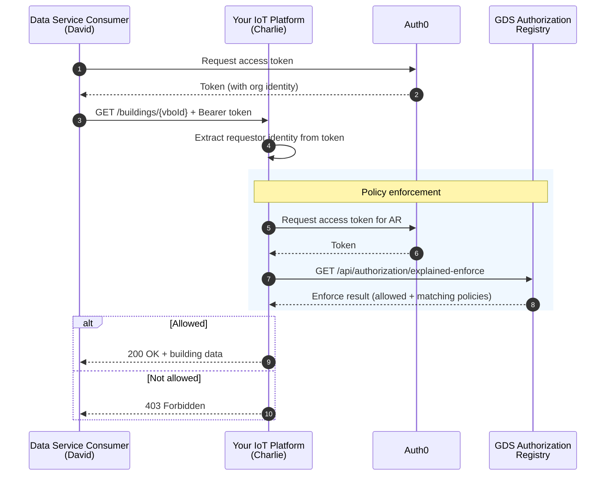

# GDS Implementation Guide: Get Building Data

**For IoT sensor platforms (data service providers)**

This guide is for developers building **IoT sensor platforms** (Charlie) who need to verify authorization policies before delivering building data to requesting platforms. It explains how to query the GDS Authorization Registry's explained enforce endpoint to check whether valid policies exist.

> **Note:** IoT sensor platforms are a type of **data service provider** in GDS terminology – any platform that provides data to data service consumers. While this guide focuses on IoT platforms specifically, the same enforcement pattern applies to other types of data service providers.

## Who is this guide for?
This guide is specifically for **IoT sensor platforms** that:
- Install and manage building sensors (temperature, humidity, energy, etc.)
- Need to verify that data requests are authorized before delivering data
- Want to implement the GDS enforcement pattern using the explained enforce endpoint


## What this guide covers
This guide focuses on **verifying authorization and delivering data**:
- How policies work in GDS and what they grant
- How to query the GDS Authorization Registry's explained enforce endpoint
- How to validate the enforce response
- Which enforce checks to implement for different resource levels

**What this guide does NOT cover:**
- How building management platforms request approval — see [Requesting Building Data Access](consumer-approval-guide.md)
- How the approval workflow works end-to-end — see [Architecture](architecture.md)


## Process overview
When a data service consumer (David's building management platform) sends a data request to your IoT platform, follow these steps:

1. **Receive request**: David sends a request to your API with a bearer token and a resource identifier (e.g., VBO ID or asset ID)
2. **Extract identity**: Extract the requestor's organization identity from the bearer token
3. **Query Authorization Registry**: Call the GDS Authorization Registry's explained enforce endpoint to check whether a valid policy exists
4. **Validate response**: Verify the response confirms the request is allowed
5. **Deliver or reject**: If authorized, deliver the requested data. If not, return a `403 Forbidden` response




## Authorization model

GDS uses the **iSHARE** use case model for policy enforcement. When a building owner (Bob) approves an access request, policies are registered in the GDS Authorization Registry. Your platform queries these policies using the explained enforce endpoint.

### Policy fields

Each policy registered in GDS contains these fields (matching the explained enforce query parameters):

| Field | Description | Example |
|-------|-------------|---------|
| `issuerId` | Building owner who granted access (Bob) | `NLNHR.87654321` |
| `subjectId` | Organization that uses your data service (David) | `NLNHR.12345678` |
| `serviceProvider` | Your IoT platform organization (Charlie) | `NLNHR.23456789` |
| `type` | Resource type: `building` or `asset` | `building` |
| `resourceId` | Resource identifier: VBO ID or asset ID | `0363010000659001` |
| `attribute` | Data attributes | `*` (all) |
| `action` | Permitted action: `GET` or `POST` | `GET` |

### Policy levels and enforce checks

GDS supports authorization at different resource levels. Your platform must check the correct level based on the incoming request:

| Enforce level | Resource type | Resource ID | Attribute | Actions | Description |
|---------------|--------------|-------------|-----------|---------|-------------|
| Building | `building` | VBO ID | `*` | `GET` / `POST` | Access to the entire building and all its assets |
| Asset | `asset` | Asset ID | `*` | `GET` / `POST` | Access to a specific sensor or control point |

**Action semantics:**
- `GET` — Read data (sensor measurements, metadata)
- `POST` — Write data or send control commands (setpoints). A `POST` policy implicitly grants `GET` access

> **Pilot scope:** During the test phase, only a **`GET` policy on building level** (VBO ID) is used. Your platform needs to support at minimum: checking whether a valid `GET` policy exists for a given VBO ID and requesting organization.

### Explained enforce request

To check authorization, call the explained enforce endpoint on the GDS Authorization Registry:

```http
GET https://gds-preview.poort8.nl/api/authorization/explained-enforce?issuer=<BUILDING_OWNER_KVK>&subject=<DATA_SERVICE_CONSUMER_KVK>&serviceProvider=<YOUR_ORGANIZATION_KVK>&action=GET&resource=<VBO_ID>&type=building&attribute=*&useCase=ishare
Authorization: Bearer <ACCESS_TOKEN>
```

**Query parameters:**

| Parameter | Description | Example |
|-----------|-------------|-------  |
| `issuer` | Building owner who granted access (Bob) | `NLNHR.87654321` |
| `subject` | Organization that uses your data service (David) | `NLNHR.12345678` |
| `serviceProvider` | Your IoT platform organization (Charlie) | `NLNHR.23456789` |
| `action` | Requested action | `GET` |
| `resource` | Resource identifier (VBO ID or asset ID) | `0363010000659001` |
| `type` | Resource type | `building` |
| `attribute` | Data attributes | `*` |
| `useCase` | Use case model | `ishare` |

### Example request with real values

```http
GET https://gds-preview.poort8.nl/api/authorization/explained-enforce?issuer=NLNHR.87654321&subject=NLNHR.12345678&serviceProvider=NLNHR.23456789&action=GET&resource=0363010000659001&type=building&attribute=*&useCase=ishare
Authorization: Bearer <ACCESS_TOKEN>
```

### Explained enforce response

The Authorization Registry returns a JSON object with the enforcement result and the matching policies. A successful authorization looks like:

```json
{
  "allowed": true,
  "explainPolicies": [
    {
      "policyId": "a1b2c3d4-e5f6-7890-abcd-ef1234567890",
      "useCase": "ishare",
      "issuedAt": 1730736000,
      "notBefore": 1730736000,
      "expiration": 2147483647,
      "issuerId": "NLNHR.87654321",
      "subjectId": "NLNHR.12345678",
      "serviceProvider": "NLNHR.23456789",
      "action": "GET",
      "resourceId": "0363010000659001",
      "type": "building",
      "attribute": "*",
      "license": "0005",
      "rules": null,
      "properties": []
    }
  ]
}
```

If no matching policy exists, the response will contain `"allowed": false` and an empty `explainPolicies` array.


## Validation requirements

When you receive an explained enforce response, verify the following before delivering data:

| Check | Requirement |
|-------|-------------|
| **Allowed** | `allowed` must be `true` |
| **Subject** | `explainPolicies[].subjectId` must match the identity extracted from the incoming request's bearer token |

### Recommended error handling

| Code | Meaning | When to use |
|------|---------|-------------|
| `200 OK` | Authorized | Enforce response confirms `allowed: true` — deliver the data |
| `401 Unauthorized` | Invalid or expired token | The incoming bearer token is missing, invalid, or expired |
| `403 Forbidden` | Not authorized | Enforce response returns `allowed: false`, or validation checks fail |
| `400 Bad Request` | Invalid input | The request is malformed (e.g., invalid VBO ID format) |
| `500 Internal Server Error` | Technical error | Unexpected server error — log and implement retry logic |


## Implementation steps

### Step 1: Set up your data endpoint

Expose an API endpoint for building data requests. For example:

```
GET /buildings/{vboId}
Authorization: Bearer {access_token}
```

Extract the requesting organization's identity from the bearer token claims.

### Step 2: Obtain access token for the Authorization Registry

Authenticate with the GDS Authorization Registry using OAuth2 client credentials:

```http
POST https://poort8.eu.auth0.com/oauth/token
Content-Type: application/json
```

```json
{
  "client_id": "<YOUR_CLIENT_ID>",
  "client_secret": "<YOUR_CLIENT_SECRET>",
  "audience": "GDS-Dataspace-CoreManager",
  "grant_type": "client_credentials"
}
```

> **Getting client credentials:** Contact Poort8 at **hello@poort8.nl** to request OAuth2 client credentials for the GDS Authorization Registry.

### Step 3: Query explained enforce

Call the explained enforce endpoint on the Authorization Registry as shown in the [explained enforce request](#explained-enforce-request) section above. The key parameters to populate from the incoming data request are:

- `issuer`: The building owner's KVK identifier (you must know which organization owns the building)
- `subject`: The organization identity extracted from the incoming bearer token
- `serviceProvider`: Your own organization's KVK identifier
- `resource`: The VBO ID or asset ID from the incoming data request

### Step 4: Validate and respond

Apply the [validation requirements](#validation-requirements) to the explained enforce response. If all checks pass, deliver the requested data. Otherwise, return `403 Forbidden`.


## Test environment

### Endpoints

| Service | URL |
|---------|-----|
| Token endpoint | `https://poort8.eu.auth0.com/oauth/token` |
| GDS Authorization Registry | `https://gds-preview.poort8.nl` |
| Explained enforce endpoint | `https://gds-preview.poort8.nl/api/authorization/explained-enforce` |

> The test environment uses separate non-production resources. Use it for functional testing without affecting production data.


## Pilot scope

During the pilot phase:
- **Only `GET` on building level** is used — your platform must check whether the requesting organization has a valid `GET` policy for the requested VBO ID
- The response to a `GET` on building level includes all assets within the building
- `POST` (write/control) policies and asset-level policies are not yet used but will be supported in future phases

### What to implement now
1. Accept data requests with a bearer token and VBO ID
2. Query the explained enforce endpoint (see [Step 3](#step-3-query-explained-enforce))
3. Validate the enforce response
4. Deliver building data (including assets) if authorized


## Future extensions

The following capabilities are planned for future phases but are **not part of the pilot**:

### Asset-level policies
Policies at the `asset` level will allow fine-grained access control per sensor. This enables scenarios like granting read access to specific sensors within a building without giving access to all of them.

### Write/control access (POST)
`POST` policies will enable building management platforms to send control commands (setpoints) to sensors or building systems. A `POST` policy implicitly includes `GET` access.

### Resource groups (grouping service)
A grouping service (e.g., Aimz) may register arbitrary groups of sensors or data fields for a building, with the building owner's consent. Policies can then be granted on these groups instead of individual assets. The design of whether this grouping is facilitated by GDS or by the IoT platform (e.g., Envitron) is still being determined.

### Data field-level enforcement
Enforcement at the level of individual data fields (e.g., specific sensor readings) may be supported in a future phase. This would allow even more granular access control than asset-level policies.


## Support
For questions, issues, or support with implementing the GDS enforcement pattern:

**Contact Poort8:**
Email: hello@poort8.nl

**API documentation:**
- [GDS API documentation ➚](https://gds-preview.poort8.nl/scalar/v1) — Interactive API reference
- [Keyper API documentation ➚](https://keyper-preview.poort8.nl/scalar/?api=v1) — Approval workflow API reference

**Related documentation:**
- [Requesting Building Data Access](consumer-approval-guide.md) — How building management platforms request approval
- [GDS Architecture](architecture.md) — How GDS components work together
- [GDS Overview](overview.md) — Understanding GDS and its value
