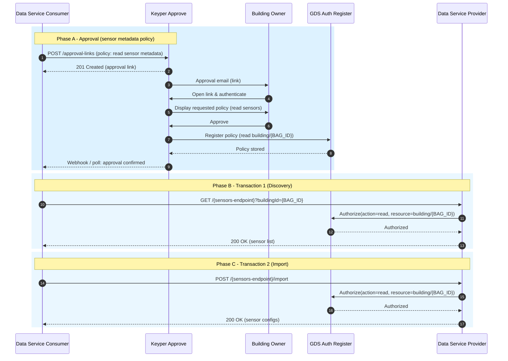

# Setup Flow – Sensor Metadata Approval, Discovery & Import

This guide describes the initial setup phase for a data service consumer to obtain authorization for sensor metadata, discover available sensors, and import their configurations from the data service provider. It covers:

* Phase A: Approval (policy granting `read` access to sensor metadata)
* Transaction 1: Sensor discovery (list sensors)
* Transaction 2: Sensor configuration import (fetch configs)

If no policy exists yet, the approval step (Phase A) must be completed before Transactions 1 and 2 will succeed.

---

## 1. Sequence Diagram – Approval + Sensor Transactions



---

## 2. Approval Link Request (Sensor Metadata Policy)

The consumer creates a single approval link requesting a `read` policy scoped to the building's sensor metadata. This example uses the same Keyper schema style as the Data Exchange Flow (properties array for extensible semantics).

### Endpoint
`POST <KEYPER_API_URL>/approval-links`

### Example Payload
```json
{
  "authenticationMethods": ["eHerkenning"],
  "requester": {
    "organization": "Data Service Consumer Org",
    "organizationId": "NL.KVK.12345678",
    "email": "tech@consumer.example"
  },
  "approver": {
    "organization": "Building Owner Org",
    "organizationId": "NL.KVK.87654321",
    "email": "owner@building.example"
  },
  "dataspace": {
    "name": "GDS",
    "policyUrl": "https://dataspace.poort8.nl/gds/policies/",
    "organizationUrl": "https://dataspace.poort8.nl/gds/organizations/"
  },
  "description": "Request read access to building sensor metadata for onboarding.",
  "reference": "GDS-SENSOR-METADATA-REQ-001",
  "redirectUrl": "https://consumer.example/app/approval/callback",
  "orchestration": { "flow": "gds.basic@1" },
  "addPolicyTransactions": [
    {
      "useCase": "GIR",
      "issuedAt": "<NOW>", // Unix timestamp - Keyper may override if in past
      "notBefore": "<NOW>", // Keyper may override if in past
      "expiration": "<NOW_PLUS_1Y>",
      "issuerId": "NL.KVK.<OWNER_KVK>",
      "subjectId": "NL.KVK.<REGISTRAR_KVK>",
      "serviceProvider": "NL.KVK.27248698",
      "action": "read",
      "resourceId": "<VBO_ID>",
      "type": "vboID",
      "attribute": "*",
      "license": "0005"
    }
  ]
}
```

---

## 3. Transaction 1 – Discover Sensors
> ⚠️ **Draft Example:**  
> The structure shown below is illustrative and will change.
Once the approval is completed and the policy registered, the consumer calls the provider's `/{sensors-endpoint}` with the target `buildingId`.

### Request
```bash
curl -X GET "https://dataspace.poort8.nl/gds/{sensors-endpoint}?buildingId=0363010000659001" \
  -H "Authorization: Bearer <ACCESS_TOKEN>"
```

### Response (Example)
```json
[
  {
    "sensorId": "provider-sensor-001",
    "type": "Temperature",
    "location": "Floor 1, Room 101"
  },
  {
    "sensorId": "provider-sensor-002",
    "type": "Humidity",
    "location": "Floor 1, Room 101"
  },
  {
    "sensorId": "provider-sensor-003",
    "type": "Energy",
    "location": "Main Utility Room"
  }
]
```

---

## 4. Transaction 2 – Import Sensor Configurations
> ⚠️ **Draft Example:**  
> The structure shown below is illustrative and will change.
The consumer imports configuration details for a subset of sensors to support later real-time measurement interpretation.

### Request
```bash
curl -X POST "https://dataspace.poort8.nl/gds/{sensors-endpoint}/import" \
  -H "Authorization: Bearer <ACCESS_TOKEN>" \
  -H "Content-Type: application/json" \
  -d '{
    "buildingId": "0363010000659001",
    "sensorIds": [
      "provider-sensor-001",
      "provider-sensor-003"
    ]
  }'
```

### Response (Example)
```json
[
  {
    "sensorId": "provider-sensor-001",
    "type": "Temperature",
    "unit": "Celsius",
    "measurementIntervalSeconds": 60
  },
  {
    "sensorId": "provider-sensor-003",
    "type": "Energy",
    "unit": "kWh",
    "measurementIntervalSeconds": 300
  }
]
```

---

## 5. Next Step
Proceed to request real-time data and (optionally) control capabilities:

* **[Data Exchange Flow](data-exchange-flow.md)** – Bundled approval for measurements & control.